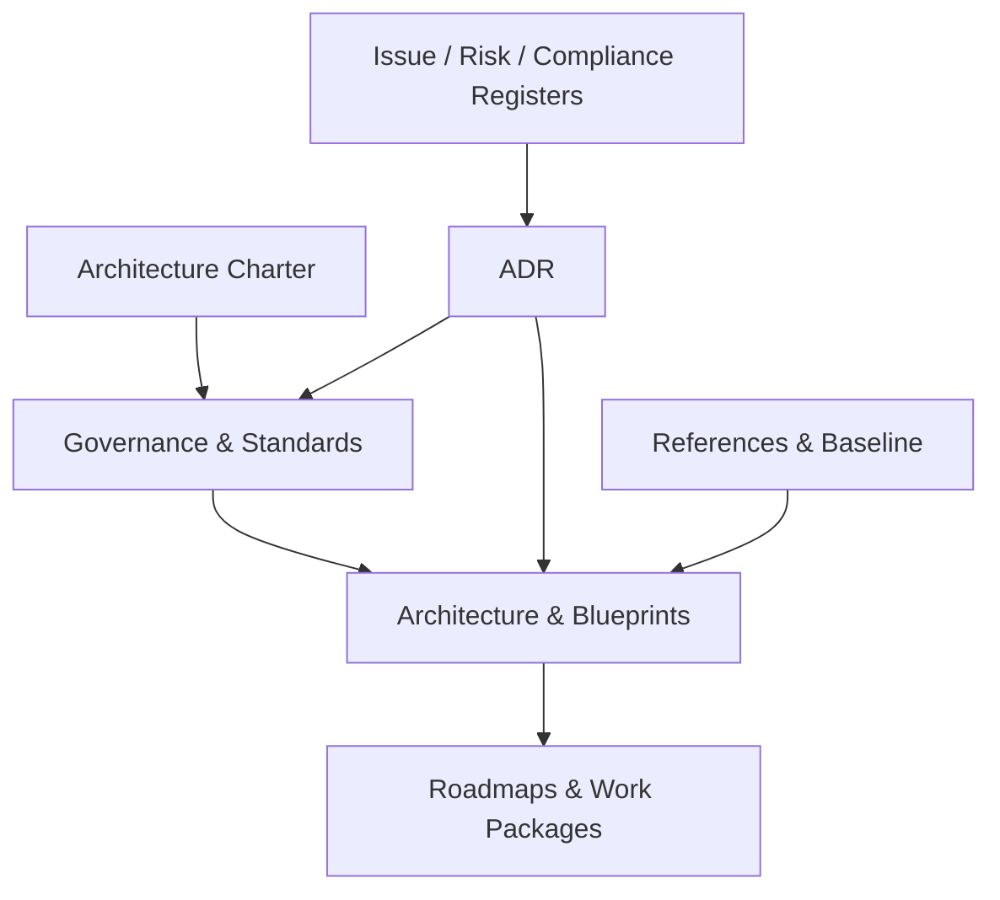
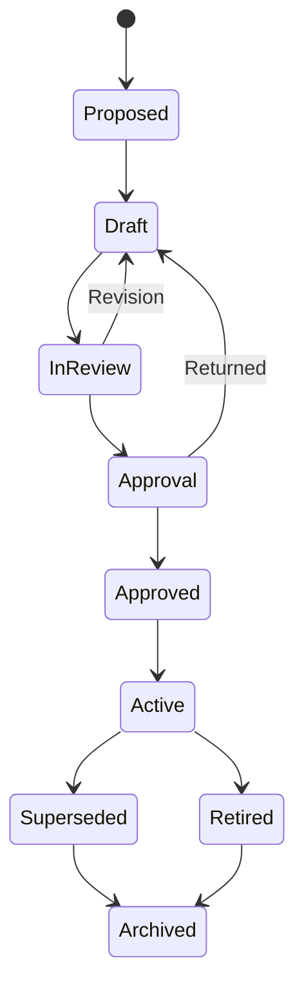

# 01 — Repository Structure

## Standar Organisasi Dokumentasi Enterprise Architecture e-PeLARA Next Generation

**Status:** Approved — Official Repository Governance Standard  
**Versi:** 1.0.0  
**Tanggal:** 4 Agustus 2026  
**Klasifikasi:** Governance Standard  
**Otoritas induk:** `00-Architecture-Charter.md` Version 1.0.0 — Approved

---

## 1. Tujuan dan Kedudukan

Dokumen ini menetapkan standar resmi untuk organisasi, penamaan, versioning, klasifikasi, hubungan, lifecycle, governance, dan penyimpanan seluruh dokumentasi **Enterprise Architecture e-PeLARA Next Generation**.

Standar ini bertujuan agar dokumentasi:

- mudah ditemukan, dibaca, ditelusuri, dan dipelihara;
- membedakan dengan jelas dokumen resmi, draft, referensi, keputusan, isu, dan arsip;
- tetap konsisten ketika dikerjakan oleh manusia maupun AI engineering tools;
- menjaga hubungan dari Charter menuju blueprint, standard, ADR, roadmap, dan implementasi;
- mendukung filosofi **One Data, Many Publications**; dan
- dapat menjadi fondasi reusable bagi proyek aplikasi pemerintahan lainnya.

Dokumen ini tidak mengubah Architecture Charter. Perubahan yang memengaruhi Charter harus diproses melalui ADR, Architecture Issue Register, dan Change Log sesuai kewenangan yang berlaku.

---

## 2. Prinsip Organisasi Repository

### R-01 — Stable Paths

Dokumen yang telah disetujui mempertahankan path dan nama file yang stabil. Versi tidak ditambahkan ke nama file; versioning dicatat dalam metadata dan riwayat versi.

### R-02 — One Document, One Authority

Setiap ketentuan normatif memiliki satu dokumen otoritatif. Dokumen lain merujuk kepadanya dan tidak menyalin seluruh isi sebagai aturan baru.

### R-03 — Classification Before Storage

Setiap file harus memiliki klasifikasi, owner, status, dan lokasi yang sesuai sebelum menjadi bagian repository resmi.

### R-04 — Human and Machine Readable

Struktur folder, nama file, front matter, heading, tabel, link, dan diagram harus dapat digunakan secara konsisten oleh manusia, pencarian, automation, dan AI.

### R-05 — Source and Rendered Asset Separation

File sumber yang dapat diedit dipisahkan dari hasil render. Hasil visual tanpa source tidak boleh menjadi satu-satunya artefak arsitektur.

### R-06 — Traceability by Link, Not Duplication

Relasi antardokumen dibangun melalui identifier dan relative link. Duplikasi substansi dihindari agar tidak muncul beberapa kebenaran.

### R-07 — Approved Content Is Controlled

Dokumen Approved/Active tidak diedit tanpa change record. Perubahan konseptual diputuskan melalui ADR; masalah dicatat di Issue Register; seluruh perubahan dicatat di Change Log.

### R-08 — Archive, Do Not Erase History

Dokumen yang tidak berlaku dipindahkan ke status Superseded, Retired, atau Archived. Riwayat keputusan tidak dihapus kecuali diwajibkan oleh keamanan, privasi, atau regulasi retensi.

---

## 3. Struktur Folder Kanonis

Root dokumentasi resmi menggunakan folder `enterprise-architecture/` dengan struktur berikut:

```text
enterprise-architecture/
├── README.md
├── 00-governance/
│   ├── 00-Architecture-Charter.md
│   ├── 01-Repository-Structure.md
│   ├── Architecture-Issue-Register.md
│   ├── Architecture-Risk-Register.md
│   ├── Compliance-Register.md
│   ├── Change-Log.md
│   └── adr/
│       ├── README.md
│       └── ADR-0001-<decision-title>.md
├── 01-current-state/
│   ├── README.md
│   ├── 1-identitas-sistem.md
│   ├── 2-modul-sistem.md
│   ├── 3-alur-logika-sistem.md
│   ├── 4-penilaian-kesesuaian-standar.md
│   └── 5-referensi-teknis-database-api-frontend.md
├── 02-business-architecture/
│   ├── README.md
│   ├── capability-map/
│   ├── value-streams/
│   ├── business-processes/
│   └── regulatory-mapping/
├── 03-data-architecture/
│   ├── README.md
│   ├── domain-models/
│   ├── master-reference-data/
│   ├── data-lineage/
│   ├── data-quality/
│   ├── business-glossary/
│   └── data-governance/
├── 04-application-architecture/
│   ├── README.md
│   ├── application-portfolio/
│   ├── domain-boundaries/
│   ├── module-blueprints/
│   └── dependency-maps/
├── 05-integration-architecture/
│   ├── README.md
│   ├── api-catalog/
│   ├── event-catalog/
│   ├── sipd/
│   ├── e-sigap/
│   └── interoperability/
├── 06-technology-architecture/
│   ├── README.md
│   ├── technology-standards/
│   ├── environments/
│   ├── deployment/
│   ├── observability/
│   └── resilience/
├── 07-security-architecture/
│   ├── README.md
│   ├── identity-access/
│   ├── data-protection/
│   ├── threat-models/
│   ├── security-controls/
│   └── audit-compliance/
├── 08-intelligence-ai-architecture/
│   ├── README.md
│   ├── analytics/
│   ├── knowledge-model/
│   ├── ai-gateway/
│   ├── model-prompt-register/
│   └── ai-governance/
├── 09-digital-publishing/
│   ├── README.md
│   ├── publishing-blueprint/
│   ├── document-models/
│   ├── design-system/
│   ├── templates/
│   └── publication-quality/
├── 10-standards/
│   ├── README.md
│   ├── architecture/
│   ├── data/
│   ├── api-integration/
│   ├── engineering/
│   ├── security/
│   ├── ux-accessibility/
│   └── documentation/
├── 11-roadmaps/
│   ├── README.md
│   ├── transition-architectures/
│   ├── migration-roadmap/
│   ├── implementation-waves/
│   └── decommissioning/
├── 12-references/
│   ├── README.md
│   ├── regulations/
│   ├── government-standards/
│   ├── external-standards/
│   └── research-benchmarks/
├── 13-knowledge/
│   ├── README.md
│   ├── government-knowledge/
│   ├── ontology/
│   ├── taxonomy/
│   ├── prompt-library/
│   ├── ai-evaluation/
│   ├── pattern-library/
│   ├── benchmarks/
│   └── research-notes/
├── 14-design-system/
│   ├── README.md
│   ├── foundations/
│   │   ├── typography/
│   │   ├── color/
│   │   ├── spacing-grid/
│   │   └── accessibility/
│   ├── layout/
│   ├── components/
│   ├── charts/
│   ├── infographics/
│   ├── publication-system/
│   ├── annual-report-style/
│   └── examples/
├── assets/
│   ├── diagrams/
│   │   ├── source/
│   │   └── rendered/
│   ├── images/
│   ├── icons/
│   ├── logos/
│   ├── fonts/
│   └── publication/
│       ├── covers/
│       ├── layouts/
│       ├── charts/
│       └── templates/
└── archive/
    ├── superseded/
    ├── retired/
    └── historical-baselines/
```

### 3.1 Aturan Root Folder

Hanya item berikut yang diperbolehkan langsung di root:

- `README.md` sebagai peta utama;
- folder domain bernomor `00` sampai `14`;
- `assets/`; dan
- `archive/`.

File sementara, hasil ekspor, screenshot acak, prompt sementara, backup, dump database, credential, dan file hasil percobaan tidak boleh disimpan di root.

### 3.2 Fungsi README pada Setiap Folder

Setiap folder utama wajib memiliki `README.md` yang memuat:

1. tujuan folder;
2. scope domain;
3. daftar dokumen aktif;
4. owner domain;
5. aturan khusus folder;
6. link ke parent dan related documents; serta
7. status kelengkapan dokumentasi.

### 3.3 Penempatan Official Baseline

Lima dokumen Current State yang telah disahkan ditempatkan di `01-current-state/` dengan substansi dan identitas baseline tetap dipertahankan. Normalisasi nama file atau format hanya boleh dilakukan tanpa mengubah makna dan harus dicatat di Change Log.

### 3.4 Knowledge Layer — `13-knowledge/`

Folder `13-knowledge/` merupakan pusat **Knowledge Layer e-PeLARA Next Generation**. Folder ini mengubah sumber, pengalaman, regulasi, keputusan, pola, dan hasil evaluasi menjadi pengetahuan pemerintah yang terstruktur, reusable, dapat ditelusuri, dan dapat digunakan secara aman oleh manusia maupun AI.

Ruang lingkupnya:

- `government-knowledge/` — konsep, aturan, praktik, dan pengetahuan domain pemerintahan yang telah dikurasi;
- `ontology/` — definisi entitas, konsep, atribut, serta hubungan semantik;
- `taxonomy/` — klasifikasi, istilah terkendali, kategori, dan hierarki pengetahuan;
- `prompt-library/` — prompt resmi yang terversi, memiliki tujuan, input, output, guard, dan model compatibility;
- `ai-evaluation/` — dataset evaluasi, rubric, test case, hasil evaluasi, dan acceptance threshold AI;
- `pattern-library/` — pola arsitektur, pemerintahan, data, workflow, dokumen, dan solusi reusable;
- `benchmarks/` — benchmark internal yang telah dikurasi untuk perbandingan kualitas dan kinerja; dan
- `research-notes/` — catatan riset terstruktur yang belum menjadi standard atau keputusan resmi.

Pemisahan tanggung jawab:

- `08-intelligence-ai-architecture/` menjelaskan blueprint, komponen, boundary, governance, dan keputusan arsitektur AI/intelligence;
- `12-references/` menyimpan sumber eksternal atau bahan bukti;
- `13-knowledge/` menyimpan pengetahuan terkurasi dan reusable yang diturunkan dari sumber serta keputusan resmi.

Konten Research Notes tidak otomatis menjadi pengetahuan resmi. Promosi menjadi Government Knowledge, ontology, taxonomy, prompt resmi, evaluation suite, atau pattern wajib melalui review, status, versioning, dan provenance yang dapat ditelusuri.

### 3.5 Presentation Layer — `14-design-system/`

Folder `14-design-system/` merupakan pusat **Presentation Layer e-PeLARA Next Generation** dan sumber resmi Design System untuk **Government Digital Publishing Platform**. Folder ini menetapkan bahasa visual terpadu bagi aplikasi, dashboard, dokumen PDF, Word, Excel, presentasi, infografis, dan kanal publikasi digital.

Ruang lingkupnya:

- `foundations/typography/` — type scale, font family, hierarchy, readability, dan fallback;
- `foundations/color/` — palette, semantic color, contrast, dan print compatibility;
- `foundations/spacing-grid/` — spacing token, grid, rhythm, page geometry, dan responsive rules;
- `foundations/accessibility/` — standar aksesibilitas visual dan interaksi;
- `layout/` — page master, screen layout, section, header, footer, dan composition rules;
- `components/` — komponen UI dan publishing reusable beserta states dan usage rules;
- `charts/` — chart grammar, pemilihan grafik, label, skala, warna, dan data integrity;
- `infographics/` — pola visual storytelling pemerintahan;
- `publication-system/` — sistem template dan aturan lintas format;
- `annual-report-style/` — standar kualitas visual setara Annual Report kelas dunia; dan
- `examples/` — contoh penggunaan yang telah disetujui.

Pemisahan tanggung jawab:

- `09-digital-publishing/` menjelaskan blueprint, pipeline, capability, governance, dan target architecture publikasi;
- `14-design-system/` menyimpan aturan presentation layer, design tokens, component specification, chart/infographic grammar, dan Annual Report Style yang berlaku resmi;
- `assets/` menyimpan file sumber visual, binary asset, dan hasil render yang digunakan oleh Design System atau publikasi.

Knowledge Layer menyediakan makna, istilah, pola, konteks, dan pengetahuan yang benar. Presentation Layer menyajikannya secara konsisten, mudah dipahami, berkualitas tinggi, dan patuh regulasi. Keduanya menjadi fondasi bersama untuk melaksanakan filosofi **One Data, Many Publications**.

---

## 4. Klasifikasi Dokumen

| Kode | Klasifikasi | Fungsi | Contoh |
|---|---|---|---|
| `ARCH` | Architecture | Menjelaskan struktur, komponen, hubungan, boundary, dan target state lintas domain | Enterprise Architecture Overview |
| `GOV` | Governance | Menetapkan mandat, kewenangan, proses kontrol, gate, register, dan tata kelola | Architecture Charter, Repository Structure |
| `BP` | Blueprint | Desain target terperinci untuk domain atau platform tertentu | Enterprise Data Blueprint |
| `STD` | Standard | Ketentuan normatif yang wajib diikuti pada desain atau implementasi | API Design Standard |
| `REF` | Reference | Sumber informasi, regulasi, katalog, glossary, atau bukti pendukung | Regulation Catalog |
| `ADR` | Architecture Decision Record | Rekam keputusan arsitektur, alternatif, alasan, dan konsekuensi | ADR-0001 Temporal Data Model |
| `AIR` | Architecture Issue Register | Daftar kontradiksi, gap, pertanyaan, dan isu yang memerlukan penanganan | Architecture-Issue-Register.md |
| `RM` | Roadmap | Tahapan transisi, dependensi, prioritas, milestone, dan architecture gate | Migration Roadmap |

### 4.1 Sifat Normatif

| Tingkat | Klasifikasi | Kekuatan |
|---|---|---|
| Konstitusional | Charter | Rujukan tertinggi program arsitektur |
| Normatif | Governance, Standard, ADR Accepted | Wajib dipatuhi sesuai scope dan tanggal efektif |
| Desain Resmi | Architecture, Blueprint, Roadmap Approved | Menjadi target dan acuan implementasi |
| Informatif | Reference | Memberi konteks atau bukti; tidak otomatis menjadi aturan |
| Operasional | Issue Register, Risk Register, Change Log | Mengendalikan status, tindakan, dan histori |

---

## 5. Identitas dan Konvensi Penamaan

### 5.1 Document ID

Setiap dokumen resmi memiliki `document_id` dengan pola:

```text
<CLASS>-<DOMAIN>-<SEQUENCE>
```

Contoh:

- `GOV-EA-001` — Architecture Charter;
- `GOV-REP-001` — Repository Structure Standard;
- `BP-DATA-001` — Enterprise Data Architecture Blueprint;
- `STD-API-001` — API Design Standard;
- `RM-MIG-001` — Migration Roadmap; dan
- `ADR-0001` — Architecture Decision Record pertama.

Kode domain yang digunakan:

| Kode | Domain |
|---|---|
| `EA` | Enterprise Architecture lintas domain |
| `BUS` | Business Architecture |
| `DATA` | Data Architecture |
| `APP` | Application Architecture |
| `INT` | Integration Architecture |
| `TECH` | Technology Architecture |
| `SEC` | Security Architecture |
| `AI` | Intelligence and AI Architecture |
| `PUB` | Government Digital Publishing |
| `REP` | Repository and Documentation Governance |
| `MIG` | Migration and Transition Architecture |

### 5.2 Nama File Markdown

Ketentuan umum:

- menggunakan bahasa Inggris untuk nama file teknis agar stabil dan interoperabel;
- menggunakan **Pascal Title dengan tanda hubung** untuk dokumen utama, misalnya `Enterprise-Data-Architecture.md`;
- tidak menggunakan spasi, karakter lokal, slash, atau simbol khusus;
- tidak menambahkan nomor versi dan status pada nama file;
- tidak menggunakan `final`, `final-revisi`, `terbaru`, tanggal acak, atau `copy`;
- nomor urut dua digit hanya dipakai untuk dokumen fondasi atau urutan seri resmi; dan
- extension Markdown selalu `.md` huruf kecil.

Contoh benar:

```text
00-Architecture-Charter.md
01-Repository-Structure.md
Enterprise-Data-Architecture.md
API-Design-Standard.md
Architecture-Issue-Register.md
```

Contoh tidak diperbolehkan:

```text
Architecture Charter FINAL v2 terbaru.md
data_blueprint_copy(1).md
ADR baru.md
Standar API 04-08-2026.md
```

### 5.3 Penamaan ADR

```text
ADR-<4-digit-sequence>-<kebab-case-decision-title>.md
```

Contoh:

```text
ADR-0001-adopt-temporal-data-model.md
ADR-0002-standardize-enterprise-design-system.md
```

Nomor ADR tidak digunakan kembali walaupun ADR ditolak atau digantikan.

### 5.4 Penamaan Issue

Issue tidak dibuat sebagai file terpisah secara default. Setiap issue menjadi baris dalam `Architecture-Issue-Register.md` dan memiliki ID:

```text
AIR-<4-digit-sequence>
```

Issue yang membutuhkan analisis panjang dapat memiliki dokumen pendukung di folder domain terkait dengan link dua arah ke register.

### 5.5 Penamaan Folder dan Aset

- folder menggunakan `kebab-case` huruf kecil;
- aset menggunakan nama deskriptif dan stabil;
- diagram: `<domain>-<subject>-<view>.<ext>`;
- gambar: `<subject>-<purpose>-<sequence>.<ext>`; dan
- template publikasi: `<document-type>-<format>-template.<ext>`.

Contoh:

```text
planning-performance-value-stream.mmd
enterprise-data-domain-model.svg
renja-annual-report-cover-01.png
renja-docx-template.docx
```

---

## 6. Metadata Wajib Dokumen

Setiap dokumen Markdown resmi, kecuali `README.md` sederhana, menggunakan YAML front matter berikut:

```yaml
---
document_id: BP-DATA-001
title: Enterprise Data Architecture Blueprint
system: e-PeLARA Next Generation
classification: Blueprint
domain: Data Architecture
version: 1.0.0
status: Draft
owner: Chief Enterprise Architect
approver: Project Owner
effective_date: null
last_reviewed: 2026-08-04
supersedes: null
superseded_by: null
parent_document: 00-Architecture-Charter.md
related_documents:
  - ADR-0001-adopt-temporal-data-model.md
source_baseline:
  - ../01-current-state/5-referensi-teknis-database-api-frontend.md
tags:
  - data-architecture
  - blueprint
---
```

### 6.1 Aturan Metadata

- tanggal menggunakan ISO `YYYY-MM-DD`;
- `version` wajib mengikuti Semantic Versioning dokumen;
- `status` menggunakan controlled vocabulary pada bagian lifecycle;
- `owner` adalah pihak yang bertanggung jawab menjaga isi;
- `approver` adalah otoritas yang mengesahkan;
- `related_documents` menggunakan relative path jika dokumen telah tersedia;
- field yang belum memiliki nilai ditulis `null`, bukan dihilangkan apabila field tersebut wajib; dan
- informasi rahasia tidak boleh ditaruh dalam metadata.

---

## 7. Standar Versioning

Dokumen menggunakan pola:

```text
MAJOR.MINOR.PATCH
```

### 7.1 Major Version

Naik apabila terjadi perubahan yang:

- mengubah mandat, scope, prinsip, model inti, atau keputusan fundamental;
- tidak kompatibel dengan desain atau implementasi yang mengacu versi sebelumnya;
- mengganti struktur utama blueprint; atau
- mengubah kewenangan dan tata kelola secara material.

Contoh: `1.4.2` menjadi `2.0.0`.

### 7.2 Minor Version

Naik apabila terjadi:

- penambahan bagian atau capability baru yang kompatibel;
- perluasan scope terkontrol;
- penambahan aturan, diagram, atau ketentuan penting; atau
- penguatan isi tanpa mengganti keputusan fundamental.

Contoh: `1.0.0` menjadi `1.1.0`.

### 7.3 Patch Version

Naik untuk:

- koreksi bahasa, typo, link, format, dan metadata;
- klarifikasi yang tidak mengubah makna normatif; atau
- perbaikan visual tanpa perubahan substansi.

Contoh: `1.0.0` menjadi `1.0.1`.

### 7.4 Aturan Khusus Draft dan Approved

- draft awal dimulai dari `0.1.0` apabila belum ditargetkan langsung sebagai rilis resmi;
- dokumen fondasi yang disiapkan untuk pengesahan dapat diberi candidate version `1.0.0` dengan status Draft for Approval;
- versi menjadi efektif hanya setelah status Approved/Active dan tanggal efektif ditetapkan;
- perubahan isi Approved harus memiliki Change Log entry;
- perubahan keputusan Approved harus merujuk ADR; dan
- Charter tidak diubah langsung untuk perubahan rutin.

Versi tidak dicantumkan pada nama file agar link dan referensi tetap stabil.

---

## 8. Aturan Hubungan Antar Dokumen

### 8.1 Hierarki Otoritas



Urutan otoritas:

1. Architecture Charter;
2. governance standard dan ADR berstatus Accepted;
3. architecture dan blueprint berstatus Approved/Active;
4. domain standard;
5. roadmap dan transition architecture;
6. reference dan baseline sebagai bukti/informasi; dan
7. working note atau draft yang belum disetujui.

### 8.2 Tipe Hubungan

| Hubungan | Makna |
|---|---|
| `parent_document` | Dokumen induk yang memberi mandat |
| `implements` | Dokumen menerapkan prinsip/keputusan tertentu |
| `conforms_to` | Dokumen wajib sesuai standard tertentu |
| `depends_on` | Isi tidak dapat diterapkan tanpa dokumen lain |
| `informed_by` | Dokumen memakai baseline/reference sebagai masukan |
| `supersedes` | Dokumen menggantikan versi/dokumen sebelumnya |
| `related_documents` | Hubungan relevan tanpa dependensi normatif |

### 8.3 Link Dua Arah

- blueprint harus menautkan ADR dan standard yang mengaturnya;
- ADR harus menautkan blueprint, issue, atau requirement yang terdampak;
- issue harus menautkan ADR atau dokumen penutupnya;
- roadmap harus menautkan blueprint target dan architecture gate; dan
- dokumen yang digantikan harus menautkan penggantinya.

### 8.4 Aturan Referensi

- gunakan relative Markdown links untuk file internal;
- gunakan heading anchor untuk bagian spesifik;
- gunakan identifier stabil pada teks, misalnya `ADR-0003` atau `AIR-0012`;
- jangan merujuk berdasarkan nomor halaman Markdown; dan
- jangan menyalin isi regulasi panjang ke blueprint—simpan sebagai Reference dan tautkan bagian yang relevan.

---

## 9. Siklus Hidup Dokumen

### 9.1 Status Resmi

| Status | Makna | Boleh Menjadi Acuan Implementasi? |
|---|---|---|
| `Proposed` | Usulan dokumen telah dicatat, isi belum lengkap | Tidak |
| `Draft` | Sedang disusun oleh owner | Tidak |
| `In Review` | Sedang ditinjau pihak terkait | Terbatas, bukan dasar final |
| `Draft for Approval` | Isi selesai dan menunggu pengesahan | Tidak |
| `Approved` | Disetujui otoritas, menunggu/atau memiliki tanggal efektif | Ya, sesuai effective date |
| `Active` | Berlaku dan digunakan secara operasional | Ya |
| `Superseded` | Digantikan oleh dokumen/versi lain | Tidak untuk pekerjaan baru |
| `Retired` | Tidak lagi digunakan dan tidak memiliki pengganti langsung | Tidak |
| `Archived` | Disimpan untuk histori atau audit | Tidak |
| `Rejected` | Usulan tidak diterima | Tidak |

### 9.2 Alur Lifecycle



### 9.3 Review Berkala

| Jenis Dokumen | Review Minimum |
|---|---|
| Charter | Tahunan atau ketika terjadi perubahan mandat besar |
| Governance/Standard | Setiap 12 bulan |
| Architecture/Blueprint | Setiap 6–12 bulan atau sebelum wave implementasi |
| ADR | Tidak direvisi substansinya; ditinjau jika perlu Superseded |
| Issue/Risk/Compliance Register | Setiap siklus kerja atau minimal bulanan |
| Roadmap | Setiap kuartal dan pada architecture gate |
| Reference | Ketika sumber/regulasi berubah |

Review tidak otomatis menghasilkan perubahan versi apabila tidak ada isi yang diubah. Tanggal `last_reviewed` tetap diperbarui dan dicatat.

---

## 10. Governance Repository

### 10.1 Peran

| Peran | Tanggung Jawab |
|---|---|
| Project Owner | Mengesahkan dokumen strategis dan perubahan berdampak institusional |
| Chief Enterprise Architect | Menjaga struktur, konsistensi, klasifikasi, keputusan, dan quality gate |
| Document Owner | Memelihara akurasi dan relevansi dokumen domain |
| Reviewer | Memeriksa aspek pemerintahan, regulasi, data, keamanan, teknis, atau operasional |
| Contributor | Menyusun perubahan sesuai scope dan template |
| Repository Custodian | Menjaga folder, akses, link, versi, arsip, dan integritas repository |

Satu orang dapat menjalankan lebih dari satu peran pada fase awal, tetapi kewenangan penyusun dan pengesah harus tetap dibedakan pada dokumen strategis.

### 10.2 Aturan Perubahan

1. Perubahan dimulai dari issue, requirement, temuan review, atau ADR.
2. Scope perubahan dan dokumen terdampak harus disebutkan.
3. File Approved tidak ditimpa tanpa version increment dan Change Log.
4. Perubahan normatif harus memperoleh review sesuai domain.
5. Perubahan lintas domain harus ditinjau Chief Enterprise Architect.
6. Pengesahan mengikuti decision rights dalam Charter.
7. Setelah pengesahan, metadata, link, index, dan register terkait diperbarui.
8. Dokumen lama dipertahankan dalam riwayat versi atau archive sesuai kebijakan platform.

### 10.3 Repository Quality Gate

Sebelum dokumen berstatus Approved/Active, wajib diperiksa:

- nama dan lokasi file sesuai standar;
- YAML front matter lengkap;
- document ID unik;
- version dan status konsisten;
- owner dan approver jelas;
- link internal tidak rusak;
- diagram memiliki source yang dapat diedit;
- aset memiliki lisensi/sumber yang jelas;
- tidak ada credential, secret, data pribadi, atau dump sensitif;
- perubahan tercatat di Change Log;
- ADR/issue terkait telah ditautkan; dan
- dokumen dapat dibaca dengan benar dalam renderer Markdown resmi.

### 10.4 Access Control

- akses baca diberikan sesuai kebutuhan organisasi dan klasifikasi informasi;
- akses tulis dibatasi kepada owner/contributor yang ditugaskan;
- hak pengesahan tidak disamakan dengan hak edit;
- folder security, threat model, dan data sensitif dapat memiliki pembatasan tambahan;
- file rahasia tidak disimpan dalam repository dokumentasi umum; dan
- perubahan akses harus dapat diaudit.

### 10.5 Prohibited Content

Repository tidak boleh menyimpan:

- password, API key, token, private key, shared secret, atau sertifikat privat;
- database dump yang mengandung data nyata/sensitif;
- data pribadi yang tidak diperlukan;
- file executable yang tidak memiliki governance;
- backup tidak terkendali;
- konten berhak cipta tanpa dasar penggunaan;
- aset tanpa sumber atau status lisensi; dan
- hasil AI yang belum ditinjau tetapi diberi status resmi.

---

## 11. Standar Markdown

### 11.1 Struktur Minimum

Dokumen resmi minimal memiliki:

1. YAML front matter;
2. judul H1 tunggal;
3. tujuan dan scope;
4. isi utama dengan heading berurutan;
5. keputusan, aturan, atau rekomendasi yang dapat dibedakan;
6. related documents;
7. approval/status; dan
8. change log.

### 11.2 Gaya Penulisan

- Bahasa utama adalah Bahasa Indonesia;
- istilah teknis Inggris dapat dipakai jika lebih presisi dan harus konsisten;
- gunakan heading maksimal hingga H4;
- gunakan tabel untuk mapping eksak dan perbandingan;
- gunakan daftar untuk aturan atau urutan;
- gunakan blok kutipan hanya untuk prinsip, definisi resmi, atau kutipan pendek;
- gunakan fenced code block dengan language identifier;
- hindari HTML kecuali benar-benar diperlukan dan didukung renderer; dan
- keputusan wajib menggunakan bahasa tegas: **harus**, **wajib**, **tidak boleh**, **dapat**, atau **direkomendasikan** sesuai kekuatan normatif.

### 11.3 Link dan Anchor

- link internal wajib relatif terhadap lokasi dokumen;
- label link menjelaskan target, bukan “klik di sini”;
- perubahan heading pada dokumen Approved harus mempertimbangkan dampak anchor;
- URL eksternal menggunakan HTTPS jika tersedia; dan
- tanggal akses dicatat untuk sumber yang mudah berubah.

---

## 12. Standar Diagram

### 12.1 Format yang Diutamakan

1. **Mermaid** untuk diagram yang dapat dirender langsung dalam Markdown;
2. **SVG** untuk hasil vektor yang harus tajam pada publikasi;
3. **PNG** hanya untuk preview, screenshot, atau visual raster;
4. format editable lain seperti `.drawio` dapat dipakai apabila diperlukan; dan
5. PDF bukan source utama diagram.

### 12.2 Penyimpanan

- source diagram: `assets/diagrams/source/`;
- hasil render: `assets/diagrams/rendered/`;
- source dan rendered menggunakan basename yang sama;
- diagram yang hanya digunakan sekali dapat ditulis langsung sebagai Mermaid di Markdown;
- diagram reusable atau kompleks wajib memiliki source terpisah; dan
- jangan menyimpan hasil render tanpa source, kecuali screenshot bukti.

### 12.3 Metadata Diagram

Setiap diagram reusable wajib mencatat:

- diagram ID;
- judul dan tujuan view;
- owner;
- source document;
- tanggal dan versi;
- notation yang digunakan;
- status Draft/Approved; dan
- sumber data atau asumsi utama.

### 12.4 Aturan Visual

- satu diagram menjelaskan satu pertanyaan utama;
- label harus pendek, jelas, dan konsisten dengan Business Glossary;
- warna tidak boleh menjadi satu-satunya pembeda makna;
- gunakan legenda bila simbol atau warna memiliki arti;
- diagram harus terbaca pada layar dan A4;
- hindari diagram sangat lebar; gunakan orientasi top-down atau pecah menjadi beberapa view;
- arsitektur logis dan fisik tidak dicampur tanpa label yang jelas; dan
- informasi sensitif tidak ditampilkan pada diagram publik.

---

## 13. Standar Gambar, Logo, Ikon, dan Font

### 13.1 Gambar

- foto dan gambar raster disimpan di `assets/images/`;
- format utama adalah PNG untuk transparansi dan JPEG/WebP untuk foto;
- file master resolusi tinggi dipertahankan bila memiliki hak penggunaan;
- gambar harus memiliki sumber, pemilik hak, izin penggunaan, dan alt text;
- gambar publikasi tidak boleh mengubah makna data atau menyesatkan; dan
- data sensitif pada screenshot harus disamarkan sebelum disimpan.

### 13.2 Logo dan Identitas Resmi

- logo pemerintah, OPD, aplikasi, dan mitra disimpan di `assets/logos/`;
- gunakan file vektor resmi jika tersedia;
- dilarang mengubah proporsi, warna resmi, atau elemen logo;
- setiap penggunaan mengikuti pedoman identitas instansi; dan
- logo pihak ketiga harus memiliki dasar penggunaan yang sah.

### 13.3 Ikon

- ikon disimpan di `assets/icons/`;
- gunakan satu icon system resmi untuk pengalaman visual konsisten;
- simpan catatan lisensi dan versi library ikon; dan
- ikon dekoratif dan ikon bermakna harus dibedakan untuk aksesibilitas.

### 13.4 Font

- font disimpan hanya apabila lisensinya mengizinkan distribusi;
- catat nama, versi, lisensi, dan konteks penggunaan;
- sediakan fallback font untuk PDF, Word, web, dan lingkungan pemerintah; dan
- embedding font harus diuji pada hasil publikasi.

---

## 14. Standar Referensi

### 14.1 Kategori Referensi

- regulasi Indonesia;
- standar SPBE dan pemerintahan;
- pedoman kementerian/lembaga;
- standar teknologi resmi;
- penelitian, benchmark, dan best practice; serta
- dokumentasi vendor atau platform.

### 14.2 Metadata Referensi

Setiap referensi minimal mencatat:

- judul resmi;
- institusi/penerbit;
- nomor dan tahun bila berupa regulasi;
- tanggal penerbitan atau versi;
- URL atau lokasi file;
- tanggal akses;
- status berlaku/diubah/dicabut jika diketahui;
- scope penggunaan; dan
- dokumen arsitektur yang menggunakannya.

### 14.3 Regulasi

- simpan salinan hanya jika hak dan kebijakan penyimpanan mengizinkan;
- gunakan nama file resmi dan stabil;
- jangan mengubah isi file regulasi;
- perubahan status regulasi dicatat di Compliance Register;
- interpretasi arsitektur ditempatkan di dokumen analisis, bukan ditulis ke file sumber; dan
- klaim kepatuhan harus menunjuk kontrol dan bukti, bukan sekadar daftar regulasi.

---

## 15. Standar Aset Government Digital Publishing

### 15.1 Struktur Aset

`14-design-system/` adalah sumber normatif Presentation Layer, sedangkan `assets/publication/` menyimpan file sumber dan hasil visual yang mendukung filosofi **One Data, Many Publications**:

- `covers/` — sistem cover dan variasi resmi;
- `layouts/` — grid, page master, header, footer, dan section pattern;
- `charts/` — chart specification dan visual style;
- `templates/` — template PDF, Word, Excel, presentasi, dan web; serta
- komponen publikasi reusable lainnya.

### 15.2 Aturan Sumber dan Output

- template adalah presentation layer, bukan sumber data;
- data dan narasi resmi harus berasal dari sumber otoritatif;
- output PDF, Word, Excel, dashboard, dan publikasi digital wajib konsisten secara substansi;
- template memiliki versi, owner, target format, dan compatibility note;
- aset visual wajib mengikuti Design System resmi pada `14-design-system/`;
- hasil render dapat diregenerasi dari source, template, dan data yang tercatat; dan
- seluruh output mengejar kualitas visual setara Annual Report kelas dunia dengan tetap 100% mematuhi regulasi pemerintah Indonesia.

### 15.3 Publication Asset Metadata

Setiap template atau aset utama mencatat:

- asset ID;
- nama dan tipe;
- format source dan output;
- versi;
- owner;
- status;
- lisensi/hak penggunaan;
- compatible document types;
- dependent fonts/icons/images;
- approval date; dan
- link ke Publishing Blueprint dan `14-design-system/`.

---

## 16. Change Management dan Riwayat

### 16.1 Change Log Terpusat

`00-governance/Change-Log.md` mencatat perubahan lintas repository dengan field minimum:

| Field | Isi |
|---|---|
| Change ID | ID unik perubahan |
| Date | Tanggal perubahan |
| Document ID | Dokumen terdampak |
| From/To Version | Versi sebelum dan sesudah |
| Change Type | Major, Minor, Patch, Status, Move, Rename |
| Summary | Ringkasan perubahan |
| Trigger | Issue, ADR, review, regulasi, atau keputusan |
| Approver | Otoritas persetujuan |
| Links | ADR, issue, dokumen, atau bukti terkait |

### 16.2 Pemindahan dan Rename

Pemindahan atau rename dokumen Approved harus:

1. memiliki alasan;
2. dicatat di Change Log;
3. memperbarui semua inbound/outbound links;
4. mempertahankan histori versi;
5. menyediakan redirect atau mapping path jika platform mendukung; dan
6. tidak menyebabkan dua dokumen aktif dengan identitas yang sama.

### 16.3 Penghapusan

Dokumen arsitektur resmi tidak dihapus secara permanen untuk sekadar merapikan repository. Gunakan Superseded, Retired, atau Archived. Penghapusan permanen hanya dilakukan karena:

- keamanan atau kebocoran rahasia;
- kewajiban privasi/retensi;
- pelanggaran hak cipta; atau
- file rusak/tidak sah yang memiliki pengganti terverifikasi.

Penghapusan material harus memiliki persetujuan dan jejak audit.

---

## 17. Definition of Done Dokumentasi

Sebuah dokumen dinyatakan selesai apabila:

- berada pada folder dan klasifikasi yang benar;
- metadata wajib lengkap;
- nama dan document ID sesuai konvensi;
- tujuan, scope, owner, dan audience jelas;
- fakta, asumsi, keputusan, target, dan risiko dapat dibedakan;
- hubungan dengan Charter, ADR, issue, standard, atau blueprint tercatat;
- tidak ada link rusak atau aset hilang;
- diagram dan aset memenuhi standar source/rendered;
- tidak mengandung rahasia atau data yang tidak berwenang;
- telah melalui review yang diwajibkan;
- versi dan status telah diperbarui;
- perubahan tercatat di Change Log; dan
- pengesahan serta tanggal efektif telah dicatat apabila berstatus Approved/Active.

---

## 18. Rencana Penerapan Awal

Setelah dokumen ini disahkan, penerapan dilakukan berurutan:

1. membuat root `enterprise-architecture/` dan seluruh folder utama;
2. menempatkan Charter dan Repository Structure pada `00-governance/`;
3. mendaftarkan lima Official Baseline di `01-current-state/`;
4. membuat `Architecture-Issue-Register.md`, `Change-Log.md`, dan folder `adr/`;
5. membuat `README.md` pada root dan setiap folder utama;
6. menerapkan YAML front matter pada dokumen baru;
7. membuat index dokumen dan aset;
8. membentuk `13-knowledge/` sebagai Knowledge Layer dan menetapkan governance promosi pengetahuan;
9. membentuk `14-design-system/` sebagai Presentation Layer dan Design System resmi;
10. menyusun template ADR, Blueprint, Standard, Reference, dan Roadmap; serta
11. menjalankan repository quality gate sebelum dokumen berikutnya disahkan.

Penerapan struktur tidak otomatis memindahkan atau mengubah source code aplikasi e-PeLARA. Repository dokumentasi dan repository aplikasi dapat berada pada lokasi yang sama atau terpisah, tetapi batas ownership, path, dan lifecycle harus eksplisit.

---

## 19. Persetujuan

| Peran | Nama | Status |
|---|---|---|
| Project Owner | Fahmi Alhabsi | Disetujui dan disahkan pada 4 Agustus 2026 |
| Chief Enterprise Architect | ChatGPT Work | Ditetapkan sebagai Official Repository Governance Standard |

---

## 20. Change Log Dokumen

| Versi | Tanggal | Perubahan | Status |
|---|---|---|---|
| 1.0.0 (patch administratif) | 2026-08-05 | Penambahan field `domain` dan `last_reviewed` pada front-matter sebagai resolusi AIR-010 (GOV-EA-006 §30, Metadata dan Evidence Level Standard); tidak ada perubahan substansi, version, atau status dokumen. Dicatat oleh Claude Work berdasarkan standing delegation Project Owner tanggal 2026-08-05. | Approved — Administrative Patch |
| 1.0.0 | 4 Agustus 2026 | Standar disahkan; `13-knowledge/` dan `14-design-system/` ditetapkan sebagai fondasi Knowledge Layer dan Presentation Layer | Approved — Official Repository Governance Standard |

---

## 21. Related Documents

- `00-Architecture-Charter.md` — Official Architecture Constitution.
- `Architecture-Issue-Register.md` — register kontradiksi dan gap arsitektur.
- `Change-Log.md` — catatan perubahan terpusat.
- `adr/README.md` — index dan template Architecture Decision Record.

---

**End of Document — 01-Repository-Structure.md**
