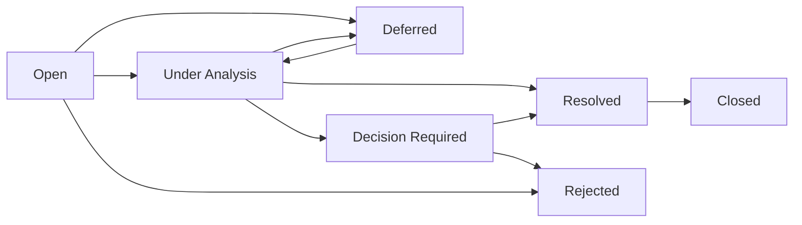

# 03 — Architecture Issue Register

## 1. Tujuan dan Kedudukan

Register ini adalah artefak tata kelola resmi untuk mencatat, mengendalikan, menelusuri, menyelesaikan, dan menutup kontradiksi, ketidakjelasan, gap, serta keputusan arsitektur yang belum diselesaikan dalam e-PeLARA Next Generation. Register melaksanakan mandat `00-Architecture-Charter.md`: ketidakkonsistenan Official Baseline dicatat dan dikelola tanpa memperluas ruang lingkup secara tidak terkendali.

Register bukan sumber keputusan arsitektur. Apabila issue membutuhkan pilihan arsitektur, keputusan, alasan, konsekuensi, dan persetujuannya direkam pada Architecture Decision Record (ADR). Register tetap menjadi indeks status dan bukti penutupan issue tersebut.

## 2. Ruang Lingkup dan Klasifikasi

Issue dicatat bila terdapat evidence eksplisit tentang kontradiksi, gap, ketidakjelasan, atau keputusan arsitektur yang belum tersedia pada artefak resmi. Cakupan lintas delapan domain EA adalah:

1. Business Architecture;
2. Data Architecture;
3. Application Architecture;
4. Integration Architecture;
5. Technology Architecture;
6. Security & Privacy Architecture;
7. Government Intelligence & AI Architecture; dan
8. Document & Publishing Architecture.

Issue dapat diberi domain utama dan domain terdampak. Governance, migration, dan compliance dicatat sebagai kategori lintas-domain agar tetap ditelusuri terhadap delapan domain tersebut.

| Istilah | Pengertian dan perlakuan |
|---|---|
| Issue | Kontradiksi, gap, atau ketidakjelasan yang sudah memiliki evidence eksplisit dan perlu resolusi atau disposition. Dicatat di register ini. |
| Risk | Ketidakpastian terhadap tujuan, dampak, atau peluang kegagalan. Dirujuk ke Architecture Risk Register. |
| Decision | Pilihan arsitektur yang memerlukan otoritas dan konsekuensi terdokumentasi. Direkam dalam ADR. |
| Change | Perubahan yang disetujui terhadap baseline, desain, atau artefak. Dikendalikan melalui Change Log dan proses perubahan. |
| Defect | Kegagalan perilaku implementasi terhadap spesifikasi yang telah disetujui. Dikelola dalam pelacakan defect implementasi; dapat menaik menjadi issue jika berdampak arsitektural. |
| Action item | Tugas terukur untuk melakukan analisis, menyiapkan bukti, atau melaksanakan keputusan. Ditautkan ke issue, tetapi bukan issue itu sendiri. |

### Severity

| Severity | Kriteria |
|---|---|
| Critical | Menghambat architecture gate kritis, kepatuhan/kewenangan, integritas data, keamanan, atau ketahanan layanan. |
| High | Menghambat rancangan lintas-domain atau menimbulkan dampak besar bila ditunda. |
| Medium | Memerlukan klarifikasi atau standardisasi sebelum area terkait diimplementasikan, tanpa blokir langsung saat ini. |
| Low | Dampak terbatas, dokumentasional, atau dapat dijadwalkan pada review berikutnya. |

## 3. Prinsip Pengelolaan

1. Evidence before assertion: issue hanya dicatat berdasarkan sumber resmi yang eksplisit.
2. Satu issue memiliki satu ID tetap, owner, status, dan jalur keputusan yang dapat ditelusuri.
3. Tidak ada status Resolved atau Closed tanpa resolution evidence dan closure approval.
4. Issue tidak boleh mengubah prinsip **One Data, Many Publications**.
5. Issue tidak menjadi alasan audit repository, source code, database, API, atau artefak di luar mandat.
6. ID tidak digunakan ulang dan tidak diisi dengan issue buatan untuk menutup urutan angka.

### Aturan Penomoran dan Reserved ID

Format ID adalah `AIR-001`, `AIR-002`, dan seterusnya, dengan nomor tiga digit berurutan. Nomor dialokasikan saat issue terverifikasi dicatat. Bila sebuah nomor dicadangkan untuk pencatatan yang sah tetapi usulan dibatalkan sebelum verifikasi, nomor tersebut diberi status **Reserved—Not Issued**, alasan, tanggal, dan persetujuan Chief Enterprise Architect; nomor tidak digunakan kembali. Tidak ada reserved ID dalam edisi awal ini.

## 4. Lifecycle dan Status Resmi

| Status | Makna dan kondisi keluar |
|---|---|
| Open | Evidence awal telah dicatat dan owner belum memulai analisis. Keluar ke Under Analysis, Rejected, atau Deferred. |
| Under Analysis | Dampak, domain, evidence, dan alternatif sedang dianalisis. Keluar ke Decision Required, Resolved, Deferred, atau Rejected. |
| Decision Required | Analisis menunjukkan keputusan otoritatif diperlukan; ADR dan/atau eskalasi wajib ditempuh. |
| Deferred | Issue valid tetapi ditunda dengan alasan, risiko, pemilik, dan tanggal review yang jelas. |
| Resolved | Resolusi telah diterapkan pada artefak yang tepat dan resolution evidence telah direkam; masih menunggu closure approval. |
| Closed | Closure approval telah diberikan setelah evidence resolusi diverifikasi. |
| Rejected | Usulan issue tidak valid, duplikat, atau di luar ruang lingkup; alasan dan otoritas penolakan dicatat. |

## 5. Struktur Field Register

Setiap entri wajib berisi: Issue ID; judul; domain; sumber/evidence; uraian kontradiksi atau gap; dampak; severity; status; owner; target architecture gate; target resolution; decision path; related ADR/risk/compliance; resolution evidence; dan closure approval. Field pendukung yang wajib ditambahkan saat relevan: domain terdampak, tanggal buka, action item, alasan penundaan, dan tanggal review berikutnya.

## 6. Eskalasi, Keterhubungan Artefak, dan Cadence Review

### Aturan Eskalasi

Issue dieskalasikan kepada Project Owner melalui Chief Enterprise Architect apabila memengaruhi regulasi atau kewenangan; scope, biaya, atau jadwal utama; data lintas OPD; integrasi eksternal; risiko kehilangan data, gangguan layanan, keamanan, atau vendor lock-in; atau memerlukan pengecualian terhadap Charter. Issue Critical segera dieskalasikan setelah evidence tervalidasi. Issue High yang statusnya Decision Required dieskalasikan sebelum architecture gate target.

| Artefak terkait | Hubungan dengan register |
|---|---|
| ADR | Wajib untuk issue yang memerlukan keputusan arsitektur. ID ADR dan statusnya dicatat pada field related ADR/risk/compliance. |
| Architecture Risk Register | Wajib dirujuk bila issue menciptakan ketidakpastian terhadap tujuan, dampak, atau jadwal. |
| Compliance Register | Wajib dirujuk bila issue menyangkut kewajiban regulasi, standar, atau kontrol kepatuhan. |
| Traceability Matrix | Menautkan issue dengan evidence, requirement, desain, gate, keputusan, dan bukti penerimaan. |
| Change Log | Mencatat perubahan pada register ini; perubahan baseline/desain akibat resolusi tetap mengikuti proses perubahan artefak masing-masing. |

Review dilakukan mingguan selama tahap aktif yang memuat issue Open, Under Analysis, atau Decision Required; sebelum setiap architecture gate; dan pada architecture review bulanan. Entry Deferred ditinjau pada tanggal review berikutnya yang dicatat. Project Owner menerima ringkasan issue Critical/High dan semua issue Decision Required.

### Definition of Resolution

Issue dapat berstatus Resolved hanya jika: jalur keputusan telah selesai bila diperlukan; perubahan atau disposition terdokumentasi pada artefak berwenang; evidence dapat diperiksa dan ditautkan; dampak residual telah dinilai; serta owner merekomendasikan resolusi.

### Definition of Closure

Issue dapat berstatus Closed hanya jika seluruh kriteria Resolution terpenuhi, closure approval dicatat oleh otoritas berwenang, referensi ADR/risk/compliance/traceability telah diperbarui bila relevan, dan tidak ada action item wajib yang tersisa. ChatGPT Work tidak memiliki kewenangan memberikan closure approval.

## 7. Governance dan Kewenangan

| Peran | Nama | Kewenangan |
|---|---|---|
| Project Owner | Fahmi Alhabsi | Persetujuan institusional dan keputusan akhir yang dieskalasikan; memberikan persetujuan penutupan sesuai dampaknya. |
| Chief Enterprise Architect | ChatGPT | Menetapkan klasifikasi, owner, jalur keputusan, rekomendasi resolusi, dan eskalasi arsitektur; mengarahkan issue ke ADR bila diperlukan. |
| Penyusun Dokumen | ChatGPT Work | Menyusun dan memelihara register berdasarkan evidence resmi; tidak mengambil keputusan arsitektur dan tidak menutup issue. |
| Owner Issue | Ditunjuk per issue | Menyediakan analisis, action item, evidence resolusi, dan rekomendasi status. |

Issue yang membutuhkan keputusan arsitektur diarahkan ke ADR. Issue kepatuhan diarahkan ke Compliance Register. Issue yang menimbulkan ketidakpastian terhadap tujuan diarahkan ke Architecture Risk Register.

## 8. Initial Architecture Issues

Seluruh entri berikut berasal dari daftar initial issue yang eksplisit pada `00-Architecture-Charter.md`; empat issue bertanda keputusan segera juga dirujuk langsung oleh Roadmap. Status awal tidak menyatakan issue telah selesai.

| Issue ID | Judul | Domain | Sumber/evidence | Uraian kontradiksi atau gap | Dampak | Severity | Status | Owner | Target architecture gate | Target resolution | Decision path | Related ADR/risk/compliance | Resolution evidence | Closure approval |
|---|---|---|---|---|---|---|---|---|---|---|---|---|---|---|
| AIR-001 | Ketidakkonsistenan siklus Renstra 5 tahun dan 6 tahun | Data Architecture | Charter §11; Roadmap artefak ADR-0001/G2; Baseline `../01-current-state/2-modul-sistem.md` dan `../01-current-state/3-alur-logika-sistem.md` menyatakan 5 tahun, sedangkan `../01-current-state/5-referensi-teknis-database-api-frontend.md` §1 dan §5.1.5 menyatakan Renstra 6 tahun | Siklus dan aturan temporal Renstra belum konsisten antardokumen. | Mengganggu model periode, perhitungan, lineage, dan konsistensi dokumen. | Critical | Resolved | Data Architecture Lead/Data Owner — To be assigned by Project Owner. | G2 — Data and Knowledge Foundation | Temporal model dan aturan periode disahkan. | ADR-0001 (Accepted, 2026-08-05); jalur keputusan selesai — Project Owner memilih Opsi C (Hybrid: siklus normatif 5 tahun + transition year kondisional tahun ke-6). | ADR-0001, Version 1.0.0, Accepted, `00-governance/adr/ADR-0001-Temporal-Model-Decision.md`; Risk/Compliance: belum ditentukan, tetap Evidence Pending. | ADR-0001 Version 1.0.0 Accepted, efektif 2026-08-05, mencatat keputusan periode dan disposisi field `target_tahun_6`/`pagu_tahun_6` sebagai transition year. Aturan pemicu transition year dan penetapan metadata `period_type` tetap Evidence Pending, dirutekan ke BP-DATA-003/GOV-DATA-001. **Addendum 2026-08-29**: verifikasi langsung kode mengonfirmasi field `target_tahun_6`/`pagu_tahun_6` benar-benar ada dan konsisten di 10 model Renstra (`renstra_tabelTujuanModel.js` s.d. `renstra_tabelSubKegiatanModel.js`, dst.), sesuai deskripsi ADR-0001 §1.1. Metadata `period_type` **belum ada di kode manapun** (dicek eksplisit) — konsisten dengan status Evidence Pending yang sudah tercatat, bukan penyimpangan baru. BP-DATA-003 §11 dan GOV-DATA-001 §7/§9/§12 diverifikasi **sudah benar** merutekan aturan pemicu transition year ke "institutional/statutory authority" secara eksplisit (bukan Data Owner program-level, bukan Project Owner biasa) — tidak ditemukan inkonsistensi yang perlu diperbaiki di kedua dokumen tsb. | Aturan pemicu transition year **tidak dapat diputuskan oleh sesi otomatis ini** — ADR-0001 §3.1 butir 3 dan GOV-DATA-001 §7 baris 4 secara eksplisit mensyaratkan institutional/statutory authority (bukan keputusan teknis/arsitektur biasa). Bagian yang dapat diverifikasi (konsistensi field kode, ketepatan routing dokumen) sudah dilakukan dan hasilnya bersih. Resolved bukan Closed — closure tetap menunggu penetapan institusional tersebut. |
| AIR-002 | Status data dashboard tidak konsisten | Application Architecture | Architecture Charter §11 — mencatat kontradiksi antara temuan baseline terdahulu dan penilaian current state. | Status implementasi dashboard tidak konsisten di artefak baseline. | Ketidakpastian tingkat kesiapan baseline dan dasar desain dashboard. | Medium | Resolved | Application Owner — To be assigned by Project Owner. | G3 — Integrated Target Architecture | Status baseline dan evidence level dashboard ditetapkan. | **Addendum 2026-08-29**: diselesaikan lewat verifikasi langsung kode (bukan ADR — tidak ada keputusan arsitektur target yang perlu diubah, murni klarifikasi fakta current-state), sesuai jalur "Klarifikasi artefak baseline" yang sudah tercatat di kolom ini. | Peninjauan langsung 8 file controller dashboard di `backend/controllers/`: `Math.random()` **tidak ditemukan** di manapun; `RealisasiIndikator` dipakai nyata di `dashboardController.js`/`dashboardRpjmdController.js`; `dashboardLkdController.js` (484 baris) memakai `sequelize.query()` SQL nyata di 15+ lokasi, bukan data statis. | Klaim `4-penilaian-kesesuaian-standar.md` §4.7 ("data nyata dari RealisasiIndikator") **terbukti benar** untuk kondisi kode saat ini; klaim §4.4 baris 7 ("masih dummy") **terbukti usang** — kemungkinan ditulis sebelum rekomendasi §4.6 (`Math.random()` → `RealisasiIndikator`) dilaksanakan. Baseline **tidak ditulis ulang** (fakta historis, per prinsip yang sama dengan penanganan ADR-0001 §4.2) — anotasi verifikasi ditambahkan di baseline merujuk balik ke baris ini. | Resolved bukan Closed — closure approval eksplisit Project Owner/Application Owner belum diperoleh secara terpisah sesuai Definition of Closure §4. Tidak ada ADR diperlukan — tidak ada keputusan arsitektur target yang diubah, murni klarifikasi current-state. |
| AIR-003 | Status model Notification tidak konsisten | Application Architecture | Charter §11; `../01-current-state/5-referensi-teknis-database-api-frontend.md` §5.1.5 menyatakan field belum didefinisikan; `../01-current-state/4-penilaian-kesesuaian-standar.md` §4 menyatakan field sudah lengkap | Kondisi model Notification berbeda antardokumen sumber. | Ketidakpastian kontrak data dan notifikasi real-time. | Medium | Open | Application/Integration Owner — To be assigned by Project Owner. | G3 — Integrated Target Architecture | Target notification architecture dan status baseline tervalidasi. | Analisis artefak; ADR bila ada keputusan lintas-domain. | ADR/Risk/Compliance: belum ditentukan. | Belum tersedia. | Belum tersedia. |
| AIR-004 | Ketidakjelasan status implementasi workflow approval | Business & Application Architecture | Charter §11; Roadmap BP-APP-002/G3; `../01-current-state/4-penilaian-kesesuaian-standar.md` §4.6 menyebut implementasi berikutnya, sedangkan Charter mencatat implementasi parsial | Workflow approval belum memiliki status dan model state enterprise yang konsisten. | Mengancam kewenangan, lifecycle dokumen, auditability, dan kepatuhan. | Critical | Resolved | Business Process Owner dan Application Owner — To be assigned by Project Owner. | G3 — Integrated Target Architecture | Enterprise Workflow State Model disetujui. | ADR-0002 (Accepted, 2026-08-06); jalur keputusan selesai — Project Owner memilih Opsi A (Standardisasi Penuh: model generik 4-state DRAFT/SUBMITTED/APPROVED/REJECTED berlaku seragam lintas RPJMD, Renstra, Renja, RKA, DPA, RKPD, LAKIP). | ADR-0002, Version 1.0.0, Accepted, `00-governance/adr/ADR-0002-Enterprise-Workflow-State-Model-Decision.md`; Compliance Register: evaluasi tetap diperlukan, belum dilakukan pada ADR ini. ADR-0002 Version 1.0.0 Accepted, efektif 2026-08-06, menetapkan standardisasi model state 4-state lintas modul, penyatuan checklist granular Renja sebagai metadata (bukan state terpisah), kewajiban perbaikan sinkronisasi RPJMD, dan penyatuan definisi otorisasi admin. Rencana migrasi teknis konkret, disposisi modul BMD/TLHP/MR/LK/Penatausahaan, dan kebutuhan approval berjenjang tetap Evidence Pending, didelegasikan ke BP-APP-002. **Addendum 2026-08-29**: dua item yang didelegasikan ke BP-APP-002 §9 kini **Implemented dengan evidence** — (1) sinkronisasi RPJMD: `rpjmd` ditambahkan ke `ENTITY_TABLE_MAP`/`TABLE_STATUS_MAP`, migration `20260808090001-add-rpjmd-approval-status.js`, regression self-test 8/8 pass; (2) penyatuan definisi admin: `ADMIN_ROLES` dead code dihapus, `WORKFLOW_ADMIN_ROLES` jadi satu-satunya sumber, regression self-test 18/18 pass. Lampiran teknis 32a (Tahap 1 lint rule, Tahap 3 Opsi C pre-commit) juga diverifikasi independen langsung pada sesi ini (dijalankan nyata, bukan sekadar dibaca) — detail di 32a v0.1.1 §7.3 dan BP-APP-002 v0.2.1 §9. | Regression self-test output (8/8, 18/18 pass, dijalankan langsung sesi ini); 32a v0.1.1 §7.3; BP-APP-002 v0.2.1 §9. Resolved bukan Closed — closure approval eksplisit Project Owner belum diperoleh secara terpisah sesuai Definition of Closure §4. Disposisi modul BMD/TLHP/MR/LK/Penatausahaan dan kebutuhan approval berjenjang tetap Evidence Pending, tidak tersentuh addendum ini. |
| AIR-005 | Beberapa library UI digunakan bersamaan | Technology & Document/Publishing Architecture | Charter §11; `../01-current-state/1-identitas-sistem.md` dan `../01-current-state/5-referensi-teknis-database-api-frontend.md` mencatat beberapa library UI | Belum ada satu design system target dan strategi konsolidasi. | Inkonsistensi UX, biaya pemeliharaan, dan kualitas publikasi. | Medium | Open | Technology/Design System Owner — To be assigned by Project Owner. | G3 — Integrated Target Architecture | Design system target dan strategi konsolidasi bertahap ditetapkan. | ADR bila pilihan standar lintas aplikasi diperlukan. | ADR/Risk/Compliance: belum ditentukan. | Belum tersedia. | Belum tersedia. |
| AIR-006 | Kriteria penerimaan siap produksi belum seragam | Governance lintas delapan domain | Charter §11; `../01-current-state/4-penilaian-kesesuaian-standar.md` §5 menyatakan siap produksi sementara Charter P-16 dan Gate 6 mengharuskan evidence | Klaim kesiapan produksi belum dipetakan ke kriteria penerimaan dan evidence seragam. | Risiko go-live tanpa bukti yang memadai. | High | Decision Required | Release and Operations Owner — To be assigned by Project Owner. | G6 — Production Ready | Production Readiness Gate dan evidence checklist disetujui. | ADR/governance decision; eskalasi Project Owner untuk go-live. | ADR: akan ditetapkan; Risk Register: evaluasi diperlukan. | **Addendum 2026-08-29**: struktur checklist (GOV-MIG-002/Seq 72) kini diisi penilaian evidence aktual per 8 kategori (bukan lagi placeholder kosong) — lihat GOV-MIG-002 v1.1.0 §6. Ringkasan: Backup/Restore dan Operations Evidence **tersedia**; Functional/Security/UAT/Rollback **sebagian tersedia** (cakupan parsial per modul); Performance dan Approval **Evidence Pending** (belum ada sama sekali). Status tetap **Decision Required** — bukan diri sendiri berubah menjadi Resolved, karena keputusan "apakah kriteria ini seragam dan cukup untuk go-live" tetap sepenuhnya wewenang Project Owner, bukan sesuatu yang bisa disimpulkan dari evidence teknis semata. | Evidence penilaian §6 GOV-MIG-002 v1.1.0 (dieksekusi langsung sesi ini); Belum tersedia untuk keputusan final. |
| AIR-007 | Integrasi SIPD masih berupa gap | Integration Architecture | Charter §11; Roadmap BP-INT-001/G3; `../01-current-state/4-penilaian-kesesuaian-standar.md` §4.6 menyatakan perlu dikaji | Kontrak, akses, dan pola integrasi SIPD belum ditetapkan. | Menghambat interoperabilitas dan pertukaran data perencanaan. | High | Resolved | Integration Owner — To be assigned by Project Owner. | G3 — Integrated Target Architecture | SIPD Integration Blueprint dan disposition akses/kontrak disetujui tanpa mengasumsikan API tersedia. | ADR-0004 (Accepted, 2026-08-06); jalur keputusan selesai — Project Owner memilih Opsi A (Formalisasi Interim Pattern: pola ekspor-manual/PDF-parsing yang sudah berjalan diakui sebagai Interim Integration Pattern resmi; status akses API SIPD tetap Decision Required/Evidence Pending sampai dikonfirmasi Kemendagri). | ADR-0004, Version 1.0.0, Accepted, `00-governance/adr/ADR-0004-SIPD-Integration-Interim-Pattern-Decision.md`; Risk/Compliance: evaluasi tetap diperlukan, belum dilakukan pada ADR ini. | ADR-0004 Version 1.0.0 Accepted, efektif 2026-08-06, memformalkan pola PDF-import/ekspor-manual sebagai Interim Integration Pattern, tanpa mengasumsikan ketersediaan API SIPD. Kontrak data teknis Interim Pattern, eskalasi institusional ke Kemendagri, dan Target Integration Pattern (API-based) tetap Evidence Pending, didelegasikan ke BP-INT-001. **Addendum 2026-08-29**: kontrak data teknis Interim Pattern kini **terdokumentasi** (BP-INT-001 v0.1.1 §6a, berdasarkan peninjauan langsung `rkaSipdPdfImportService.js`/`realisasiSipdPdfImportService.js`). Target Integration Pattern (API-based) dan eskalasi institusional ke Kemendagri **tetap Evidence Pending, sengaja tidak diisi** — ADR-0004 §3 butir 4 dan BP-INT-001 §7 eksplisit melarang pengisian berdasarkan asumsi untuk sistem eksternal yang karakteristiknya tidak diketahui. | BP-INT-001 v0.1.1 §6a (dokumentasi kontrak teknis, evidence baru). Resolved bukan Closed — closure approval eksplisit Project Owner belum diperoleh secara terpisah sesuai Definition of Closure §4. Ketersediaan API SIPD tetap murni keputusan eksternal Kemendagri, di luar kendali sesi otomatis manapun. |
| AIR-008 | CSRF protection belum tersedia | Security & Privacy Architecture | Charter §11; `../01-current-state/4-penilaian-kesesuaian-standar.md` §4 menyatakan belum ada CSRF protection (baseline 2026-08-06, kini usang — lihat kolom evidence) | Control pencegahan CSRF belum tersedia dalam baseline. | Risiko keamanan pada pengiriman form. | High | Resolved | Security Owner — To be assigned by Project Owner. | G3 — Integrated Target Architecture | Security control dan evidence penerapannya ditetapkan dalam Security Architecture/control backlog. | **Addendum 2026-08-29**: peninjauan langsung kode menemukan CSRF protection sudah diimplementasikan penuh (Sprint 3, S3-2, uncommitted sebelum sesi ini) — double-submit-cookie pattern: `backend/lib/csrfToken.js`, `backend/middlewares/csrfProtection.js`, wired inline di `backend/middlewares/verifyToken.js` (dipanggil setelah otentikasi berhasil, hanya untuk request cookie-authenticated pada method state-changing; bearer-authenticated request tidak diperiksa — desain sengaja, dijelaskan lengkap di header file). Cookie `csrfToken` di-set/clear di `authController.js` (login/register/refresh/logout). Frontend (`frontend/src/services/api.js`) membaca cookie dan mengirim ulang header `X-CSRF-Token`. Self-test `backend/scripts/csrfProtectionSelfTest.js`: **19/19 pass**, termasuk verifikasi eksplisit bahwa wiring di `verifyToken.js` benar-benar terpasang (bukan hanya kode ada tapi tidak terpanggil). | Compliance Register: evaluasi control diperlukan; Risk Register: evaluasi diperlukan. | Self-test output 19/19 pass (dijalankan langsung sesi ini, `node scripts/csrfProtectionSelfTest.js`); commit kode terkait dibuat pada sesi ini (lihat Enterprise Change Log ECHG-087) untuk memastikan evidence ini punya riwayat git, bukan hanya klaim atas working tree lokal. | Resolved bukan Closed — closure approval eksplisit Project Owner/otoritas keamanan belum diperoleh. Cakupan CSRF sengaja terbatas pada cookie-authenticated state-changing request (desain, bukan celah) — Project Owner perlu meninjau apakah cakupan ini dianggap memadai untuk closure. |
| AIR-009 | Backup dan restore otomatis belum tersedia | Technology Architecture | Charter §11; Roadmap BP-TECH-003/G3–G5 | Otomasi backup/restore dan target ketahanan belum tersedia. | Risiko kehilangan data dan pemulihan layanan tidak terukur. | Critical | Resolved | Technology and Operations Owner — To be assigned by Project Owner. | G3 — Integrated Target Architecture; G4 — Migration Ready; G5 — Implementation Ready | RPO/RTO, backup, restore test, dan disaster recovery target disetujui serta dibuktikan. | ADR-0003 (Accepted, 2026-08-06); jalur keputusan target selesai — Project Owner menetapkan RPO 24 jam, RTO fleksibel sesuai kapasitas operasional; restore test wajib dilakukan berkala. Pembuktian aktual (implementasi backup, restore test terlaksana) belum dilakukan. | ADR-0003, Version 1.0.0, Accepted, `00-governance/adr/ADR-0003-Backup-and-Disaster-Recovery-Decision.md`; Risk Register: evaluasi tetap diperlukan, belum dilakukan pada ADR ini. | ADR-0003 Version 1.0.0 Accepted, efektif 2026-08-06, menetapkan target RPO 24 jam dan RTO fleksibel, mensyaratkan restore test berkala sebagai bukti (bukan hanya backup ada). **Addendum 2026-08-29**: teknologi/tooling backup konkret **kini Implemented** (`backend/scripts/databaseBackup.js` dkk, Sprint 2, commit `949a3e4f` 2026-08-16) dan **pelaksanaan restore test aktual kini tersedia** — dijalankan langsung pada sesi 2026-08-29 terhadap `db_epelara` lokal/dev, outcome `RESTORE_VERIFIED` (checksum match, 283/283 tabel, cleanup sukses); detail lengkap di BP-TECH-003 v0.2.0 §9. Lokasi penyimpanan/retensi punya default terpasang di kode, kecukupannya belum eksplisit dikonfirmasi Owner. Penjadwalan otomatis berkala (Task Scheduler) dikonfirmasi **belum terdaftar** di mesin ini — masih tindakan manual Owner. | Evidence restore test kini tersedia (lihat kolom sebelumnya dan BP-TECH-003 v0.2.0 §9) — namun **Resolved bukan Closed**: closure approval eksplisit Project Owner belum diperoleh, dan Project Owner belum memutuskan apakah bukti sekali-jalan di lingkungan lokal/dev ini cukup untuk closure, atau perlu diulang berkala/terhadap lingkungan produksi, sesuai Definition of Closure §4. |
| AIR-010 | Dokumentasi mencampur current state, hasil perbaikan, dan rekomendasi masa depan | Governance lintas delapan domain | Charter §11; perbedaan status pada AIR-002, AIR-003, AIR-004, dan AIR-006 memperlihatkan campuran evidence baseline | Status, versi, tanggal efektif, owner, dan evidence level belum diterapkan seragam pada artefak. | Menurunkan keterlacakan dan meningkatkan risiko keputusan berbasis status yang keliru. | High | Resolved | Chief Enterprise Architect | G1 — Business and Regulatory Alignment | Standar metadata dan evidence level diterapkan pada artefak tata kelola terkait. | Governance decision — diselesaikan tanpa ADR karena tidak menetapkan keputusan arsitektur lintas-domain, hanya standar metadata administratif. | Traceability Matrix: **Addendum 2026-08-29** — Seq 74 sudah disusun sejak Batch 4 (2026-08-05), keterangan "belum dimulai" di sini usang; kini v1.1.0 dengan koreksi staleness Seq 32/38/44, ditautkan konseptual ke GOV-EA-006 §30; ADR/Risk/Compliance: tidak diperlukan untuk resolusi ini. | GOV-EA-006 (Traceability Standard) Version 1.1.0 §30 "Metadata dan Evidence Level Standard" menetapkan field front-matter minimum dan definisi Evidence Level; diterapkan melalui patch administratif pada front-matter `01-Repository-Structure.md`, `06-Change-Log.md`, `07-Architecture-Governance-Operating-Model.md`, `08-Architecture-Review-and-Gate-Standard.md`, dan `09-Traceability-Standard.md` (field `domain`/`last_reviewed` ditambahkan tanpa mengubah substansi/versi/status). `03-Architecture-Issue-Register.md`, `04-Architecture-Risk-Register.md`, dan `05-Compliance-Register.md` sudah memenuhi standar field sejak awal. `00-Architecture-Charter.md` sengaja tidak diubah (baseline foundational tanpa front-matter, sesuai batas §30.1). | Belum tersedia; Resolved bukan Closed — closure approval eksplisit Chief Enterprise Architect/Project Owner belum diperoleh secara terpisah sesuai Definition of Closure §4. |

### Issue yang Memerlukan Keputusan Segera

AIR-006 perlu diputuskan sebelum G6 agar klaim kesiapan produksi dapat dinilai dengan evidence yang seragam. AIR-001, AIR-004, AIR-007, dan AIR-009 telah Resolved masing-masing melalui ADR-0001 (2026-08-05), ADR-0002 (2026-08-06), ADR-0004 (2026-08-06), dan ADR-0003 (2026-08-06); keempatnya tetap memerlukan closure approval eksplisit Project Owner secara terpisah sesuai Definition of Closure §4 — untuk AIR-009 secara khusus juga memerlukan bukti restore test aktual — namun tidak lagi termasuk kategori "memerlukan keputusan segera" karena jalur keputusan arsitekturnya sudah selesai.

## 9. Persetujuan

| Peran | Nama | Keputusan | Tanda tangan | Tanggal |
|---|---|---|---|---|
| Penyusun Dokumen | ChatGPT Work | Disusun | Pending | 2026-08-04 |
| Chief Enterprise Architect | ChatGPT | Direview dan direkomendasikan untuk disahkan | Pending | — |
| Project Owner | Fahmi Alhabsi | Disahkan | Pending | 2026-08-04 |

## 10. Change Log

| Versi | Tanggal | Perubahan | Penyusun | Status |
|---|---|---|---|---|
| 1.0.13 | 2026-08-29 | AIR-002 Open → Resolved: verifikasi langsung 8 controller dashboard mengonfirmasi tidak ada `Math.random()`, `RealisasiIndikator`/query SQL nyata dipakai — klaim §4.7 baseline benar, §4.4 baris 7 usang. Anotasi verifikasi ditambahkan di `01-current-state/4-penilaian-kesesuaian-standar.md` (baseline sendiri tidak ditulis ulang, sesuai prinsip fakta historis). Tidak ada baris issue lain yang diubah. Dilakukan di bawah runbook `11-roadmaps/backlog-eksekusi-otomatis.md` (mode `/loop` otonom). | Claude (mode `/loop`, sesi eksekusi backlog) | Approved — Evidence Addendum (belum direview terpisah oleh Project Owner) | Baris AIR-010: referensi Seq 74 "belum dimulai" dikoreksi (usang sejak Batch 4). Traceability Matrix (Seq 74) sendiri diperbarui ke v1.1.0 — koreksi staleness Seq 32/38/44 dari "belum disusun" menjadi Approved. Populasi detail per-requirement 75 artefak sengaja tidak dikerjakan (bertentangan dengan larangan dokumen itu sendiri). Tidak ada baris issue lain yang diubah. Dilakukan di bawah runbook `11-roadmaps/backlog-eksekusi-otomatis.md` (mode `/loop` otonom). | Claude (mode `/loop`, sesi eksekusi backlog) | Approved — Correction Addendum (belum direview terpisah oleh Project Owner) |
| 1.0.11 | 2026-08-29 | Baris AIR-007: kontrak data teknis Interim Pattern kini terdokumentasi (BP-INT-001 v0.1.1 §6a, evidence kode nyata). Target Integration Pattern (API-based) dan eskalasi Kemendagri tetap Evidence Pending — sengaja tidak diisi, ADR-0004 §3 butir 4 eksplisit melarang pengisian berdasarkan asumsi. Tidak ada baris issue lain yang diubah. Dilakukan di bawah runbook `11-roadmaps/backlog-eksekusi-otomatis.md` (mode `/loop` otonom). | Claude (mode `/loop`, sesi eksekusi backlog) | Approved — Evidence Addendum (belum direview terpisah oleh Project Owner) |
| 1.0.10 | 2026-08-29 | Baris AIR-004: dua item delegasi BP-APP-002 §9 (sinkronisasi RPJMD, penyatuan definisi admin) dikonfirmasi Implemented dengan regression self-test (8/8, 18/18 pass, dijalankan langsung sesi ini). Lampiran 32a diverifikasi independen (Tahap 1/Tahap 3 Opsi C dijalankan nyata). Status tetap Resolved (bukan Closed); disposisi modul lain dan approval berjenjang tetap Evidence Pending, tidak tersentuh. Tidak ada baris issue lain yang diubah. Dilakukan di bawah runbook `11-roadmaps/backlog-eksekusi-otomatis.md` (mode `/loop` otonom). | Claude (mode `/loop`, sesi eksekusi backlog) | Approved — Evidence Addendum (belum direview terpisah oleh Project Owner) |
| 1.0.9 | 2026-08-29 | Baris AIR-001: ditambahkan verifikasi langsung — field `target_tahun_6`/`pagu_tahun_6` dikonfirmasi konsisten di 10 model Renstra; metadata `period_type` dikonfirmasi belum ada (sesuai Evidence Pending yang sudah tercatat); BP-DATA-003/GOV-DATA-001 dikonfirmasi sudah benar merutekan aturan pemicu transition year ke institutional/statutory authority. Tidak ada perubahan status (tetap Resolved) — aturan pemicu itu sendiri secara eksplisit di luar wewenang sesi otomatis (ADR-0001 §3.1). Tidak ada baris issue lain yang diubah. Dilakukan di bawah runbook `11-roadmaps/backlog-eksekusi-otomatis.md` (mode `/loop` otonom). | Claude (mode `/loop`, sesi eksekusi backlog) | Approved — Verification Addendum (belum direview terpisah oleh Project Owner) |
| 1.0.8 | 2026-08-29 | Baris AIR-006: kolom evidence diisi hasil penilaian aktual 8 kategori Production Readiness Checklist (GOV-MIG-002 v1.1.0 §6) — Backup/Restore & Operations tersedia, Functional/Security/UAT/Rollback sebagian, Performance & Approval Evidence Pending. Status **tetap Decision Required** (bukan Resolved) — keputusan kecukupan kriteria untuk go-live tetap sepenuhnya wewenang Project Owner. Tidak ada baris issue lain yang diubah. Dilakukan di bawah runbook `11-roadmaps/backlog-eksekusi-otomatis.md` (mode `/loop` otonom). | Claude (mode `/loop`, sesi eksekusi backlog) | Approved — Evidence Addendum (belum direview terpisah oleh Project Owner) |
| 1.0.7 | 2026-08-29 | Baris AIR-008: Open → Resolved setelah peninjauan langsung kode menemukan CSRF protection (Sprint 3, S3-2) sudah diimplementasikan penuh dan wired (double-submit-cookie, verifikasi via self-test 19/19 pass). Kode terkait (sebelumnya uncommitted) dikomit pada sesi ini. Status tetap Resolved bukan Closed — closure tetap wewenang Project Owner/otoritas keamanan. Tidak ada baris issue lain yang diubah. Dilakukan di bawah runbook `11-roadmaps/backlog-eksekusi-otomatis.md` (mode `/loop` otonom). | Claude (mode `/loop`, sesi eksekusi backlog) | Approved — Evidence Addendum (belum direview terpisah oleh Project Owner) |
| 1.0.6 | 2026-08-29 | Baris AIR-009: evidence restore test aktual ditambahkan setelah verifikasi langsung kode (`backend/scripts/databaseBackup.js` dkk, Sprint 2 commit `949a3e4f`) dan eksekusi nyata `db:backup`/`db:restore:verify` pada sesi ini terhadap `db_epelara` lokal/dev (outcome `RESTORE_VERIFIED`, detail di BP-TECH-003 v0.2.0 §9). Status baris tetap Resolved (bukan Closed) — closure eksplisit tetap wewenang Project Owner, termasuk keputusan kecukupan bukti sekali-jalan lokal/dev ini. Tidak ada baris issue lain yang diubah. Dilakukan di bawah runbook `11-roadmaps/backlog-eksekusi-otomatis.md` (mode `/loop` otonom). | Claude (mode `/loop`, sesi eksekusi backlog) | Approved — Evidence Addendum (belum direview terpisah oleh Project Owner) |
| 1.0.5 | 2026-08-06 | AIR-007 dan AIR-009 diperbarui dari Decision Required menjadi Resolved setelah ADR-0004 (SIPD Integration Interim Pattern Decision, Opsi A — Formalisasi Interim Pattern) dan ADR-0003 (Backup and Disaster Recovery Decision, Opsi A — RPO 24 jam/RTO fleksibel) disahkan Accepted oleh Project Owner pada 2026-08-06, berdasarkan peninjauan langsung implementasi kode aplikasi. Decision path, resolution evidence, dan related ADR pada kedua baris diperbarui; baris "Issue yang Memerlukan Keputusan Segera" disesuaikan. Closure approval tetap Belum tersedia untuk keduanya; untuk AIR-009 secara khusus closure juga memerlukan bukti restore test aktual, belum dilaksanakan. Tidak ada baris issue lain yang diubah. | Claude Work, di bawah HANDOFF-e-PeLARA-EA-2026-08-05-v10 | Approved — Administrative Patch |
| 1.0.4 | 2026-08-06 | AIR-004 diperbarui dari Decision Required menjadi Resolved setelah ADR-0002 (Enterprise Workflow State Model Decision, Opsi A — Standardisasi Penuh) disahkan Accepted oleh Project Owner pada 2026-08-06, berdasarkan peninjauan langsung implementasi kode aplikasi. Decision path, resolution evidence, dan related ADR pada baris AIR-004 diperbarui; baris "Issue yang Memerlukan Keputusan Segera" disesuaikan. Closure approval tetap Belum tersedia karena closure memerlukan persetujuan eksplisit Project Owner secara terpisah. Tidak ada baris issue lain yang diubah. | Claude Work, di bawah HANDOFF-e-PeLARA-EA-2026-08-05-v10 | Approved — Administrative Patch |
| 1.0.3 | 2026-08-05 | AIR-010 diperbarui dari Open menjadi Resolved setelah GOV-EA-006 (Traceability Standard) Version 1.1.0 §30 menetapkan Metadata dan Evidence Level Standard, dan diterapkan melalui patch administratif pada front-matter lima artefak governance (01, 06, 07, 08, 09). Resolution evidence, decision path, dan status pada baris AIR-010 diperbarui; closure approval tetap Belum tersedia. Tidak ada baris issue lain yang diubah. | Claude Work, berdasarkan standing delegation Project Owner tanggal 2026-08-05 | Approved — Administrative Patch |
| 1.0.2 | 2026-08-05 | AIR-001 diperbarui dari Decision Required menjadi Resolved setelah ADR-0001 (Temporal Model Decision, Opsi C — Hybrid) disahkan Accepted oleh Project Owner pada 2026-08-05. Decision path, resolution evidence, dan related ADR pada baris AIR-001 diperbarui; closure approval tetap Belum tersedia karena closure memerlukan persetujuan eksplisit Project Owner secara terpisah. Tidak ada baris issue lain yang diubah. | Claude Work, di bawah HANDOFF-e-PeLARA-EA-2026-08-05-v10 | Approved — Administrative Patch |
| 1.0.1 | 2026-08-04 | Pembaruan referensi lokasi Official Current State Baseline setelah pemindahan ke 01-current-state; tanpa perubahan substansi. | ChatGPT Work | Approved — Administrative Patch |
| 1.0.0 | 2026-08-04 | Penyusunan, review, dan pengesahan Official Architecture Issue Register. | ChatGPT Work | Approved |
