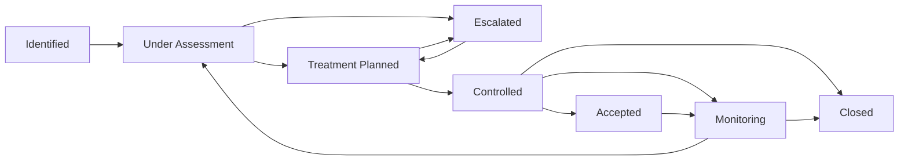

# 04 — Architecture Risk Register

## 1. Tujuan dan Kedudukan

Register ini adalah artefak governance resmi untuk mengidentifikasi, menilai, menangani, memantau, mengeskalasi, menerima, dan menutup risiko Enterprise Architecture e-PeLARA Next Generation. Register melengkapi Architecture Charter, Roadmap, dan Architecture Issue Register; register ini tidak menggantikan keputusan arsitektur, kontrol kepatuhan, atau pengelolaan defect implementasi.

| Istilah | Kedudukan |
|---|---|
| Issue | Kondisi, kontradiksi, atau gap yang telah terjadi dan memiliki evidence. Dicatat pada Architecture Issue Register. |
| Risk | Ketidakpastian yang dapat memengaruhi tujuan, gate, kualitas, keamanan, kepatuhan, atau keberlanjutan transformasi. Dicatat di register ini. |
| Decision | Pilihan arsitektur dan konsekuensinya; dicatat melalui ADR. |
| Defect | Kegagalan implementasi terhadap spesifikasi yang disetujui; dikelola melalui pelacakan defect. |
| Action item | Pekerjaan penanganan yang terukur; ditautkan ke risk atau issue, tetapi bukan risk itu sendiri. |
| Compliance finding | Ketidaksesuaian terhadap regulasi atau kontrol; dicatat dan dibuktikan pada Compliance Register. |

## 2. Ruang Lingkup dan Prinsip Risk Governance

Ruang lingkup mencakup delapan domain EA: Business, Data, Application, Integration, Technology, Security & Privacy, Government Intelligence & AI, serta Document & Publishing Architecture. Risiko governance, migration, dan compliance dipetakan sebagai lintas-domain terhadap domain yang terdampak.

Prinsip pengelolaan risiko:

1. Evidence dan rationale mendahului penilaian skor.
2. Risiko dikelola sepanjang lifecycle dan architecture gate, bukan hanya saat eskalasi.
3. Setiap risiko memiliki owner manusia/fungsi organisasi, treatment, trigger/KRI, dan jalur penerimaan yang jelas.
4. Inherent risk dinilai sebelum treatment; residual risk hanya dinilai setelah treatment dirancang atau diterapkan.
5. Risiko Critical/High tidak dapat diterima oleh ChatGPT atau ChatGPT Work.
6. Risiko tidak boleh digunakan untuk mengubah prinsip **One Data, Many Publications** atau memperluas mandat tanpa persetujuan.

### Risk Taxonomy

| Kategori | Contoh cakupan |
|---|---|
| Business & Regulatory | Kewenangan, proses resmi, regulasi, dan keselarasan tujuan. |
| Data & Knowledge | Temporal rule, ownership, kualitas, lineage, dan authoritative source. |
| Application & Workflow | Lifecycle aplikasi, modularitas, workflow, dan readiness fungsional. |
| Integration | Kontrak, interoperabilitas, ketergantungan eksternal, dan versi. |
| Technology & Resilience | Operasi, observability, backup, restore, RPO/RTO, dan DR. |
| Security & Privacy | Identitas, akses, kerentanan aplikasi, audit, dan perlindungan data. |
| Governance & Evidence | Gate, evidence, status baseline, traceability, dan pengambilan keputusan. |
| Transformation Delivery | Kapasitas, pendanaan, jadwal, readiness organisasi, dan dependensi roadmap. |

## 3. Lifecycle dan Status Risiko

| Status | Makna |
|---|---|
| Identified | Risiko memiliki evidence awal dan menunggu penilaian. |
| Under Assessment | Rationale, likelihood, impact, owner, dan hubungan artefak sedang diverifikasi. |
| Treatment Planned | Treatment dan action plan telah dirancang, tetapi evidence pelaksanaan belum tersedia. |
| Controlled | Treatment telah diterapkan, evidence penerapan dan efektivitas awal tersedia, residual risk telah dinilai, serta pemantauan berjalan. |
| Escalated | Risiko memerlukan perhatian atau penerimaan oleh otoritas lebih tinggi. |
| Accepted | Residual risk diterima secara eksplisit oleh acceptance authority yang berwenang. |
| Monitoring | Risiko diterima atau dikendalikan dan dipantau melalui trigger/KRI. |
| Closed | Penyebab/peristiwa sudah tidak relevan atau telah dieliminasi, closure evidence diverifikasi, dan closure approval diberikan. |

## 4. Metode Penilaian dan Appetite

**Risk Score = Likelihood × Impact.** Skor tidak boleh ditentukan tanpa rationale dan evidence yang dicatat pada entri risiko.

| Nilai | Likelihood | Impact |
|---|---|---|
| 1 | Rare — belum pernah terlihat dan sangat tidak mungkin pada fase terkait. | Negligible — dampak lokal, tanpa pengaruh tujuan/gate. |
| 2 | Unlikely — mungkin terjadi pada kondisi terbatas. | Minor — pemulihan sederhana, tanpa dampak material lintas-domain. |
| 3 | Possible — dapat terjadi berdasarkan evidence atau dependensi yang ada. | Moderate — menunda work package atau memengaruhi satu domain utama. |
| 4 | Likely — gap atau dependensi aktif membuat kejadian mungkin terjadi tanpa tindakan. | Major — memengaruhi beberapa domain, gate, kepatuhan, atau layanan penting. |
| 5 | Almost Certain — kejadian/dampak sangat mungkin atau sedang berlangsung tanpa treatment. | Severe — menghambat tujuan inti, kewenangan/regulasi, keamanan, integritas data, atau kontinuitas layanan. |

### Matriks Risiko 5×5

| Likelihood \ Impact | 1 | 2 | 3 | 4 | 5 |
|---|---:|---:|---:|---:|---:|
| 5 | 5 Low | 10 Medium | 15 High | 20 Critical | 25 Critical |
| 4 | 4 Low | 8 Medium | 12 High | 16 High | 20 Critical |
| 3 | 3 Low | 6 Medium | 9 Medium | 12 High | 15 High |
| 2 | 2 Low | 4 Low | 6 Medium | 8 Medium | 10 Medium |
| 1 | 1 Low | 2 Low | 3 Low | 4 Low | 5 Low |

| Level | Skor |
|---|---|
| Critical | 20–25 |
| High | 12–19 |
| Medium | 6–11 |
| Low | 1–5 |

**Inherent risk** adalah skor sebelum treatment. **Residual risk** adalah skor setelah treatment dirancang atau diterapkan dan tidak boleh diisi sebagai nilai final tanpa evidence tersebut.

Risk appetite e-PeLARA adalah rendah untuk pelanggaran kewenangan/regulasi, keamanan, integritas data, dan kehilangan data; rendah–sedang untuk keterlambatan roadmap yang telah memiliki treatment dan persetujuan. Tolerance adalah: tidak ada penerimaan Critical/High tanpa persetujuan Project Owner atau pejabat berwenang; tidak ada go-live G6 tanpa evidence yang dipersyaratkan Charter; dan setiap pengecualian Charter memerlukan eskalasi serta rekam keputusan yang berwenang.

### Pilihan Treatment

| Treatment | Penggunaan |
|---|---|
| Avoid | Menghentikan atau mengubah pendekatan yang memunculkan risiko. |
| Mitigate | Mengurangi likelihood dan/atau impact melalui kontrol, desain, bukti, atau action plan. |
| Transfer | Mengalihkan sebagian konsekuensi melalui pengaturan pihak berwenang/penyedia, tanpa mengalihkan akuntabilitas pemerintah. |
| Accept | Menerima residual risk secara eksplisit oleh otoritas yang berwenang setelah rationale dan evidence tersedia. |

## 5. Eskalasi, Review, dan Keterhubungan Artefak

Risiko Critical segera dieskalasikan ke Chief Enterprise Architect dan Project Owner. Risiko High dieskalasikan sebelum target Architecture Gate; Critical/High hanya dapat diterima oleh Project Owner atau pejabat berwenang. Eskalasi juga wajib dilakukan jika risiko menyangkut regulasi/kewenangan, data lintas OPD, integrasi eksternal, keamanan, kehilangan data, gangguan layanan, vendor lock-in, atau pengecualian Charter.

Review dilakukan mingguan untuk risiko Critical/High yang aktif, bulanan pada roadmap health review, pada akhir setiap phase/work package melalui Architecture Gate review, triwulanan untuk prioritas/kapasitas/milestone, dan tahunan untuk outcome, regulasi, teknologi, pendanaan, serta horizon roadmap. Trigger/KRI dapat meminta review lebih awal.

| Artefak | Hubungan |
|---|---|
| Architecture Issue Register | Issue yang telah terjadi dapat menjadi sumber evidence atau related issue, tetapi risk tetap dinilai sebagai ketidakpastian dampak masa depan. |
| ADR | Pilihan arsitektur untuk treatment atau acceptance exception dicatat pada ADR bila diperlukan. |
| Compliance Register | Ketidaksesuaian regulasi/kontrol dan bukti kepatuhan dicatat di sana; risikonya ditautkan di register ini. |
| Traceability Matrix | Menautkan risk ke objective, evidence, requirement, ADR, gate, action plan, dan closure evidence. |
| Architecture Gates | Setiap risiko memiliki gate target; gate tidak boleh disetujui tanpa disposition risiko yang relevan. |
| Change Log | Perubahan register dicatat pada Change Log dokumen; perubahan baseline/desain mengikuti Change Log artefak masing-masing. |

### Definition of Controlled

Risiko dapat berstatus Controlled hanya apabila treatment telah diterapkan, evidence penerapan dan efektivitas awal dapat diperiksa, residual risk telah dinilai, owner serta KRI/trigger telah ditetapkan, dan pemantauan berjalan. Treatment yang baru dirancang tetap berstatus Treatment Planned.

### Definition of Acceptance

Risiko dapat berstatus Accepted hanya bila residual risk telah dinilai setelah treatment, rationale penerimaan dan durasinya dicatat, acceptance authority berwenang menyetujui, serta rencana monitoring tersedia. Critical/High hanya dapat diterima Project Owner atau pejabat berwenang.

### Definition of Closure

Risiko dapat berstatus Closed hanya bila peristiwa risiko tidak lagi relevan atau sebabnya dieliminasi, closure evidence dan residual disposition diverifikasi, action plan wajib selesai atau dibatalkan secara berwenang, serta closure approval dicatat. ChatGPT Work tidak dapat menerima, menutup, atau mengubah tingkat risiko.

## 6. Initial Architecture Risk Register

Residual likelihood, impact, dan score ditulis **Belum dinilai** sampai treatment dirancang atau diterapkan dengan evidence. Tidak satu pun treatment pada tabel ini dinyatakan selesai.

| Risk ID | Judul | Pernyataan sebab–peristiwa–dampak | Domain | Sumber/evidence | Related issue | Objective at risk | L | Likelihood rationale | I | Impact rationale | Inherent score | Level | Existing control | Treatment | Action plan | Risk owner | Action owner | Target Architecture Gate | Target fase | Trigger/KRI | Residual L | Residual I | Residual score | Status | Acceptance authority | Closure evidence |
|---|---|---|---|---|---|---|---:|---|---:|---|---:|---|---|---|---|---|---|---|---|---|---|---|---|---|---|---|
| ARISK-001 | Ketidakselarasan temporal Renstra | Karena siklus Renstra 5 dan 6 tahun belum diselaraskan, model temporal dapat ditetapkan tidak konsisten sehingga lineage, perhitungan, dan publikasi perencanaan terdampak. | Data & Business | `03-Architecture-Issue-Register.md` AIR-001; Charter §11; Roadmap ADR-0001/G2. | AIR-001 | Kesinambungan RPJMD → Renstra dan Single Source of Truth. | 4 | Kontradiksi siklus aktif tercatat dan ADR-0001 belum disahkan. | 5 | Mempengaruhi temporal model, perhitungan, lineage, dan publikasi lintas proses. | 20 | Critical | Issue telah dicatat; Roadmap menetapkan ADR-0001 sebagai output G2. | Mitigate | Tetapkan temporal model melalui ADR-0001 dan tautkan ke Traceability Matrix. | Data Architecture Lead/Data Owner — To be assigned by Project Owner. | Data Architecture Lead/Data Owner — To be assigned by Project Owner. | G2 — Data and Knowledge Foundation | Sebelum G2 | ADR-0001 belum disahkan atau model periode belum ditetapkan. | Belum dinilai | Belum dinilai | Belum dinilai | Escalated | Project Owner | ADR-0001 disahkan, model temporal ditautkan, dan evidence gate G2 tersedia. |
| ARISK-002 | Workflow tanpa kewenangan yang konsisten | Karena workflow approval dan state model belum jelas, dokumen dapat diproses tanpa lifecycle/kewenangan yang seragam sehingga auditability dan kepatuhan proses terdampak. | Business & Application | `03-Architecture-Issue-Register.md` AIR-004; Roadmap BP-APP-002/G3; `../01-current-state/4-penilaian-kesesuaian-standar.md` §4.3 dan §4.6. | AIR-004 | Government and Regulation by Design; Security, Privacy, and Audit by Design. | 4 | Workflow approval belum tersedia secara konsisten dan model state masih menjadi kebutuhan G3. | 5 | Menyangkut kewenangan dokumen, auditability, dan kepatuhan proses utama. | 20 | Critical | Issue dan kebutuhan workflow state model telah dicatat. | Mitigate | Susun Enterprise Workflow State Model dan rujuk keputusan yang diperlukan ke ADR/Compliance Register. | Business Process Owner dan Application Owner — To be assigned by Project Owner. | Business Process Owner dan Application Owner — To be assigned by Project Owner. | G3 — Integrated Target Architecture | Sebelum G3 | Workflow state model atau keputusan kewenangan belum disahkan. | Belum dinilai | Belum dinilai | Belum dinilai | Escalated | Project Owner atau pejabat berwenang | Workflow model, ADR/rekam keputusan, compliance mapping, dan evidence G3 tersedia. |
| ARISK-003 | Go-live tanpa readiness evidence seragam | Karena kriteria production readiness belum seragam, keputusan go-live dapat diambil tanpa evidence lengkap sehingga layanan, keamanan, rollback, atau penerimaan pengguna terdampak. | Governance & Technology | `03-Architecture-Issue-Register.md` AIR-006; Charter P-16 dan Gate 6; Roadmap G6. | AIR-006 | Measurable Quality dan operational readiness. | 3 | Kriteria belum seragam, tetapi Charter dan Roadmap sudah menetapkan kontrol normatif G6. | 5 | Dapat memengaruhi go-live, keamanan, rollback, dan penerimaan pengguna. | 15 | High | Charter dan Roadmap telah menetapkan evidence G6 sebagai control normatif. | Mitigate | Tetapkan Production Readiness Gate dan evidence checklist sebelum G6. | Release and Operations Owner — To be assigned by Project Owner. | Release and Operations Owner — To be assigned by Project Owner. | G6 — Production Ready | Sebelum G6 | Evidence functional, security, backup/restore, UAT, operasi, atau rollback tidak lengkap. | Belum dinilai | Belum dinilai | Belum dinilai | Treatment Planned | Project Owner | Checklist disetujui dan seluruh evidence G6 diverifikasi. |
| ARISK-004 | Ketergantungan integrasi SIPD tidak terkelola | Karena status, akses, dan kontrak SIPD belum tersedia, interoperabilitas dapat tertunda atau dirancang atas asumsi sehingga target pertukaran data terdampak. | Integration | `03-Architecture-Issue-Register.md` AIR-007; Roadmap BP-INT-001/G3; `../01-current-state/4-penilaian-kesesuaian-standar.md` §4.3 dan §4.6. | AIR-007 | API and Contract First serta interoperabilitas pemerintahan. | 4 | Sistem tercatat standalone dan akses/kontrak SIPD belum dikonfirmasi. | 4 | Menunda interoperabilitas dan pertukaran data dengan sistem eksternal pemerintah. | 16 | High | Roadmap memandatkan SIPD Integration Blueprint tanpa mengasumsikan API tersedia. | Mitigate | Susun blueprint, dependency register, dan disposition akses/kontrak; eskalasi bila akses eksternal diperlukan. | Integration Owner — To be assigned by Project Owner. | Integration Owner — To be assigned by Project Owner. | G3 — Integrated Target Architecture | Sebelum G3 | Kontrak/akses SIPD belum dikonfirmasi pada review G3. | Belum dinilai | Belum dinilai | Belum dinilai | Escalated | Project Owner | Blueprint disetujui, status akses/kontrak terdokumentasi, dan evidence G3 tersedia. |
| ARISK-005 | Paparan CSRF pada pengiriman form | Karena CSRF protection belum tersedia, form submission dapat dieksploitasi sehingga integritas tindakan pengguna dan keamanan aplikasi terdampak. | Security & Privacy | `03-Architecture-Issue-Register.md` AIR-008; `../01-current-state/4-penilaian-kesesuaian-standar.md` §4.4 menyatakan belum ada CSRF protection dan rentan CSRF. | AIR-008 | Security, Privacy, and Audit by Design. | 3 | Ketiadaan CSRF protection dan kerentanan form dinyatakan eksplisit dalam baseline. | 4 | Dapat memengaruhi integritas tindakan pengguna dan keamanan aplikasi. | 12 | High | Kontrol autentikasi/RBAC dicatat baseline, namun CSRF belum tersedia. | Mitigate | Tetapkan control CSRF pada Security Architecture dan control backlog; tautkan ke Compliance/Risk evidence bila relevan. | Security Owner — To be assigned by Project Owner. | Security Owner — To be assigned by Project Owner. | G3 — Integrated Target Architecture | Sebelum G3 | Control CSRF belum dirancang atau security exception diminta. | Belum dinilai | Belum dinilai | Belum dinilai | Treatment Planned | Project Owner atau pejabat berwenang | Control design, verification evidence, dan disposition compliance tersedia. |
| ARISK-006 | Pemulihan data tidak terukur | Karena backup dan restore otomatis belum tersedia, kehilangan data atau gangguan layanan dapat tidak pulih sesuai target sehingga kontinuitas layanan dan integritas data terdampak. | Technology & Resilience | `03-Architecture-Issue-Register.md` AIR-009; Roadmap BP-TECH-003/G3–G5; `../01-current-state/4-penilaian-kesesuaian-standar.md` §4.3 menyatakan backup hanya manual. | AIR-009 | Observability and Operational Readiness; ketahanan layanan. | 4 | Backup terjadwal otomatis belum tersedia dan backup hanya manual. | 5 | Kehilangan data atau gangguan layanan dapat tidak pulih sesuai target. | 20 | Critical | Backup manual disebut ada; Charter/Roadmap mensyaratkan RPO/RTO, backup/restore, dan DR. | Mitigate | Tetapkan RPO/RTO, rancangan backup/DR, uji restore, dan evidence sebelum G5/G6. | Technology and Operations Owner — To be assigned by Project Owner. | Technology and Operations Owner — To be assigned by Project Owner. | G3 — Integrated Target Architecture; G4 — Migration Ready; G5 — Implementation Ready; G6 — Production Ready | G3–G6 | RPO/RTO belum disetujui, backup otomatis belum tersedia, atau uji restore gagal/tidak ada. | Belum dinilai | Belum dinilai | Belum dinilai | Escalated | Project Owner | RPO/RTO disetujui, uji restore berhasil, DR evidence dan gate evidence tersedia. |
| ARISK-007 | Keputusan berbasis baseline dengan status tidak jelas | Karena current state, hasil perbaikan, dan rekomendasi masa depan bercampur, keputusan arsitektur dapat menggunakan evidence yang salah sehingga prioritas, gate, dan traceability terdampak. | Governance lintas-domain | `03-Architecture-Issue-Register.md` AIR-010; Charter §11; Roadmap mensyaratkan traceability dan status issue/risk/compliance diperbarui. | AIR-010 | Evidence-based governance dan kualitas keputusan arsitektur. | 4 | Campuran status/evidence baseline telah dicatat sebagai issue yang masih aktif. | 4 | Dapat memengaruhi prioritas, gate, dan traceability lintas-domain. | 16 | High | Issue Register dan metadata artefak telah tersedia, tetapi standardisasi evidence level masih menjadi issue. | Mitigate | Terapkan status, versi, tanggal efektif, owner, dan evidence level pada artefak terkait serta tautkan ke Traceability Matrix. | Architecture Governance Owner — To be assigned by Project Owner. | Architecture Governance Owner — To be assigned by Project Owner. | G1 — Business and Regulatory Alignment | Sebelum G1 | Artefak tanpa status/evidence level atau evidence saling bertentangan pada review gate. | Belum dinilai | Belum dinilai | Belum dinilai | Treatment Planned | Project Owner | Metadata/evidence standard tersedia dan traceability review membuktikan konsistensi. |
| ARISK-008 | Ketidakpastian delivery transformasi 2026–2035 | Karena jadwal Roadmap bergantung pada kapasitas, pendanaan, regulasi, akses integrasi, dan readiness organisasi, milestone transformasi dapat tertunda atau bergeser sehingga manfaat target architecture tidak tercapai sesuai horizon. | Transformation Delivery lintas-domain | Roadmap §14.1 review cadence; Roadmap menyatakan jadwal bergantung pada kapasitas, pendanaan, regulasi, akses integrasi, dan readiness organisasi. | Tidak ada issue tunggal; dependency Roadmap eksplisit. | Incremental Modernization dan realisasi Roadmap 2026–2035. | 4 | Lima dependency roadmap dinyatakan eksplisit dan berlaku sepanjang horizon transformasi. | 4 | Dapat menggeser milestone, gate, dan realisasi manfaat target architecture. | 16 | High | Roadmap menyediakan review bulanan, triwulanan, tahunan, dan midpoint 2030. | Mitigate | Kelola dependency, kapasitas, pendanaan, dan readiness pada roadmap health review; eskalasi perubahan strategis melalui ADR/Change Log. | Transformation Portfolio Owner — To be assigned by Project Owner. | Transformation Portfolio Owner — To be assigned by Project Owner. | G0 — Charter Approved; G1 — Business and Regulatory Alignment; G4 — Migration Ready | Sepanjang 2026–2035; review midpoint 2030 | Milestone/gate tertunda, kapasitas atau pendanaan tidak tersedia, akses integrasi/regulasi berubah. | Belum dinilai | Belum dinilai | Belum dinilai | Escalated | Project Owner | Dependency dan milestone disposition disetujui, review evidence tersedia, dan risiko residual diterima/ditutup secara berwenang. |

### Risiko yang Memerlukan Eskalasi Segera

ARISK-001, ARISK-002, ARISK-004, ARISK-006, dan ARISK-008 berstatus Escalated karena inherent level Critical/High serta memengaruhi keputusan, ketergantungan eksternal, ketahanan layanan, atau delivery roadmap. ARISK-003, ARISK-005, dan ARISK-007 tetap memerlukan treatment sebelum gate targetnya.

## 7. Governance dan Kewenangan

Pengesahan Architecture Risk Register tidak berarti penerimaan atas risiko individual, persetujuan otomatis terhadap treatment, atau izin melewati Architecture Gate. Risk acceptance dan gate disposition memerlukan keputusan tersendiri dari otoritas yang berwenang serta evidence yang dipersyaratkan.

| Peran | Nama | Kewenangan |
|---|---|---|
| Project Owner | Fahmi Alhabsi | Menerima risiko Critical/High atau menetapkan pejabat berwenang; menyetujui eskalasi institusional dan closure yang berdampak strategis. |
| Chief Enterprise Architect | ChatGPT | Mengarahkan klasifikasi, penilaian, treatment, gate disposition, dan eskalasi; tidak menjadi risk owner atau action owner. |
| Penyusun Dokumen | ChatGPT Work | Menyusun dan memelihara register berdasarkan evidence resmi; tidak menerima, menutup, atau mengubah tingkat risiko. |
| Risk owner | Fungsi/peran manusia yang ditetapkan | Bertanggung jawab atas pemantauan, rationale, treatment, KRI, dan rekomendasi disposition. |
| Action owner | Fungsi/peran manusia yang ditetapkan | Menjalankan action plan dan menyediakan evidence. |

## 8. Persetujuan

| Peran | Nama | Keputusan | Tanda tangan | Tanggal |
|---|---|---|---|---|
| Penyusun Dokumen | ChatGPT Work | Disusun | Pending | 2026-08-04 |
| Chief Enterprise Architect | ChatGPT | Direview dan direkomendasikan untuk disahkan | Pending | — |
| Project Owner | Fahmi Alhabsi | Disahkan | Pending | 2026-08-04 |

## 9. Change Log

| Versi | Tanggal | Perubahan | Penyusun | Status |
|---|---|---|---|---|
| 1.0.1 | 2026-08-04 | Pembaruan referensi lokasi Official Current State Baseline setelah pemindahan ke 01-current-state; tanpa perubahan substansi. | ChatGPT Work | Approved — Administrative Patch |
| 1.0.0 | 2026-08-04 | Penyusunan, review, dan pengesahan Official Architecture Risk Register. | ChatGPT Work | Approved |
