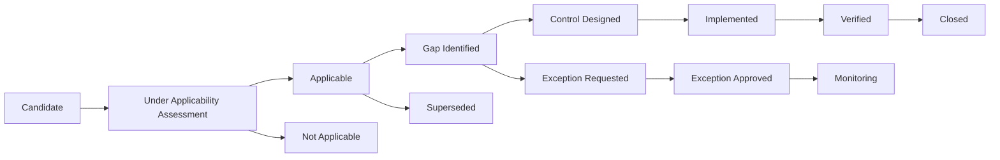

# 05 — Compliance Register

## 1. Tujuan dan Kedudukan

Register ini adalah artefak governance resmi untuk mengidentifikasi, memverifikasi, memetakan, mengendalikan, membuktikan, meninjau, dan menutup kewajiban regulasi serta standar yang berlaku terhadap e-PeLARA Next Generation. Register mendukung **Compliance by Design**, regulatory fidelity, traceability, human authority, evidence-based governance, dan prinsip **One Data, Many Publications**.

Pengesahan register tidak berarti seluruh requirement telah dipenuhi. Status `Verified` hanya dapat digunakan setelah implementation evidence tersedia dan diverifikasi secara independen; istilah `Compliant` tidak digunakan sebagai pengganti evidence tersebut.

## 2. Ruang Lingkup dan Definisi

Ruang lingkup mencakup Business, Data, Application, Integration, Technology, Security & Privacy, Government Intelligence & AI, serta Document & Publishing Architecture; termasuk perencanaan dan keuangan daerah, SAKIP, SPBE, Satu Data, sistem elektronik, data pribadi, kearsipan, keterbukaan informasi, aksesibilitas, tanda tangan elektronik, dan nomenklatur.

| Istilah | Definisi operasional |
|---|---|
| Regulatory requirement | Kewajiban atau batasan dari regulasi/standar berwenang yang telah diverifikasi. |
| Control objective | Sasaran yang harus dicapai agar requirement dipenuhi. |
| Control | Kebijakan, proses, desain, atau tindakan yang memenuhi control objective. |
| Evidence | Bukti yang dapat diperiksa tentang desain, penerapan, atau efektivitas control. |
| Finding | Ketidaksesuaian atau kekurangan control/evidence yang teridentifikasi. |
| Issue | Kondisi atau gap yang telah terjadi; dicatat pada Issue Register. |
| Risk | Ketidakpastian dampak terhadap tujuan; dicatat pada Risk Register. |
| Exception | Permohonan perlakuan berbeda terhadap requirement; tidak sah tanpa otoritas dan dasar hukum. |
| Decision | Pilihan arsitektur; direkam melalui ADR bila relevan. |

## 3. Prinsip Compliance by Design

1. Requirement diturunkan dari sumber primer/resmi, bukan ringkasan pihak ketiga.
2. Applicability ditentukan menurut fungsi, data, proses, output, dan kewenangan e-PeLARA; bukan hanya nama modul.
3. Control, evidence, dan verification dirancang sebelum Architecture Gate yang relevan.
4. Evidence harus dapat ditelusuri ke requirement, owner, artefak, dan tanggal verifikasi.
5. Ketidaksesuaian menjadi finding dan ditautkan ke Issue/Risk Register; ia tidak ditutup hanya karena treatment direncanakan.
6. Tidak ada exception terhadap kewajiban hukum bila regulasi tidak mengizinkannya.

### Hierarki dan Authority Sumber

Urutan authority: UUD 1945; Undang-Undang; Peraturan Pemerintah; Peraturan Presiden; Peraturan Menteri/ketentuan pelaksana yang berwenang; regulasi daerah yang relevan; lalu standar internal. Conflict atau status yang belum jelas dieskalasikan kepada pejabat berwenang, bukan diputuskan oleh penyusun register.

### Metode Applicability

Sebuah requirement dinilai Applicable bila regulasinya berstatus berlaku/berlaku efektif menurut sumber resmi dan ruang lingkupnya mencakup fungsi, data, proses, atau output e-PeLARA. Jika status atau cakupan spesifik belum dapat dipetakan, statusnya `Candidate` atau `Under Applicability Assessment`; tidak diasumsikan berlaku secara otomatis pada desain rinci.

## 4. Lifecycle dan Status Requirement

| Status | Makna |
|---|---|
| Candidate | Regulasi/sumber telah diidentifikasi, namun verification atau applicability belum lengkap. |
| Under Applicability Assessment | Status dan/atau cakupan terhadap e-PeLARA sedang dinilai. |
| Applicable | Requirement berlaku terhadap ruang lingkup yang dicatat. |
| Not Applicable | Tidak berlaku dengan rationale, evidence, dan approval yang dicatat. |
| Gap Identified | Applicable, tetapi control/evidence yang diwajibkan belum cukup. |
| Control Designed | Control dan evidence target telah dirancang, belum dibuktikan diterapkan. |
| Implemented | Control diterapkan dengan implementation evidence. |
| Verified | Implementation evidence diverifikasi secara independen. |
| Exception Requested | Permohonan exception telah dicatat dan belum disetujui. |
| Exception Approved | Exception disetujui bila dasar hukum mengizinkan, dengan batas waktu dan residual risk. |
| Superseded | Requirement digantikan oleh regulasi atau versi yang ditetapkan. |
| Closed | Requirement telah diverifikasi atau disposition akhir yang sah telah dicatat. |

### Tingkat Kewajiban

| Tingkat | Perlakuan |
|---|---|
| Mandatory | Kewajiban hukum/regulasi yang berlaku; gap harus memiliki remediation atau disposition sah. |
| Conditional | Berlaku bila kondisi, data, layanan, atau proses tertentu digunakan. |
| Candidate | Sumber sudah diidentifikasi, tetapi status/applicability rinci belum disimpulkan. |
| Internal | Control internal untuk memenuhi Charter/standard; bukan pengganti kewajiban hukum. |

## 5. Struktur Register, Evidence, dan Eskalasi

Setiap entry menggunakan field: Compliance ID; authority; nomor/tahun; judul; status regulasi; sumber resmi/URL; tanggal verifikasi; pasal/lampiran; requirement statement; applicability/rationale; domain; proses/data/aplikasi/output terdampak; control objective; existing/required control; control owner; evidence required; verification method; implementation status; related issue/risk/ADR; target gate; gap/remediation; target fase/tanggal; exception authority; dan closure evidence.

Evidence harus berasal dari artefak yang berwenang, bertanggal, dapat ditelusuri, dan tidak memuat credential atau data sensitif. Verification membedakan review desain, pemeriksaan evidence implementasi, dan independent verification. Klaim penerapan tanpa evidence tetap berstatus `Gap Identified` atau `Control Designed`.

Finding yang menyangkut hukum, kewenangan, data sensitif, keamanan, kehilangan data, layanan publik, atau gate Critical/High wajib dieskalasikan melalui Chief Enterprise Architect kepada Project Owner dan/atau pejabat berwenang. Exception tidak boleh menjadi jalan pintas untuk melewati Architecture Gate.

## 6. Keterhubungan dan Review

| Artefak | Hubungan |
|---|---|
| Issue Register | Finding atau kontradiksi yang telah terjadi ditautkan sebagai issue. |
| Risk Register | Ketidakpastian dampak atau remediation ditautkan sebagai risk. |
| ADR | Keputusan arsitektur untuk control/treatment direkam bila memerlukan pilihan lintas-domain. |
| Traceability Matrix | Menghubungkan regulation → requirement → control → evidence → gate. |
| Architecture Gates | G0–G6 menilai disposition requirement yang relevan; gate tidak otomatis meloloskan requirement. |
| Change Log | Memelihara histori perubahan register; perubahan regulasi/control mengikuti proses perubahan berwenang. |

Review dilakukan bulanan pada fase aktif, sebelum Architecture Gate terkait, dan segera setelah perubahan regulasi yang terverifikasi. Regulatory watch dilakukan triwulanan untuk status, pencabutan, perubahan, dan regulasi pelaksana yang relevan; annual strategic review menilai dampak regulasi terhadap roadmap.

### Definition of Applicable

Applicable apabila sumber resmi memverifikasi regulasi berlaku dan requirement secara rasional mencakup fungsi, data, proses, atau output yang dicatat.

### Definition of Implemented

Implemented apabila required control telah diterapkan dan evidence penerapannya dapat diperiksa oleh verifier yang ditunjuk.

### Definition of Verified

Verified apabila verifier independen yang berwenang telah memeriksa evidence, scope, dan hasil control tanpa menemukan gap material yang belum didisposisikan.

### Definition of Closure

Closed apabila requirement telah `Verified`, `Not Applicable`, atau `Superseded`, atau penyelesaian exception telah diverifikasi; closure evidence dan authority dicatat. Exception Approved tidak menjadi dasar tunggal Closure. ChatGPT Work tidak menjadi control owner, verifier, exception authority, atau pemberi closure.

## 7. Sumber Regulasi Terverifikasi

Tanggal verifikasi seluruh sumber di bawah: **2026-08-04**. Status mencerminkan metadata pada halaman detail sumber resmi yang dicatat; pasal/lampiran rinci yang belum dipetakan tidak digunakan untuk menyatakan compliance.

| Kode | Regulasi terverifikasi | Status | Sumber resmi |
|---|---|---|---|
| REG-01 | UU No. 25 Tahun 2004 tentang Sistem Perencanaan Pembangunan Nasional | Berlaku | [JDIH BPK](https://peraturan.bpk.go.id/Details/40694/uu-no-25-tahun-2004) |
| REG-02 | Permendagri No. 86 Tahun 2017 tentang tata cara perencanaan, pengendalian, dan evaluasi pembangunan daerah | Berlaku | [JDIH BPK](https://peraturan.bpk.go.id/Details/311927) |
| REG-03 | PP No. 12 Tahun 2019 tentang Pengelolaan Keuangan Daerah | Berlaku | [JDIH BPK](https://peraturan.bpk.go.id/Details/103888/pp-no-12-tahun-2019) |
| REG-04 | Permendagri No. 70 Tahun 2019 tentang Sistem Informasi Pemerintahan Daerah | Berlaku | [JDIH BPK](https://peraturan.bpk.go.id/Details/127924/permendagri-no-70-tahun-2019) |
| REG-05 | Permendagri No. 90 Tahun 2019 tentang Klasifikasi, Kodefikasi, dan Nomenklatur Perencanaan Pembangunan dan Keuangan Daerah | Berlaku | [JDIH BPK](https://peraturan.bpk.go.id/Details/139075/permendagri-no-90tahun-2019) |
| REG-06 | Perpres No. 29 Tahun 2014 tentang Sistem Akuntabilitas Kinerja Instansi Pemerintah | Berlaku | [Peraturan.go.id](https://www.peraturan.go.id/id/perpres-no-29-tahun-2014) |
| REG-07 | Perpres No. 95 Tahun 2018 tentang Sistem Pemerintahan Berbasis Elektronik | Berlaku | [Peraturan.go.id](https://www.peraturan.go.id/id/perpres-no-95-tahun-2018) |
| REG-08 | Perpres No. 39 Tahun 2019 tentang Satu Data Indonesia | Under Regulatory Status Verification | [JDIH BPK](https://peraturan.bpk.go.id/Details/108813/perpres-no-39-tahun-2019) |
| REG-09 | PP No. 71 Tahun 2019 tentang Penyelenggaraan Sistem dan Transaksi Elektronik | Berlaku | [JDIH BPK](https://peraturan.bpk.go.id/Details/122030/pp-no-71-tahun-2019) |
| REG-10 | UU No. 27 Tahun 2022 tentang Pelindungan Data Pribadi | Berlaku | [JDIH BPK](https://peraturan.bpk.go.id/Details/229798/uu-no-27-tahun-2022) |
| REG-11 | UU No. 43 Tahun 2009 tentang Kearsipan | Berlaku | [JDIH BPK](https://peraturan.bpk.go.id/Details/38788/uu-no-43-tahun-2009) |
| REG-12 | UU No. 14 Tahun 2008 tentang Keterbukaan Informasi Publik | Berlaku | [JDIH BPK](https://peraturan.bpk.go.id/Details/39047/uu-no-14-tahun2008) |
| REG-13 | PP No. 61 Tahun 2010 tentang Pelaksanaan UU Keterbukaan Informasi Publik | Berlaku | [JDIH BPK](https://peraturan.bpk.go.id/Home/Details/5084/pp-no-61-tahun-2010) |
| REG-14 | UU No. 8 Tahun 2016 tentang Penyandang Disabilitas | Berlaku | [JDIH BPK](https://peraturan.bpk.go.id/Details/37251/uu-no-8-tahun-2016) |
| REG-15 | Permendagri No. 77 Tahun 2020 tentang Pedoman Teknis Pengelolaan Keuangan Daerah | Berlaku | [JDIH BPK](https://peraturan.bpk.go.id/Details/162792/permendagri-no-77-tahun-2020) |
| REG-16 | Perpres No. 132 Tahun 2022 tentang Arsitektur Sistem Pemerintahan Berbasis Elektronik Nasional | Berlaku | [JDIH BPK](https://peraturan.bpk.go.id/Details/233483/perpres-no-132-tahun-2022) |

## 8. Initial Compliance Register

Tabel ini adalah baseline governance, bukan klaim kepatuhan. Pasal/lampiran ditulis hanya sejauh dapat diverifikasi dari sumber resmi yang dicatat; pemetaan rinci yang belum tersedia tetap menjadi gap atau assessment.

| ID | Authority / regulasi | Status regulasi, URL, verifikasi, pasal/lampiran | Requirement dan applicability rationale | Domain / dampak | Control objective; existing / required control | Owner; evidence; verification | Status implementasi; issue/risk/ADR | Gate; gap/remediation; fase | Exception authority; closure evidence |
|---|---|---|---|---|---|---|---|---|---|
| COMP-001 | REG-01 UU 25/2004; REG-02 Permendagri 86/2017 | Berlaku; URL pada §7; 2026-08-04; UU 25/2004 Bab IV–VI (tahapan, penyusunan/penetapan, pengendalian/evaluasi); Permendagri 86/2017 ruang lingkup dan lampiran. | Dokumen perencanaan daerah harus ditata sesuai siklus, penyusunan, pengendalian, dan evaluasi yang berlaku. Applicable karena e-PeLARA mengelola RPJMD, RKPD, Renstra, dan Renja. | Business & Data; dokumen perencanaan, periode, indikator. | Tujuan: lineage dan temporal rule regulatif. Existing: modul/dokumen baseline. Required: mapping requirement-ke-data-ke-output dan keputusan temporal. | Control owner: Kepala Bappeda/Business Process Owner — To be assigned by Project Owner. Evidence: mapping, ADR, contoh output. Verifikasi: review regulasi dan traceability. | Gap Identified; AIR-001; ARISK-001; ADR-0001. | G2 — Data and Knowledge Foundation; model temporal belum disahkan; sebelum G2. | Project Owner/pejabat berwenang; ADR temporal dan evidence G2. |
| COMP-002 | REG-03 PP 12/2019; REG-15 Permendagri 77/2020 | Berlaku; URL pada §7; 2026-08-04; PP 12/2019 mencakup APBD, penyusunan rancangan APBD, pelaksanaan/penatausahaan, dan pelaporan; Permendagri 77/2020 adalah pedoman teknis pengelolaan keuangan daerah. Bagian Lampiran RKA/DPA yang relevan belum dipetakan dari sumber resmi. | RKA, DPA, penganggaran, pelaksanaan, dan pelaporan keuangan harus dipetakan terhadap ketentuan pengelolaan keuangan daerah. Applicable karena modul RKA/DPA tercatat pada baseline. | Business, Data, Application; RKA, DPA, anggaran. | Tujuan: menjaga struktur dan lifecycle dokumen keuangan. Existing: modul RKA/DPA baseline. Required: regulatory control mapping dan evidence acceptance. | Control owner: PPKD/Bidang Keuangan — To be assigned by Project Owner. Evidence: mapping, approval lifecycle, output teruji. Verifikasi: review pejabat keuangan berwenang. | Under Applicability Assessment; —; —; ADR: —. | G3 — Integrated Target Architecture; pasal/lampiran, control, dan evidence gap belum dipetakan lengkap; sebelum G3. | Pejabat keuangan berwenang; mapping dan evidence review. |
| COMP-003 | REG-04 Permendagri 70/2019 | Berlaku; URL pada §7; 2026-08-04; konsiderans menyebut UU 23/2014 Pasal 391 dan 395; ruang lingkup SIPD. | Pengelolaan informasi pemerintahan daerah harus dipetakan terhadap SIPD. Applicable karena fungsi perencanaan/keuangan daerah dan SIPD dicatat pada baseline; regulasi ini **tidak** ditafsirkan sebagai kewajiban API tersedia. | Integration; data perencanaan dan keuangan. | Tujuan: disposition integrasi sesuai kontrak/kewenangan. Existing: status integrasi adalah gap. Required: SIPD Integration Blueprint dan assessment akses/kontrak. | Control owner: Integration Owner — To be assigned by Project Owner. Evidence: blueprint, status akses, kontrak bila ada. Verifikasi: review integrasi dan pejabat berwenang. | Gap Identified; AIR-007; ARISK-004; ADR: bila diperlukan. | G3 — Integrated Target Architecture; akses/kontrak belum terkonfirmasi; sebelum G3. | Project Owner/pejabat berwenang; blueprint dan evidence G3. |
| COMP-004 | REG-05 Permendagri 90/2019 | Berlaku; URL pada §7; 2026-08-04; judul dan metadata resmi; pemetaan pasal/lampiran serta pemutakhiran nomenklatur belum diverifikasi rinci. | Klasifikasi, kodefikasi, dan nomenklatur perencanaan/keuangan perlu dijadikan controlled reference data. Applicable karena baseline menggunakan kode program/kegiatan/subkegiatan dan merujuk Permendagri 90/2019. | Data & Business; nomenklatur dan reference data. | Tujuan: kode resmi terkelola dan terbarui. Existing: kode dicatat baseline. Required: owner, versi, source, change control, dan mapping pemutakhiran. | Control owner: Data Owner/Nomenclature Owner — To be assigned by Project Owner. Evidence: katalog reference, versi, perubahan. Verifikasi: rekonsiliasi dengan sumber resmi. | Under Applicability Assessment; —; —; ADR: —. | G2 — Data and Knowledge Foundation; pasal/lampiran dan mekanisme update perlu dipetakan; sebelum G2. | Pejabat berwenang; katalog terverifikasi dan disposition assessment. |
| COMP-005 | REG-06 Perpres 29/2014 | Berlaku; URL pada §7; 2026-08-04; abstrak resmi: penetapan/pengukuran, pengumpulan data, pengklasifikasian, pengikhtisaran, dan pelaporan kinerja; pasal rinci belum dipetakan. | Data indikator, pengukuran, dan pelaporan kinerja harus dapat ditelusuri. Applicable karena baseline memuat indikator, realisasi, monev, dan LAKIP/LKjIP. | Business, Data, Document/Publishing; indikator dan laporan kinerja. | Tujuan: data kinerja dapat dibuktikan dari perencanaan sampai laporan. Existing: modul indikator/monev/laporan baseline. Required: mapping SAKIP, lineage, review evidence. | Control owner: Performance Accountability Owner — To be assigned by Project Owner. Evidence: mapping, lineage, sample laporan. Verifikasi: review pejabat kinerja berwenang. | Under Applicability Assessment; —; ARISK-007; ADR: —. | G2 — Data and Knowledge Foundation; pasal, control, dan evidence gap belum dipetakan lengkap; sebelum G2. | Pejabat kinerja berwenang; mapping dan verification record. |
| COMP-006 | REG-07 Perpres 95/2018; REG-16 Perpres 132/2022 | Berlaku; URL pada §7; 2026-08-04; Perpres 95/2018 Pasal 61 ayat (1) mengatur tugas kepala daerah terkait koordinasi dan kebijakan SPBE; Perpres 132/2022 mengatur Arsitektur SPBE Nasional dan Lampiran Arsitektur SPBE Nasional. Pemetaan domain/ketentuan rinci belum selesai. | Tata kelola dan arsitektur SPBE harus diatur melalui kewenangan yang tepat. Applicable karena e-PeLARA adalah layanan digital pemerintah daerah; requirement ini tidak mencakup evaluasi kematangan SPBE. | Lintas delapan domain; arsitektur dan governance SPBE. | Tujuan: target architecture dan gate dapat ditelusuri ke governance/arsitektur SPBE. Existing: Charter/Roadmap. Required: mapping arsitektur SPBE daerah, owner, dan evidence gate. | Control owner: SPBE Coordinator — To be assigned by Project Owner. Evidence: arsitektur/kebijakan berwenang, traceability, gate record. Verifikasi: review SPBE/pejabat berwenang. | Under Applicability Assessment; AIR-006, AIR-010; ARISK-003, ARISK-007; ADR: bila diperlukan. | G1 — Business and Regulatory Alignment; ketentuan, control, dan evidence gap belum dipetakan lengkap; sebelum G1. | Project Owner/pejabat SPBE berwenang; approved mapping dan evidence G1. |
| COMP-007 | REG-08 Perpres 39/2019 | Under Regulatory Status Verification; URL pada §7; 2026-08-04; Peraturan.go.id menyatakan Tidak Berlaku, sedangkan halaman JDIH BPK tidak mencatat pencabutan dan regulasi yang lebih baru masih merujuk Perpres 39/2019. Status dan applicability wajib diverifikasi secara legal sebelum kewajiban ditetapkan. | Data pemerintah harus dikelola dengan standar data, metadata, interoperabilitas, dan tata kelola yang dapat ditelusuri. Assessment tetap diperlukan karena Charter menetapkan Single Source of Truth dan One Data, Many Publications. | Data & Integration; master/reference data, metadata, lineage. | Tujuan: authoritative source dan publikasi konsisten. Existing: prinsip Charter. Required: verifikasi sumber berlaku, data owner, metadata, catalog, lineage, dan interoperabilitas terkontrol. | Control owner: Data Governance Owner — To be assigned by Project Owner. Evidence: legal verification status regulasi, katalog, metadata, lineage, ownership. Verifikasi: review data governance dan pejabat berwenang. | Under Applicability Assessment; AIR-001, AIR-010; ARISK-001, ARISK-007; ADR-0001. | G2 — Data and Knowledge Foundation; status regulasi, control, dan evidence belum dipetakan; sebelum G2. | Project Owner/pejabat data berwenang; legal verification dan evidence G2 terverifikasi. |
| COMP-008 | REG-09 PP 71/2019; REG-10 UU 27/2022 | Berlaku; URL pada §7; 2026-08-04; PP 71/2019 mengatur PSE dan transaksi elektronik; UU PDP mengatur pelindungan data pribadi; pasal control rinci dan klasifikasi data belum dipetakan tanpa asumsi. | Sistem elektronik dan data pribadi, bila diproses, memerlukan control keamanan dan pelindungan yang sesuai. Applicable karena baseline memuat autentikasi, pengguna, notifikasi, dan data OPD; scope data pribadi rinci perlu diklasifikasikan. | Security & Privacy; identitas, akses, form, data pengguna. | Tujuan: keamanan dan pelindungan data by design. Existing: autentikasi/RBAC dicatat; CSRF belum tersedia. Required: klasifikasi data, threat/control mapping, CSRF, evidence keamanan. | Control owner: Security & Privacy Owner — To be assigned by Project Owner. Evidence: klasifikasi data, control design, test evidence. Verifikasi: security review oleh fungsi berwenang. | Under Applicability Assessment; AIR-008; ARISK-005; ADR: bila diperlukan. | G3 — Integrated Target Architecture; pasal, control, dan evidence gap belum dipetakan lengkap; sebelum G3. | Project Owner/pejabat berwenang; security verification dan disposition PDP. |
| COMP-009 | REG-11 UU 43/2009; REG-09 PP 71/2019 | Berlaku; URL pada §7; 2026-08-04; UU 43/2009 mengatur arsip autentik, utuh, terpercaya; PP 71/2019 relevan pada sistem elektronik. Pasal/lampiran retensi dan autentisitas spesifik belum dipetakan. | Dokumen resmi, arsip, retensi, dan autentisitas perlu dinilai untuk output e-PeLARA. Applicability rinci bergantung pada klasifikasi arsip dan kebijakan kearsipan daerah yang belum tersedia. | Document & Publishing; PDF/Word/Excel, tanda tangan, arsip. | Tujuan: dokumen resmi dapat ditelusuri dan dikelola sesuai klasifikasi/retensi. Existing: baseline mencatat sign-PDF. Required: assessment klasifikasi, retensi, autentisitas, dan evidence. | Control owner: Records Management Owner — To be assigned by Project Owner. Evidence: klasifikasi, jadwal retensi, kebijakan tanda tangan. Verifikasi: review unit kearsipan/pejabat berwenang. | Under Applicability Assessment; —; —; ADR: —. | G3 — Integrated Target Architecture; kebijakan/kategori arsip belum dipetakan; sebelum G3. | Pejabat kearsipan berwenang; assessment disetujui dan evidence control. |
| COMP-010 | REG-12 UU 14/2008; REG-13 PP 61/2010 | Berlaku; URL pada §7; 2026-08-04; UU 14/2008 Bab IV (informasi wajib tersedia/diumumkan) dan Bab V (informasi dikecualikan); PP 61/2010 pelaksanaan. | Publikasi digital harus membedakan informasi publik, informasi dikecualikan, dan kewenangan publikasi. Applicability rinci bergantung pada klasifikasi output dan proses PPID yang belum tersedia. | Document & Publishing; dashboard, laporan, publikasi. | Tujuan: publikasi tidak membuka informasi yang dikecualikan dan memiliki proses klasifikasi. Existing: Charter mewajibkan publikasi berkualitas/regulatory fidelity. Required: klasifikasi publikasi, approval, dan review disclosure. | Control owner: PPID/Publication Owner — To be assigned by Project Owner. Evidence: klasifikasi, approval, register publikasi. Verifikasi: review PPID/pejabat berwenang. | Under Applicability Assessment; —; ARISK-007; ADR: —. | G4 — Migration Ready; klasifikasi dan approval publikasi belum ditetapkan; sebelum G4. | PPID/pejabat berwenang; review disclosure dan evidence approval. |
| COMP-011 | REG-14 UU 8/2016 | Berlaku; URL pada §7; 2026-08-04; abstrak resmi mencakup aksesibilitas dan akomodasi yang layak; standar teknis digital yang berlaku belum dipetakan. | Aksesibilitas layanan dan publikasi perlu dianalisis terhadap kebutuhan pengguna penyandang disabilitas. Candidate karena requirement teknis e-PeLARA belum ditentukan dari sumber berwenang yang lebih spesifik. | Document & Publishing; UX, dashboard, dokumen digital. | Tujuan: design system dapat mengakomodasi aksesibilitas. Existing: Charter mewajibkan aksesibilitas. Required: regulatory/standard mapping dan acceptance criteria. | Control owner: Accessibility Owner — To be assigned by Project Owner. Evidence: assessment, design criteria, test record. Verifikasi: review aksesibilitas oleh fungsi berwenang. | Candidate; —; —; ADR: —. | G3 — Integrated Target Architecture; standar teknis dan applicability rinci belum dipetakan; sebelum G3. | Project Owner/pejabat berwenang; assessment dan criteria disetujui. |

## 9. Governance dan Kewenangan

| Peran | Nama | Kewenangan |
|---|---|---|
| Project Owner | Fahmi Alhabsi | Menyetujui register dan disposition strategis; menerima eskalasi sesuai kewenangan. |
| Chief Enterprise Architect | ChatGPT | Mengarahkan traceability requirement-control-gate, klasifikasi, dan eskalasi; bukan control owner/verifier/exception authority. |
| Penyusun Dokumen | ChatGPT Work | Menyusun register berdasarkan evidence resmi; tidak menjadi control owner, verifier, exception authority, atau pemberi closure. |
| Control owner | Fungsi/pejabat manusia yang ditetapkan | Menerapkan control dan menyediakan evidence. |
| Compliance verifier | Fungsi/pejabat manusia yang ditetapkan | Memverifikasi evidence secara independen dari control owner. |

Ketidaksesuaian dicatat sebagai compliance finding dan ditautkan ke issue/risk. Pengesahan register tidak berarti penerimaan exception, kepatuhan seluruh requirement, atau izin melewati Architecture Gate.

Jika sumber resmi pemerintah memberikan metadata status yang bertentangan, status regulasi tidak boleh diputuskan oleh ChatGPT atau ChatGPT Work dan wajib dieskalasikan untuk legal verification.

## 10. Persetujuan

| Peran | Nama | Keputusan | Tanda tangan | Tanggal |
|---|---|---|---|---|
| Penyusun Dokumen | ChatGPT Work | Disusun | Pending | 2026-08-04 |
| Chief Enterprise Architect | ChatGPT | Direview dan direkomendasikan untuk disahkan | Pending | — |
| Project Owner | Fahmi Alhabsi | Approved | Disahkan | 2026-08-04 |

## 11. Change Log

| Versi | Tanggal | Perubahan | Penyusun | Status |
|---|---|---|---|---|
| 1.0.0 | 2026-08-04 | Penyusunan Compliance Register; proses review oleh Chief Enterprise Architect; pengesahan sebagai Official Compliance Register oleh Project Owner pada 4 Agustus 2026. | ChatGPT Work | Approved |
