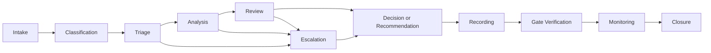

# 07 — Architecture Governance Operating Model

## 1. Tujuan dan Kedudukan

Dokumen ini menerjemahkan foundation governance e-PeLARA Next Generation menjadi mekanisme kerja operasional untuk mengarahkan, memutuskan, mereview, mengendalikan, mengeskalasi, menelusuri, dan menghubungkan pekerjaan Enterprise Architecture dengan Architecture Gate. Dokumen ini tidak mengubah keputusan yang telah disahkan dan tidak menggantikan Charter, Roadmap, register, ADR, atau Change Log.

## 2. Ruang Lingkup

Operating model ini berlaku bagi artefak Enterprise Architecture, keputusan lintas-domain, issue, risk, compliance, perubahan terdokumentasi, serta verifikasi gate. Perubahan implementasi teknis tetap berada pada pelaksana dan penanggung jawab yang sah setelah gate relevan mengizinkan, tanpa mengalihkan kewenangan institusional atau hukum kepada AI.

## 3. Prinsip Governance

1. Charter adalah rujukan tertinggi sampai perubahan resmi disetujui Project Owner.
2. One Data, Many Publications dipertahankan melalui data otoritatif, lineage, status, dan versi yang dapat ditelusuri.
3. Keputusan lintas-domain dicatat sebagai ADR; issue, risk, compliance, dan change dicatat pada register masing-masing.
4. Pernyataan siap, sesuai, atau selesai memerlukan evidence dan acceptance criteria yang relevan.
5. AI mendukung analisis dan administrasi berbasis instruksi, tetapi tidak menggantikan kewenangan pejabat atau otoritas hukum.

## 4. Model Operasi Governance

Model bekerja sebagai siklus evidence-led: kebutuhan atau temuan masuk melalui intake, diklasifikasikan, dianalisis, direview, memperoleh keputusan atau rekomendasi, direkam pada artefak yang tepat, diverifikasi terhadap gate, dipantau, lalu ditutup hanya oleh otoritas yang berwenang dan dengan evidence yang dipersyaratkan.

## 5. Struktur Peran dan Kewenangan

| Peran | Penetapan | Kewenangan operasional |
|---|---|---|
| Project Owner | Fahmi Alhabsi | Memberikan keputusan dan pengesahan sesuai kewenangan, termasuk keputusan strategis dan gate yang ditetapkan Roadmap. |
| Chief Enterprise Architect | ChatGPT | Mengarahkan EA, menjaga konsistensi lintas-domain, melakukan review, mengarahkan eskalasi, dan memberikan rekomendasi. |
| Penyusun Dokumen/File Operator | ChatGPT Work | Menyusun dan memperbarui file berdasarkan instruksi resmi dan evidence; bukan approver atau pemegang otoritas arsitektur. |
| Control owner | To be assigned by Project Owner | Menerapkan control dan menyediakan evidence. |
| Risk owner | To be assigned by Project Owner | Mengelola treatment, residual risk, trigger, dan evidence risiko. |
| Compliance verifier | To be assigned by Project Owner | Memverifikasi evidence compliance secara independen dari control owner. |
| Security authority | To be assigned by Project Owner | Menilai security disposition atau exception sesuai kewenangan sah. |
| Legal authority | To be assigned by Project Owner | Memverifikasi applicability dan status regulasi yang memerlukan penilaian hukum. |
| Data owner | To be assigned by Project Owner | Menetapkan ownership data sesuai kewenangan organisasi. |

### Standing Delegation Penetapan Status Final Artefak EA

Berdasarkan keputusan resmi Project Owner Fahmi Alhabsi tanggal 2026-08-04, Chief Enterprise Architect memiliki standing delegation untuk menetapkan hasil review final dan status final artefak Enterprise Architecture setelah seluruh koreksi, evidence, dependency, dan guard yang relevan terpenuhi. Dalam batas ini, Chief Enterprise Architect dapat menetapkan artefak menjadi `Approved`, menetapkan effective date administratif sesuai keputusan atau tanggal finalisasi yang sah, menginstruksikan ChatGPT Work mencatat metadata, Persetujuan, dan Change Log, serta menetapkan pekerjaan EA `DONE` dan pekerjaan berikutnya `READY` setelah pencatatan diverifikasi.

Delegasi hanya berlaku untuk approval dan status final artefak Enterprise Architecture. Delegasi tidak menjadikan Chief Enterprise Architect atau AI sebagai pejabat pemerintah, legal authority, compliance verifier, risk acceptance authority, exception authority, data owner, security authority, control owner, atau verifier institusional. Delegasi tidak mencakup legal verification, compliance determination/verification, risk acceptance, exception approval, data ownership, security authority, anggaran, pengadaan, go-live, atau keputusan administratif pemerintahan. Authority Gate G0–G6 tidak berubah. Project Owner tetap dapat mencabut, membatasi, mengambil alih delegasi, melakukan override, atau meminta review ulang.

### Standing Delegation Fungsi Terpadu dan Disposition G1/G2 kepada Claude Work

Berdasarkan mandat resmi Project Owner Fahmi Alhabsi tanggal 2026-08-05, Claude Work menerima delegasi untuk menjalankan fungsi terpadu sebagai Operator, Acting Chief Enterprise Architect, dan Delegated Project Owner/Project Authority untuk governance internal proyek. Dalam batas delegasi ini, Claude Work berwenang membaca dan mengelola repository; menyusun, mengoreksi, mereview, memvalidasi, menyetujui, dan memfinalisasi artefak; mengambil keputusan arsitektur; **menetapkan disposition G1 dan G2 berdasarkan evidence dan standar governance yang berlaku**; memperbarui metadata, ADR, register, serta Enterprise Change Log; dan memastikan setiap hasil konsisten, dapat ditelusuri, serta siap digunakan.

Delegasi ini berlaku untuk governance internal proyek dan tidak menjadikan Claude Work atau AI sebagai pejabat pemerintah, legal authority, compliance verifier, risk acceptance authority, exception authority, data owner, security authority, control owner, atau otoritas institusional eksternal yang belum memberikan penetapan resmi. Claude Work tetap tidak boleh mengarang evidence, menyatakan implementasi atau compliance tanpa verifikasi, maupun mengatasnamakan otoritas eksternal tersebut. Delegasi tidak mencakup legal verification, compliance determination/verification eksternal, risk acceptance institusional, exception approval institusional, data ownership institusional, security authority institusional, anggaran, pengadaan, go-live, atau keputusan administratif pemerintahan di luar governance internal proyek. Authority Gate G0, G3–G6 dan pembagian decision rights operasional G2 sesuai §9 tidak berubah oleh delegasi ini. Project Owner tetap dapat mencabut, membatasi, mengambil alih delegasi, melakukan override, atau meminta review ulang kapan pun.

Ketentuan kerja: satu artefak atau satu keputusan governance per tahap; penyelesaian menyeluruh termasuk self-review, validasi, ripple-effect, dan pencatatan perubahan; berhenti setelah satu artefak selesai dan menunggu instruksi "Lanjut" sebelum tahap berikutnya; laporan ringkas memuat hasil, status akhir, file yang berubah, hasil validasi, keputusan arsitektur, dan blocker jika ada; audit trail, traceability, versioning, dan evidence boundary proyek tetap dipatuhi.

## 6. Decision Rights

| Objek atau keputusan | Analisis/rekomendasi | Decision authority | System of record / artefak pencatatan |
|---|---|---|---|
| Visi, ruang lingkup, prioritas, perubahan Charter, dan keputusan strategis | Chief Enterprise Architect | Project Owner | Charter, ADR bila relevan, dan Enterprise Change Log. |
| Prinsip dan standar arsitektur | Chief Enterprise Architect | Project Owner sesuai dampak dan kewenangan | Standard/Charter terkait dan Enterprise Change Log. |
| Status final artefak Enterprise Architecture | Chief Enterprise Architect | Chief Enterprise Architect berdasarkan standing delegation Project Owner, sepanjang berada dalam batas delegasi | Metadata artefak, Persetujuan, Change Log lokal, dan Enterprise Change Log bila relevan. |
| Keputusan arsitektur lintas-domain | Chief Enterprise Architect | Project Owner untuk dampak strategis atau pejabat manusia yang sah sesuai kewenangan | ADR; ADR merekam keputusan dan konsekuensi, bukan memberikan otorisasi. |
| Kontradiksi, gap, atau ketidakjelasan arsitektur | Chief Enterprise Architect mengarahkan klasifikasi dan rekomendasi disposition | Project Owner atau pejabat manusia yang sah sesuai dampak | Architecture Issue Register; register merekam issue dan disposition, bukan mengambil keputusan. |
| Ketidakpastian terhadap tujuan atau outcome | Risk owner yang ditetapkan dan Chief Enterprise Architect | Project Owner atau pejabat manusia yang sah sesuai acceptance/closure pada register | Architecture Risk Register; register merekam risiko, treatment, acceptance, dan closure. |
| Kewajiban regulasi, control, evidence, atau exception | Control owner/verifier yang ditetapkan dan Chief Enterprise Architect | Legal, compliance, atau pejabat manusia yang sah sesuai kewenangan | Compliance Register; register merekam requirement, control, evidence, exception, dan verification. |
| Perubahan lintas-artefak | Chief Enterprise Architect mereview dampak | Authority yang berwenang atas artefak/perubahan tersebut | Enterprise Change Log; register merekam perubahan, bukan mengizinkan perubahan. |
| Keputusan teknis implementasi setelah gate mengizinkan | Pelaksana teknis dan Chief Enterprise Architect sesuai blueprint/guard | Penanggung jawab implementasi dan/atau Project Owner sesuai authority gate | Artefak desain/implementasi yang relevan, ADR bila keputusan arsitektur, dan Change Log bila perubahan lintas-artefak. |

ChatGPT Work hanya melakukan pencatatan berdasarkan instruksi resmi. Project Owner atau pejabat manusia yang sah tetap menjadi decision authority sesuai kewenangannya, kecuali penetapan status final artefak EA yang berada dalam standing delegation ini; Chief Enterprise Architect memberikan analisis, arahan, review, rekomendasi, dan penetapan status final dalam batas delegasi.

## 7. Architecture Governance Workflow

| Tahap | Input | Penanggung jawab | Output dan evidence | Eskalasi |
|---|---|---|---|---|
| Intake | Kebutuhan, temuan, perubahan, atau evidence baru | Pengaju; ChatGPT Work untuk pencatatan bila diinstruksikan | Objek, scope, sumber, dan dampak awal | Bila scope, authority, atau evidence tidak jelas. |
| Classification | Intake tervalidasi secara awal | Chief Enterprise Architect | Rute ADR, issue, risk, compliance, change, atau implementasi | Bila satu objek memengaruhi beberapa register. |
| Triage | Klasifikasi dan dampak awal | Chief Enterprise Architect | Prioritas, owner yang diperlukan, gate terkait, dan kebutuhan analysis | Ke Project Owner untuk dampak strategis atau lintas-kewenangan. |
| Analysis | Evidence, dependency, dan status artefak | Owner yang ditetapkan; Chief Enterprise Architect mengarahkan | Analisis, opsi, traceability, dan evidence | Ke legal/security/data/compliance authority bila diperlukan. |
| Review | Analisis dan evidence | Chief Enterprise Architect; verifier/authority yang ditetapkan | Rekomendasi, finding, atau permintaan evidence tambahan | Ke Project Owner bila membutuhkan keputusan atau acceptance. |
| Decision/Recommendation | Hasil review | Project Owner atau authority sah; Chief Enterprise Architect memberi rekomendasi | Keputusan, rekomendasi, atau disposition | Ke ADR atau register yang relevan bila keputusan belum tersedia. |
| Recording | Keputusan atau rekomendasi | ChatGPT Work berdasarkan instruksi resmi | Record pada artefak/register yang tepat | Tidak ada closure tanpa record dan evidence. |
| Gate Verification | Evidence dan record terkait gate | Chief Enterprise Architect mengarahkan; authority gate sesuai Roadmap | Gate evidence dan disposition | Ke Project Owner sesuai authority gate. |
| Monitoring | Issue, risk, exception, control, atau change aktif | Owner yang ditetapkan | Status, trigger, evidence pembaruan | Bila overdue, critical, atau mengubah scope/gate. |
| Closure | Resolution evidence dan approval | Authority berwenang | Closure record dan evidence | Ditolak bila evidence atau approval tidak tersedia. |

### Workflow Finalisasi Dokumen Berdasarkan Delegasi

1. ChatGPT Work menyusun atau memperbarui artefak.
2. Chief Enterprise Architect melakukan review.
3. Jika `REVISIONS REQUIRED`, ChatGPT Work melakukan koreksi.
4. Jika `PASSED`, hasil review final dicatat.
5. Chief Enterprise Architect menetapkan status final berdasarkan standing delegation.
6. ChatGPT Work mencatat metadata, effective date, Persetujuan, Change Log lokal, dan Enterprise Change Log bila relevan.
7. Chief Enterprise Architect memverifikasi pencatatan.
8. Setelah verifikasi, pekerjaan ditetapkan `DONE` dan pekerjaan berikutnya `READY`.

Pernyataan pengesahan Project Owner per dokumen tidak diperlukan dalam batas delegation ini, kecuali Chief Enterprise Architect menyatakan keputusan berada di luar delegation boundary, terdapat konflik authority atau dampak hukum/regulasi/risiko/compliance/security/data ownership/anggaran/go-live, atau Project Owner mengambil alih keputusan.

## 8. Architecture Decision Path

Keputusan yang berdampak lintas-domain, prinsip, dependency, target platform, gate, atau scope strategis diarahkan ke ADR dan dinilai oleh Chief Enterprise Architect sebelum disposition berwenang. Kontradiksi yang belum menjadi keputusan dicatat sebagai issue; ketidakpastian outcome sebagai risk; ketentuan regulasi sebagai compliance requirement; dan perubahan lintas-artefak sebagai change record. Tidak satu pun jalur tersebut menggantikan persetujuan Project Owner atau pejabat manusia yang berwenang.

## 9. Hubungan dengan Architecture Gate

| Gate | Nama resmi | Penyedia evidence | Reviewer/rekomendasi | Gate decision authority (Roadmap) |
|---|---|---|---|---|
| G0 | Charter Approved | Pemilik artefak awal — To be assigned by Project Owner | Chief Enterprise Architect | Project Owner |
| G1 | Business and Regulatory Alignment | Owner proses dan control/compliance terkait — To be assigned by Project Owner | Chief Enterprise Architect | Project Owner berdasarkan rekomendasi CEA; untuk governance internal proyek, disposition dapat ditetapkan oleh Claude Work berdasarkan standing delegation Project Owner tanggal 2026-08-05 (lihat §5), dalam batas evidence dan standar governance yang berlaku dan tanpa mengambil alih otoritas institusional/legal eksternal. |
| G2 | Data and Knowledge Foundation | Data owner dan owner evidence terkait — To be assigned by Project Owner | Chief Enterprise Architect | Project Owner/owner data — frasa sumber dari Master Roadmap; pembagian kewenangan operasional antara Project Owner dan data owner harus ditetapkan dalam EA-008 dan disahkan oleh Project Owner. Untuk governance internal proyek, disposition dapat ditetapkan oleh Claude Work berdasarkan standing delegation Project Owner tanggal 2026-08-05 (lihat §5), dalam batas evidence dan standar governance yang berlaku dan tanpa mengambil alih otoritas institusional/legal eksternal atau penetapan data owner institusional. |
| G3 | Integrated Target Architecture | Owner domain dan evidence target architecture — To be assigned by Project Owner | Architecture Review; detail review ditetapkan EA-008 | Project Owner berdasarkan Architecture Review |
| G4 | Migration Ready | Owner transition, dependency, cost/risk, dan rollback evidence — To be assigned by Project Owner | Chief Enterprise Architect | Project Owner |
| G5 | Implementation Ready | Penanggung jawab implementasi dan owner evidence terkait — To be assigned by Project Owner | Detail reviewer/verifier ditetapkan EA-008 | Penanggung jawab implementasi dan Project Owner |
| G6 | Production Ready | Owner evidence functional, security, UAT, backup/restore, operasi, dan rollback — To be assigned by Project Owner | Chief Enterprise Architect dan reviewer/verifier yang ditetapkan | Project Owner |

Untuk G2, frasa `Project Owner/owner data` dipertahankan sebagaimana tercantum dalam Master Roadmap. Tanda garis miring tersebut belum ditafsirkan sebagai kewenangan alternatif, bersama, atau delegatif. Pembagian decision rights operasional antara Project Owner dan data owner harus ditetapkan dalam EA-008 dan memperoleh pengesahan Project Owner. Penyedia evidence dan reviewer/rekomendasi bukan gate decision authority kecuali ditetapkan secara sah.

Rincian checklist, exit criteria operasional, dan mekanisme Architecture Review/Gate menjadi interface bagi `08-Architecture-Review-and-Gate-Standard.md`. Dokumen ini tidak menetapkan atau menggantikan rincian tersebut.

## 10. Issue, Risk, Compliance, dan Change Governance

| Artefak | Batas dan hubungan |
|---|---|
| ADR | Merekam keputusan arsitektur, opsi, alasan, dan konsekuensi. |
| Architecture Issue Register | Merekam kontradiksi, gap, ketidakjelasan, dan keputusan yang belum terselesaikan. |
| Architecture Risk Register | Merekam ketidakpastian yang dapat menghambat tujuan, beserta owner, treatment, trigger, dan residual risk. |
| Compliance Register | Merekam kewajiban, applicability, control, evidence, verifier, dan exception yang relevan. |
| Enterprise Change Log | Merekam perubahan lintas-artefak; tidak mengotorisasi perubahan. |
| Traceability Standard/Matrix | Menghubungkan kebutuhan, regulasi, keputusan, desain, implementation evidence, dan pengujian; interface detail menunggu standard terkait. |
| Architecture Review and Gate Standard | Menetapkan detail review dan gate; operating model ini hanya mengarahkan input, record, authority, dan interface. |

## 11. Intake, Triage, dan Prioritization

Intake minimum memuat tujuan, scope, artefak terdampak, sumber evidence, owner yang tersedia, dan gate terkait bila diketahui. Triage menilai dampak lintas-domain, regulasi, keamanan, data, dependency, dan kebutuhan keputusan. Prioritas mengikuti dampak, risiko, dependency, dan gate; tidak ada SLA atau target numerik yang ditetapkan oleh dokumen ini.

## 12. Review, Escalation, dan Resolution

Eskalasi ke Project Owner dilakukan ketika keputusan menyangkut ruang lingkup, anggaran, kewenangan institusional, go-live/rollback, dampak strategis, atau acceptance gate. Eskalasi ke authority khusus dilakukan untuk legal, security, data ownership, compliance verification, atau control evidence sesuai kewenangan. Resolution dan closure memerlukan evidence serta approval yang ditetapkan oleh register atau artefak yang mengendalikannya; ChatGPT Work tidak mengambil keputusan atau menutup record.

## 13. Meeting dan Review Cadence

Review dilakukan pada Architecture Gate terkait, saat intake atau finding memerlukan keputusan, saat evidence perubahan tersedia, dan sesuai cadence review yang tercatat dalam Roadmap atau register terkait. Dokumen ini tidak membentuk forum, komite, agenda, SLA, atau target frekuensi baru. Setiap meeting/review yang ditetapkan kemudian harus menghasilkan record dan evidence yang dapat ditelusuri.

## 14. Evidence dan Traceability

Evidence minimum mencakup sumber, owner, status, versi, tanggal, keputusan/rekomendasi, dependency, gate, dan record terkait. Traceability menggunakan identifier dan relative link sesuai Repository Structure Standard; duplikasi substansi dihindari. Evidence yang belum cukup ditandai sesuai mekanisme register terkait dan tidak menjadi dasar untuk menyatakan compliance, closure, atau gate readiness.

## 15. Governance Metrics

Metrik dipantau berdasarkan record yang tersedia, tanpa target numerik sampai ditetapkan oleh Project Owner atau authority berwenang:

- jumlah keputusan pending;
- usia issue;
- risiko overdue;
- compliance requirement tanpa owner;
- perubahan tanpa evidence;
- gate finding;
- traceability coverage; dan
- waktu penyelesaian review.

## 16. Repository dan Record Management

Artefak disimpan pada folder domain resmi, menggunakan metadata, nama, status, dan link yang sesuai Repository Structure Standard. Dokumen Approved/Active tidak diubah tanpa change record. Pemindahan atau rename artefak Approved harus dicatat, memperbarui link, mempertahankan histori versi, dan tidak menghasilkan dua dokumen aktif dengan identitas sama. ChatGPT Work hanya mengoperasikan file sesuai instruksi resmi dan batas scope.

## 17. Exception dan Batas Kewenangan

Exception sementara wajib memiliki owner, alasan, risiko, control kompensasi, dan tanggal berakhir sesuai Charter dan register terkait. `Exception Approved` tidak berarti requirement selesai atau compliant; exception yang disetujui masuk ke `Monitoring`. Exception tidak menjadi dasar tunggal untuk closure dan closure tetap memerlukan verification, evidence, serta authority yang sah. Exception tidak menjadi pengganti keputusan arsitektur, legal verification, compliance verification, atau gate disposition. AI tidak boleh menyetujui exception, mengesahkan dokumen, menetapkan status hukum/regulasi, menerima risiko, menetapkan closure, menutup issue, atau mengambil alih kewenangan pejabat pemerintah.

## 18. Persetujuan

| Peran | Nama | Keputusan | Tanda tangan | Tanggal |
|---|---|---|---|---|
| Penyusun Dokumen/File Operator | ChatGPT Work | Disusun | Pending | 2026-08-04 |
| Chief Enterprise Architect | ChatGPT | Direview dan direkomendasikan untuk disahkan | Selesai | 2026-08-04 |
| Project Owner | Fahmi Alhabsi | Disahkan | Selesai | 2026-08-04 |

### Persetujuan Perubahan 1.1.0

| Peran | Nama | Keputusan | Tanda tangan | Tanggal |
|---|---|---|---|---|
| Project Owner | Fahmi Alhabsi | Standing delegation diberikan dan disahkan | Selesai | 2026-08-04 |
| Chief Enterprise Architect | ChatGPT | Menerima mandat dan menerapkan delegation boundary | Selesai | 2026-08-04 |
| Penyusun Dokumen/File Operator | ChatGPT Work | Mencatat perubahan | Selesai | 2026-08-04 |

### Persetujuan Perubahan 1.2.0

| Peran | Nama | Keputusan | Tanda tangan | Tanggal |
|---|---|---|---|---|
| Project Owner | Fahmi Alhabsi | Mandat fungsi terpadu (Operator, Acting Chief Enterprise Architect, Delegated Project Owner/Project Authority) dan standing delegation disposition G1/G2 governance internal diberikan dan disahkan | Selesai | 2026-08-05 |
| Penyusun Dokumen/Operator/Acting Chief Enterprise Architect | Claude Work | Menerima mandat, menyusun pencatatan, melakukan self-review, dan menerapkan delegation boundary | Selesai | 2026-08-05 |

## 19. Change Log Dokumen

| Versi | Tanggal | Perubahan | Penyusun | Status |
|---|---|---|---|---|
| 1.2.0 | 2026-08-05 | Standing delegation Project Owner Fahmi Alhabsi kepada Claude Work untuk fungsi terpadu (Operator, Acting Chief Enterprise Architect, Delegated Project Owner/Project Authority) atas governance internal proyek, termasuk kewenangan menetapkan disposition G1 dan G2 berdasarkan evidence dan standar governance yang berlaku. Delegasi tidak mencakup otoritas institusional/legal eksternal, data ownership institusional, anggaran, pengadaan, go-live, atau keputusan administratif pemerintahan. Authority Gate G0, G3–G6 dan pembagian decision rights operasional G2 sesuai §9 tidak berubah. §5 (standing delegation baru), §9 (catatan disposition G1/G2 internal), §18, dan §19 diperbarui. Tidak ada disposition G1/G2 aktual ditetapkan pada perubahan ini; tidak ada perubahan pada Enterprise Change Log. Efektif 2026-08-05. | Claude Work | Approved — Minor Governance Change |
| 1.1.0 | 2026-08-04 | Standing delegation Project Owner kepada Chief Enterprise Architect untuk menetapkan status final artefak EA; workflow tanpa pengesahan berulang; batas delegasi, hak override/revocation Project Owner, dan ketetapan bahwa authority Gate G0–G6 tidak berubah. Efektif 2026-08-04. | ChatGPT Work | Approved — Minor Governance Change |
| 1.0.0 | 2026-08-04 | Penyusunan awal Architecture Governance Operating Model; review awal Chief Enterprise Architect dengan hasil Revisions Required; pemisahan objek keputusan, analisis/rekomendasi, decision authority, dan system of record; penegasan ADR dan seluruh register sebagai artefak pencatatan, bukan pengambil keputusan; pemisahan penyedia evidence, reviewer/rekomendasi, dan gate decision authority; perbaikan exception lifecycle: Exception Approved menuju Monitoring, tidak berarti compliant atau selesai, dan bukan dasar tunggal closure; frasa authority G2 Master Roadmap `Project Owner/owner data` dipertahankan tanpa ditafsirkan sebagai alternatif, bersama, atau delegatif; pembagian decision rights operasional G2 ditetapkan dalam EA-008 dan memerlukan pengesahan Project Owner; review final Chief Enterprise Architect PASSED dan Version 1.0.0 direkomendasikan untuk diajukan kepada Project Owner untuk pengesahan; disahkan oleh Project Owner Fahmi Alhabsi sebagai Official Architecture Governance Operating Model, status Approved, efektif 2026-08-04. | ChatGPT Work | Approved |
