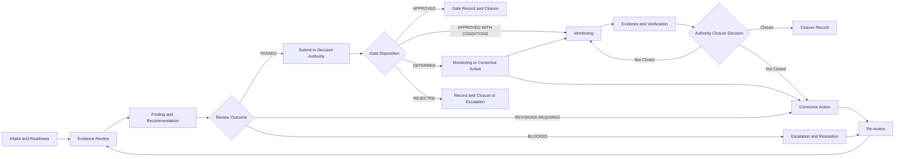

# 08 — Architecture Review and Gate Standard

## 1. Tujuan dan Kedudukan

Standar ini menetapkan interface operasional untuk Architecture Review dan Gate G0–G6: readiness, evidence, review, finding, recommendation, disposition, monitoring, dan closure. Standar ini melaksanakan interface EA-007 tanpa menggantikan atau mengubah Charter, Master Roadmap, Operating Model, maupun authority sumber.

## 2. Ruang Lingkup

Ruang lingkup meliputi artefak Enterprise Architecture dan evidence yang diajukan untuk gate. Standar ini tidak mengaudit repository aplikasi, tidak mengesahkan implementasi, dan tidak menyatakan issue selesai, risiko diterima, atau requirement compliant tanpa evidence dan authority yang sah.

## 3. Sumber Otoritatif dan Dependency

| Sumber | Peran terhadap standar |
|---|---|
| `00-Architecture-Charter.md` | Prinsip, guard, decision rights, evidence-based acceptance, dan batas AI. |
| `01-Repository-Structure.md` | Metadata, path, versioning, link, dan record management. |
| `../11-roadmaps/02-Enterprise-Architecture-Roadmap.md` | Document ID, nama/urutan Gate, evidence minimum, dan authority Gate. |
| `03-Architecture-Issue-Register.md` | Routing issue, severity, escalation, resolution, dan closure issue. |
| `04-Architecture-Risk-Register.md` | Treatment, monitoring, residual risk, dan closure risiko. |
| `05-Compliance-Register.md` | Requirement, control, evidence, exception, verification, dan closure compliance. |
| `06-Change-Log.md` | Pencatatan perubahan lintas-artefak. |
| `07-Architecture-Governance-Operating-Model.md` | Model operasi, decision rights, dan interface governance. |

## 4. Prinsip Architecture Review dan Gate

1. Gate adalah keputusan resmi, bukan rapat status atau hasil review semata.
2. Evidence harus memiliki sumber, owner, versi, tanggal, status, dan traceability.
3. Penyedia evidence, reviewer, verifier, decision authority, dan system of record adalah peran yang berbeda.
4. `Evidence Pending` bukan evidence terverifikasi dan tidak dapat digunakan untuk menyatakan readiness.
5. One Data, Many Publications, guard Charter, dan dependency Roadmap tetap berlaku pada seluruh gate.

## 5. Istilah dan Definisi

| Istilah | Definisi |
|---|---|
| Architecture Review | Penilaian evidence dan konsistensi terhadap artefak otoritatif yang menghasilkan outcome/rekomendasi. |
| Gate | Titik keputusan resmi pada Roadmap dengan authority yang ditetapkan. |
| Review outcome | `PASSED`, `REVISIONS REQUIRED`, atau `BLOCKED`; bukan pengesahan gate. |
| Gate disposition | `APPROVED`, `APPROVED WITH CONDITIONS`, `DEFERRED`, atau `REJECTED`; hanya authority sah yang menetapkan. |
| Finding | Ketidaksesuaian, gap, evidence tidak cukup, atau dependency yang menghalangi outcome/disposition. |
| Corrective action | Tindakan dengan owner, evidence, dan re-review untuk menangani finding atau condition. |
| Evidence Pending | Evidence belum tersedia atau belum dapat diverifikasi. |
| System of record | Artefak yang menyimpan record; bukan decision authority. |

## 6. Pemisahan Peran dan Decision Rights

| Peran | Tanggung jawab | Batas |
|---|---|---|
| Penyedia evidence | Menyusun dan menyerahkan evidence sesuai scope gate. | Bukan otomatis reviewer, verifier, atau decision authority. |
| Reviewer | Menilai konsistensi dan menghasilkan outcome/rekomendasi. | Bukan otomatis verifier atau decision authority. |
| Verifier | Memeriksa evidence pada scope yang memerlukan verifikasi independen/berwenang. | Bukan otomatis decision authority. |
| Chief Enterprise Architect | Melakukan Architecture Review, arahan, rekomendasi, dan eskalasi. | Bukan gate decision authority kecuali ditetapkan secara sah oleh sumber lain. |
| Project Owner | Mengambil keputusan/gate disposition sesuai authority Roadmap dan kewenangan. | Tidak digantikan AI atau system of record. |
| ChatGPT Work | Mencatat file berdasarkan instruksi resmi. | Bukan approver, verifier institusional, data owner, atau gate decision authority. |

## 7. Jenis Architecture Review

| Jenis | Tujuan | Output |
|---|---|---|
| Intake/readiness review | Memastikan scope, prerequisite, dan evidence minimum dapat dinilai. | `PASSED`, `REVISIONS REQUIRED`, atau `BLOCKED`. |
| Architecture consistency review | Menilai keselarasan artefak dengan Charter, Roadmap, dependency, dan domain terkait. | Outcome dan rekomendasi. |
| Gate review | Menilai evidence minimum untuk rekomendasi gate disposition. | Outcome, finding, corrective action, dan rekomendasi. |
| Re-review | Menilai corrective evidence atas finding/condition sebelumnya. | Outcome pembaruan dan status finding. |
| Exception/condition review | Menilai condition atau exception yang dipantau. | Rekomendasi monitoring, corrective action, atau escalation. |

## 8. Siklus Architecture Review

## 9. Review Intake dan Readiness Check

Intake harus mengidentifikasi gate, scope, artefak, prerequisite, evidence, provider, owner, dependency, register/ADR terkait, dan authority. Readiness check mengembalikan `REVISIONS REQUIRED` atau `BLOCKED` bila evidence tidak dapat ditelusuri, provider/owner belum ditetapkan, prerequisite belum terpenuhi, atau authority belum dapat dirujuk. Readiness check tidak menetapkan gate disposition.

## 10. Evidence Standard

Setiap evidence mencantumkan sumber, owner, versi, tanggal, status, scope gate, relative link, dan hubungan ke requirement/decision/finding bila relevan. Evidence yang belum tersedia ditandai `Evidence Pending`. Evidence provider dan verifier manusia yang memerlukan penetapan menggunakan `To be assigned by Project Owner`.

## 11. Review Finding dan Severity

| Severity | Makna review | Penanganan minimum |
|---|---|---|
| Critical | Finding blocking sampai corrective evidence diverifikasi dan authority sah menyatakan blocker terselesaikan. | Escalation, corrective action, verification, dan disposition blocker sebelum gate dapat dilanjutkan. |
| High | Menjadi blocking bila memengaruhi evidence minimum, prerequisite, authority, keamanan, compliance, data integrity, rollback, atau acceptance gate. | Owner, corrective evidence, dan re-review sebelum disposition yang relevan. |
| Medium | Gap terukur yang perlu disposition atau monitoring. | Catat finding dan corrective action. |
| Low | Perbaikan terbatas tanpa mengubah keputusan material. | Catat dan monitor sesuai dampak. |

Finding dirutekan ke Architecture Issue Register bila merupakan kontradiksi/gap; ke Architecture Risk Register bila ketidakpastian outcome; dan ke Compliance Register bila menyangkut requirement, control, evidence, atau exception. Klasifikasi severity pada standar ini tidak menggantikan severity/status pada register resmi; setelah dirutekan, klasifikasi dan status register menjadi sumber pencatatan resmi.

## 12. Review Outcome

| Outcome | Makna | Tindak lanjut |
|---|---|---|
| PASSED | Evidence yang diajukan cukup untuk rekomendasi pada scope review. | Dapat diteruskan ke decision authority; bukan gate approval otomatis. |
| REVISIONS REQUIRED | Evidence atau artefak memerlukan koreksi/kelengkapan. | Corrective action dan re-review. |
| BLOCKED | Dependency, authority, prerequisite, atau evidence minimum belum tersedia. | Escalation, routing register, atau disposition berwenang. |

## 13. Gate Disposition

| Disposition | Ketentuan |
|---|---|
| APPROVED | Ditetapkan oleh decision authority setelah evidence, review, verifier yang diperlukan, dan exit criteria terpenuhi. |
| APPROVED WITH CONDITIONS | Hanya dapat digunakan bila prerequisite, decision authority, dan evidence minimum wajib telah tersedia; tidak untuk melewati finding blocking atau ketiadaan legal, security, compliance, data ownership, maupun authority verification yang diwajibkan. Condition hanya mencakup tindakan lanjutan non-blocking dengan owner, evidence tersisa, monitoring, batas penyelesaian yang ditetapkan authority bila tersedia, dan authority closure; tidak berarti seluruh requirement compliant atau seluruh finding selesai. |
| DEFERRED | Gate ditunda dengan alasan, dependency, owner, dan record. |
| REJECTED | Gate tidak disetujui; alasan dan authority dicatat. |

`APPROVED` dan `APPROVED WITH CONDITIONS` tidak diperbolehkan apabila review outcome masih `BLOCKED`, evidence minimum wajib belum tersedia, prerequisite belum terpenuhi, decision authority belum jelas, atau finding blocking belum diselesaikan dan diverifikasi. Dalam kondisi tersebut, disposition yang dapat dipertimbangkan oleh authority yang sah adalah `DEFERRED` atau `REJECTED`.

## 14. Prosedur Eskalasi

Eskalasi dilakukan melalui Chief Enterprise Architect kepada Project Owner bila finding memengaruhi kewenangan/regulasi, scope/biaya/jadwal utama, data lintas organisasi, integrasi eksternal, risiko kehilangan data/gangguan layanan/keamanan, exception Charter, atau disposition gate. Legal, security, compliance, dan data verification hanya dilakukan oleh pejabat manusia yang sah dan ditetapkan bila diperlukan.

## 15. Re-review dan Corrective Action

Setiap corrective action memuat finding, owner `To be assigned by Project Owner` bila belum ditetapkan, tindakan, evidence yang diperlukan, dependency, gate, dan re-review record. Finding tidak dinyatakan selesai tanpa corrective evidence dan verification yang relevan. Re-review dapat menghasilkan `PASSED`, `REVISIONS REQUIRED`, atau `BLOCKED` tanpa mengubah authority gate.

## 16. Monitoring Kondisi dan Exception

Condition pada `APPROVED WITH CONDITIONS` dipantau dengan owner, evidence tersisa, status, dependency, dan authority closure. `Exception Approved` masuk ke `Monitoring`; exception tidak berarti requirement compliant atau selesai, dan bukan dasar tunggal closure. Exception, risk acceptance, compliance determination, dan gate disposition tetap memerlukan authority manusia yang sah.

## 17. Closure

Closure finding, condition, atau exception memerlukan corrective evidence, verification, monitoring yang relevan, dan authority closure yang sah. System of record menyimpan evidence/closure record tetapi tidak menjadi authority. AI tidak boleh menyetujui exception, menerima risiko, menetapkan compliance, mengesahkan gate, atau melakukan closure.

## 18. Standar Operasional Gate G0–G6

Status ketersediaan evidence tidak diasumsikan oleh standar ini. Setiap review menggunakan `Evidence Pending` sampai evidence ditautkan dan diverifikasi pada record yang sesuai.

### G0 — Charter Approved

| Elemen | Standar operasional |
|---|---|
| Tujuan dan scope | Memutuskan bahwa program arsitektur boleh dimulai berdasarkan foundation governance. |
| Prerequisite, input, evidence minimum | Charter, Official Baseline, Repository Standard, Master Roadmap, dan initial issue register. |
| Penyedia evidence | Pemilik artefak awal — To be assigned by Project Owner. |
| Reviewer/rekomendasi; verifier | Chief Enterprise Architect; verifier khusus bila diperlukan: To be assigned by Project Owner. |
| Decision authority | Project Owner. |
| Exit criteria | Input minimum dapat ditelusuri, status/versi jelas, dan finding blocking telah didisposisi. |
| Review outcome; gate disposition | `PASSED`/`REVISIONS REQUIRED`/`BLOCKED`; `APPROVED`/`APPROVED WITH CONDITIONS`/`DEFERRED`/`REJECTED`. |
| Finding, corrective action, escalation | Catat gap foundation; eskalasi bila Charter/baseline/authority tidak jelas. |
| Record, dependency, blocker | Artefak foundation, ADR/register bila relevan, dan Change Log; dependency menuju G1; blocked bila evidence minimum atau authority belum tersedia. |

### G1 — Business and Regulatory Alignment

| Elemen | Standar operasional |
|---|---|
| Tujuan dan scope | Menilai target proses dan kewenangan sah pada lingkup bisnis/regulasi. |
| Prerequisite, input, evidence minimum | Capability map, value streams, document lifecycle, roles/approval, dan regulatory traceability. |
| Penyedia evidence | Owner proses dan control/compliance terkait — To be assigned by Project Owner. |
| Reviewer/rekomendasi; verifier | Chief Enterprise Architect; legal/compliance verifier: To be assigned by Project Owner. |
| Decision authority | Project Owner berdasarkan rekomendasi CEA. |
| Exit criteria | Traceability proses/kewenangan tersedia; applicability/finding terdokumentasi dan dependencies G2 jelas. |
| Review outcome; gate disposition | `PASSED`/`REVISIONS REQUIRED`/`BLOCKED`; `APPROVED`/`APPROVED WITH CONDITIONS`/`DEFERRED`/`REJECTED`. |
| Finding, corrective action, escalation | Route gap ke issue/compliance/risk; eskalasi untuk kewenangan atau regulatory status yang tidak pasti. |
| Record, dependency, blocker | Artefak bisnis/compliance, ADR/register terkait, Change Log bila lintas-artefak; dependency menuju G2; blocked bila authority atau regulatory traceability tidak tersedia. |

### G2 — Data and Knowledge Foundation

| Elemen | Standar operasional |
|---|---|
| Tujuan dan scope | Menilai apakah model data/knowledge dapat menjadi fondasi. |
| Prerequisite, input, evidence minimum | Data domains, ownership, master/reference, temporal model ADR, lineage, quality, glossary, ontology, dan retention. |
| Penyedia evidence | Evidence producer atau custodian menyediakan evidence teknis/operasional — To be assigned by Project Owner. |
| Data-domain acceptance | Data owner yang ditetapkan resmi menerima/menolak evidence pada scope ownership dan memberikan data-domain acceptance sesuai kewenangannya. |
| Verifier independen bila diwajibkan | Verifier manusia yang berbeda — To be assigned by Project Owner — bila regulasi, control, security, atau governance mewajibkan independent verification. Data owner tidak dianggap verifier independen atas evidence yang dibuatnya sendiri. |
| Reviewer/rekomendasi | Chief Enterprise Architect melakukan Architecture Review dan memberikan outcome/rekomendasi; bukan decision authority. |
| Decision authority | Project Owner/owner data. |
| Exit criteria | Data owner ditetapkan, data-domain acceptance tersedia, evidence minimum dapat ditelusuri, independent verification tersedia bila diwajibkan, dan dependency G3 jelas. |
| Review outcome; gate disposition | `PASSED`/`REVISIONS REQUIRED`/`BLOCKED`; `APPROVED`/`APPROVED WITH CONDITIONS`/`DEFERRED`/`REJECTED`. |
| Finding, corrective action, escalation | Route temporal/ownership/lineage finding ke ADR, issue, risk, atau compliance; eskalasi konflik ownership kepada Project Owner. |
| Record, dependency, blocker | Artefak data/knowledge, ADR, register terkait, Traceability Matrix saat tersedia; dependency menuju G3; blocked bila evidence producer/custodian, data owner, data-domain acceptance, atau independent verification yang diwajibkan belum tersedia. |

### G3 — Integrated Target Architecture

| Elemen | Standar operasional |
|---|---|
| Tujuan dan scope | Menilai target platform lengkap dan konsisten lintas domain. |
| Prerequisite, input, evidence minimum | App domains, workflow, APIs/events, technology, security, GIP, GDPP, Design System, dan AI governance. |
| Penyedia evidence | Owner domain dan evidence target architecture — To be assigned by Project Owner. |
| Reviewer/rekomendasi; verifier | Architecture Review dipimpin Chief Enterprise Architect; verifier khusus: To be assigned by Project Owner. |
| Decision authority | Project Owner berdasarkan Architecture Review. |
| Exit criteria | Domain target dan dependency lintas-domain konsisten; finding blocking didisposisi; dependency G4 jelas. |
| Review outcome; gate disposition | `PASSED`/`REVISIONS REQUIRED`/`BLOCKED`; `APPROVED`/`APPROVED WITH CONDITIONS`/`DEFERRED`/`REJECTED`. |
| Finding, corrective action, escalation | Route keputusan material ke ADR; gap workflow/integrasi/security ke register; eskalasi untuk scope, authority, atau integration dependency. |
| Record, dependency, blocker | Artefak domain, ADR/register, dan Change Log bila lintas-artefak; dependency menuju G4; blocked bila target/evidence minimum atau keputusan lintas-domain belum tersedia. |

### G4 — Migration Ready

| Elemen | Standar operasional |
|---|---|
| Tujuan dan scope | Menilai apakah transisi dapat direncanakan sebagai work package. |
| Prerequisite, input, evidence minimum | Gap analysis, transition architectures, dependency, cost/risk, coexistence, rollback, dan acceptance. |
| Penyedia evidence | Owner transition, dependency, cost/risk, dan rollback evidence — To be assigned by Project Owner. |
| Reviewer/rekomendasi; verifier | Chief Enterprise Architect; verifier terkait: To be assigned by Project Owner. |
| Decision authority | Project Owner. |
| Exit criteria | Transisi/dependency/rollback dapat ditelusuri, risiko utama dinilai, dan dependency G5 jelas. |
| Review outcome; gate disposition | `PASSED`/`REVISIONS REQUIRED`/`BLOCKED`; `APPROVED`/`APPROVED WITH CONDITIONS`/`DEFERRED`/`REJECTED`. |
| Finding, corrective action, escalation | Route risk/issue/ADR sesuai objek; eskalasi bila biaya, coexistence, rollback, atau dependency eksternal tidak didisposisi. |
| Record, dependency, blocker | Migration artefak, ADR/register, dan Change Log bila lintas-artefak; dependency menuju G5; blocked bila transition/rollback/acceptance evidence belum tersedia. |

### G5 — Implementation Ready

| Elemen | Standar operasional |
|---|---|
| Tujuan dan scope | Menilai apakah work package boleh diimplementasikan. |
| Prerequisite, input, evidence minimum | Traceability, design package, test plan, migration plan, environment, security, operations, dan rollback. |
| Penyedia evidence | Penanggung jawab implementasi dan owner evidence terkait — To be assigned by Project Owner. |
| Reviewer/rekomendasi; verifier | Chief Enterprise Architect; reviewer/verifier detail: To be assigned by Project Owner. |
| Decision authority | Penanggung jawab implementasi dan Project Owner. |
| Exit criteria | Paket desain/rencana implementasi dapat ditelusuri, security/operations/rollback tersedia, dan dependency G6 jelas. |
| Review outcome; gate disposition | `PASSED`/`REVISIONS REQUIRED`/`BLOCKED`; `APPROVED`/`APPROVED WITH CONDITIONS`/`DEFERRED`/`REJECTED`. |
| Finding, corrective action, escalation | Route finding design/test/migration/security/operations; eskalasi bila scope atau readiness evidence menghalangi implementasi. |
| Record, dependency, blocker | Artefak desain/rencana, ADR/register, dan Change Log bila lintas-artefak; dependency menuju G6; blocked bila traceability, test/migration, environment, security, operations, atau rollback belum tersedia. |

Penanggung jawab implementasi memberikan implementation-readiness acceptance atas paket implementasi, test plan, migration, environment, operations, dan rollback sesuai kewenangannya. Chief Enterprise Architect memberikan Architecture Review outcome dan rekomendasi. Project Owner memberikan final G5 gate disposition. Karena authority sumber menggunakan kata `dan`, acceptance penanggung jawab implementasi dan keputusan Project Owner sama-sama wajib dicatat; salah satu tidak otomatis menggantikan yang lain. Bila penanggung jawab implementasi belum ditetapkan, G5 berstatus `BLOCKED` dan tidak dapat memperoleh `APPROVED` atau `APPROVED WITH CONDITIONS`.

### G6 — Production Ready

| Elemen | Standar operasional |
|---|---|
| Tujuan dan scope | Menilai apakah rilis boleh go-live. |
| Prerequisite, input, evidence minimum | Evidence functional, integration, regression, performance, security, UAT acceptance, security verification, operational readiness, backup/restore evidence, dan rollback readiness. Domain acceptance/approval pendukung yang diwajibkan harus tersedia sebelum go-live. |
| Penyedia evidence | Owner evidence functional, security, UAT, backup/restore, operations, dan rollback — To be assigned by Project Owner. |
| Reviewer/rekomendasi; verifier | Chief Enterprise Architect; verifier khusus: To be assigned by Project Owner. |
| Decision authority | Project Owner. |
| Exit criteria | Evidence minimum dan domain acceptance/verification yang diwajibkan dapat ditelusuri serta diverifikasi; finding/condition memiliki disposition; rekomendasi disampaikan kepada Project Owner untuk final G6 gate disposition. |
| Review outcome; gate disposition | `PASSED`/`REVISIONS REQUIRED`/`BLOCKED`; `APPROVED`/`APPROVED WITH CONDITIONS`/`DEFERRED`/`REJECTED`. |
| Finding, corrective action, escalation | Route security/resilience/compliance finding; eskalasi bila domain acceptance/verification, UAT, backup/restore, operations, atau rollback readiness tidak tersedia. |
| Record, dependency, blocker | Production readiness evidence, register/ADR terkait, dan Change Log bila lintas-artefak; dependency ke operasi/monitoring; blocked bila evidence minimum atau domain acceptance/verification yang diwajibkan belum tersedia. Project Owner kemudian menetapkan final G6 gate disposition; disposition tersebut bukan prerequisite evidence bagi dirinya sendiri. |

## 19. Klarifikasi Decision Rights G2

Frasa sumber `Project Owner/owner data` dipertahankan persis dari Master Roadmap dan tidak ditafsirkan sebagai pilihan bebas, kewenangan bersama otomatis, atau delegasi otomatis. Pembagian operasional berikut disahkan oleh Project Owner melalui pengesahan EA-008 pada 2026-08-04:

| Peran | Pembagian operasional yang disahkan |
|---|---|
| Evidence producer atau custodian | Menyediakan evidence teknis/operasional pada scope yang ditetapkan; bukan otomatis data owner, reviewer, verifier independen, atau decision authority. |
| Data owner yang ditetapkan resmi | Menerima/menolak evidence pada scope ownership; melakukan data-domain acceptance atas definisi, sumber otoritatif, ownership, kualitas, klasifikasi, akses, lineage, metadata, dan penggunaan data sesuai kewenangannya; bukan verifier independen atas evidence yang dibuatnya sendiri dan bukan pengganti Project Owner untuk keputusan gate strategis. |
| Verifier independen bila diwajibkan | Verifier manusia berbeda ditetapkan oleh Project Owner bila regulasi, control, security, atau governance mewajibkan independent verification. Satu orang hanya dapat menjalankan beberapa peran bila penetapannya eksplisit, scope dicatat, dan tidak diklaim sebagai independent verification. |
| Chief Enterprise Architect | Melakukan Architecture Review, memeriksa konsistensi Data and Knowledge Foundation dengan Charter/Roadmap/dependency/domain, serta memberi outcome dan rekomendasi; bukan gate decision authority. |
| Project Owner | Menetapkan/mengesahkan data owner, menyelesaikan konflik ownership/kewenangan, menetapkan final G2 disposition berdasarkan data-domain acceptance dan rekomendasi CEA, serta mengesahkan pembagian operasional ini. |

G2 tidak memperoleh `APPROVED` bila data owner belum ditetapkan atau data-domain acceptance wajib belum tersedia. Bila Project Owner menjalankan fungsi data owner, penetapan peran tersebut harus eksplisit dan dicatat.

## 20. Hubungan dengan ADR dan Register

| Objek | Routing | Batas |
|---|---|---|
| Keputusan arsitektur material | ADR | ADR merekam keputusan, bukan decision authority. |
| Kontradiksi atau gap | Architecture Issue Register | Register merekam issue dan disposition. |
| Ketidakpastian outcome | Architecture Risk Register | Register merekam risiko, treatment, acceptance, dan closure. |
| Requirement, control, evidence, atau exception | Compliance Register | Register merekam requirement, control, evidence, exception, dan verification. |
| Perubahan lintas-artefak | Enterprise Change Log | Register merekam perubahan, bukan mengizinkan perubahan. |
| Perubahan dokumen | Change Log lokal | Merekam histori artefak. |
| Evidence lintas-artefak | Traceability Standard/Matrix | Merekam hubungan evidence; bukan decision authority. |

## 21. Traceability dan Record Management

Setiap record review/gate menggunakan identifier, relative link, versi, status, tanggal, owner, decision/recommendation, evidence, finding, condition, dan closure reference bila relevan. Record disimpan pada artefak yang tepat; Change Log lintas-artefak digunakan hanya untuk perubahan yang memenuhi scope-nya. Tidak dibuat register tandingan oleh standar ini.

## 22. Metrics tanpa Target Numerik

Metrik yang dapat dicatat tanpa target/threshold: jumlah review berdasarkan outcome, finding terbuka, usia finding, condition yang dimonitor, evidence pending, re-review, gate disposition, traceability coverage, dan exception aktif. Dokumen ini tidak menetapkan SLA, frekuensi, target angka, atau threshold.

## 23. Batas Kewenangan AI

AI dapat membantu penataan evidence dan dokumentasi dalam scope yang diinstruksikan. AI tidak boleh memverifikasi fakta institusional/hukum tanpa evidence dan authority yang sah, menyetujui exception, menerima risiko, menetapkan compliance, mengesahkan gate, menjadi data owner, atau melakukan closure.

## 24. Persetujuan

| Peran | Nama | Keputusan | Tanda tangan | Tanggal |
|---|---|---|---|---|
| Penyusun Dokumen/File Operator | ChatGPT Work | Disusun | Pending | 2026-08-04 |
| Chief Enterprise Architect | ChatGPT | Direview dan direkomendasikan untuk disahkan | Selesai | 2026-08-04 |
| Project Owner | Fahmi Alhabsi | Disahkan | Selesai | 2026-08-04 |

## 25. Change Log Dokumen

| Versi | Tanggal | Perubahan | Penyusun | Status |
|---|---|---|---|---|
| 1.0.0 (patch administratif) | 2026-08-05 | Penambahan field `last_reviewed` pada front-matter sebagai resolusi AIR-010 (GOV-EA-006 §30, Metadata dan Evidence Level Standard); tidak ada perubahan substansi, version, atau status dokumen. Dicatat oleh Claude Work berdasarkan standing delegation Project Owner tanggal 2026-08-05. | Claude Work | Approved — Administrative Patch |
| 1.0.0 | 2026-08-04 | Penyusunan awal Architecture Review and Gate Standard; review CEA dengan hasil REVISIONS REQUIRED; konsistensi review outcome; pembatasan APPROVED WITH CONDITIONS; segregation of duties G2; klarifikasi operasional G5; pemisahan prerequisite evidence dan final disposition G6; penguatan finding blocking; perbaikan workflow Mermaid; serta review ulang CEA dan koreksi alur monitoring, evidence, verification, dan authority closure pada diagram Mermaid; verifikasi final atas koreksi workflow Mermaid, hasil review final Chief Enterprise Architect PASSED, dan rekomendasi agar EA-008 Version 1.0.0 diajukan kepada Project Owner untuk pengesahan; disahkan oleh Project Owner Fahmi Alhabsi sebagai Official Architecture Review and Gate Standard, status Approved, efektif 2026-08-04, sekaligus mengesahkan pembagian decision rights operasional G2 sebagaimana ditetapkan dalam dokumen; penyelarasan administratif status judul kolom G2 setelah pengesahan Project Owner. | ChatGPT Work | Approved |
