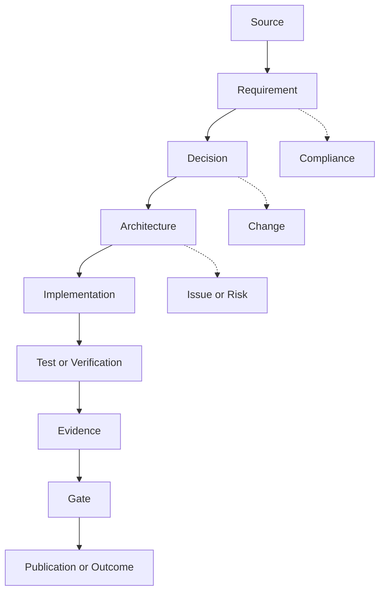

# 09 — Traceability Standard

## 1. Tujuan dan Kedudukan

Standar ini menetapkan mekanisme traceability Enterprise Architecture e-PeLARA Next Generation dari sumber hingga outcome/publikasi. Standar mendukung One Data, Many Publications, impact analysis, Architecture Review, Gate verification, auditability, dan pencegahan klaim tanpa evidence. Standar ini tidak membuat Traceability Matrix aktual, record aktual, atau keputusan arsitektur.

## 2. Ruang Lingkup

Traceability mencakup sumber regulasi/kebijakan, requirement, bisnis, data/knowledge, arsitektur, implementasi, test/verification, evidence, Gate G0–G6, publikasi/outcome, ADR, issue, risk, compliance, change, control, dan dependency. Traceability bukan pengganti ownership, verification, maupun decision authority.

## 3. Sumber Otoritatif dan Dependency

| Sumber                                  | Peran                                                                       |
| --------------------------------------- | --------------------------------------------------------------------------- |
| Architecture Charter                    | Prinsip One Data, Many Publications, guard, dan evidence-based governance.  |
| Repository Structure                    | Identifier, path, versioning, relative link, dan Change Log.                |
| Issue/Risk/Compliance Register          | Routing, evidence, status, verification, dan closure sesuai register.       |
| Enterprise Change Log                   | Perubahan lintas-artefak.                                                   |
| Architecture Governance Operating Model | Decision rights, standing delegation, dan record management.                |
| Architecture Review and Gate Standard   | Gate evidence, review, disposition, monitoring, dan closure.                |
| Master Roadmap                          | Document ID `GOV-EA-006`, dependency, artefak traceability, dan Gate G0–G6. |

## 4. Prinsip Traceability

1. Satu record kanonis dapat membentuk banyak view/publikasi terkontrol.
2. Relasi dibuat melalui identifier dan link, bukan duplikasi substansi.
3. Link tidak selalu satu-ke-satu dan wajib memiliki rationale.
4. Evidence Pending tidak dapat diperlakukan sebagai evidence terverifikasi.
5. Traceability merekam hubungan; matrix, register, dan link bukan decision authority.

## 5. Istilah dan Definisi

| Istilah             | Definisi                                                                                |
| ------------------- | --------------------------------------------------------------------------------------- |
| Traceability record | Record kanonis yang merekam hubungan sumber-target beserta metadata/verifikasi.         |
| Traceability link   | Relasi teridentifikasi antara dua objek pada record traceability.                       |
| Canonical record    | Sumber record lengkap yang menjadi acuan untuk view/export.                             |
| View                | Tampilan terfilter berdasarkan domain, Gate, objek, atau kebutuhan publikasi.           |
| Orphan record       | Objek yang seharusnya memiliki hubungan tetapi belum memiliki link yang dipersyaratkan. |
| Broken link         | Link yang source/target/path/versinya tidak lagi dapat ditelusuri.                      |

## 6. Traceability Metamodel

Model minimum adalah `Source → Requirement → Decision → Architecture → Implementation → Test/Verification → Evidence → Gate → Publication/Outcome`.

Issue, risk, compliance requirement, control, exception, change, owner, version, dan dependency dapat bercabang dari objek mana pun yang relevan. Model tidak menyiratkan hubungan satu-ke-satu atau status objek tertentu.

## 7. Jenis Objek Traceability

| Jenis objek                                    | Batas penggunaan                                                   |
| ---------------------------------------------- | ------------------------------------------------------------------ |
| `REGULATION`, `POLICY`                         | Sumber normatif/kebijakan yang dirujuk secara sah.                 |
| `REQUIREMENT`                                  | Kebutuhan yang dapat ditelusuri ke source atau keputusan.          |
| `CAPABILITY`, `PROCESS`, `ROLE`                | Objek bisnis dan kewenangan proses.                                |
| `DATA`, `KNOWLEDGE`                            | Data/knowledge termasuk ownership, lineage, dan penggunaan.        |
| `APPLICATION`, `INTEGRATION`, `TECHNOLOGY`     | Elemen arsitektur aplikasi, integrasi, dan teknologi.              |
| `SECURITY_CONTROL`, `AI_CONTROL`               | Control keamanan/AI yang dapat ditelusuri ke requirement/evidence. |
| `PUBLICATION`                                  | Output/publikasi yang diturunkan dari data/knowledge terkelola.    |
| `ADR`, `ISSUE`, `RISK`, `COMPLIANCE`, `CHANGE` | Artefak governance sesuai register atau record resmi.              |
| `WORK_PACKAGE`, `TEST`, `EVIDENCE`, `GATE`     | Implementasi, verifikasi, evidence, dan Gate G0–G6.                |

## 8. Jenis Relasi Traceability

Setiap record menggunakan arah relasi:

`source_object_id --relationship_type--> target_object_id`

Objek source adalah subjek yang memiliki atau melakukan relasi, sedangkan target adalah objek yang menerima arah relasi. Arah tidak boleh dibalik tanpa membuat record lain dengan rationale yang sah.

| Relasi              | Definisi dan batas penggunaan                                                                 |
| ------------------- | --------------------------------------------------------------------------------------------- |
| `DERIVED_FROM`      | Source diturunkan dari target; contoh: requirement diturunkan dari regulation.                |
| `IMPLEMENTS`        | Source menerapkan target; contoh: work package menerapkan architecture element.               |
| `REALIZES`          | Source merealisasikan target; contoh: application merealisasikan capability.                  |
| `ADDRESSES`         | Source menangani target berupa requirement, issue, risk, atau finding.                        |
| `DEPENDS_ON`        | Source bergantung pada target sebelum dapat berlaku atau diselesaikan.                        |
| `GOVERNED_BY`       | Source diatur oleh target berupa policy, standard, atau governance artefact.                  |
| `CONTROLLED_BY`     | Source dikendalikan oleh target berupa control yang ditetapkan.                               |
| `VERIFIED_BY`       | Source diverifikasi oleh target berupa verification record, evidence, atau verifier yang sah. |
| `TESTED_BY`         | Source diuji oleh target berupa objek test.                                                   |
| `EVIDENCED_BY`      | Klaim atau status source didukung oleh target berupa evidence.                                |
| `BLOCKS`            | Source menghalangi target sampai resolution atau disposition yang sah tersedia.               |
| `AFFECTS`           | Source berdampak pada target yang diidentifikasi.                                             |
| `SUPERSEDES`        | Source menggantikan target dengan histori versi target tetap dipertahankan.                   |
| `PUBLISHED_AS`      | Source diwujudkan sebagai target berupa publication.                                          |
| `REQUIRED_FOR_GATE` | Source merupakan input atau evidence yang diwajibkan untuk target berupa Gate.                |

`RELATED_TO` tidak digunakan sebagai pengganti relationship type yang tepat, rationale, atau analisis hubungan. Relasi dua arah hanya dibuat bila masing-masing arah memiliki makna dan record yang sah.

## 9. Identifier Standard

Identifier konseptual menggunakan pola `<OBJECT-TYPE>-<SEQUENCE>`, unik pada scope repository, tidak digunakan ulang, dan stabil ketika path berpindah. Objek register atau artefak Approved memakai ID resmi yang telah ada. ID dokumen utama mengikuti Master Roadmap sebagai guard kerja; evidence formal bahwa urutan global tidak dimulai ulang per folder masih `Evidence Pending` dan tidak dinyatakan normatif oleh standar ini.

## 10. Minimum Traceability Record

| Field                                                                           | Ketentuan                                                                                 |
| ------------------------------------------------------------------------------- | ----------------------------------------------------------------------------------------- |
| `trace_id`                                                                      | Identifier unik record.                                                                   |
| `source_object_type`, `source_object_id`, `source_version`, `source_path`       | Identitas dan lokasi source.                                                              |
| `relationship_type`                                                             | Salah satu vocabulary relasi yang ditetapkan.                                             |
| `target_object_type`, `target_object_id`, `target_version`, `target_path`       | Identitas dan lokasi target.                                                              |
| `rationale`                                                                     | Alasan hubungan yang dapat diperiksa.                                                     |
| `owner`, `status`, `gate`                                                       | Ownership, lifecycle status link, dan Gate terkait bila ada.                              |
| `evidence_reference`, `verification_status`, `verified_by`, `verification_date` | Evidence dan verifikasi; person yang belum ditetapkan: `To be assigned by Project Owner`. |
| `change_reference`, `created_date`, `updated_date`                              | Hubungan perubahan dan histori record.                                                    |

Tanggal, evidence, authority, owner, atau verifier yang belum tersedia tidak diarang dan menggunakan `Evidence Pending` atau `To be assigned by Project Owner` sesuai field.

## 11. Traceability Lifecycle

Lifecycle link: identifikasi candidate → pencatatan `Draft` → pengisian rationale/owner → `Active` → `Superseded`, `Broken`, atau `Closed` sesuai kondisi. Verification berjalan sebagai dimensi terpisah melalui `verification_status`. Lifecycle link dan verification status tidak mengubah status objek source atau target.

## 12. Status Link Traceability

### Lifecycle status — field `status`

| Status       | Makna                                                                                        |
| ------------ | -------------------------------------------------------------------------------------------- |
| `Draft`      | Link belum siap digunakan sebagai traceability aktif.                                        |
| `Active`     | Link aktif dan dapat digunakan sesuai verification status-nya.                               |
| `Superseded` | Link telah digantikan dengan histori pengganti tetap dipertahankan.                          |
| `Broken`     | Source, target, path, atau versi tidak dapat ditelusuri.                                     |
| `Closed`     | Lifecycle link ditutup; tidak berarti issue, risk, compliance, exception, atau Gate selesai. |

### Verification status — field `verification_status`

| Status                 | Makna                                                                                       |
| ---------------------- | ------------------------------------------------------------------------------------------- |
| `Not Required`         | Link tidak memerlukan verification khusus berdasarkan control atau governance yang berlaku. |
| `Evidence Pending`     | Evidence belum tersedia atau belum dapat diajukan untuk verification.                       |
| `Pending Verification` | Evidence tersedia tetapi belum diverifikasi oleh verifier yang sah.                         |
| `Verified`             | Evidence telah diverifikasi oleh verifier yang sah sesuai scope.                            |
| `Verification Failed`  | Evidence telah diperiksa tetapi tidak memenuhi verification criteria.                       |

Link `Active` dapat memiliki verification status yang berbeda sesuai requirement. `Evidence Pending` dan `Pending Verification` bukan evidence terverifikasi. `Broken` wajib masuk remediation atau escalation. Status link tidak otomatis mengubah status source, target, issue, risk, compliance, exception, atau Gate.

## 13. Source-to-Requirement Traceability

Setiap requirement yang membutuhkan dasar normatif/strategis ditautkan ke `REGULATION`, `POLICY`, Charter, keputusan, atau source berwenang. Applicability hukum/regulasi tetap diverifikasi oleh authority sah dan dicatat pada Compliance Register bila relevan.

## 14. Requirement-to-Architecture Traceability

Requirement ditautkan ke capability, process, role, data, knowledge, application, integration, technology, security/privacy, AI, digital publishing, control, atau deliverable yang merealisasikannya. Keputusan material yang memengaruhi arsitektur ditautkan ke ADR.

## 15. Architecture-to-Implementation Traceability

Elemen arsitektur ditautkan ke `WORK_PACKAGE`, rencana implementasi, dependency, dan change record bila relevan. Link ini tidak membuktikan implementasi selesai tanpa test/verification/evidence yang sah.

## 16. Implementation-to-Test-and-Evidence Traceability

`WORK_PACKAGE` atau implementasi ditautkan ke `TEST`, verification, evidence, control, finding, dan corrective action yang relevan. Penyedia evidence bukan otomatis reviewer/verifier; independent verification mengikuti control, security, compliance, atau governance yang berlaku.

## 17. Evidence-to-Gate Traceability

Evidence ditautkan ke Gate G0–G6 dengan `REQUIRED_FOR_GATE`, `EVIDENCED_BY`, atau `VERIFIED_BY` sesuai rationale. EA-008 mengendalikan review outcome dan gate disposition; traceability record hanya menunjukkan hubungan evidence-Gate dan bukan authority gate.

## 18. Data-to-Publication Traceability

Setiap angka, indikator, tabel, grafik, narasi analitis, dashboard, laporan, dan publikasi ditautkan ke sumber data otoritatif, periode, versi, transformasi, validation status, owner, evidence, dan publication instance. AI-generated narrative ditautkan ke data tervalidasi serta prompt/model configuration yang relevan; AI tidak menghitung atau menetapkan angka resmi. Prinsipnya adalah One Data, Many Publications tanpa input ulang atau perbedaan substansi.

## 19. Hubungan dengan ADR dan Register

| Objek                                  | Routing                     | Batas                                                |
| -------------------------------------- | --------------------------- | ---------------------------------------------------- |
| Keputusan material                     | ADR                         | Merekam keputusan, bukan authority.                  |
| Kontradiksi/gap                        | Architecture Issue Register | Merekam issue dan disposition.                       |
| Ketidakpastian outcome                 | Architecture Risk Register  | Merekam risk, treatment, acceptance, dan closure.    |
| Requirement/control/evidence/exception | Compliance Register         | Merekam compliance lifecycle dan verification.       |
| Perubahan lintas-artefak               | Enterprise Change Log       | Merekam perubahan, bukan mengizinkan perubahan.      |
| Perubahan dokumen                      | Change Log lokal            | Merekam histori artefak.                             |
| Gate evidence                          | EA-008 dan gate record      | Mengendalikan review/disposition pada authority sah. |

## 20. Change Impact dan Dependency Analysis

Setiap perubahan menunjukkan objek asal, objek terdampak, dependency, Gate terdampak, evidence yang diperbarui, publication yang diregenerasi, ADR/register/change record terkait, dan kebutuhan re-review. Perubahan path administratif bukan perubahan substansi, tetapi path dan version reference wajib diperbarui.

## 21. Versioning, Supersession, dan Baseline

Setiap link mengacu pada path dan versi aktif, mempertahankan histori supersession, dan tidak memakai link Superseded sebagai current source. Baseline tetap dibedakan dari target/future state. Pemindahan/rename mengikuti Change Log dan link inbound/outbound diperbarui sesuai Repository Structure.

## 22. Verification dan Quality Rules

Pemeriksaan minimum: identifier valid; source/target tersedia; versi/path dapat ditelusuri; relationship type valid; tidak ada duplicate active link; circular dependency dijelaskan; evidence reference tersedia bila wajib; owner/verifier dipisahkan bila independent verification wajib; superseded link tidak menjadi source saat ini; broken link dicatat; dan orphan requirement, architecture element, implementation, test, evidence, atau publication dapat dideteksi. Tidak ada SLA, target angka, atau threshold pada standar ini.

## 23. Broken Link dan Orphan Record Management

`Broken` link dicatat dengan objek terdampak, alasan, owner, remediation, Gate/dependency, dan escalation bila menghalangi review. Orphan record dianalisis untuk menentukan apakah link wajib, candidate link, issue, risk, atau tidak applicable. Tidak ada link dibuat otomatis tanpa rationale dan evidence yang relevan.

## 24. Traceability Matrix Standard

Traceability Matrix adalah view dari canonical traceability record, bukan sumber tandingan. Matrix menampilkan subset field minimum yang tetap merujuk ke record lengkap, mendukung filter domain/Gate, navigasi dua arah, version-aware links, dan export tanpa input ulang. Future implementation matrix mengikuti standar ini. Prinsipnya: `One canonical traceability record, many controlled views/publications.`

## 25. Metrics tanpa Target Numerik

Metrik yang dapat dihitung dari record: coverage link, link `Evidence Pending`, link `Broken`, orphan record, link Verified, link Superseded, dampak perubahan, dan coverage per Gate/domain. Tidak ada target numerik, SLA, atau threshold yang ditetapkan.

## 26. Batas Kewenangan AI

AI dapat membantu menemukan candidate link, mengidentifikasi orphan/broken link, menyusun matrix/view, dan impact analysis berbasis record. AI tidak boleh menetapkan sumber otoritatif tanpa evidence, memberi status `Verified`, menjadi verifier institusional, menentukan legal applicability, menerima risiko, menyetujui exception, menetapkan compliance, mengesahkan Gate, menutup record berwenang, atau mengarang hubungan traceability.

## 27. Repository dan Record Management

Record memakai identifier, relative link, version, status, owner, evidence, dan Change Log yang sesuai. Canonical record dan view ditempatkan pada lokasi resmi ketika implementasinya disahkan. Standar ini tidak membuat registry tandingan atau Traceability Matrix aktual.

## 30. Metadata dan Evidence Level Standard

Bagian ini menetapkan standar minimum field front-matter dan evidence level untuk artefak governance (`00-governance/*.md`), disusun sebagai resolusi AIR-010 (standar metadata dan evidence level belum diterapkan seragam pada artefak tata kelola).

### 30.1 Field Front-Matter Minimum

Setiap artefak governance yang memiliki front-matter YAML wajib mencantumkan field berikut, sesuai yang berlaku pada dokumennya:

| Field | Ketentuan |
| --- | --- |
| `document_id` | Identifier resmi sesuai Master Roadmap. |
| `title` | Judul dokumen. |
| `system`, `classification`, `domain` | Konteks klasifikasi dan domain EA. |
| `version` | Mengikuti Repository Structure Standard (semantic versioning). |
| `status` | Status lifecycle dokumen (`Draft for Review`, `Approved`, dsb.). |
| `owner`, `approver` | Peran governance sesuai Operating Model; nama person yang belum ditetapkan memakai `To be assigned by Project Owner`. |
| `effective_date` | Tanggal efektif; `null` bila belum Approved. |
| `last_reviewed` | Tanggal review substantif terakhir; wajib diisi setiap kali dokumen direview atau dipatch, termasuk patch administratif. |
| `parent_document`, `conforms_to`, `roadmap_reference` | Rujukan struktural sesuai Repository Structure Standard. |
| `intended_repository_path` | Path kanonis dokumen. |

Dokumen tanpa front-matter YAML pada baseline foundational (`00-Architecture-Charter.md`) tidak diubah oleh standar ini; metadatanya tetap dibaca dari body dokumen sebagaimana dicatat Master Artifact Register, kecuali Project Owner memberikan mandat khusus untuk menambahkan front-matter.

### 30.2 Evidence Level

Evidence level mengklasifikasikan status epistemik pernyataan pada artefak governance, konsisten dengan klasifikasi yang telah digunakan pada artefak Data and Knowledge Architecture (Seq 18-28):

| Evidence Level | Makna |
| --- | --- |
| `Documented Current Fact` | Fakta yang tercatat langsung pada sumber baseline/resmi yang telah diverifikasi. |
| `Documented Assessment` | Penilaian yang tercatat pada sumber resmi, memerlukan konteks tambahan untuk applicability. |
| `Approved Architecture Direction` | Arah yang telah disahkan sebagai keputusan/artefak Approved. |
| `Candidate Target Direction` | Arah konseptual yang belum menjadi keputusan mengikat. |
| `Evidence Pending` | Belum tersedia atau belum dapat diverifikasi. |

Field opsional `evidence_level` dapat ditambahkan pada front-matter artefak governance untuk menandai status epistemik keseluruhan dokumen bila relevan; penggunaannya tidak wajib pada dokumen yang telah menggunakan `status` lifecycle GOV-EA-005 (`Review outcome`/`Gate disposition`) sebagai klasifikasi utamanya.

### 30.3 Penerapan

Field yang hilang pada artefak governance existing (Seq 01, 03–09) ditambahkan melalui patch administratif: menambahkan field yang belum ada (`last_reviewed`, `domain` bila hilang) tanpa mengubah `version`, `status`, atau isi substantif dokumen, kecuali dokumen memang sedang menjalani perubahan substantif tersendiri. Patch administratif dicatat pada Change Log lokal masing-masing dokumen.

## 31. Persetujuan

| Peran                          | Nama                          | Keputusan                                        | Status proses | Tanggal    |
| ------------------------------ | ----------------------------- | ------------------------------------------------ | ------------- | ---------- |
| Penyusun Dokumen/File Operator | ChatGPT Work                  | Disusun                                          | Selesai       | 2026-08-04 |
| Chief Enterprise Architect     | ChatGPT                       | Direview, ditetapkan final, dan disahkan berdasarkan standing delegation | Selesai | 2026-08-04 |
| Delegation authority           | Project Owner — Fahmi Alhabsi | Standing delegation melalui EA-007 Version 1.1.0 | Tercatat      | 2026-08-04 |
| Operator/Acting Chief Enterprise Architect | Claude Work | Menyusun §30 (Metadata dan Evidence Level Standard) sebagai resolusi AIR-010, berdasarkan standing delegation Project Owner tanggal 2026-08-05 | Selesai | 2026-08-05 |

Project Owner tidak memerlukan pengesahan ulang per dokumen selama keputusan berada dalam delegation boundary.

## 32. Change Log Dokumen

| Versi | Tanggal    | Perubahan                                                                                                                                                                                                                                | Penyusun     | Status             |
| ----- | ---------- | ---------------------------------------------------------------------------------------------------------------------------------------------------------------------------------------------------------------------------------------- | ------------ | ------------------ |
| 1.1.0 | 2026-08-05 | Penambahan §30 Metadata dan Evidence Level Standard sebagai resolusi AIR-010: menetapkan field front-matter minimum artefak governance, definisi Evidence Level (Documented Current Fact/Documented Assessment/Approved Architecture Direction/Candidate Target Direction/Evidence Pending), dan mekanisme penerapan melalui patch administratif. Tidak mengubah metamodel traceability, vocabulary relationship type, atau isi §1-27 yang sudah Approved. Disusun oleh Claude Work berdasarkan standing delegation Project Owner tanggal 2026-08-05 (GOV-EA-004 §5 Version 1.2.0), yang mencakup kewenangan disposition G1/G2 governance internal. | Claude Work | Approved — Minor Governance Change |
| 1.0.0 | 2026-08-04 | Penyusunan awal Traceability Standard; review Chief Enterprise Architect dengan hasil REVISIONS REQUIRED; perbaikan orientasi Mermaid; penegasan arah relasi source-to-target; pemisahan lifecycle status dan verification status; verifikasi final sintaks Markdown; hasil review final CEA PASSED; penetapan sebagai Official Enterprise Architecture Traceability Standard dan pengesahan CEA berdasarkan standing delegation, status Approved, efektif 2026-08-04. | ChatGPT Work | Approved |
