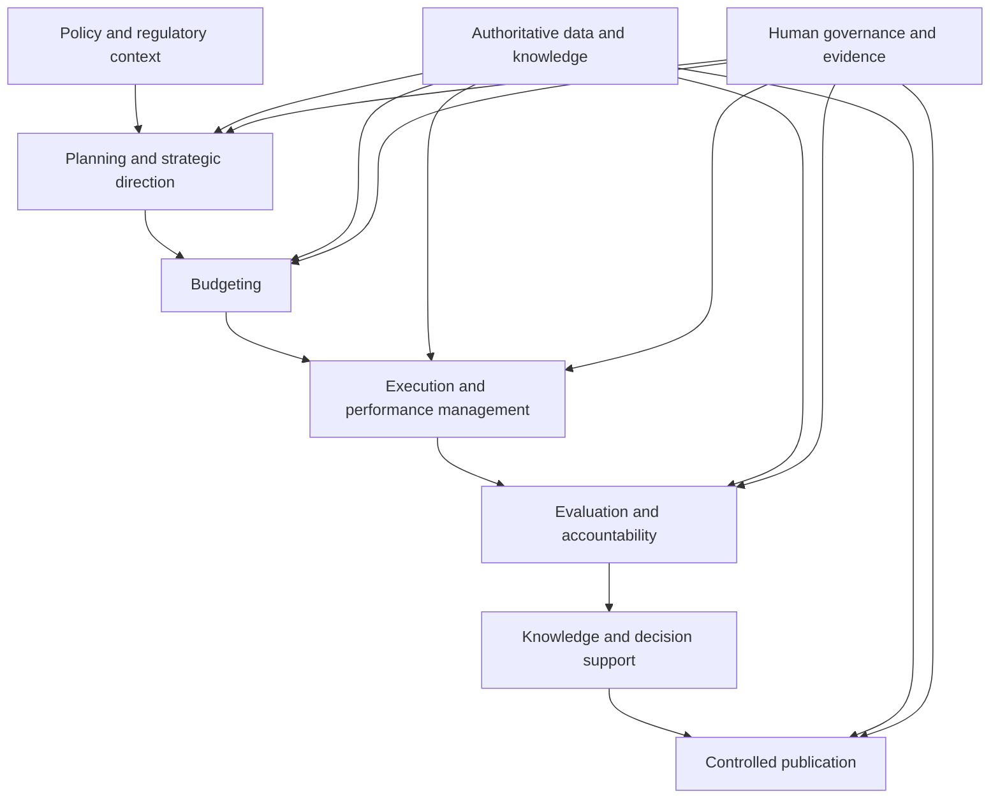
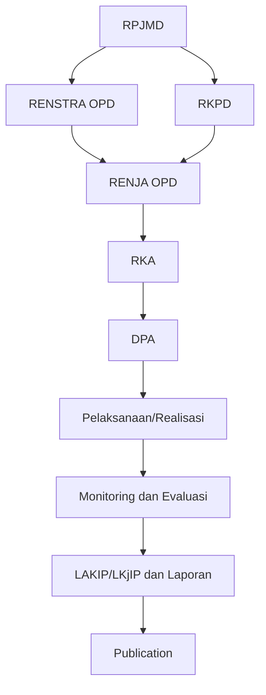

# 10 — Business Architecture Overview

## 1. Tujuan dan Kedudukan

Dokumen ini adalah overview resmi Business Architecture e-PeLARA Next Generation. Dokumen menerjemahkan visi dan prinsip Charter ke konteks bisnis, merangkum current state yang terdokumentasi, serta menetapkan arah target Level 0 sebagai dasar evidence menuju G1 — Business and Regulatory Alignment.

Dokumen ini menjadi parent/context bagi artefak Business Architecture lanjutan. Dokumen ini bukan Capability Map terperinci, katalog Value Stream, process model, organization model, regulatory matrix, operating procedure, atau Traceability Matrix aktual.

## 2. Ruang Lingkup

Ruang lingkup mencakup konteks bisnis pemerintahan, capability domain Level 0, value stream Level 0, business service Level 0, konteks lifecycle dokumen pemerintahan, kebutuhan bisnis tingkat tinggi, batas ownership, dan hubungan lintas-domain. Dokumen tidak menetapkan desain teknis, status implementasi target, pejabat/owner manusia yang belum ditunjuk, atau disposition Gate.

## 3. Sumber Otoritatif dan Dependency

| Sumber | Peran pada dokumen |
| --- | --- |
| [Architecture Charter](../00-governance/00-Architecture-Charter.md) | Visi, prinsip, arah platform, dan Gate 1. |
| [Repository Structure](../00-governance/01-Repository-Structure.md) | Lokasi domain, relative link, dan traceability by link. |
| [Architecture Issue Register](../00-governance/03-Architecture-Issue-Register.md) | Interface issue bisnis dan lintas-domain. |
| [Architecture Risk Register](../00-governance/04-Architecture-Risk-Register.md) | Interface risiko dan treatment lintas-domain. |
| [Compliance Register](../00-governance/05-Compliance-Register.md) | Interface requirement, control, evidence, dan verification kepatuhan. |
| [Architecture Governance Operating Model](../00-governance/07-Architecture-Governance-Operating-Model.md) | Decision rights dan standing delegation. |
| [Architecture Review and Gate Standard](../00-governance/08-Architecture-Review-and-Gate-Standard.md) | Evidence, review, finding, dan disposition Gate. |
| [Traceability Standard](../00-governance/09-Traceability-Standard.md) | Source-to-requirement dan evidence-to-Gate traceability. |
| [Master Roadmap](../11-roadmaps/02-Enterprise-Architecture-Roadmap.md) | `ARCH-BUS-001`, dependency `Roadmap, Baseline`, dan Gate G1. |
| [Lima Official Current State Baseline](../01-current-state/) | Fakta dan assessment current state yang diringkas secara terbatas. |

## 4. Business Architecture Vision

Business Architecture mendukung visi Charter: e-PeLARA Next Generation sebagai Government Intelligence Platform yang menghubungkan kebijakan, program, anggaran, pelaksanaan, kinerja, pengetahuan, dan publikasi pemerintahan dalam arsitektur data yang terpercaya, patuh regulasi, aman, dan berkelanjutan.

Arah bisnis ini mencakup Government Knowledge Platform, Government Digital Publishing Platform, dan Government AI Platform sebagai arah target yang tunduk pada regulatory fidelity, traceability end-to-end, separation of duties, evidence-based governance, serta human decision authority. Arah tersebut tidak menyatakan bahwa target telah diimplementasikan.

## 5. Business Context

e-PeLARA berada pada konteks perencanaan, penganggaran, pelaksanaan/pengendalian, evaluasi, pelaporan, dan publikasi pemerintahan. Baseline mendokumentasikan rantai dokumen perencanaan dan anggaran serta modul terkait. Charter menempatkan proses pemerintahan, aktor, kewenangan, layanan, dan value stream sebagai ruang Business Architecture.

Konteks ini memerlukan hubungan yang dapat ditelusuri dari sumber kebijakan dan kebutuhan bisnis hingga evidence dan publikasi, tanpa menjadikan dokumen, register, atau AI sebagai pengganti kewenangan institusional.

## 6. Current-State Summary

| Kategori evidence | Ringkasan terbatas | Sumber |
| --- | --- | --- |
| Fakta terverifikasi dalam baseline | Baseline modul dan alur logika mendokumentasikan keterkaitan dokumen RPJMD, Renstra OPD, RKPD, Renja, RKA, DPA, realisasi/pengendalian, evaluasi, dan laporan akuntabilitas. | [Modul Sistem](../01-current-state/2-modul-sistem.md); [Alur Logika Sistem](../01-current-state/3-alur-logika-sistem.md) |
| Fakta terverifikasi dalam baseline | Baseline mendokumentasikan modul perencanaan, penganggaran, penatausahaan, pengendalian kegiatan, monitoring dan evaluasi, laporan akuntabilitas, dashboard/monitoring, rekomendasi AI, notifikasi, tanda tangan digital, serta manajemen pengguna dan akses. | [Modul Sistem](../01-current-state/2-modul-sistem.md) |
| Assessment terdokumentasi | Penilaian kesesuaian mencatat gap fungsional terkait integrasi SIPD, workflow approval, kelengkapan export, dashboard tertentu, serta backup dan restore otomatis. | [Penilaian Kesesuaian Standar](../01-current-state/4-penilaian-kesesuaian-standar.md) |
| Assessment terdokumentasi | Baseline mencatat perbedaan siklus Renstra dan status/gap yang relevan bagi keputusan arsitektur. | [Modul Sistem](../01-current-state/2-modul-sistem.md); [Referensi Teknis](../01-current-state/5-referensi-teknis-database-api-frontend.md) |
| Evidence Pending | Status end-to-end workflow approval, kontrak/akses SIPD, owner bisnis/proses, legal applicability per requirement, dan evidence readiness Gate belum ditetapkan oleh otoritas/verifier yang sah dalam overview ini. | [Issue Register](../00-governance/03-Architecture-Issue-Register.md); [Risk Register](../00-governance/04-Architecture-Risk-Register.md); [Compliance Register](../00-governance/05-Compliance-Register.md) |

Ringkasan ini tidak melakukan audit ulang baseline dan tidak mengubah atau menyelesaikan kontradiksi yang telah dicatat oleh register.

## 7. Business Drivers

1. Keselarasan kebijakan, program, anggaran, pelaksanaan, kinerja, pengetahuan, dan publikasi pemerintahan.
2. Regulatory fidelity untuk struktur, substansi, kewenangan, dan proses pengesahan.
3. Keterlacakan source-to-outcome serta evidence-based governance.
4. Satu sumber data pemerintahan yang dapat digunakan untuk publikasi multi-format tanpa input ulang.
5. Pemisahan kewenangan dan pengambilan keputusan manusia pada batas institusional.
6. Penanganan gap/ketidakpastian yang telah direkam pada Issue, Risk, dan Compliance Register.

## 8. Business Outcomes

Outcome target berikut adalah arah arsitektur, bukan klaim implementasi:

| Outcome target | Makna pada Level 0 |
| --- | --- |
| Keselarasan perencanaan dan akuntabilitas | Rantai dokumen dan outcome bisnis dapat ditelusuri lintas tahap. |
| Keputusan berbasis evidence | Keputusan dan rekomendasi memakai sumber, status, dan evidence yang dapat diperiksa. |
| Data dan pengetahuan terkelola | Data/knowledge menjadi dasar bersama bagi proses, insight, dan publikasi. |
| Publikasi tanpa input ulang | Satu data resmi dapat membentuk banyak publikasi terkontrol. |
| Kewenangan yang jelas | Decision authority tetap berada pada pejabat manusia yang sah. |

## 9. Scope dan Boundary

| Dalam scope | Di luar scope |
| --- | --- |
| Konteks bisnis, capability/value stream/service Level 0, lifecycle konseptual, kebutuhan bisnis, dan evidence G1. | Rancangan proses rinci, SOP, BPMN, struktur organisasi, assignment owner manusia, model data, API, UI, atau implementasi. |
| Hubungan konteks dengan data, aplikasi, integrasi, keamanan, AI, dan publikasi. | Keputusan legal, compliance determination, risk acceptance, exception approval, atau gate disposition. |

## 10. Stakeholder dan Actor Categories

| Kategori actor | Kontribusi pada konteks bisnis | Status penetapan |
| --- | --- | --- |
| Project Owner | Kewenangan strategis dan institusional. | Fahmi Alhabsi tercatat sebagai Project Owner/delegation authority. |
| Chief Enterprise Architect | Memimpin analisis/review dan menetapkan status final artefak EA dalam standing delegation. | ChatGPT sesuai governance yang berlaku. |
| Business owner dan process owner | Menetapkan kebutuhan, konteks proses, dan evidence bisnis sesuai kewenangan. | To be assigned by Project Owner. |
| Legal authority dan compliance verifier | Menilai applicability, compliance, dan verification sesuai kewenangan. | To be assigned by Project Owner. |
| Unit perencanaan, penganggaran, pelaksanaan, pengendalian, evaluasi, dan pelaporan | Penerima/manajer konteks proses dan dokumen pemerintahan. | Kategori konseptual; penetapan manusia/unit tidak dibuat oleh dokumen ini. |
| Pengguna informasi dan penerima publikasi | Memakai output informasi/publikasi sesuai kebutuhan yang sah. | Kategori konseptual. |
| ChatGPT Work | Menyusun dan mencatat berdasarkan instruksi resmi. | Bukan decision authority. |

## 11. Business Capability Domains — Level 0

| Domain capability | Ruang lingkup Level 0 | Dasar evidence/arah |
| --- | --- | --- |
| Governance dan strategic direction | Penyelarasan arah, prinsip, decision rights, dan evidence governance. | Charter; Governance Operating Model. |
| Planning | Pengelolaan konteks RPJMD, Renstra, RKPD, dan Renja. | Baseline modul dan alur logika. |
| Budgeting | Pengelolaan konteks RKA dan DPA. | Baseline modul, alur logika, dan penilaian kesesuaian. |
| Execution management | Konteks pelaksanaan, penatausahaan, dan pengendalian kegiatan. | Baseline modul dan alur logika. |
| Performance monitoring | Monitoring realisasi/indikator dan pengendalian. | Baseline modul dan penilaian kesesuaian. |
| Evaluation dan reporting | Evaluasi serta laporan akuntabilitas. | Baseline modul, alur logika, dan penilaian kesesuaian. |
| Data dan knowledge management | Pengelolaan data/knowledge sebagai basis proses, insight, dan publication. | Charter target direction. |
| Compliance dan control | Hubungan requirement, control, evidence, dan verification. | Compliance Register; Charter. |
| Digital publication | Pembentukan publikasi multi-format dari sumber data resmi. | Charter One Data, Many Publications. |
| Analytics dan decision support | Insight, rekomendasi, dan human oversight untuk keputusan. | Charter; baseline modul rekomendasi AI. |

Domain ini bukan capability map terperinci dan tidak membentuk capability ID formal.

## 12. Value Streams — Level 0

| Value stream | Trigger | Stakeholder/value recipient | Value/outcome | Capability domain | Sumber evidence | Status |
| --- | --- | --- | --- | --- | --- | --- |
| Penyelarasan arah dan perencanaan daerah | Kebutuhan siklus/perubahan perencanaan. | Pemegang kewenangan dan unit perencanaan. | Konteks perencanaan yang tersambung dari RPJMD hingga Renja. | Governance, Planning. | Baseline modul/alur logika; Charter. | Current (terdokumentasi) |
| Penyusunan anggaran | Kebutuhan penyusunan RKA dan DPA. | Unit penganggaran dan pemegang kewenangan yang sah. | Konteks dokumen anggaran RKA dan DPA. | Budgeting. | Baseline modul/alur logika; penilaian kesesuaian. | Current (terdokumentasi) |
| Pelaksanaan dan pengendalian | Kebutuhan pelaksanaan, penatausahaan, dan pengendalian. | Unit pelaksana/pengendalian. | Konteks pengelolaan pelaksanaan dan pengendalian kegiatan. | Execution management, Performance monitoring. | Baseline modul. | Current (terdokumentasi) |
| Evaluasi dan akuntabilitas | Kebutuhan evaluasi, monitoring, dan laporan akuntabilitas. | Pengelola evaluasi dan penerima laporan. | Evidence/konteks kinerja dan laporan akuntabilitas. | Performance monitoring, Evaluation dan reporting. | Baseline modul/alur logika; penilaian kesesuaian. | Current (terdokumentasi) |
| Pengetahuan dan dukungan keputusan | Kebutuhan insight atau rekomendasi atas data yang sah. | Decision maker manusia yang sah. | Insight yang traceable dan berada dalam human oversight. | Data dan knowledge management, Analytics dan decision support. | Charter; baseline modul rekomendasi AI. | Target |
| Publikasi terkontrol | Kebutuhan penyajian informasi kepada audiens yang sah. | Penerima publikasi/informasi. | Publikasi multi-format tanpa input ulang dari sumber resmi. | Digital publication, Data dan knowledge management. | Charter. | Target |
| Interoperabilitas eksternal | Kebutuhan pertukaran data dengan sistem pemerintahan eksternal. | Organisasi/sistem eksternal berwenang. | Pertukaran yang memiliki kontrak, akses, dan evidence sah. | Governance, Data dan knowledge management. | Baseline penilaian kesesuaian; Issue/Risk Register. | Evidence Pending |

## 13. Business Services — Level 0

| Kategori service | Service Level 0 | Batas pernyataan |
| --- | --- | --- |
| Internal government service | Perencanaan dan pengelolaan dokumen perencanaan/anggaran. | Konteks dokumen/modul terdokumentasi; ketersediaan service operasional end-to-end tidak ditetapkan di sini. |
| Internal government service | Pelaksanaan, pengendalian, monitoring, evaluasi, dan pelaporan akuntabilitas. | Ringkasan berdasarkan baseline; bukan katalog service. |
| Cross-organizational service | Penyelarasan keterkaitan prioritas dan dokumen lintas konteks pemerintahan. | Baseline mendokumentasikan cascading; kontrak interorganisasi tidak ditetapkan di sini. |
| Publication/information service | Penyediaan informasi/publikasi dari data resmi yang sama dalam berbagai format. | Target Charter; tidak diklaim telah tersedia secara operasional. |
| Analytical/decision-support service | Insight dan rekomendasi dengan human oversight. | Arah Charter dan modul baseline; bukan otorisasi AI untuk mengambil keputusan. |

## 14. Government Document Lifecycle Context

Hubungan konseptual yang tersedia dalam evidence baseline diringkas sebagai berikut:

Baseline mendokumentasikan keterkaitan RPJMD, Renstra OPD, RKPD, Renja, RKA, dan DPA, serta konteks realisasi, monitoring/evaluasi, dan LAKIP/laporan. Diagram menampilkan dependency konseptual Level 0: RPJMD memberi konteks bagi Renstra OPD dan RKPD; Renstra OPD dan RKPD menjadi konteks bagi Renja OPD; hubungan berikutnya menuju RKA dan DPA tetap harus dibaca bersama evidence, status, kewenangan, serta ketentuan yang berlaku. Diagram adalah hubungan konseptual Level 0 untuk traceability bisnis, bukan workflow approval, SOP, penetapan regulasi, atau pernyataan bahwa semua transisi telah diimplementasikan.

Istilah `Publication` adalah arah target dari Charter. Hubungan khusus, approval state, legal applicability, dan status implementasi setiap tahap yang tidak tersedia secara konsisten tetap `Evidence Pending`.

## 15. One Data, Many Publications dalam Business Architecture

One Data, Many Publications berarti satu data pemerintahan yang sah, terkelola, dan dapat ditelusuri menjadi sumber berbagai bentuk publikasi tanpa input ulang dan tanpa perbedaan substansi. Pada Business Architecture, prinsip ini menghubungkan proses pengelolaan data/knowledge dengan kebutuhan informasi, pelaporan, dashboard, dokumen, dan publikasi multi-format.

Perbedaan format atau desain tidak boleh mengubah makna, angka, status, sumber, versi, maupun lineage data. Detail data model, publishing pipeline, template, dan rendering berada pada domain/artefak lanjutan.

## 16. Target Business Architecture Direction

Target direction adalah arsitektur bisnis yang:

1. menghubungkan perencanaan, penganggaran, pelaksanaan, pengendalian, evaluasi, pelaporan, dan publikasi melalui konteks yang traceable;
2. mendukung Government Intelligence Platform, Government Knowledge Platform, Government Digital Publishing Platform, dan Government AI Platform secara terkendali;
3. menggunakan data/knowledge resmi untuk publikasi multi-format tanpa input ulang;
4. mempertahankan regulatory fidelity, separation of duties, evidence-based governance, dan human decision authority; dan
5. memisahkan requirement bisnis dari desain data, aplikasi, integrasi, keamanan, teknologi, AI, serta implementasi.

Target direction belum merupakan klaim implementasi atau gate approval.

## 17. Current-to-Target Transition Themes

| Tema | Current evidence | Arah transisi |
| --- | --- | --- |
| Lifecycle dan traceability dokumen | Rantai dokumen terdokumentasi dalam baseline; konsistensi detail dan evidence lintas artefak masih perlu dikelola. | Hubungan source-to-outcome dan evidence-to-Gate yang konsisten. |
| Workflow dan kewenangan | Status workflow approval tercatat sebagai issue. | Model state dan decision rights lintas dokumen ditetapkan melalui artefak/keputusan berwenang. |
| Interoperabilitas | Integrasi SIPD tercatat sebagai gap. | Kontrak, akses, dan disposition tanpa asumsi ketersediaan API. |
| Data/knowledge dan publikasi | Charter menetapkan One Data, Many Publications. | Data/knowledge terkelola menjadi sumber publikasi terkontrol multi-format. |
| Insight dan AI | Baseline mendokumentasikan rekomendasi AI; Charter menetapkan human oversight. | AI mendukung insight/rekomendasi, bukan authority institusional. |

## 18. Business Principles

1. Regulatory fidelity dan kewenangan institusional tidak dapat digantikan oleh automation atau AI.
2. One Data, Many Publications: satu sumber resmi, banyak publikasi terkontrol.
3. Traceability by link, not duplication.
4. Evidence Pending bukan evidence terverifikasi.
5. Separation of duties diterapkan antara penyusunan, review, verification, dan keputusan.
6. Target architecture tidak boleh dinyatakan telah diimplementasikan tanpa evidence dan verifier yang sah.

## 19. Business Requirements tingkat tinggi

| Requirement | Kriteria verifikasi tingkat arsitektur | Source reference |
| --- | --- | --- |
| Rantai dokumen bisnis harus dapat ditelusuri dari konteks perencanaan hingga outcome/publikasi yang relevan. | Link source-to-requirement dan evidence-to-Gate dapat diperiksa sesuai Traceability Standard. | Charter; baseline modul/alur logika; Traceability Standard. |
| Kewenangan keputusan, review, dan verification harus dipisahkan sesuai governance. | Decision rights dan record menunjukkan authority manusia yang sah; AI/register tidak diperlakukan sebagai authority. | Charter; Governance Operating Model. |
| Data/knowledge resmi harus mendukung banyak publikasi tanpa input ulang atau perubahan substansi. | Rationale dan evidence menunjukkan sumber kanonis, versi, dan lineage publikasi. | Charter. |
| Gap workflow approval, integrasi SIPD, dan ketahanan layanan harus dirutekan ke mekanisme governance yang sesuai. | Issue/risk/compliance interface dan disposition berwenang tersedia sebelum Gate terkait. | Issue Register; Risk Register; Compliance Register. |
| Target business architecture harus dapat dinilai terhadap evidence G1 tanpa mengklaim disposition Gate. | Evidence, finding, dependency, owner/verifier, dan status review dicatat sesuai EA-008. | Charter; Architecture Review and Gate Standard. |

Tabel ini adalah requirement overview dan bukan Traceability Matrix aktual atau spesifikasi desain teknis.

## 20. Decision Rights dan Ownership Boundaries

| Objek/keputusan | Analisis atau rekomendasi | Decision authority | Record |
| --- | --- | --- | --- |
| Arah strategis dan kewenangan institusional | Chief Enterprise Architect. | Project Owner atau pejabat manusia yang sah sesuai kewenangan. | Charter, ADR bila relevan, dan Enterprise Change Log. |
| Status final artefak EA dalam batas delegation | Chief Enterprise Architect. | Chief Enterprise Architect berdasarkan standing delegation dari Project Owner. | Metadata, Persetujuan, Change Log lokal, dan Enterprise Change Log bila relevan. |
| Business/process ownership, legal/compliance verification, dan keputusan institusional lain | Owner/verifier manusia yang sah. | To be assigned by Project Owner atau authority sah sesuai kewenangan. | Artefak/domain register yang relevan. |
| Pencatatan dokumen | ChatGPT Work. | Bukan decision authority. | File resmi berdasarkan instruksi resmi. |

Standing delegation tidak mengubah authority Gate G0–G6. AI bukan legal authority, pejabat pemerintah, compliance verifier, risk acceptance authority, atau exception authority.

## 21. Hubungan dengan Domain Arsitektur Lain

| Domain | Hubungan konteks bisnis |
| --- | --- |
| Data dan Knowledge Architecture | Data/knowledge resmi, ownership, lineage, temporal model, dan kualitas mendukung capability, laporan, insight, dan publication. |
| Application dan Integration Architecture | Aplikasi/integrasi merealisasikan kebutuhan bisnis setelah keputusan dan kontrak yang sah tersedia. |
| Technology dan Security Architecture | Ketahanan, akses, keamanan, audit, dan operasi mendukung layanan/proses; desainnya tidak ditetapkan di sini. |
| AI Architecture | AI mendukung knowledge, analytics, dan rekomendasi dalam human oversight. |
| Document dan Publishing Architecture | Mengubah data resmi menjadi publikasi terkontrol sesuai One Data, Many Publications. |
| Governance | Menetapkan decision rights, review, evidence, status, dan change record. |

## 22. Issue, Risk, Compliance, dan Change Interfaces

| Interface | Penggunaan pada Business Architecture Overview |
| --- | --- |
| Issue Register | AIR-001, AIR-004, AIR-007, AIR-009, dan AIR-010 tetap menjadi record issue resmi sesuai substansinya; overview ini tidak mengubah status atau disposition. |
| Risk Register | Risiko terkait evidence, integrasi, ketahanan, dan delivery tetap dikelola oleh register; overview ini hanya menunjukkan konteks bisnis. |
| Compliance Register | Requirement, control, evidence, exception, applicability, dan verification kepatuhan tetap dikelola oleh register. |
| Enterprise Change Log | Perubahan lintas-artefak dicatat sesuai mekanisme yang berlaku; tidak diperbarui untuk draft ini. |
| ADR | Keputusan arsitektur yang diperlukan dirutekan ke ADR; ADR merekam keputusan dan bukan authority. |

## 23. Traceability

Traceability mengikuti [Traceability Standard](../00-governance/09-Traceability-Standard.md):

1. source-to-requirement dari Charter, Roadmap, baseline, dan sumber berwenang;
2. requirement-to-capability/value stream/service pada Level 0;
3. current-to-target untuk tema transisi;
4. business-to-data/application/integration/security/AI/publication sesuai domain; dan
5. evidence-to-G1.

Dokumen ini tidak membuat canonical Traceability Matrix, traceability record aktual, atau status `Verified` tanpa evidence dan verifier yang sah.

## 24. G1 Readiness dan Evidence Status

| Elemen G1 | Evidence tersedia | Evidence/aksi masih diperlukan | Owner/verifier | Status |
| --- | --- | --- | --- | --- |
| Konteks dan arah Business Architecture | Charter, Roadmap, lima baseline, dan overview ini. | Review CEA serta evidence yang dipersyaratkan untuk Gate. | Chief Enterprise Architect; verifier lain To be assigned by Project Owner. | Evidence Pending |
| Capability dan value stream | Domain capability dan value stream Level 0 tersedia dalam dokumen ini. | Capability Map dan artefak value stream lanjutan sesuai roadmap; persetujuan/evidence yang sah. | Business owner/process owner To be assigned by Project Owner. | Evidence Pending |
| Regulatory alignment | Compliance Register tersedia sebagai interface. | Applicability, control, evidence, dan verification per requirement yang sah. | Legal authority/compliance verifier To be assigned by Project Owner. | Evidence Pending |
| Issue/risk dependencies | Register Issue dan Risk tersedia. | Disposition/evidence untuk issue atau risk yang memengaruhi Gate. | Owner terkait To be assigned by Project Owner; authority sesuai governance. | Evidence Pending |

Finding: capability/value stream Level 0 belum merupakan bukti persetujuan atau verification G1. Dokumen ini tidak menetapkan Gate disposition dan tidak menyatakan G1 `APPROVED`.

## 25. Dependency ke Artefak Business Architecture Berikutnya

Master Roadmap menempatkan dokumen berikut setelah overview ini:

| Seq | Document ID | Artefak lanjutan | Dependency | Gate | Batas terhadap dokumen ini |
| --- | --- | --- | --- | --- | --- |
| 11 | `BP-BUS-001` | `Business-Capability-Map.md` | Business Overview | G1 | Mendetailkan capability; tidak dibuat oleh overview ini. |
| 12 | `BP-BUS-002` | `Planning-to-Accountability-Value-Streams.md` | Capability Map | G1 | Mendetailkan value stream; tidak dibuat oleh overview ini. |
| 13 | `BP-BUS-003` | `Government-Document-Lifecycle-Blueprint.md` | Value Streams, regulations | G1 | Mendetailkan lifecycle; tidak dibuat oleh overview ini. |
| 14 | `BP-BUS-004` | `Roles-Authority-and-Approval-Blueprint.md` | Document Lifecycle | G1 | Mendetailkan role/authority; tidak dibuat oleh overview ini. |

## 26. Assumptions, Constraints, dan Evidence Pending

| Jenis | Pernyataan |
| --- | --- |
| Constraint | Overview hanya memakai sumber yang tercantum pada Bagian 3 dan tidak mengaudit repository atau source code. |
| Constraint | Tidak ada capability ID formal, process model, SOP, organization model, regulatory matrix, atau Traceability Matrix aktual. |
| Assumption kerja | `ARCH-BUS-001` adalah dokumen overview yang menjadi dependency `Business Overview` bagi `BP-BUS-001`, sesuai Master Roadmap. |
| Evidence Pending | Owner bisnis/proses, legal authority, compliance verifier, evidence Gate, dan keputusan/disposition yang belum tersedia menggunakan penandaan yang sesuai. |
| Evidence Pending | Detail hubungan lifecycle, status approval, status implementasi target, kontrak SIPD, dan legal applicability tidak disimpulkan tanpa evidence sah. |

## 27. Batas Kewenangan AI

ChatGPT Work hanya menyusun dan mencatat dokumen berdasarkan instruksi resmi. ChatGPT Work tidak mengambil keputusan bisnis/arsitektur, tidak menetapkan owner manusia, tidak memverifikasi compliance/legal applicability, tidak menerima risiko, tidak menyetujui exception, tidak menetapkan Gate disposition, dan tidak menutup issue/risk.

AI dapat membantu analisis atau penyusunan dalam batas governance, tetapi tidak menggantikan Project Owner, Chief Enterprise Architect dalam batas mandatnya, business owner, process owner, legal authority, compliance verifier, atau pejabat manusia yang sah.

## 28. Persetujuan

| Peran                          | Nama                          | Keputusan                                        | Status proses | Tanggal    |
| ------------------------------ | ----------------------------- | ------------------------------------------------ | ------------- | ---------- |
| Penyusun Dokumen/File Operator | ChatGPT Work                  | Disusun                                          | Selesai       | 2026-08-04 |
| Chief Enterprise Architect     | ChatGPT                       | Direview, ditetapkan final, dan disahkan berdasarkan standing delegation | Selesai | 2026-08-04 |
| Delegation authority           | Project Owner — Fahmi Alhabsi | Standing delegation melalui EA-007 Version 1.1.0 | Tercatat      | 2026-08-04 |

Project Owner tidak memerlukan pengesahan ulang selama keputusan berada dalam delegation boundary.

## 29. Change Log Dokumen

| Versi | Tanggal | Perubahan | Penyusun | Status |
| --- | --- | --- | --- | --- |
| 1.0.0 | 2026-08-04 | Penyusunan awal Business Architecture Overview; review CEA dengan hasil REVISIONS REQUIRED; koreksi dependency konseptual RPJMD, Renstra OPD, RKPD, dan Renja; penghapusan interpretasi lifecycle linear; verifikasi final dependency konseptual; hasil review final CEA PASSED; penetapan sebagai Official Business Architecture Overview dan pengesahan berdasarkan standing delegation, status Approved, efektif 2026-08-04. | ChatGPT Work | Approved |
