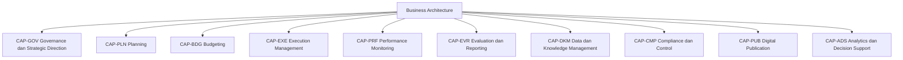
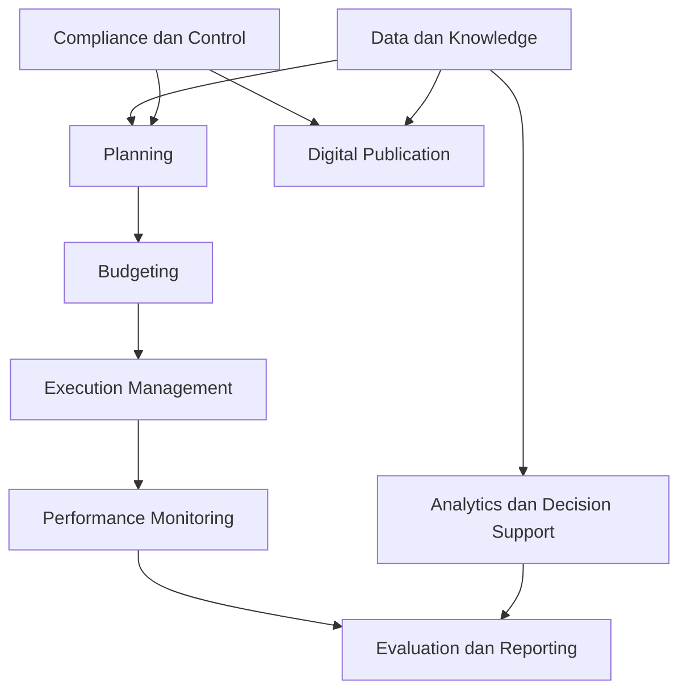

# 11 — Business Capability Map

## 1. Tujuan dan Kedudukan

Dokumen ini adalah Business Capability Map untuk e-PeLARA Next Generation. Dokumen mendetailkan sepuluh domain capability Level 0 yang telah ditetapkan oleh [ARCH-BUS-001](10-Business-Architecture-Overview.md), menetapkan capability Level 1 yang stabil, serta menyediakan evidence Business Architecture menuju G1 — Business and Regulatory Alignment.

Capability adalah kemampuan stabil yang harus dimiliki organisasi atau platform untuk menghasilkan outcome, terlepas dari struktur organisasi, urutan proses, aplikasi, atau teknologi tertentu. Dokumen ini menjadi dependency bagi `BP-BUS-002 — Planning-to-Accountability-Value-Streams.md`; dokumen ini bukan value-stream blueprint, process model, organization chart, katalog aplikasi, atau penetapan implementasi.

## 2. Ruang Lingkup

Dalam scope: domain Level 0, capability Level 1, outcome, evidence current/target, gap view, dependency konseptual, dan interface ke artefak berikutnya. Di luar scope: Level 2, dekomposisi proses, workflow approval, SOP, penetapan role/owner manusia, desain aplikasi/modul, maturity assessment, dan gate disposition.

## 3. Sumber Otoritatif dan Dependency

| Sumber | Peran |
| --- | --- |
| [Business Architecture Overview](10-Business-Architecture-Overview.md) | Parent, domain Level 0, outcome, arah bisnis, dan lifecycle konseptual. |
| [Lima Official Current State Baseline](../01-current-state/) | Evidence current yang dirujuk terbatas. |
| [Architecture Charter](../00-governance/00-Architecture-Charter.md) | Prinsip, One Data, Many Publications, dan batas kewenangan. |
| [Issue Register](../00-governance/03-Architecture-Issue-Register.md) | Issue resmi yang relevan. |
| [Risk Register](../00-governance/04-Architecture-Risk-Register.md) | Risiko resmi yang relevan. |
| [Compliance Register](../00-governance/05-Compliance-Register.md) | Requirement/control/evidence compliance yang relevan. |
| [Governance Operating Model](../00-governance/07-Architecture-Governance-Operating-Model.md) | Decision rights dan standing delegation. |
| [Review and Gate Standard](../00-governance/08-Architecture-Review-and-Gate-Standard.md) | Evidence dan batas G1. |
| [Traceability Standard](../00-governance/09-Traceability-Standard.md) | Identifier dan relasi traceability. |
| [Master Roadmap](../11-roadmaps/02-Enterprise-Architecture-Roadmap.md) | EA-011; dependency Business Overview; BP-BUS-002 sebagai artefak berikutnya. |

## 4. Prinsip Capability Mapping

1. Capability menjelaskan `what`; process/value stream menjelaskan aliran atau `how`; role menjelaskan pihak bertanggung jawab; business service menjelaskan value yang diberikan; application/module menjelaskan realisasi digital; project/work package menjelaskan perubahan atau implementasi.
2. Nama menu aplikasi, modul, dokumen, unit organisasi, atau proyek tidak digunakan sebagai capability tanpa abstraksi bisnis.
3. Level 1 harus stabil terhadap perubahan struktur organisasi, urutan kerja, dan pilihan teknologi.
4. `Documented Current` hanya menyatakan dukungan evidence baseline, bukan maturity atau kesiapan end-to-end; `Target` adalah arah Charter/overview; `Evidence Pending` berarti bukti scope, ownership, atau readiness belum memadai.
5. One Data, Many Publications memerlukan data resmi, lineage, versi, status, dan substansi yang konsisten untuk banyak publikasi tanpa input ulang.

## 5. Istilah dan Definisi

| Istilah | Definisi/batas |
| --- | --- |
| Capability | Kemampuan stabil untuk menghasilkan outcome. |
| Process/value stream | Aliran aktivitas atau tahap `how`; tidak dimodelkan rinci di sini. |
| Role | Pihak dengan tanggung jawab; owner manusia belum ditetapkan kecuali sumber resmi menyatakannya. |
| Business service | Value yang diberikan kepada penerima. |
| Application/module | Realisasi digital; bukan capability itu sendiri. |
| Project/work package | Perubahan untuk membangun capability; bukan capability. |
| Current evidence | Referensi fakta atau assessment yang didokumentasikan pada baseline/register. |
| Target direction | Arah arsitektur, bukan klaim implementasi. |

## 6. Capability Metamodel

Setiap capability Level 1 memiliki ID, definisi, parent Level 0, outcome, stakeholder/value recipient, current evidence, target direction, dependency, keterkaitan register bila tersedia, status evidence, status owner, relevansi Gate, serta notes/constraints. Owner bisnis, process owner, legal authority, dan compliance verifier yang belum ditetapkan berstatus `To be assigned by Project Owner`.

Relasi yang dipakai mengikuti EA-009: capability `DERIVED_FROM` source/requirement, `REALIZES` business outcome, `DEPENDS_ON` capability lain, dan `GOVERNED_BY` governance/control. Future value stream atau application dapat `REALIZES` capability sesuai arah relasi yang sah.

## 7. Capability Identifier Standard

| Level | Pola | Aturan |
| --- | --- | --- |
| Level 0 | `CAP-<DOMAIN>` | Domain yang disahkan ARCH-BUS-001. |
| Level 1 | `CAP-<DOMAIN>-<NN>` | Unik, stabil, tidak digunakan ulang, dan tidak bergantung pada nama organisasi/aplikasi. |

Kode domain: `GOV`, `PLN`, `BDG`, `EXE`, `PRF`, `EVR`, `DKM`, `CMP`, `PUB`, dan `ADS`.

## 8. Capability Level 0

| ID | Domain Level 0 | Arah Level 0 |
| --- | --- | --- |
| CAP-GOV | Governance dan Strategic Direction | Arah, prinsip, decision rights, dan evidence governance. |
| CAP-PLN | Planning | Konteks RPJMD, Renstra OPD, RKPD, dan Renja OPD. |
| CAP-BDG | Budgeting | Konteks RKA dan DPA. |
| CAP-EXE | Execution Management | Pelaksanaan, penatausahaan, dan pengendalian kegiatan. |
| CAP-PRF | Performance Monitoring | Monitoring realisasi/indikator dan pengendalian. |
| CAP-EVR | Evaluation dan Reporting | Evaluasi dan laporan akuntabilitas. |
| CAP-DKM | Data dan Knowledge Management | Data/knowledge sebagai basis proses, insight, dan publikasi. |
| CAP-CMP | Compliance dan Control | Requirement, control, evidence, dan verification. |
| CAP-PUB | Digital Publication | Publikasi multi-format dari data resmi. |
| CAP-ADS | Analytics dan Decision Support | Insight/rekomendasi dengan human oversight. |

## 9. Governance dan Strategic Direction Capabilities

| ID dan nama | Definisi; outcome; penerima value | Evidence current; target direction | Dependency; register | Status; owner; Gate; notes |
| --- | --- | --- | --- | --- |
| CAP-GOV-01 — Strategic Direction Alignment | Kemampuan menyelaraskan arah bisnis, prinsip, dan prioritas. Outcome: keselarasan perencanaan dan akuntabilitas. Penerima: Project Owner dan pemegang kewenangan. | Charter dan ARCH-BUS-001; arah platform dan business architecture yang traceable. | CAP-GOV-02, CAP-PLN-01; COMP-006. | Target; To be assigned by Project Owner; G1; tidak menetapkan prioritas institusional. |
| CAP-GOV-02 — Decision Rights Governance | Kemampuan menjaga batas keputusan, review, verification, dan escalation. Outcome: kewenangan yang jelas. Penerima: pejabat berwenang. | Charter; Governance Operating Model; arah separation of duties. | CAP-GOV-03, CAP-CMP-01; AIR-004, ARISK-002. | Target; To be assigned by Project Owner; G1; AI bukan decision authority. |
| CAP-GOV-03 — Architecture Evidence Governance | Kemampuan mengelola status, versi, evidence, dan keputusan arsitektur secara dapat ditelusuri. Outcome: keputusan berbasis evidence. Penerima: governance/reviewer. | Governance artefak dan AIR-010/ARISK-007. Target: evidence-to-Gate konsisten. | CAP-DKM-03, CAP-CMP-02; AIR-010, ARISK-007, COMP-006. | Documented Current; To be assigned by Project Owner; G1; bukan register tandingan. |

## 10. Planning Capabilities

| ID dan nama | Definisi; outcome; penerima value | Evidence current; target direction | Dependency; register | Status; owner; Gate; notes |
| --- | --- | --- | --- | --- |
| CAP-PLN-01 — Strategic Planning Context Management | Kemampuan mengelola konteks RPJMD, Renstra OPD, dan RKPD secara saling-terkait. Outcome: keselarasan perencanaan dan akuntabilitas. Penerima: unit perencanaan/pemegang kewenangan. | Baseline modul dan alur logika; target lineage yang terkendali. | CAP-DKM-01, CAP-CMP-01; AIR-001, ARISK-001, COMP-001. | Documented Current; To be assigned by Project Owner; G1; siklus temporal tidak diasumsikan telah diselaraskan. |
| CAP-PLN-02 — Annual Planning Context Management | Kemampuan mengelola konteks Renja OPD terhadap konteks Renstra OPD dan RKPD. Outcome: keselarasan perencanaan dan akuntabilitas. Penerima: unit perencanaan. | Baseline modul/alur logika; target traceability lintas dokumen. | CAP-PLN-01, CAP-DKM-01; COMP-001. | Documented Current; To be assigned by Project Owner; G1; bukan workflow penyusunan Renja. |
| CAP-PLN-03 — Planning Lineage Management | Kemampuan mempertahankan keterlacakan kebutuhan, dokumen, indikator, dan arah perencanaan. Outcome: keputusan berbasis evidence. Penerima: pengelola perencanaan/evaluasi. | Baseline perencanaan dan Charter P-02; target source-to-outcome traceability. | CAP-DKM-03, CAP-CMP-02; AIR-001, COMP-001. | Target; To be assigned by Project Owner; G1; detail model data berada di G2. |

## 11. Budgeting Capabilities

| ID dan nama | Definisi; outcome; penerima value | Evidence current; target direction | Dependency; register | Status; owner; Gate; notes |
| --- | --- | --- | --- | --- |
| CAP-BDG-01 — Budget Formulation Context Management | Kemampuan mengelola konteks penyusunan RKA. Outcome: keselarasan perencanaan dan akuntabilitas. Penerima: unit penganggaran. | Baseline modul/alur logika mencatat RKA; target regulatory fidelity. | CAP-PLN-02, CAP-CMP-01; COMP-002. | Documented Current; To be assigned by Project Owner; G1; bukan proses persetujuan anggaran. |
| CAP-BDG-02 — Budget Authorization Context Management | Kemampuan mengelola konteks DPA sebagai dokumen anggaran. Outcome: kewenangan yang jelas. Penerima: pejabat keuangan berwenang. | Baseline mencatat DPA; target lifecycle yang dapat ditelusuri. | CAP-BDG-01, CAP-CMP-01; COMP-002. | Documented Current; To be assigned by Project Owner; G1; status approval tidak diklaim. |
| CAP-BDG-03 — Plan-to-Budget Alignment Management | Kemampuan menjaga keterkaitan konteks perencanaan dengan konteks anggaran. Outcome: keselarasan perencanaan dan akuntabilitas. Penerima: perencanaan/penganggaran. | Baseline keterkaitan Renja, RKA, DPA; target lineage lintas domain. | CAP-PLN-02, CAP-DKM-03; COMP-001, COMP-002. | Target; To be assigned by Project Owner; G1; bukan penetapan alokasi atau aturan hukum. |

## 12. Execution Management Capabilities

| ID dan nama | Definisi; outcome; penerima value | Evidence current; target direction | Dependency; register | Status; owner; Gate; notes |
| --- | --- | --- | --- | --- |
| CAP-EXE-01 — Activity Execution Coordination | Kemampuan mengelola konteks pelaksanaan kegiatan terhadap dokumen anggaran. Outcome: keselarasan perencanaan dan akuntabilitas. Penerima: unit pelaksana. | Baseline modul/alur logika mencatat pelaksanaan/realisasi. Target: keterlacakan konteks. | CAP-BDG-02, CAP-DKM-01; COMP-002. | Documented Current; To be assigned by Project Owner; G1; bukan SOP pelaksanaan. |
| CAP-EXE-02 — Financial Administration Context Management | Kemampuan mengelola konteks penatausahaan sebagai bagian pelaksanaan. Outcome: keputusan berbasis evidence. Penerima: fungsi keuangan berwenang. | Baseline modul mencatat penatausahaan; target evidence yang dapat diperiksa. | CAP-BDG-02, CAP-CMP-01; COMP-002. | Documented Current; To be assigned by Project Owner; G1; detail control berada pada artefak lanjutan. |
| CAP-EXE-03 — Activity Control Context Management | Kemampuan menjaga konteks pengendalian kegiatan. Outcome: keselarasan perencanaan dan akuntabilitas. Penerima: pengendalian/pemegang kewenangan. | Baseline modul pengendalian; target decision rights dan evidence yang jelas. | CAP-PRF-03, CAP-GOV-02; AIR-004, ARISK-002. | Evidence Pending; To be assigned by Project Owner; G1; status workflow approval belum konsisten. |

## 13. Performance Monitoring Capabilities

| ID dan nama | Definisi; outcome; penerima value | Evidence current; target direction | Dependency; register | Status; owner; Gate; notes |
| --- | --- | --- | --- | --- |
| CAP-PRF-01 — Indicator Monitoring | Kemampuan memantau konteks indikator kinerja. Outcome: keputusan berbasis evidence. Penerima: pengelola kinerja. | Baseline modul indikator/monev; target lineage indikator yang dapat ditelusuri. | CAP-DKM-01, CAP-PLN-03; COMP-005. | Documented Current; To be assigned by Project Owner; G1; tidak menyatakan kualitas indikator. |
| CAP-PRF-02 — Realization Monitoring | Kemampuan memantau konteks realisasi. Outcome: keputusan berbasis evidence. Penerima: pelaksana/pengendalian. | Baseline modul realisasi, monitoring, dashboard; target evidence konsisten. | CAP-EXE-01, CAP-DKM-01; AIR-002. | Documented Current; To be assigned by Project Owner; G1; status dashboard tidak disimpulkan. |
| CAP-PRF-03 — Performance Control Insight | Kemampuan menyediakan konteks pengendalian berbasis data kinerja. Outcome: keselarasan perencanaan dan akuntabilitas. Penerima: pemegang kewenangan. | Baseline pengendalian/monev; target human-overseen insight. | CAP-PRF-01, CAP-ADS-01, CAP-CMP-02; COMP-005. | Target; To be assigned by Project Owner; G1; bukan keputusan otomatis. |

## 14. Evaluation dan Reporting Capabilities

| ID dan nama | Definisi; outcome; penerima value | Evidence current; target direction | Dependency; register | Status; owner; Gate; notes |
| --- | --- | --- | --- | --- |
| CAP-EVR-01 — Performance Evaluation | Kemampuan mengevaluasi konteks capaian dan evidence kinerja. Outcome: keputusan berbasis evidence. Penerima: pengelola evaluasi. | Baseline evaluasi/monev; target evaluasi traceable. | CAP-PRF-01, CAP-DKM-03; COMP-005. | Documented Current; To be assigned by Project Owner; G1; bukan metode evaluasi rinci. |
| CAP-EVR-02 — Accountability Reporting | Kemampuan membentuk konteks laporan akuntabilitas. Outcome: keselarasan perencanaan dan akuntabilitas. Penerima: pejabat/penerima laporan. | Baseline LAKIP/LKjIP dan laporan; target konsistensi sumber-ke-output. | CAP-EVR-01, CAP-PUB-02; COMP-005. | Documented Current; To be assigned by Project Owner; G1; acceptance laporan belum ditetapkan. |
| CAP-EVR-03 — Recommendation Management | Kemampuan mengelola rekomendasi sebagai input keputusan yang dapat ditelusuri. Outcome: keputusan berbasis evidence. Penerima: decision maker manusia. | Baseline rekomendasi AI; Charter human oversight. | CAP-ADS-02, CAP-GOV-02; —. | Target; To be assigned by Project Owner; G1; rekomendasi bukan authority institusional. |

## 15. Data dan Knowledge Management Capabilities

| ID dan nama | Definisi; outcome; penerima value | Evidence current; target direction | Dependency; register | Status; owner; Gate; notes |
| --- | --- | --- | --- | --- |
| CAP-DKM-01 — Authoritative Data Management | Kemampuan mengelola data resmi sebagai dasar bersama. Outcome: data dan pengetahuan terkelola. Penerima: seluruh domain dan penerima informasi sah. | Charter One Data, Many Publications; baseline data dokumen/modul. | CAP-DKM-02, CAP-CMP-02; AIR-001, ARISK-001, COMP-007. | Target; To be assigned by Project Owner; G1; authoritative source/owner belum ditetapkan. |
| CAP-DKM-02 — Reference and Nomenclature Management | Kemampuan mengelola reference data dan nomenklatur secara terkendali. Outcome: data dan pengetahuan terkelola. Penerima: perencanaan/penganggaran/publikasi. | Baseline kode program/kegiatan; target sumber, versi, dan change control. | CAP-DKM-01, CAP-CMP-01; COMP-004. | Evidence Pending; To be assigned by Project Owner; G1; tidak mengklaim katalog telah tersedia. |
| CAP-DKM-03 — Knowledge Provenance and Lineage Management | Kemampuan mengelola provenance, hubungan, dan lineage knowledge/evidence. Outcome: keputusan berbasis evidence. Penerima: reviewer dan pengguna insight. | Charter/Traceability Standard; target end-to-end lineage. | CAP-GOV-03, CAP-CMP-02; AIR-010, ARISK-007, COMP-007. | Target; To be assigned by Project Owner; G1; model data/ontology berada pada G2. |

## 16. Compliance dan Control Capabilities

| ID dan nama | Definisi; outcome; penerima value | Evidence current; target direction | Dependency; register | Status; owner; Gate; notes |
| --- | --- | --- | --- | --- |
| CAP-CMP-01 — Requirement and Applicability Management | Kemampuan mengelola keterkaitan requirement, applicability, dan capability. Outcome: kewenangan yang jelas. Penerima: legal/compliance authority. | Compliance Register tersedia; target assessment oleh authority sah. | CAP-GOV-02, CAP-DKM-03; COMP-001 sampai COMP-011 sesuai scope. | Documented Current; To be assigned by Project Owner; G1; tidak menetapkan legal applicability baru. |
| CAP-CMP-02 — Control Evidence Management | Kemampuan mengelola evidence kontrol dan keterkaitannya dengan requirement/gate. Outcome: keputusan berbasis evidence. Penerima: verifier/reviewer. | Compliance/Register dan Gate Standard; target evidence yang dapat diverifikasi. | CAP-GOV-03, CAP-DKM-03; AIR-010, ARISK-007, COMP-006. | Target; To be assigned by Project Owner; G1; tidak memberi status Verified. |
| CAP-CMP-03 — Authority and Control Assurance | Kemampuan memastikan control dibaca bersama kewenangan dan separation of duties. Outcome: kewenangan yang jelas. Penerima: Project Owner/pejabat berwenang. | Charter dan Gate Standard; target assurance terpisah dari automation. | CAP-GOV-02, CAP-CMP-01; AIR-004, ARISK-002. | Target; To be assigned by Project Owner; G1; bukan compliance determination. |

## 17. Digital Publication Capabilities

| ID dan nama | Definisi; outcome; penerima value | Evidence current; target direction | Dependency; register | Status; owner; Gate; notes |
| --- | --- | --- | --- | --- |
| CAP-PUB-01 — Multi-format Publication Management | Kemampuan membentuk publikasi dalam banyak format dari sumber resmi. Outcome: publikasi tanpa input ulang. Penerima: penerima informasi/publikasi. | Charter One Data, Many Publications; baseline output/dokumen. | CAP-DKM-01, CAP-PUB-02; COMP-009, COMP-010. | Target; To be assigned by Project Owner; G1; tidak menyatakan pipeline telah diimplementasi. |
| CAP-PUB-02 — Publication Consistency and Lineage | Kemampuan menjaga substansi, sumber, versi, status, dan lineage lintas publikasi. Outcome: publikasi tanpa input ulang. Penerima: penerima publikasi dan reviewer. | Charter P-19; target controlled publication. | CAP-DKM-03, CAP-CMP-02; AIR-010, ARISK-007, COMP-007. | Target; To be assigned by Project Owner; G1; format dapat berbeda, substansi tidak. |
| CAP-PUB-03 — Publication Authorization Context | Kemampuan menjaga konteks klasifikasi dan kewenangan publikasi. Outcome: kewenangan yang jelas. Penerima: PPID/pejabat berwenang. | Compliance Register mencatat kebutuhan assessment publikasi. | CAP-CMP-01, CAP-GOV-02; COMP-010, COMP-011. | Evidence Pending; To be assigned by Project Owner; G1; classification/approval belum ditetapkan. |

## 18. Analytics dan Decision Support Capabilities

| ID dan nama | Definisi; outcome; penerima value | Evidence current; target direction | Dependency; register | Status; owner; Gate; notes |
| --- | --- | --- | --- | --- |
| CAP-ADS-01 — Analytical Insight Management | Kemampuan menghasilkan insight dari data/knowledge yang dapat ditelusuri. Outcome: keputusan berbasis evidence. Penerima: decision maker manusia. | Baseline dashboard/monitoring dan Charter GIP direction. | CAP-DKM-01, CAP-DKM-03; AIR-002. | Target; To be assigned by Project Owner; G1; status implementasi analytics tidak disimpulkan. |
| CAP-ADS-02 — Decision Recommendation Support | Kemampuan menyediakan rekomendasi bagi keputusan manusia. Outcome: keputusan berbasis evidence. Penerima: pejabat berwenang. | Baseline rekomendasi AI; Charter human oversight. | CAP-ADS-01, CAP-GOV-02, CAP-CMP-03; —. | Documented Current; To be assigned by Project Owner; G1; rekomendasi tidak menggantikan keputusan. |
| CAP-ADS-03 — Decision Traceability Support | Kemampuan menghubungkan insight/rekomendasi dengan sumber, evidence, dan batas penggunaan. Outcome: kewenangan yang jelas. Penerima: reviewer/decision maker. | Charter dan Traceability Standard; target accountable decision support. | CAP-DKM-03, CAP-CMP-02; AIR-010, ARISK-007. | Target; To be assigned by Project Owner; G1; tidak memberi status verifier. |

## 19. Cross-Capability Dependencies

Dependency ini bersifat konseptual dan tidak menyatakan sequence hukum, workflow approval, atau implementasi. RPJMD memberi konteks bagi Renstra OPD dan RKPD; Renstra OPD serta RKPD memberi konteks bagi Renja OPD. Hubungan lanjutan menuju RKA dan DPA dibaca bersama evidence, kewenangan, dan ketentuan yang berlaku.

## 20. Current Evidence dan Target Direction

| Status evidence | Penggunaan |
| --- | --- |
| Documented Current | Didukung baseline/register; tidak otomatis matang atau end-to-end. |
| Target | Arah Charter/overview; belum diklaim terimplementasi. |
| Evidence Pending | Bukti existence, scope, ownership, atau readiness belum memadai. |

Evidence current terutama mencakup keterkaitan dokumen perencanaan/anggaran, modul pelaksanaan, monitoring/evaluasi, laporan, dan rekomendasi AI pada baseline. Target direction terutama mencakup authoritative data, lineage, control evidence, publikasi multi-format, dan decision support dengan human oversight.

## 21. Capability Gap Register View

View ini bukan register baru dan tidak mengubah status register resmi.

Follow-up direction pada view ini tidak menetapkan ID, nama, urutan, dependency, atau Gate artefak baru; seluruh artefak lanjutan wajib mengikuti Master Roadmap dan governance classification yang berlaku.

| Capability | Current evidence | Target direction | Gap statement | Dependency | Register terkait | Status evidence | Follow-up direction |
| --- | --- | --- | --- | --- | --- | --- | --- |
| CAP-PLN-01 | Siklus Renstra 5/6 tahun kontradiktif. | Konteks perencanaan temporal yang traceable. | Aturan periode belum selaras. | CAP-DKM-01 | AIR-001; ARISK-001; COMP-001 | Evidence Pending | Tindak lanjut melalui AIR-001, ARISK-001, COMP-001, dan artefak resmi sesuai dependency Master Roadmap. |
| CAP-EXE-03 | Status workflow approval belum konsisten. | Kewenangan/control context yang jelas. | State/kewenangan belum dibuktikan konsisten. | CAP-GOV-02 | AIR-004; ARISK-002 | Evidence Pending | Tindak lanjut melalui AIR-004, ARISK-002, dan artefak resmi sesuai dependency Master Roadmap. |
| CAP-PRF-02 | Status dashboard tidak konsisten. | Monitoring berbasis evidence yang jelas. | Readiness dashboard tidak dapat disimpulkan. | CAP-DKM-01 | AIR-002 | Evidence Pending | Klarifikasi evidence baseline dan tindak lanjut melalui AIR-002 serta artefak resmi yang relevan. |
| CAP-DKM-01 | Prinsip authoritative data tersedia, owner/source belum ditetapkan. | Data resmi dan lineage terkelola. | Ownership dan source-of-truth belum dibuktikan. | CAP-CMP-01 | AIR-010; ARISK-007; COMP-007 | Evidence Pending | Tindak lanjut melalui AIR-010, ARISK-007, COMP-007, dan artefak resmi sesuai dependency Master Roadmap. |
| CAP-DKM-02 | Kode/nomenklatur dicatat baseline. | Reference data terversi dan terkendali. | Katalog, owner, dan update control belum tersedia. | CAP-DKM-01 | COMP-004 | Evidence Pending | Tindak lanjut melalui COMP-004 dan artefak resmi sesuai dependency Master Roadmap. |
| CAP-CMP-02 | Register tersedia, verification belum ditetapkan. | Evidence control dapat diverifikasi. | Verifier dan mapping lengkap belum tersedia. | CAP-GOV-03 | AIR-010; ARISK-007; COMP-006 | Evidence Pending | Tindak lanjut melalui AIR-010, ARISK-007, COMP-006, dan rekaman review resmi yang relevan. |
| CAP-PUB-03 | Kebutuhan assessment publikasi tercatat. | Klasifikasi dan kewenangan publikasi jelas. | Classification/approval belum ditetapkan. | CAP-CMP-01 | COMP-010; COMP-011 | Evidence Pending | Tindak lanjut melalui COMP-010, COMP-011, dan artefak resmi sesuai dependency Master Roadmap. |
| CAP-ADS-03 | Target traceability tersedia. | Insight/rekomendasi traceable dan diawasi manusia. | Evidence penggunaan dan oversight belum memadai. | CAP-DKM-03 | AIR-010; ARISK-007 | Evidence Pending | Tindak lanjut melalui AIR-010, ARISK-007, dan artefak resmi sesuai dependency Master Roadmap. |

## 22. Capability-to-Outcome Mapping

| Outcome target ARCH-BUS-001 | Capability yang berkontribusi |
| --- | --- |
| Keselarasan perencanaan dan akuntabilitas | CAP-GOV-01, CAP-PLN-01–03, CAP-BDG-01–03, CAP-EXE-01–03, CAP-PRF-03, CAP-EVR-02. |
| Keputusan berbasis evidence | CAP-GOV-03, CAP-PLN-03, CAP-PRF-01–03, CAP-EVR-01–03, CAP-DKM-03, CAP-CMP-02, CAP-ADS-01–03. |
| Data dan pengetahuan terkelola | CAP-DKM-01–03, CAP-CMP-01–02, CAP-PUB-02, CAP-ADS-01. |
| Publikasi tanpa input ulang | CAP-DKM-01–03, CAP-PUB-01–03, CAP-CMP-02. |
| Kewenangan yang jelas | CAP-GOV-02, CAP-BDG-02, CAP-CMP-01–03, CAP-PUB-03, CAP-ADS-03. |

Pemetaan many-to-many ini menunjukkan kontribusi arsitektural; satu capability tidak dengan sendirinya membuktikan outcome tercapai.

## 23. Capability-to-Value-Stream Interface

Candidate value stream untuk `BP-BUS-002` adalah: penyelarasan arah dan perencanaan daerah (CAP-GOV/CAP-PLN), penyusunan anggaran (CAP-BDG), pelaksanaan dan pengendalian (CAP-EXE/CAP-PRF), evaluasi dan akuntabilitas (CAP-PRF/CAP-EVR), pengetahuan dan dukungan keputusan (CAP-DKM/CAP-ADS), serta publikasi terkontrol (CAP-DKM/CAP-PUB). BP-BUS-002 yang akan menetapkan stage secara sah; dokumen ini tidak mendefinisikan stage rinci.

## 24. Hubungan dengan Domain Arsitektur Lain

| Domain | Interface |
| --- | --- |
| Data dan Knowledge Architecture | CAP-DKM membutuhkan domain data, ownership, lineage, kualitas, glossary, dan ontology di G2. |
| Application dan Integration Architecture | Application/module dan integrasi dapat merealisasikan capability, tetapi bukan capability; SIPD tetap bergantung pada kontrak/akses yang sah. |
| Security dan Privacy Architecture | CAP-CMP dan kewenangan publikasi memerlukan control/security evidence pada G3. |
| Government Intelligence Platform | CAP-ADS menerima data/knowledge terkelola dan mempertahankan human oversight. |
| Government Digital Publishing Platform | CAP-PUB menggunakan sumber resmi bersama, dengan consistency dan publication lineage. |

## 25. Traceability

| Objek | Relasi | Target/referensi | Status |
| --- | --- | --- | --- |
| Semua CAP Level 0/1 | DERIVED_FROM | ARCH-BUS-001, Charter, baseline, dan register yang dirujuk | Documented Current / Target sesuai capability |
| Semua CAP Level 1 | REALIZES | Outcome pada §22 | Candidate relationship; belum Verified |
| CAP Level 1 | DEPENDS_ON | Dependency pada tabel domain dan §19 | Candidate relationship; belum Verified |
| CAP-GOV/CAP-CMP | GOVERNED_BY | Charter, Operating Model, Gate Standard, Traceability Standard | Documented Current; belum Verified sebagai evidence gate |
| Future value stream/application | REALIZES | Capability terkait | Future direction; ditetapkan artefak lanjutan |

Canonical Traceability Matrix tidak dibuat pada dokumen ini. Tidak ada status `Verified` karena belum ada verifier sah.

## 26. G1 Evidence dan Readiness

| Aspek G1 | Kontribusi dokumen | Status |
| --- | --- | --- |
| Capability map | Sepuluh Level 0 dan tiga puluh Level 1 dengan evidence status. | Approved — document status only |
| Value streams | Interface candidate untuk BP-BUS-002. | Belum dimulai |
| Document lifecycle | Dependency konseptual diwariskan dari ARCH-BUS-001. | Documented Current / Evidence Pending sesuai detail |
| Roles/approval | Batas capability-role ditegaskan; owner/authority belum ditetapkan. | Evidence Pending |
| Regulatory traceability | Referensi COMP dan gap view disediakan tanpa determination baru. | Evidence Pending |

Approval dokumen ini tidak menetapkan disposition G1. G1 belum memperoleh disposition, dan approval dokumen tidak membuktikan capability telah diverifikasi atau diimplementasikan.

## 27. Assumptions, Constraints, dan Evidence Pending

1. Lima baseline tetap menjadi sumber current state resmi; tidak dilakukan audit repository, source code, database, atau implementasi.
2. Level 2 tidak dibuat karena Master Roadmap tidak mewajibkannya dan evidence belum cukup.
3. Business owner, process owner, legal authority, compliance verifier, dan owner capability manusia tetap `To be assigned by Project Owner`.
4. Status workflow approval, temporal Renstra, integrasi SIPD, authoritative source, compliance verification, dan publication authorization memiliki evidence pending sebagaimana dirujuk register.
5. Tidak ada maturity score, heatmap, persentase, rating, SLA, target angka, atau status implementasi yang ditetapkan.

## 28. Batas Kewenangan AI

ChatGPT Work menyusun artefak ini berdasarkan sumber yang diizinkan. AI tidak menetapkan fakta institusional/hukum, legal applicability, owner manusia, verifier, risk acceptance, compliance, exception, gate disposition, atau closure. Persetujuan institusional, legal, anggaran, dan operasional berada pada Project Owner serta pejabat berwenang.

## 29. Persetujuan

| Peran | Nama | Keputusan | Status proses | Tanggal |
| ------------------------------ | ----------------------------- | ------------------------------------------------ | ------------- | ---------- |
| Penyusun Dokumen/File Operator | ChatGPT Work | Disusun | Selesai | 2026-08-04 |
| Chief Enterprise Architect | ChatGPT | Direview, ditetapkan final, dan disahkan berdasarkan standing delegation | Selesai | 2026-08-04 |
| Delegation authority | Project Owner — Fahmi Alhabsi | Standing delegation melalui EA-007 Version 1.1.0 | Tercatat | 2026-08-04 |

## 30. Change Log Dokumen

| Versi | Tanggal | Perubahan | Penyusun | Status |
| --- | --- | --- | --- | --- |
| 1.0.0 | 2026-08-04 | Penyusunan awal Business Capability Map | ChatGPT Work | Draft for Approval |
| 1.0.0 | 2026-08-04 | Review CEA: Revisions Required; rujukan follow-up yang belum terverifikasi wajib dinetralkan sebelum persetujuan | ChatGPT | Revisions Required |
| 1.0.0 | 2026-08-04 | Review final PASSED; ditetapkan Approved sebagai Official Business Capability Map berdasarkan standing delegation EA-007 Version 1.1.0; approval dokumen tidak menetapkan disposition G1 | ChatGPT | Approved |

**End of Document — 11-Business-Capability-Map.md**
