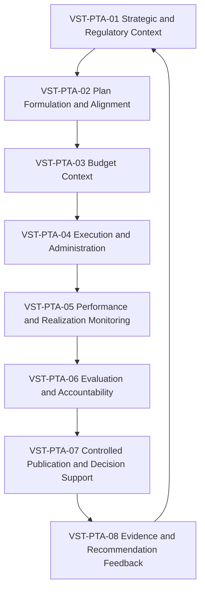
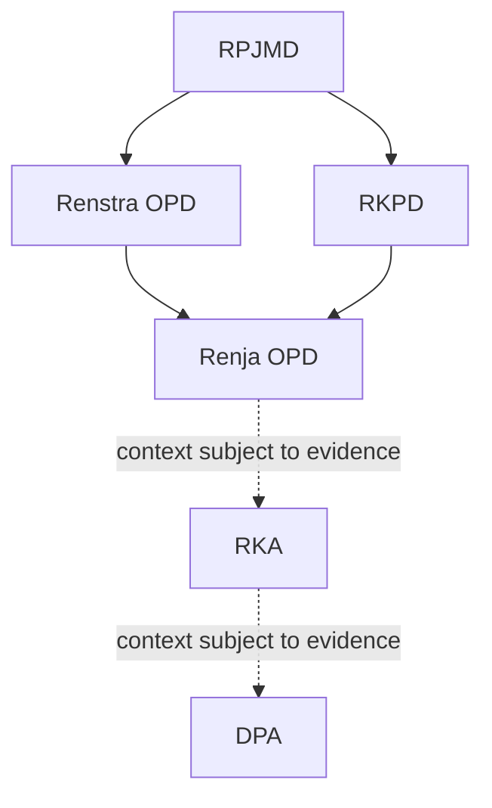

# 12 — Planning-to-Accountability Value Streams

## 1. Tujuan dan Kedudukan

Dokumen ini menetapkan `VS-PTA-001 — Planning-to-Accountability` sebagai value stream utama e-PeLARA Next Generation. Dokumen memodelkan pergerakan nilai secara konseptual dari arah strategis dan perencanaan menuju pelaksanaan, monitoring, evaluasi, akuntabilitas, dukungan keputusan, dan publikasi terkontrol.

Dokumen adalah dependency bagi BP-BUS-003 dan kontribusi evidence menuju G1 — Business and Regulatory Alignment. Dokumen bukan Government Document Lifecycle Blueprint, workflow approval, SOP, model aplikasi, atau penetapan kewenangan manusia.

## 2. Ruang Lingkup

Ruang lingkup meliputi satu value stream, delapan stage, value item, evidence status, capability participation, dependency konseptual dokumen pemerintahan, dan interface lintas-domain. Di luar scope: lifecycle state, transition rule, version transition, approval sequence, retention rule, RACI, penetapan owner, dan status implementasi.

## 3. Sumber Otoritatif dan Dependency

| Sumber | Peran |
| --- | --- |
| [Business Architecture Overview](10-Business-Architecture-Overview.md) | Parent/context, outcome, dependency konseptual, dan arah bisnis. |
| [Business Capability Map](11-Business-Capability-Map.md) | Dependency resmi; capability Level 0 dan Level 1 yang berpartisipasi. |
| [Master Roadmap](../11-roadmaps/02-Enterprise-Architecture-Roadmap.md) | Seq 12, dependency Capability Map, Gate G1, serta boundary Seq 13–14. |
| [Official Current State Baseline](../01-current-state/) | Current evidence terbatas untuk konteks perencanaan hingga pelaporan. |
| [Architecture Charter](../00-governance/00-Architecture-Charter.md) | Prinsip One Data, Many Publications dan human authority. |
| [Issue, Risk, dan Compliance Register](../00-governance/) | Referensi resmi gap, risiko, requirement, control, dan evidence. |
| [Governance, Gate, dan Traceability Standards](../00-governance/) | Standing delegation, G1 evidence, dan relasi traceability. |
| [Enterprise Change Log](../00-governance/06-Change-Log.md) | Konfirmasi BP-BUS-001 Approved dan ECHG-019. |

## 4. Prinsip Value Stream

1. Value stream menjelaskan bagaimana value bergerak secara konseptual; bukan urutan kerja operasional atau sequence hukum final.
2. Stage harus organization-agnostic, application-agnostic, dan technology-agnostic.
3. Capability menjelaskan kemampuan stabil yang berpartisipasi; capability bukan stage, modul, menu, role, atau proyek.
4. One Data, Many Publications menjaga satu data resmi, lineage, versi, status, dan substansi lintas publikasi tanpa input ulang.
5. Analytics dan rekomendasi mendukung keputusan manusia, tidak menggantikan kewenangan manusia.
6. `Documented Current`, `Target`, dan `Evidence Pending` dipisahkan tanpa maturity score, rating, atau klaim verifikasi.

## 5. Istilah dan Definisi

| Istilah | Definisi/batas |
| --- | --- |
| Value stream | Rangkaian stage konseptual yang bersama-sama membentuk dan menyampaikan value. |
| Stage | Bagian stabil dari value stream; bukan langkah SOP atau status lifecycle. |
| Value item | Konteks, evidence, insight, atau publikasi yang membawa value antarstage. |
| Participating capability | Capability BP-BUS-001 yang berkontribusi pada stage; relasi lokal/candidate, bukan relasi kanonis EA-009 baru. |
| Current evidence | Fakta atau assessment yang didokumentasikan sumber resmi. |
| Target direction | Arah arsitektur tanpa klaim implementasi. |
| Evidence Pending | Bukti existence, scope, ownership, readiness, atau verification belum memadai. |

## 6. Value Stream Metamodel

`VS-PTA-001` terdiri dari delapan stage `VST-PTA-01` sampai `VST-PTA-08`. Setiap stage menerima entry context, membentuk value secara konseptual, dan menghasilkan exit/value item bagi stage atau penggunaan berikutnya. Stage `DEPENDS_ON` stage/capability yang relevan dan berkontribusi (`REALIZES`) pada outcome business sesuai arah relasi yang sah.

Capability `PARTICIPATES_IN` stage adalah relasi lokal/candidate untuk dokumen ini. Relasi tersebut tidak mengubah vocabulary kanonis EA-009, status capability, atau Traceability Matrix.

## 7. Identifier Standard

| Objek | Identifier | Aturan |
| --- | --- | --- |
| Value stream utama | `VS-PTA-001` | Identifier arsitektur internal BP-BUS-002; bukan kode regulasi, proses, aplikasi, atau keputusan hukum. |
| Stage | `VST-PTA-01` sampai `VST-PTA-08` | Unik, stabil, dan hanya menunjuk stage value stream ini. |

## 8. Planning-to-Accountability Value Proposition

**Value proposition:** Data, keputusan, pelaksanaan, evidence, evaluasi, dan publikasi pemerintahan dapat ditelusuri secara konsisten dari konteks perencanaan sampai akuntabilitas tanpa input ulang dan tanpa menggantikan kewenangan manusia.

Value recipient dinyatakan sebagai kategori: pemegang kewenangan pemerintahan, fungsi perencanaan, fungsi penganggaran, unit pelaksana, fungsi monitoring dan evaluasi, penerima laporan, penerima publikasi, dan decision maker manusia.

## 9. Value Stream Overview

Diagram menunjukkan pergerakan value konseptual dan feedback, bukan workflow approval, sequence hukum final, lifecycle status, atau penetapan authority.

## 10. Stage Definitions

| Stage | Tujuan/value contribution | Value recipient | Entry context | Value-producing transformation | Exit/value item | Participating capability | Current evidence; target direction | Status | Register reference | Constraints/boundary |
| --- | --- | --- | --- | --- | --- | --- | --- | --- | --- | --- |
| VST-PTA-01 — Establish Strategic and Regulatory Context | Membentuk konteks arah, prinsip, requirement, dan batas kewenangan. | Pemegang kewenangan; fungsi perencanaan. | Arah Charter, kebutuhan bisnis, requirement tercatat. | Menyatukan konteks strategis/regulatif yang dapat ditelusuri tanpa determination baru. | Konteks arah dan requirement. | CAP-GOV-01, CAP-GOV-02, CAP-CMP-01, CAP-CMP-03. | Charter, ARCH-BUS-001, Compliance Register; target regulatory traceability. | Documented Current | AIR-010; ARISK-007; COMP-006. | Bukan legal determination atau approval. |
| VST-PTA-02 — Formulate and Align Plans | Membentuk konteks rencana yang saling terkait. | Fungsi perencanaan; pemegang kewenangan. | Konteks RPJMD, Renstra OPD, RKPD, Renja OPD. | Menjaga alignment dan lineage konteks perencanaan. | Konteks rencana yang selaras. | CAP-PLN-01, CAP-PLN-02, CAP-PLN-03, CAP-DKM-03. | Baseline modul/alur logika; target traceability lintas dokumen. | Documented Current | AIR-001; ARISK-001; COMP-001. | Bukan penetapan periode atau SOP penyusunan. |
| VST-PTA-03 — Formulate and Authorize Budget Context | Membentuk konteks anggaran yang terhubung dengan rencana. | Fungsi penganggaran; pemegang kewenangan. | Konteks Renja serta RKA/DPA yang terdokumentasi. | Menghubungkan konteks rencana dengan konteks anggaran tanpa menetapkan approval. | Konteks anggaran yang traceable. | CAP-BDG-01, CAP-BDG-02, CAP-BDG-03, CAP-CMP-01. | Baseline modul/alur logika; target regulatory fidelity. | Documented Current | COMP-002. | RKA/DPA bukan sequence hukum atau authority. |
| VST-PTA-04 — Execute and Administer Activities | Membentuk evidence konteks pelaksanaan dan penatausahaan. | Unit pelaksana; fungsi pengendalian. | Konteks anggaran dan kegiatan. | Menghubungkan pelaksanaan, penatausahaan, dan pengendalian sebagai pembentuk evidence. | Konteks pelaksanaan dan administrasi. | CAP-EXE-01, CAP-EXE-02, CAP-EXE-03, CAP-DKM-01. | Baseline modul pelaksanaan/penatausahaan; target control context yang jelas. | Documented Current | AIR-004; ARISK-002; COMP-002. | Status workflow dan authority tetap Evidence Pending. |
| VST-PTA-05 — Monitor Performance and Realization | Membentuk insight monitoring atas indikator dan realisasi. | Fungsi monitoring/evaluasi; pemegang kewenangan. | Konteks pelaksanaan, indikator, dan realisasi. | Mengaitkan monitoring indikator/realisasi dengan pengendalian berbasis evidence. | Konteks monitoring dan insight. | CAP-PRF-01, CAP-PRF-02, CAP-PRF-03, CAP-ADS-01. | Baseline monitoring/dashboard; target insight traceable. | Documented Current | AIR-002; COMP-005. | Status dashboard tidak disimpulkan. |
| VST-PTA-06 — Evaluate Results and Accountability | Membentuk evaluasi dan konteks akuntabilitas. | Fungsi evaluasi; penerima laporan. | Konteks monitoring, evidence kinerja, dan realisasi. | Menghubungkan evaluasi dengan pelaporan akuntabilitas secara konseptual. | Evaluasi dan konteks laporan akuntabilitas. | CAP-EVR-01, CAP-EVR-02, CAP-PRF-03, CAP-DKM-03. | Baseline evaluasi/laporan; target source-to-output consistency. | Documented Current | COMP-005. | Bukan metode evaluasi, acceptance, atau authority laporan. |
| VST-PTA-07 — Produce Controlled Publications and Decision Support | Membentuk publikasi terkontrol dan dukungan keputusan dari sumber yang dapat ditelusuri. | Penerima publikasi; decision maker manusia. | Evaluasi, laporan, data/knowledge resmi, dan insight. | Mengubah konteks/evidence menjadi publikasi dan rekomendasi tanpa mengubah substansi atau authority. | Publikasi terkontrol dan recommendation context. | CAP-PUB-01, CAP-PUB-02, CAP-PUB-03, CAP-ADS-02, CAP-ADS-03. | Charter One Data, Many Publications; baseline rekomendasi AI; target controlled publication. | Target | COMP-010; COMP-011. | Klasifikasi publikasi, verification, dan authority belum ditetapkan. |
| VST-PTA-08 — Feed Evidence and Recommendations into Subsequent Direction | Mengembalikan evidence dan rekomendasi sebagai input arah berikutnya. | Pemegang kewenangan; fungsi perencanaan; decision maker manusia. | Evaluasi, publikasi, insight, dan recommendation context. | Menjaga feedback evidence-to-direction yang dapat ditelusuri dan berada dalam human oversight. | Evidence dan recommendation context untuk arah berikutnya. | CAP-GOV-03, CAP-EVR-03, CAP-DKM-03, CAP-ADS-03. | Charter/Traceability Standard; target evidence-based governance. | Target | AIR-010; ARISK-007; COMP-006. | Bukan keputusan otomatis, policy change, atau authority baru. |

## 11. Strategic and Regulatory Context Stage

`VST-PTA-01` menempatkan arah strategis, prinsip, requirement, dan batas governance sebagai konteks awal value stream. Stage ini tidak menetapkan applicability hukum, control acceptance, atau decision authority; aspek tersebut tetap membutuhkan authority sah.

## 12. Plan Formulation and Alignment Stage

`VST-PTA-02` menggunakan konteks perencanaan yang terdokumentasi untuk membentuk alignment lintas dokumen. Hubungan RPJMD, Renstra OPD, RKPD, dan Renja OPD bersifat konseptual dan tidak diperlakukan sebagai workflow atau lifecycle state.

## 13. Budget Context Stage

`VST-PTA-03` menghubungkan value perencanaan dengan konteks RKA dan DPA. Stage tidak menyatakan urutan hukum, approval, atau pemegang otoritas anggaran; semua hubungan dibaca bersama evidence dan ketentuan yang berlaku.

## 14. Execution and Administration Stage

`VST-PTA-04` memanfaatkan konteks pelaksanaan, penatausahaan, dan pengendalian yang tercatat dalam baseline. Status workflow approval belum konsisten dalam evidence dan tetap dirujuk ke AIR-004/ARISK-002.

## 15. Performance and Realization Monitoring Stage

`VST-PTA-05` menghubungkan monitoring indikator/realisasi dengan insight pengendalian. Baseline mendokumentasikan monitoring dan dashboard, namun status dashboard tidak disimpulkan karena AIR-002 tetap terbuka.

## 16. Evaluation and Accountability Stage

`VST-PTA-06` menghubungkan evaluasi dengan konteks laporan akuntabilitas. Stage tidak menetapkan metode evaluasi, kriteria penerimaan, atau authority atas laporan.

## 17. Controlled Publication and Decision Support Stage

`VST-PTA-07` menerapkan arah One Data, Many Publications: satu data resmi dapat menjadi banyak publikasi terkontrol tanpa input ulang atau perbedaan substansi. Insight dan rekomendasi hanya mendukung decision maker manusia; publikasi dan rekomendasi tidak menggantikan kewenangan manusia.

## 18. Evidence and Recommendation Feedback Stage

`VST-PTA-08` menjadikan evidence, evaluation, publikasi, dan recommendation context sebagai input konseptual bagi arah berikutnya. Stage ini adalah feedback value, bukan loop approval atau penetapan kebijakan otomatis.

## 19. Stage-to-Capability Mapping

| Stage | Participating capability Level 0 | Participating capability Level 1 |
| --- | --- | --- |
| VST-PTA-01 | CAP-GOV, CAP-CMP | CAP-GOV-01, CAP-GOV-02, CAP-CMP-01, CAP-CMP-03 |
| VST-PTA-02 | CAP-PLN, CAP-DKM | CAP-PLN-01, CAP-PLN-02, CAP-PLN-03, CAP-DKM-03 |
| VST-PTA-03 | CAP-BDG, CAP-CMP | CAP-BDG-01, CAP-BDG-02, CAP-BDG-03, CAP-CMP-01 |
| VST-PTA-04 | CAP-EXE, CAP-DKM | CAP-EXE-01, CAP-EXE-02, CAP-EXE-03, CAP-DKM-01 |
| VST-PTA-05 | CAP-PRF, CAP-ADS | CAP-PRF-01, CAP-PRF-02, CAP-PRF-03, CAP-ADS-01 |
| VST-PTA-06 | CAP-EVR, CAP-PRF, CAP-DKM | CAP-EVR-01, CAP-EVR-02, CAP-PRF-03, CAP-DKM-03 |
| VST-PTA-07 | CAP-PUB, CAP-ADS | CAP-PUB-01, CAP-PUB-02, CAP-PUB-03, CAP-ADS-02, CAP-ADS-03 |
| VST-PTA-08 | CAP-GOV, CAP-EVR, CAP-DKM, CAP-ADS | CAP-GOV-03, CAP-EVR-03, CAP-DKM-03, CAP-ADS-03 |

Pemetaan bersifat many-to-many. Tidak ada capability baru, Level 2, perubahan nama, perubahan evidence status, atau klaim bahwa capability direalisasikan oleh aplikasi tertentu.

## 20. Conceptual Government Document Dependencies

RPJMD memberi konteks bagi Renstra OPD dan RKPD. Renstra OPD serta RKPD memberi konteks bagi Renja OPD. Hubungan berikutnya menuju RKA dan DPA dibaca bersama evidence, kewenangan, dan ketentuan yang berlaku. Diagram bukan workflow approval, sequence hukum final, lifecycle status, atau penetapan authority.

## 21. Value, Evidence, dan Information Movement

| Dari | Value/evidence movement | Ke | Batas |
| --- | --- | --- | --- |
| Context strategis/regulatif | Arah, prinsip, requirement, dan boundary. | Plan formulation. | Tidak menetapkan legal applicability. |
| Plan formulation | Konteks rencana dan alignment. | Budget context. | Tidak menetapkan approval anggaran. |
| Budget context | Konteks anggaran yang dapat ditelusuri. | Execution/administration. | Tidak menetapkan sequence RKA/DPA. |
| Execution/administration | Konteks pelaksanaan, administrasi, indikator, dan realisasi. | Monitoring/evaluation. | Workflow status tetap Evidence Pending. |
| Evaluation/accountability | Evidence, laporan, dan insight. | Publication/decision support. | Tidak menyatakan verification atau acceptance. |
| Publication/decision support | Publikasi terkontrol dan recommendation context. | Subsequent direction. | Human oversight tetap wajib. |

## 22. Current Evidence dan Target Direction

| Status | Penggunaan dalam value stream |
| --- | --- |
| Documented Current | Baseline mendukung keterkaitan konteks perencanaan, anggaran, pelaksanaan, monitoring, evaluasi, dan laporan; tidak berarti end-to-end atau implemented. |
| Target | Charter/overview menetapkan arah traceability, authoritative data, publikasi multi-format, dan decision support dengan human oversight. |
| Evidence Pending | Workflow approval, owner/authority, legal applicability, verification, integrasi eksternal, dan readiness Gate belum cukup dibuktikan. |

## 23. Value Stream Gap View

View ini bukan register baru dan tidak mengubah AIR, ARISK, atau COMP. Follow-up direction tidak menetapkan ID, nama, urutan, dependency, atau Gate artefak baru; seluruh tindak lanjut mengikuti Master Roadmap dan governance classification yang berlaku.

| Stage | Current evidence | Target direction | Gap statement | Register reference | Evidence status | Follow-up direction |
| --- | --- | --- | --- | --- | --- |
| VST-PTA-02 | Siklus Renstra 5/6 tahun kontradiktif. | Alignment perencanaan temporal yang traceable. | Aturan periode belum selaras. | AIR-001; ARISK-001; COMP-001 | Evidence Pending | Tindak lanjut melalui register resmi dan artefak resmi sesuai dependency Master Roadmap. |
| VST-PTA-04 | Status workflow approval belum konsisten. | Pelaksanaan/control context dengan batas kewenangan jelas. | State dan kewenangan belum dibuktikan konsisten. | AIR-004; ARISK-002 | Evidence Pending | Tindak lanjut melalui register resmi dan artefak resmi yang relevan. |
| VST-PTA-05 | Status dashboard tidak konsisten. | Monitoring berbasis evidence yang dapat diperiksa. | Readiness dashboard tidak dapat disimpulkan. | AIR-002 | Evidence Pending | Klarifikasi evidence baseline dan tindak lanjut melalui AIR-002 serta artefak resmi yang relevan. |
| VST-PTA-07 | Klasifikasi/authority publikasi belum ditetapkan. | Publikasi terkontrol dari sumber resmi. | Control/evidence publikasi belum memadai. | COMP-010; COMP-011 | Evidence Pending | Tindak lanjut melalui register resmi dan artefak resmi sesuai dependency Master Roadmap. |
| VST-PTA-08 | Metadata/evidence lintas artefak perlu konsisten. | Feedback evidence-to-direction yang traceable. | Evidence governance belum lengkap. | AIR-010; ARISK-007; COMP-006 | Evidence Pending | Tindak lanjut melalui register resmi dan rekaman review resmi yang relevan. |

## 24. Cross-Stage Constraints

1. Satu stage tidak membuktikan outcome tercapai, compliance, atau readiness Gate.
2. Data/knowledge harus dibaca sebagai enabling capability lintas-stage, bukan duplikasi data per publikasi.
3. Compliance/control adalah guard lintas-stage, bukan stage approval.
4. Informasi publikasi harus mempertahankan sumber, versi, status, dan substansi; detail klasifikasi tetap Evidence Pending.
5. AI, analytics, dan rekomendasi tidak memiliki authority institusional.

## 25. Interface ke BP-BUS-003

BP-BUS-003 dapat diturunkan dari value stream ini untuk menelaah: stage, value item, business document context, entry/exit context, dependency konseptual, evidence status, dan lifecycle questions yang masih Evidence Pending. Dokumen ini tidak membuat lifecycle state, transition rule, version transition, approval workflow, retention rule, document authority, atau Government Document Lifecycle Blueprint.

## 26. Boundary terhadap BP-BUS-004

Dokumen ini tidak menetapkan RACI, business owner, process owner, approver, verifier, pejabat, unit organisasi, delegation baru, decision rights baru, atau approval sequence. Bila penetapan owner/authority diperlukan pada artefak berikutnya, statusnya adalah `To be assigned by Project Owner` sampai ditetapkan oleh authority sah.

## 27. Hubungan dengan Domain Arsitektur Lain

| Domain | Interface |
| --- | --- |
| Data dan Knowledge Architecture | Menyediakan authoritative data, reference, lineage, quality, dan knowledge provenance sebagai enabling capability. |
| Application dan Integration Architecture | Aplikasi/modul/integrasi dapat merealisasikan capability setelah keputusan/kontrak sah; bukan capability atau stage. |
| Security dan Privacy Architecture | Menyediakan control keamanan, akses, audit, dan evidence sesuai scope berwenang. |
| Government Intelligence Platform | Mendukung insight/rekomendasi yang traceable dalam human oversight. |
| Government Digital Publishing Platform | Membentuk publikasi multi-format dari sumber resmi bersama. |

## 28. Traceability

| Source | Relasi | Target | Kedudukan relasi | Evidence status | Verification status |
| --- | --- | --- | --- | --- | --- |
| VS-PTA-001 | DERIVED_FROM | BP-BUS-001 dan ARCH-BUS-001 | Draft candidate relationship | Documented Current | Evidence Pending |
| VST-PTA-01–08 | DEPENDS_ON | Stage/capability terkait pada §10 dan §19 | Draft candidate relationship | Evidence Pending | Evidence Pending |
| VST-PTA-01–08 | REALIZES | Outcome Business Architecture Overview secara kontribusi | Draft candidate relationship | Target | Evidence Pending |
| Participating capability | PARTICIPATES_IN | VS-PTA-001/stage terkait | Draft local/candidate relationship; bukan vocabulary kanonis baru EA-009 | Evidence Pending | Evidence Pending |
| Future document lifecycle blueprint | DERIVED_FROM | BP-BUS-002 | Draft future-direction relationship; objek belum dibuat | Target | Evidence Pending |

Lifecycle/kedudukan relasi dipisahkan dari evidence status dan verification status. Tidak ada status `Verified` tanpa evidence serta verifier sah. Tabel ini bukan Canonical Traceability Matrix; pencatatan candidate relationship tidak mengubah status source, target, capability, register, atau Gate.

## 29. G1 Evidence dan Readiness

| Aspek G1 | Kontribusi BP-BUS-002 | Status |
| --- | --- | --- |
| Value streams | VS-PTA-001 dan delapan stage dengan capability/evidence mapping. | Approved — document status only |
| Lifecycle | Interface konseptual untuk BP-BUS-003. | Belum dimulai |
| Roles/approval | Boundary terhadap BP-BUS-004. | Belum dimulai |
| Regulatory traceability | Referensi register dan gap view tanpa determination baru. | Evidence Pending |

Approval dokumen bukan Gate disposition. BP-BUS-002 hanya berkontribusi pada evidence G1; G1 tetap tanpa disposition. Approval BP-BUS-001 tidak otomatis membuat BP-BUS-002 atau G1 Approved. Value stream, stage, capability, dan candidate relationship tidak diklaim implemented atau Verified, dan BP-BUS-003 serta BP-BUS-004 belum dimulai.

## 30. Assumptions, Constraints, dan Evidence Pending

1. Baseline resmi digunakan tanpa audit ulang repository, source code, database, atau implementasi.
2. Kontradiksi Renstra, workflow approval, dashboard, integrasi, ownership, legal applicability, dan verification tetap dirujuk ke register resmi.
3. Tidak ada maturity score, heatmap, persentase readiness, SLA, rating, threshold, target angka, atau status Verified.
4. Stage dan capability adalah model arsitektur konseptual; bukan klaim implementasi end-to-end.

## 31. Batas Kewenangan AI

ChatGPT Work menyusun dokumen berdasarkan sumber yang diizinkan. AI tidak menetapkan fakta institusional/hukum, owner atau authority manusia, legal applicability, compliance, risk acceptance, exception, Gate disposition, verification, atau closure.

## 32. Persetujuan

| Peran | Nama | Keputusan | Status proses | Tanggal |
| --- | --- | --- | --- | --- |
| Penyusun Dokumen/File Operator | ChatGPT Work | Disusun | Selesai | 2026-08-04 |
| Chief Enterprise Architect | ChatGPT | Direview, ditetapkan final, dan disahkan berdasarkan standing delegation | Selesai | 2026-08-04 |
| Delegation authority | Project Owner — Fahmi Alhabsi | Standing delegation melalui EA-007 Version 1.1.0 | Tercatat | 2026-08-04 |

## 33. Change Log Dokumen

| Versi | Tanggal | Perubahan | Penyusun | Status |
| --- | --- | --- | --- | --- |
| 1.0.0 | 2026-08-04 | Penyusunan awal Planning-to-Accountability Value Streams | ChatGPT Work | Draft for Approval |
| 1.0.0 | 2026-08-04 | Review CEA: Revisions Required; tabel traceability wajib memisahkan kedudukan relasi, evidence status, dan verification status sesuai EA-009 | ChatGPT | Revisions Required |
| 1.0.0 | 2026-08-04 | Review final PASSED; ditetapkan Approved sebagai Official Planning-to-Accountability Value Streams berdasarkan standing delegation EA-007 Version 1.1.0; approval dokumen tidak menetapkan disposition G1 | ChatGPT | Approved |

**End of Document — 12-Planning-to-Accountability-Value-Streams.md**
