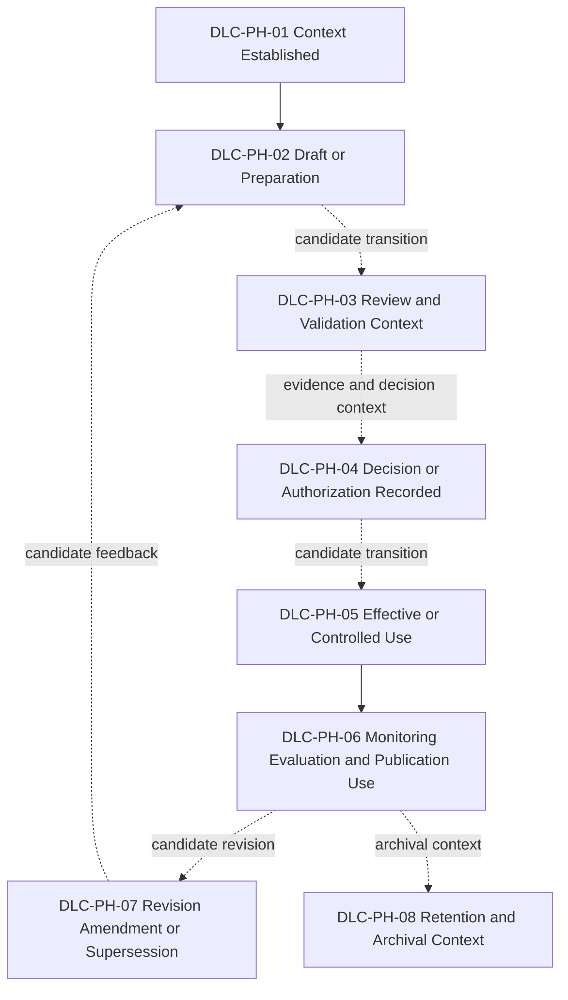
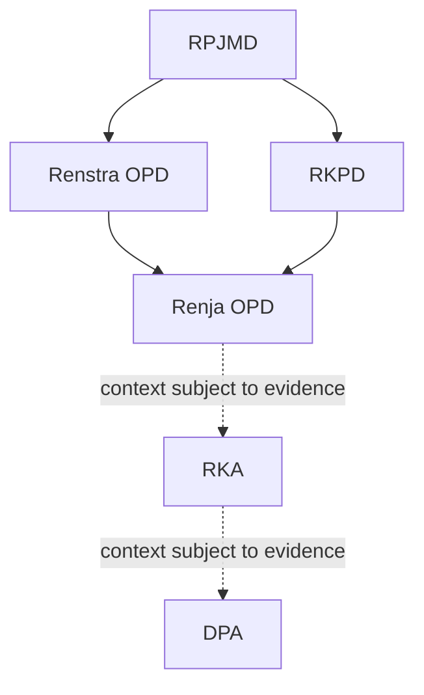

# 13 — Government Document Lifecycle Blueprint

## 1. Tujuan dan Kedudukan

Dokumen ini menetapkan `DLC-GOV-001` sebagai blueprint konseptual lifecycle dokumen pemerintahan e-PeLARA Next Generation. Blueprint menghubungkan business document context dengan stage `VS-PTA-001`, menjaga traceability antardokumen, dan menyediakan decision-point interface bagi BP-BUS-004.

Dokumen bukan workflow operasional, SOP, penetapan authority, aturan retensi, atau status implementasi lifecycle. BP-BUS-003 hanya berkontribusi pada evidence G1.

## 2. Ruang Lingkup

Ruang lingkup meliputi klasifikasi document family, delapan lifecycle phase, candidate transition, status separation, version/supersession, publication, retention/archival context, dan evidence/gap view. Di luar scope: approval sequence, RACI, pejabat, unit organisasi, legal applicability, retention period, disposal rule, dan implementasi aplikasi.

## 3. Sumber Otoritatif dan Dependency

| Sumber | Peran |
| --- | --- |
| [Business Architecture Overview](10-Business-Architecture-Overview.md) | Parent/context, outcome, document dependency, dan One Data, Many Publications. |
| [Business Capability Map](11-Business-Capability-Map.md) | Capability context untuk lifecycle. |
| [Planning-to-Accountability Value Streams](12-Planning-to-Accountability-Value-Streams.md) | Dependency resmi; stage dan value item context. |
| [Master Roadmap](../11-roadmaps/02-Enterprise-Architecture-Roadmap.md) | Seq 13, dependency Value Streams, Gate G1, dan boundary Seq 14. |
| [Official Current State Baseline](../01-current-state/) | Evidence terbatas jenis/keterkaitan dokumen, modul, laporan, dan publikasi. |
| [Governance dan Register Resmi](../00-governance/) | Prinsip, decision boundary, gap, risk, compliance, G1, dan traceability. |

## 4. Prinsip Government Document Lifecycle

1. Lifecycle state, workflow/task status, review, approval, version, publication, evidence, verification, dan Gate adalah objek status yang berbeda.
2. Approval dokumen tidak otomatis published, effective, verified, compliant, archived, atau Gate Approved.
3. Published tidak otomatis Approved/effective; Verified tidak otomatis Approved/compliant/Gate Approved.
4. Superseded tidak sama dengan deleted; archived tidak berarti boleh dimusnahkan.
5. Retention dan disposal tetap `Evidence Pending` sampai sumber hukum dan authority sah tersedia.
6. Phase dan transition adalah candidate architecture relationship, bukan transition otomatis atau keputusan hukum.
7. AI tidak menjalankan approval atau transition berwenang.

## 5. Istilah dan Definisi

| Istilah | Definisi/batas |
| --- | --- |
| Business document context | Konteks dokumen/rekam pemerintahan yang didukung sumber; bukan selalu dokumen hukum resmi. |
| Lifecycle phase | Posisi konseptual dokumen/business document instance; bukan workflow task atau approval disposition. |
| Candidate transition | Hubungan perubahan phase yang bersyarat pada evidence dan keputusan sah. |
| Publication instance | Output penyajian dari sumber resmi; bukan otomatis authoritative source. |
| Supersession | Penggantian versi/kedudukan dengan histori dan lineage yang dipertahankan. |
| Archival context | Konteks pengelolaan arsip; tidak menetapkan retensi atau pemusnahan. |

## 6. Lifecycle Metamodel

`DLC-GOV-001` terdiri atas document family, lifecycle phase, candidate transition, status dimensions, evidence, publication instance, dan decision-point interface. Document family dapat `APPLIES` lifecycle phase dan candidate transition dapat `CONNECTS` phase sebagai relasi lokal/candidate; tidak semua family wajib melewati semua phase.

## 7. Identifier Standard

| Objek | Identifier | Aturan |
| --- | --- | --- |
| Lifecycle blueprint | `DLC-GOV-001` | Identifier arsitektur internal; bukan kode regulasi atau keputusan hukum. |
| Lifecycle phase | `DLC-PH-01` sampai `DLC-PH-08` | Unik dan menunjuk phase konseptual. |
| Candidate transition | `DLC-TR-01` dan seterusnya | Unik; tidak menyatakan automation atau authority. |

## 8. Document Family Classification

| Document family | Konteks yang didukung sumber | Batas |
| --- | --- | --- |
| Strategic and Medium-Term Planning Documents | RPJMD; Renstra OPD. | Siklus/periodisasi tidak diselaraskan di sini. |
| Annual Planning Documents | RKPD; Renja OPD. | Dependency konseptual, bukan workflow. |
| Budgeting Documents | RKA; DPA. | Tidak menetapkan approval/sequence hukum. |
| Execution and Realization Records | Pelaksanaan, penatausahaan, pengendalian kegiatan, realisasi. | Tidak menciptakan dokumen resmi baru. |
| Performance, Evaluation, and Accountability Documents | Indikator, realisasi, monitoring/evaluasi, laporan akuntabilitas. | Nama laporan spesifik mengikuti evidence sumber. |
| Controlled Publication Outputs | PDF, Word, Excel, dashboard, executive report, annual report, infografis, presentasi, website, media sosial, Government Open Data, AI Insight. | Output/publication context, bukan otomatis dokumen hukum resmi. |

## 9. Generic Government Document Lifecycle

Diagram menunjukkan phase dan candidate relationship konseptual; panah bukan transition otomatis, workflow approval, sequence hukum final, atau penetapan authority.

## 10. Lifecycle Phase Definitions

| ID | Phase | Makna konseptual | Evidence status | Batas |
| --- | --- | --- | --- | --- |
| DLC-PH-01 | Context Established | Konteks kebutuhan, sumber, dan hubungan dokumen tersedia. | Documented Current | Bukan authority atau legal applicability. |
| DLC-PH-02 | Draft or Preparation | Dokumen/rekam berada pada konteks persiapan. | Target | Bukan task workflow atau status aplikasi. |
| DLC-PH-03 | Review and Validation Context | Ada kebutuhan review/validasi context. | Evidence Pending | Bukan review outcome atau verifier. |
| DLC-PH-04 | Decision or Authorization Recorded | Ada decision context yang tercatat. | Evidence Pending | Tidak menetapkan siapa/apa keputusan. |
| DLC-PH-05 | Effective or Controlled Use | Dokumen/rekam digunakan secara terkendali jika evidence/decision sah tersedia. | Target | Tidak berlaku otomatis setelah approval. |
| DLC-PH-06 | Monitoring, Evaluation, and Publication Use | Konteks penggunaan untuk monitoring, evaluasi, pelaporan, atau publikasi. | Documented Current | Publication bukan otomatis authoritative source. |
| DLC-PH-07 | Revision, Amendment, or Supersession | Konteks perubahan/penggantian yang menjaga lineage. | Target | Superseded bukan deleted. |
| DLC-PH-08 | Retention and Archival Context | Konteks penyimpanan/arsip setelah penggunaan. | Evidence Pending | Tidak menetapkan retensi/disposal. |

## 11. Context Established

`DLC-PH-01` menghubungkan document family dengan kebutuhan bisnis, sumber, dan dependency konseptual. RPJMD, Renstra OPD, RKPD, Renja OPD, RKA, dan DPA diperlakukan sebagai context yang ditelusuri, bukan state yang otomatis berubah.

## 12. Draft or Preparation

`DLC-PH-02` adalah phase kandidat persiapan. Phase ini tidak menyatakan bahwa semua document family memiliki konsep draft yang sama atau bahwa workflow implementasi tersedia.

## 13. Review and Validation Context

`DLC-PH-03` membedakan kebutuhan review/validation context dari review outcome. Outcome, verifier, dan evidence yang belum ada tetap `Evidence Pending`.

## 14. Decision or Authorization Recorded

`DLC-PH-04` hanya merekam adanya decision/authorization context. Decision/authority dependency adalah `To be assigned by Project Owner through BP-BUS-004`; phase tidak menetapkan approver atau disposition.

## 15. Effective or Controlled Use

`DLC-PH-05` menyatakan penggunaan yang terkendali hanya bila evidence dan keputusan sah tersedia. Approval tidak menjadikan dokumen efektif secara otomatis.

## 16. Monitoring, Evaluation, and Publication Use

`DLC-PH-06` menghubungkan document context dengan realisasi, monitoring, evaluasi, laporan akuntabilitas, dan publication use yang didukung baseline. Publication status tetap berbeda dari status dokumen.

## 17. Revision, Amendment, or Supersession

`DLC-PH-07` menjaga kebutuhan perubahan dan supersession secara konseptual. Riwayat, source, version, dan lineage harus dipertahankan; detail rule/version transition belum ditetapkan.

## 18. Retention and Archival Context

`DLC-PH-08` memisahkan archival context dari deletion atau disposal. Retention period, archival authority, dan disposal rule tetap `Evidence Pending`.

## 19. Candidate Transition Model

| Transition ID | Source phase | Target phase | Conceptual trigger | Required evidence | Decision/authority dependency | Output/status effect | Exception/rollback consideration | Evidence status | Verification status | Constraints |
| --- | --- | --- | --- | --- | --- | --- | --- | --- | --- | --- |
| DLC-TR-01 | DLC-PH-01 | DLC-PH-02 | Konteks dokumen siap dipersiapkan. | Source/context dan kebutuhan terdokumentasi. | To be assigned by Project Owner through BP-BUS-004. | Preparation context tersedia. | Context dapat perlu diklarifikasi. | Evidence Pending | Evidence Pending | Bukan transition otomatis. |
| DLC-TR-02 | DLC-PH-02 | DLC-PH-03 | Candidate review/validation diperlukan. | Draft/preparation context yang dapat ditelusuri. | To be assigned by Project Owner through BP-BUS-004. | Review context tersedia. | Rework dapat kembali ke preparation context. | Evidence Pending | Evidence Pending | Bukan review outcome. |
| DLC-TR-03 | DLC-PH-03 | DLC-PH-04 | Decision context direkam setelah evidence terkait tersedia. | Evidence review/validation sesuai scope. | To be assigned by Project Owner through BP-BUS-004. | Decision/authorization context tercatat. | Finding dapat meminta revisi atau eskalasi. | Evidence Pending | Evidence Pending | Tidak menetapkan disposition. |
| DLC-TR-04 | DLC-PH-04 | DLC-PH-05 | Controlled use bergantung evidence/decision sah. | Decision record dan evidence penggunaan yang relevan. | To be assigned by Project Owner through BP-BUS-004. | Controlled-use context tersedia. | Decision dapat belum cukup untuk effective use. | Evidence Pending | Evidence Pending | Tidak berlaku otomatis. |
| DLC-TR-05 | DLC-PH-05 | DLC-PH-06 | Dokumen/rekam digunakan untuk monitoring, evaluasi, atau publication context. | Source, version, status, dan lineage yang tersedia. | To be assigned by Project Owner through BP-BUS-004. | Use/publication context tersedia. | Publication dapat ditarik tanpa menghapus source. | Target | Evidence Pending | Publication bukan approval. |
| DLC-TR-06 | DLC-PH-06 | DLC-PH-07 | Perubahan/amendment/supersession diperlukan. | Change context dan histori terkait. | To be assigned by Project Owner through BP-BUS-004. | Candidate revised/superseding context. | Histori/lineage harus dipertahankan. | Target | Evidence Pending | Superseded bukan deleted. |
| DLC-TR-07 | DLC-PH-06 | DLC-PH-08 | Archival context dipertimbangkan setelah penggunaan. | Policy/retention evidence yang sah. | To be assigned by Project Owner through BP-BUS-004. | Archival context candidate. | Withdrawal/disposal tidak diasumsikan. | Evidence Pending | Evidence Pending | Tidak menetapkan retensi. |
| DLC-TR-08 | DLC-PH-07 | DLC-PH-02 | Revision, amendment, atau supersession context membutuhkan preparation context baru yang tetap terhubung dengan histori sebelumnya. | Existing source/version, change context, histori, dan lineage yang dapat ditelusuri. | To be assigned by Project Owner through BP-BUS-004. | Candidate preparation context baru yang terhubung dengan source/version sebelumnya. | Source, versi sebelumnya, dan supersession history harus dipertahankan; cancellation atau rollback membutuhkan evidence dan keputusan sah. | Target | Evidence Pending | Bukan transition otomatis dan tidak menimpa atau menghapus histori sebelumnya. |

## 20. Status Separation Model

| Status dimension | Object yang dinilai | Contoh makna conceptual/candidate | Tidak boleh disamakan dengan |
| --- | --- | --- | --- |
| Document lifecycle state | Dokumen/business document instance | Posisi lifecycle konseptual. | workflow, approval, Gate |
| Workflow/task status | Aktivitas/tugas | Posisi pekerjaan operasional. | status dokumen |
| Review outcome | Hasil review | PASSED/REVISIONS REQUIRED/BLOCKED bila standard berlaku. | approval disposition |
| Decision/approval disposition | Keputusan authority | Keputusan yang dicatat oleh authority sah. | review outcome |
| Version status | Versi dokumen | current/superseded sesuai evidence. | approval atau publication |
| Publication status | Publication instance | prepared/published/withdrawn sesuai evidence. | approval dokumen |
| Evidence status | Evidence claim | Documented Current/Target/Evidence Pending. | verification |
| Verification status | Evidence/link/control | Status sesuai EA-009. | approval atau Gate |
| Gate disposition | Architecture Gate | Disposition G0–G6. | status dokumen bisnis |

Vocabulary pada contoh adalah conceptual/candidate kecuali sumber resmi menetapkannya; tabel tidak membuat vocabulary operasional final.

## 21. Document Family Lifecycle Applicability

| Document family | Business purpose | Related BP-BUS-002 stage | Upstream context | Downstream context | Applicable lifecycle phase | Authoritative source status | Versioning concern | Publication concern | Retention concern | Evidence status | Register reference | Boundary/constraint |
| --- | --- | --- | --- | --- | --- | --- | --- | --- | --- | --- | --- | --- |
| Strategic and Medium-Term Planning Documents | Konteks arah/perencanaan jangka menengah. | VST-PTA-01, VST-PTA-02 | RPJMD context. | Renstra OPD/RKPD/Renja context. | DLC-PH-01–07 candidate. | Documented Current untuk family/context. | Siklus Renstra kontradiktif. | Publication context Target. | Evidence Pending. | Evidence Pending | AIR-001; ARISK-001; COMP-001 | Tidak menyelaraskan periode atau status hukum. |
| Annual Planning Documents | Konteks rencana tahunan. | VST-PTA-02 | RPJMD, Renstra OPD, RKPD context. | Renja OPD/RKA context. | DLC-PH-01–07 candidate. | Documented Current untuk family/context. | Lineage/versi perlu evidence. | Publication context Target. | Evidence Pending. | Evidence Pending | COMP-001 | Bukan sequence hukum final. |
| Budgeting Documents | Konteks anggaran. | VST-PTA-03 | Renja context. | RKA, DPA, execution context. | DLC-PH-01–07 candidate. | Documented Current untuk RKA/DPA context. | Version/approval context Evidence Pending. | Publication context Target. | Evidence Pending. | Evidence Pending | COMP-002 | Tidak menetapkan authority/approval. |
| Execution and Realization Records | Konteks pelaksanaan, penatausahaan, pengendalian, realisasi. | VST-PTA-04, VST-PTA-05 | Budget context. | Monitoring/evaluation context. | DLC-PH-01, 05–08 candidate. | Documented Current untuk istilah baseline. | Status record belum seragam. | Publication context Target. | Evidence Pending. | Evidence Pending | AIR-004; ARISK-002 | Bukan workflow state model. |
| Performance, Evaluation, and Accountability Documents | Konteks indikator, evaluasi, dan laporan akuntabilitas. | VST-PTA-05, VST-PTA-06 | Realisasi/monitoring context. | Laporan/publication context. | DLC-PH-01, 05–08 candidate. | Documented Current. | Lineage dan acceptance perlu evidence. | Publication context Target. | Evidence Pending. | Evidence Pending | AIR-002; COMP-005 | Status dashboard tidak disimpulkan. |
| Controlled Publication Outputs | Penyajian dari sumber resmi bersama. | VST-PTA-07, VST-PTA-08 | Authoritative document/data context. | Penerima publikasi/feedback context. | DLC-PH-05–08 candidate. | Target; publication instance bukan source otomatis. | Source/version/lineage wajib dapat ditelusuri. | Target. | Evidence Pending. | Evidence Pending | COMP-009; COMP-010 | Classification/authority publikasi belum ditetapkan. |

## 22. Conceptual Government Document Dependencies

RPJMD memberi konteks bagi Renstra OPD dan RKPD. Renstra OPD serta RKPD memberi konteks bagi Renja OPD. Hubungan berikutnya menuju RKA dan DPA dibaca bersama evidence, kewenangan, dan ketentuan yang berlaku. Diagram bukan workflow approval, lifecycle transition final, atau sequence hukum final.

## 23. Version and Supersession Model

Version status dipisahkan dari lifecycle phase dan decision/approval disposition. Candidate supersession harus mempertahankan histori, source, version, dan lineage; `Superseded` tidak sama dengan deleted. Aturan penomoran, version transition, dan decision authority tetap `Evidence Pending`.

## 24. Publication Lifecycle Interface

Publication instance dapat dibentuk dari authoritative business document/data dalam controlled publication context. Prepared/published/withdrawn hanya contoh conceptual/candidate status publication dan tidak sama dengan approval/effective status dokumen. Withdrawal tidak otomatis menghapus authoritative source.

## 25. One Data, Many Publications

Authoritative business document/data adalah sumber publikasi; publication instance bukan otomatis authoritative source. PDF, Word, Excel, dashboard, website, media sosial, dan output lain dapat berasal dari sumber sama tanpa mengubah substansi. Source, version, status, lineage, publication date, dan authority context harus dapat ditelusuri. AI narrative/insight harus berasal dari data tervalidasi dan tidak boleh menetapkan angka atau status resmi.

## 26. Exception, Rollback, and Withdrawal Context

Exception, rollback, dan withdrawal diperlakukan sebagai context yang membutuhkan evidence, decision/authority dependency, dan audit trail. Tidak ada exception approval, risk acceptance, rollback rule, atau withdrawal authority yang ditetapkan oleh blueprint ini. Semua assignment tetap `To be assigned by Project Owner through BP-BUS-004`.

## 27. Lifecycle Evidence and Gap View

View ini bukan register baru dan tidak mengubah AIR, ARISK, COMP, exception, atau Gate. Follow-up direction tidak menetapkan ID, nama, urutan, dependency, atau Gate artefak baru; tindak lanjut mengikuti Master Roadmap dan governance classification yang berlaku.

| Lifecycle object | Current evidence | Target direction | Gap statement | Register reference | Evidence status | Verification status | Follow-up direction |
| --- | --- | --- | --- | --- | --- | --- | --- |
| Planning family context | Siklus Renstra 5/6 tahun kontradiktif. | Lifecycle context yang traceable. | Aturan periode belum selaras. | AIR-001; ARISK-001; COMP-001 | Evidence Pending | Evidence Pending | Tindak lanjut melalui register resmi dan artefak resmi sesuai dependency Master Roadmap. |
| Review/decision context | Workflow approval belum konsisten. | Decision/authority interface yang jelas. | State dan kewenangan belum dibuktikan konsisten. | AIR-004; ARISK-002 | Evidence Pending | Evidence Pending | Tindak lanjut melalui register resmi dan BP-BUS-004 sesuai dependency Master Roadmap. |
| Monitoring/publication context | Status dashboard tidak konsisten; publikasi membutuhkan control. | Penggunaan/publikasi yang traceable. | Evidence readiness dan classification belum memadai. | AIR-002; COMP-010 | Evidence Pending | Evidence Pending | Klarifikasi evidence baseline dan tindak lanjut melalui register resmi. |
| Evidence/traceability context | Metadata/evidence lintas artefak perlu konsisten. | Lifecycle evidence yang dapat diperiksa. | Evidence governance belum lengkap. | AIR-010; ARISK-007; COMP-006 | Evidence Pending | Evidence Pending | Tindak lanjut melalui register resmi dan rekaman review resmi yang relevan. |
| Retention/archival context | Tidak ada sumber legal/authority terverifikasi pada scope ini. | Retention/archival yang patuh dan traceable. | Retention/disposal rule belum dapat ditetapkan. | COMP-009 | Evidence Pending | Evidence Pending | Menunggu sumber hukum dan authority sah; tidak membuat rule baru. |

## 28. Interface ke BP-BUS-004

| Candidate decision point | Lifecycle phase | Decision context | Required evidence | Separation-of-duties question | Owner/authority question | Verification requirement | Exception/escalation question | Evidence status |
| --- | --- | --- | --- | --- | --- | --- | --- | --- |
| Use after review context | DLC-PH-03–05 | Candidate decision/authorization record. | Review/validation evidence sesuai scope. | Apakah review, verification, dan decision perlu dipisahkan? | To be assigned by Project Owner through BP-BUS-004. | Verifier sah bila diwajibkan. | Finding/exception perlu escalation? | Evidence Pending |
| Revision or supersession | DLC-PH-06–07 | Candidate perubahan dan histori. | Source/version/lineage context. | Apakah perubahan dan approval dipisahkan? | To be assigned by Project Owner through BP-BUS-004. | Verification sesuai scope. | Bagaimana exception/rollback dicatat? | Evidence Pending |
| Publication or withdrawal | DLC-PH-05–08 | Candidate publication/withdrawal context. | Classification, source, version, status, lineage. | Apakah preparation, approval, dan publication dipisahkan? | To be assigned by Project Owner through BP-BUS-004. | Review/verifier sesuai ketentuan. | Bagaimana withdrawal tanpa menghapus source? | Evidence Pending |
| Retention or archival | DLC-PH-08 | Candidate archival context. | Sumber hukum, retention, dan authority evidence. | Apakah archive/disposal decision dipisahkan? | To be assigned by Project Owner through BP-BUS-004. | Legal/records verification bila diwajibkan. | Bagaimana exception dan preservation dicatat? | Evidence Pending |

Tidak ada RACI, approver, verifier, pejabat, unit, delegation, decision right, atau approval sequence yang ditetapkan di sini.

## 29. Hubungan dengan Value Stream dan Capability

| Lifecycle context | Value stream stage | Participating capability Level 0 |
| --- | --- | --- |
| Context dan preparation | VST-PTA-01–02 | CAP-GOV, CAP-PLN, CAP-CMP, CAP-DKM |
| Budget dan execution context | VST-PTA-03–04 | CAP-BDG, CAP-EXE, CAP-CMP, CAP-DKM |
| Monitoring/evaluation context | VST-PTA-05–06 | CAP-PRF, CAP-EVR, CAP-DKM, CAP-ADS |
| Publication/feedback context | VST-PTA-07–08 | CAP-PUB, CAP-ADS, CAP-GOV, CAP-DKM |

Capability berpartisipasi sebagai context; blueprint tidak mengubah capability, evidence status capability, atau menyatakan capability direalisasikan aplikasi.

## 30. Hubungan dengan Domain Arsitektur Lain

| Domain | Interface |
| --- | --- |
| Data dan Knowledge Architecture | Authoritative source, metadata, version, lineage, reference, dan knowledge provenance. |
| Application dan Integration Architecture | Workflow/system state, API, integration, dan implementation berada di domain lanjutan. |
| Security dan Privacy Architecture | Access, audit, classification, integrity, dan control evidence mengikuti scope berwenang. |
| Government Digital Publishing Platform | Controlled publication dan output multi-format dari sumber yang sama. |
| Government Intelligence Platform | Insight/recommendation menggunakan data tervalidasi dan human oversight. |

## 31. Traceability

| Source | Relationship | Target | Kedudukan relasi | Evidence status | Verification status |
| --- | --- | --- | --- | --- | --- |
| DLC-GOV-001 | DERIVED_FROM | BP-BUS-002 | Draft candidate relationship | Documented Current | Evidence Pending |
| DLC-PH-01–08 | PART_OF | DLC-GOV-001 | Draft local/candidate relationship | Target | Evidence Pending |
| Document family | APPLIES | Lifecycle phase terkait | Draft local/candidate relationship | Evidence Pending | Evidence Pending |
| DLC-TR-01–08 | CONNECTS | Source dan target phase terkait | Draft local/candidate relationship | Evidence Pending | Evidence Pending |
| Future BP-BUS-004 | DERIVED_FROM | Decision-point interface BP-BUS-003 | Draft future-direction relationship; objek belum dibuat | Target | Evidence Pending |

Relasi local/candidate bukan vocabulary kanonis baru EA-009. Tabel ini bukan Canonical Traceability Matrix dan tidak mengubah status source, target, document family, register, atau Gate. Tidak ada status `Verified` tanpa evidence dan verifier sah.

## 32. G1 Evidence dan Readiness

| Aspek G1 | Kontribusi BP-BUS-003 | Status |
| --- | --- | --- |
| Document lifecycle | Blueprint lifecycle, phase, transition candidate, dan status separation. | Approved — document status only |
| Roles/approval | Decision-point interface untuk BP-BUS-004. | Belum dimulai |
| Regulatory traceability | Register reference dan gap view tanpa determination baru. | Evidence Pending |

BP-BUS-003 hanya berkontribusi pada evidence G1. Approval dokumen bukan Gate disposition; G1 tetap tanpa disposition. Approval BP-BUS-002 tidak otomatis membuat BP-BUS-003 atau G1 Approved. Lifecycle blueprint, phase, candidate transition, document family, dan relationship tidak diklaim implemented atau Verified; BP-BUS-004 belum dimulai, dan owner, authority, verifier, retention rule, disposal rule, serta legal applicability yang belum terbukti tetap `Evidence Pending`.

## 33. Assumptions, Constraints, dan Evidence Pending

1. Baseline resmi digunakan tanpa audit repository, source code, database, atau implementasi.
2. Workflow approval, owner/authority, verifier, legal applicability, retention, disposal, dan publication classification tidak ditetapkan tanpa evidence sah.
3. Tidak ada SLA, retention duration, threshold, target angka, atau transition otomatis.
4. Tidak semua document family wajib melalui semua phase; applicability dan sequence dapat berbeda sesuai evidence/kewenangan.

## 34. Batas Kewenangan AI

ChatGPT Work menyusun blueprint berdasarkan sumber yang diizinkan. AI tidak menetapkan fakta institusional/hukum, lifecycle transition berwenang, owner, authority, approver, verifier, retention/disposal rule, compliance, exception, risk acceptance, Gate disposition, atau closure.

## 35. Persetujuan

| Peran | Nama | Keputusan | Status proses | Tanggal |
| --- | --- | --- | --- | --- |
| Penyusun Dokumen/File Operator | ChatGPT Work | Disusun | Selesai | 2026-08-04 |
| Chief Enterprise Architect | ChatGPT | Direview, ditetapkan final, dan disahkan berdasarkan standing delegation | Selesai | 2026-08-04 |
| Delegation authority | Project Owner — Fahmi Alhabsi | Standing delegation melalui EA-007 Version 1.1.0 | Tercatat | 2026-08-04 |

## 36. Change Log Dokumen

| Versi | Tanggal | Perubahan | Penyusun | Status |
| --- | --- | --- | --- | --- |
| 1.0.0 | 2026-08-04 | Penyusunan awal Government Document Lifecycle Blueprint | ChatGPT Work | Draft for Approval |
| 1.0.0 | 2026-08-04 | Review CEA: Revisions Required; candidate feedback DLC-PH-07 menuju DLC-PH-02 wajib dicatat sebagai DLC-TR-08 dan disinkronkan pada traceability | ChatGPT | Revisions Required |
| 1.0.0 | 2026-08-04 | Review final PASSED; ditetapkan Approved sebagai Official Government Document Lifecycle Blueprint berdasarkan standing delegation EA-007 Version 1.1.0; approval dokumen tidak menetapkan disposition G1 | ChatGPT | Approved |

**End of Document — 13-Government-Document-Lifecycle-Blueprint.md**
