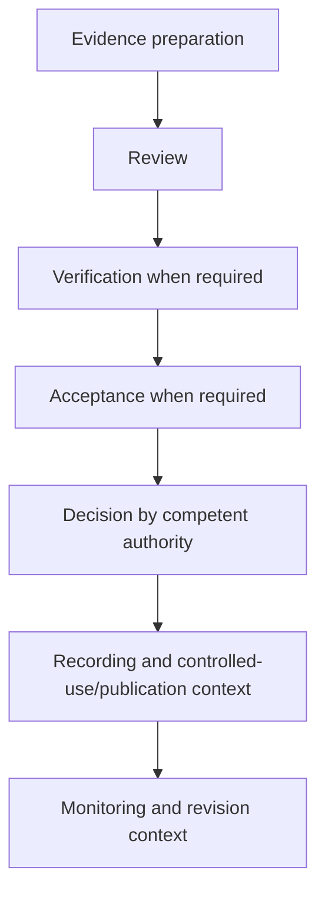
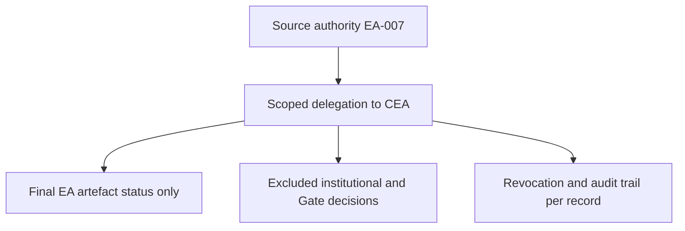

# 14 — Roles, Authority and Approval Blueprint

## 1. Tujuan dan Kedudukan

Dokumen ini menetapkan `RAP-GOV-001` sebagai blueprint konseptual role archetype, responsibility, participation, decision context, separation of duties, dan delegation control untuk e-PeLARA Next Generation. Blueprint menyediakan interface role/authority terhadap lifecycle BP-BUS-003 dan evidence G1.

Dokumen bukan RACI institusional, struktur organisasi, daftar jabatan, penetapan pejabat, atau approval workflow universal. Blueprint tidak menetapkan Gate disposition atau mengklaim telah diimplementasikan.

## 2. Ruang Lingkup

Ruang lingkup mencakup role archetype stabil, decision context, separation-of-duties control, delegation control, approval interaction conceptual, status separation, dan interface lifecycle. Di luar scope: person, position, unit organisasi, statutory authority, system permission design, digital-signature implementation, retention/disposal rule, dan approval sequence final.

## 3. Sumber Otoritatif dan Dependency

| Sumber | Peran |
| --- | --- |
| [Business Architecture Overview](10-Business-Architecture-Overview.md) | Parent/context, human authority, dan evidence G1. |
| [Business Capability Map](11-Business-Capability-Map.md) | Capability governance, compliance, data, publication, dan decision support. |
| [Planning-to-Accountability Value Streams](12-Planning-to-Accountability-Value-Streams.md) | Stage/value-stream participation context. |
| [Government Document Lifecycle Blueprint](13-Government-Document-Lifecycle-Blueprint.md) | Dependency resmi, lifecycle phase, transition, dan decision-point interface. |
| [Master Roadmap](../11-roadmaps/02-Enterprise-Architecture-Roadmap.md) | Seq 14, dependency Document Lifecycle, Gate G1. |
| [Official Current State Baseline](../01-current-state/) | Evidence terbatas workflow, akses, signature, user/access management, dan gap terdokumentasi. |
| [Governance, Register, Gate, dan Traceability](../00-governance/) | Decision boundary, standing delegation, finding, risk, compliance, dan traceability. |

## 4. Prinsip Roles, Authority, and Approval

1. Responsibility tidak otomatis menjadi decision authority; participation tidak otomatis menjadi approval right.
2. Reviewer, verifier, data-domain acceptance, recommendation provider, dan decision authority adalah peran yang berbeda.
3. System permission, digital signature, dan workflow completion tidak otomatis menciptakan authority atau approval.
4. Approval tidak otomatis effective, published, verified, compliant, archived, atau Gate Approved.
5. Publication authorization dipisahkan dari document approval; withdrawal dipisahkan dari source deletion.
6. AI/automation tidak memiliki authority institusional dan tidak menjadi independent verifier.
7. Assignment tanpa evidence tidak diperlakukan sebagai resmi.

## 5. Istilah dan Definisi

| Istilah | Definisi/batas |
| --- | --- |
| Role archetype | Pola peran stabil, bukan jabatan, person, atau unit. |
| Responsibility | Kontribusi yang boleh dilakukan; bukan authority. |
| Participation | Keterlibatan dalam stage/lifecycle/decision context; bukan approval right. |
| Review outcome | Hasil review sesuai standard; bukan decision disposition. |
| Verification result | Hasil pemeriksaan evidence/link/control; bukan approval. |
| Acceptance | Penerimaan domain/scope bila diwajibkan; bukan Gate disposition. |
| Decision authority | Authority manusia sah untuk keputusan tertentu; tidak diasumsikan. |
| System permission | Akses teknis; bukan kewenangan institusional. |
| Delegation | Pelimpahan eksplisit berscope yang harus memiliki source, limit, dan audit trail. |

## 6. Metamodel

`RAP-GOV-001` memuat role archetype `RAP-ROLE`, decision context `RAP-DEC`, separation-of-duties rule `RAP-SOD`, dan delegation control `RAP-DEL`. Role archetype dapat `PARTICIPATES_IN` decision context; decision context dapat `APPLIES_TO` lifecycle phase; SOD/delegation control dapat `GOVERN` candidate interaction. Relasi tersebut lokal/candidate dan tidak mengubah EA-009.

## 7. Identifier Standard

| Objek | Identifier | Aturan |
| --- | --- | --- |
| Blueprint | `RAP-GOV-001` | Identifier arsitektur internal, bukan kode jabatan/regulasi. |
| Role archetype | `RAP-ROLE-01`–`RAP-ROLE-14` | Unik, organization/application agnostic. |
| Decision context | `RAP-DEC-01`–`RAP-DEC-12` | Candidate context, bukan keputusan otomatis. |
| SOD control | `RAP-SOD-01` dan seterusnya | Prinsip candidate; bukan klaim penerapan. |
| Delegation control | `RAP-DEL-01` dan seterusnya | Control candidate; tidak memperluas delegation. |

## 8. Authority Boundary

Authority institusional yang belum dibuktikan memakai `To be designated or verified by competent institutional authority — Evidence Pending`. Assignment program-level dalam mandat Project Owner memakai `To be assigned by Project Owner`. Kedua status tidak dapat dipertukarkan.

Project Owner tercatat sebagai delegation authority untuk artefak EA, tetapi status tersebut tidak otomatis merupakan statutory/legal authority untuk seluruh dokumen pemerintahan. Chief Enterprise Architect hanya memiliki boundary yang ditegaskan pada §25.

## 9. Role Archetype Catalogue

| Role ID dan nama | Purpose; allowed responsibility | Prohibited authority assumption | Lifecycle/value-stream participation | Evidence provided/consumed; decision involvement | SOD concern; assignment/evidence status; boundary |
| --- | --- | --- | --- | --- | --- |
| RAP-ROLE-01 — Mandate and Policy Authority | Menetapkan konteks mandat/policy sesuai authority sah. | Bukan otomatis approver semua dokumen. | DLC-PH-01; VST-PTA-01. | Konsumsi context/requirement; decision bila sah. | Pisahkan dari verifier; To be designated or verified by competent institutional authority — Evidence Pending. |
| RAP-ROLE-02 — Business Document Sponsor | Menyatakan kebutuhan dan sponsor context bisnis. | Bukan otomatis legal/decision authority. | DLC-PH-01–02; VST-PTA-01–02. | Menyediakan business context; recommendation context. | Pisahkan dari independent verifier; To be assigned by Project Owner. |
| RAP-ROLE-03 — Document Preparer or Evidence Producer | Menyiapkan dokumen/evidence dalam scope. | Bukan reviewer independen, verifier, atau approver. | DLC-PH-02; semua stage relevan. | Menyediakan source/evidence; bukan final decision. | Pisahkan dari independent verifier bila diwajibkan; Evidence Pending. |
| RAP-ROLE-04 — Business Reviewer | Menilai kelengkapan/kesesuaian bisnis. | Review bukan verification/approval. | DLC-PH-03; VST-PTA-02–06. | Mengonsumsi evidence; menghasilkan review outcome/recommendation. | Pisahkan dari decision authority bila diwajibkan; Evidence Pending. |
| RAP-ROLE-05 — Independent Verifier | Memeriksa evidence secara independen bila diwajibkan. | Bukan approver atau authority. | DLC-PH-03–04. | Menghasilkan verification result. | Tidak memverifikasi evidence yang dibuat sendiri; To be designated or verified by competent institutional authority — Evidence Pending. |
| RAP-ROLE-06 — Data Owner or Data-Domain Acceptance Role | Menerima/menolak evidence pada scope data yang ditetapkan. | Acceptance bukan Gate disposition/independent verification. | DLC-PH-03–05; VST-PTA-02–08. | Mengonsumsi data evidence; data-domain acceptance bila sah. | Pisahkan dari verifier independen. Program-level data-domain acceptance role: `To be assigned by Project Owner`. Institutional/statutory data ownership: `To be designated or verified by competent institutional authority — Evidence Pending`. Kedua kategori tidak dapat dipertukarkan. |
| RAP-ROLE-07 — Decision Authority or Approver | Memberi decision/approval sesuai source authority sah. | Tidak diasumsikan dari role atau permission. | DLC-PH-04–05. | Mengonsumsi evidence/recommendation; merekam disposition. | Pisahkan dari reviewer/verifier bila diperlukan; To be designated or verified by competent institutional authority — Evidence Pending. |
| RAP-ROLE-08 — Publication Preparer | Menyiapkan publication instance dari source resmi. | Bukan publication authorizer atau source authority. | DLC-PH-06; VST-PTA-07. | Mengonsumsi source/version/lineage; menyediakan output preparation. | Pisahkan dari authorizer; Evidence Pending. |
| RAP-ROLE-09 — Publication Authorizer | Menetapkan authorization publikasi bila authority sah tersedia. | Tidak sama dengan document approval/legal approval. | DLC-PH-05–06. | Mengonsumsi classification/source evidence; decision context. | Pisahkan dari preparer; To be designated or verified by competent institutional authority — Evidence Pending. |
| RAP-ROLE-10 — Records or Evidence Custodian | Menjaga record, evidence, histori, dan lineage. | Bukan disposal authority. | DLC-PH-01–08. | Menyediakan/menjaga record; bukan decision. | Pisahkan dari disposal decision; Evidence Pending. |
| RAP-ROLE-11 — System Operator or Workflow Administrator | Mengelola operasi teknis/workflow sesuai scope. | Permission/status sistem bukan authority/approval. | Interface semua phase. | Menjaga system record; bukan disposition. | Pisahkan dari decision authority; Evidence Pending. |
| RAP-ROLE-12 — Oversight, Audit, or Compliance Role | Memberi oversight/audit/compliance input sesuai authority. | Tidak otomatis legal authority, risk acceptance, atau approver. | DLC-PH-03–08. | Mengonsumsi control evidence; finding/recommendation context. | Pisahkan dari object owner bila independensi diwajibkan; To be designated or verified by competent institutional authority — Evidence Pending. |
| RAP-ROLE-13 — Architecture Reviewer | Mereview konsistensi artefak EA dan memberi recommendation. | Architecture review bukan Gate disposition. | Context blueprint; VST-PTA-01/08. | Mengonsumsi blueprint evidence; review outcome. | Pisahkan dari Gate decision authority; Documented Current untuk batas EA-007. |
| RAP-ROLE-14 — AI/Automation Assistant | Membantu drafting, classification, checking, recommendation, dan traceability. | Bukan authority, reviewer independen, verifier, approver, atau custodian legal. | Assistive context. | Menyediakan candidate output; tidak membuat official decision. | Human oversight wajib; Target. |

## 10. Mandate and Policy Authority

RAP-ROLE-01 hanya menunjukkan archetype konteks mandate/policy. Penetapan authority konkret membutuhkan sumber institusional sah dan tidak dibuat oleh blueprint ini.

## 11. Preparation and Evidence Roles

RAP-ROLE-02 dan RAP-ROLE-03 dapat berpartisipasi pada kebutuhan/penyusunan/evidence. Penyusunan evidence tidak memberi hak review independen atau decision.

## 12. Review and Verification Roles

RAP-ROLE-04 menghasilkan review outcome/recommendation; RAP-ROLE-05 menghasilkan verification result bila diwajibkan. Keduanya bukan approval disposition dan independensi verifier tidak diasumsikan.

## 13. Acceptance and Decision Roles

RAP-ROLE-06 menangani data-domain acceptance bila ditetapkan; RAP-ROLE-07 adalah archetype decision authority. Acceptance tidak menjadi Gate disposition, dan authority tidak diambil dari role name.

Assignment data-domain acceptance pada tingkat program tidak menetapkan institutional/statutory data ownership. Institutional/statutory data ownership memerlukan designation atau verification oleh competent institutional authority dan tetap Evidence Pending sampai dibuktikan.

## 14. Publication Roles

RAP-ROLE-08 menyiapkan output; RAP-ROLE-09 mengelola authorization context bila sah. Publication authorization dipisahkan dari document approval dan legal approval.

## 15. Records and Custodian Roles

RAP-ROLE-10 menjaga evidence, version, histori, dan lineage. Custody tidak berarti authority untuk approval, withdrawal, archival, atau disposal.

## 16. System Operator and Workflow Administration

RAP-ROLE-11 mengelola operasi teknis. System permission, digital signature, dan workflow completion tidak sama dengan authority, approval, atau document lifecycle state.

## 17. Oversight, Audit, and Compliance Roles

RAP-ROLE-12 menyediakan oversight/audit/compliance context berdasarkan scope sah. Applicability compliance, exception, risk acceptance, dan legal determination tetap berada pada authority berwenang.

## 18. Architecture Governance Roles

RAP-ROLE-13 mendukung architecture review dan final artefact status dalam boundary EA-007. Architecture review outcome berbeda dari Gate disposition dan tidak mengubah authority sumber G0–G6.

## 19. AI and Automation Boundary

RAP-ROLE-14 dapat membantu drafting, classification, checking, recommendation, dan traceability. AI tidak dapat melakukan independent verification, data-domain acceptance, approval, legal/compliance determination, risk acceptance, exception approval, atau Gate disposition.

## 20. Decision Context Catalogue

| Decision ID | Lifecycle phase | Decision object; input/evidence | Reviewer/verifier/acceptance involvement | Decision-authority requirement | Output/disposition context; escalation/exception | Assignment; evidence; verification status | Boundary |
| --- | --- | --- | --- | --- | --- | --- | --- |
| RAP-DEC-01 — Context Acceptance | DLC-PH-01 | Context/source relationship. | Review/verification bila diperlukan. | To be designated or verified by competent institutional authority — Evidence Pending. | Candidate accepted context; escalation jika source tidak jelas. | Evidence Pending; Evidence Pending; Evidence Pending. | Bukan legal applicability. |
| RAP-DEC-02 — Preparation Completion or Submission | DLC-PH-02 | Preparation/evidence package. | Review context mungkin diperlukan. | To be assigned by Project Owner. | Candidate submission/return-for-rework context. | Evidence Pending; Evidence Pending; Evidence Pending. | Bukan approval. |
| RAP-DEC-03 — Review Outcome | DLC-PH-03 | Review evidence/context. | Business reviewer; verifier terpisah bila diwajibkan. | To be assigned by Project Owner. | PASSED/REVISIONS REQUIRED/BLOCKED bila standard berlaku. | Evidence Pending; Evidence Pending; Evidence Pending. | Bukan decision disposition. |
| RAP-DEC-04 — Verification Result | DLC-PH-03–04 | Evidence/link/control. | Independent verifier bila diwajibkan. | To be designated or verified by competent institutional authority — Evidence Pending. | Verification result/finding context. | Evidence Pending; Evidence Pending; Evidence Pending. | Bukan approval. |
| RAP-DEC-05 — Document Approval or Authorization | DLC-PH-04 | Evidence, review, verification, acceptance bila diwajibkan. | Reviewer/verifier/acceptance sesuai scope. | To be designated or verified by competent institutional authority — Evidence Pending. | Candidate approval/authorization record; escalation bila authority tidak jelas. | Evidence Pending; Evidence Pending; Evidence Pending. | Tidak otomatis effective/published. |
| RAP-DEC-06 — Effective/Controlled-Use Decision | DLC-PH-05 | Decision record dan evidence penggunaan. | Review/verification sesuai scope. | To be designated or verified by competent institutional authority — Evidence Pending. | Candidate controlled-use context. | Evidence Pending; Evidence Pending; Evidence Pending. | Tidak otomatis setelah approval. |
| RAP-DEC-07 — Revision or Supersession Decision | DLC-PH-06–07 | Change context, source/version/history/lineage. | Review/verification sesuai scope. | To be designated or verified by competent institutional authority — Evidence Pending. | Candidate revision/supersession context; rollback/escalation. | Evidence Pending; Evidence Pending; Evidence Pending. | Superseded bukan deleted. |
| RAP-DEC-08 — Publication Authorization | DLC-PH-05–06 | Source, version, status, classification, lineage. | Publication review/verification sesuai scope. | To be designated or verified by competent institutional authority — Evidence Pending. | Candidate publish/not-publish context. | Evidence Pending; Evidence Pending; Evidence Pending. | Terpisah dari document approval. |
| RAP-DEC-09 — Publication Withdrawal | DLC-PH-06–08 | Publication instance/source/lineage context. | Review/verification sesuai scope. | To be designated or verified by competent institutional authority — Evidence Pending. | Candidate withdrawal context; preserve source/history. | Evidence Pending; Evidence Pending; Evidence Pending. | Withdrawal bukan deletion source. |
| RAP-DEC-10 — Exception or Escalation | Semua context relevan | Finding, exception request, risk/control evidence. | Reviewer/verifier sesuai scope. | To be designated or verified by competent institutional authority — Evidence Pending. | Candidate escalation/exception record. | Evidence Pending; Evidence Pending; Evidence Pending. | Requester bukan auto-approver. |
| RAP-DEC-11 — Retention or Archival Decision | DLC-PH-08 | Records, retention/legal evidence bila ada. | Records/legal verification bila diwajibkan. | To be designated or verified by competent institutional authority — Evidence Pending. | Candidate archival context. | Evidence Pending; Evidence Pending; Evidence Pending. | Tidak menetapkan retention rule. |
| RAP-DEC-12 — Disposal Decision | DLC-PH-08 | Legal, retention, record, preservation evidence. | Records/legal verification bila diwajibkan. | To be designated or verified by competent institutional authority — Evidence Pending. | Candidate disposal decision context. | Evidence Pending; Evidence Pending; Evidence Pending. | Disposal tetap Evidence Pending. |

## 21. Approval Interaction Model

Ini bukan approval sequence universal. Langkah dapat berbeda menurut document family dan aturan sah; tidak semua selalu diperlukan, transition tidak otomatis, dan authority mengikuti sumber yang sah.

## 22. Authority Assignment Matrix

| Decision context | Responsible participant | Reviewer | Verifier | Data-domain acceptance | Recommendation provider | Required decision authority | Recording/custodian role | Publication role | Assignment status | Evidence status | Boundary |
| --- | --- | --- | --- | --- | --- | --- | --- | --- | --- | --- | --- |
| Context/Preparation/Review | RAP-ROLE-02/03 | RAP-ROLE-04 | RAP-ROLE-05 bila diwajibkan | RAP-ROLE-06 bila relevan | RAP-ROLE-04 | Not Applicable atau authority sah sesuai object. | RAP-ROLE-10 | Not Applicable | Program-level only: To be assigned by Project Owner. Institutional authority, if applicable: To be designated or verified by competent institutional authority — Evidence Pending. | Evidence Pending | Tidak menetapkan approval; assignment program-level dan institutional authority tidak dapat dipertukarkan. |
| Verification/Approval/Use | RAP-ROLE-03 | RAP-ROLE-04 | RAP-ROLE-05 bila diwajibkan | RAP-ROLE-06 bila relevan | RAP-ROLE-04/12 | To be designated or verified by competent institutional authority — Evidence Pending. | RAP-ROLE-10 | Not Applicable | Evidence Pending | Evidence Pending | Acceptance/review bukan authority. |
| Revision/Supersession | RAP-ROLE-03 | RAP-ROLE-04 | RAP-ROLE-05 bila diwajibkan | RAP-ROLE-06 bila relevan | RAP-ROLE-04/12 | To be designated or verified by competent institutional authority — Evidence Pending. | RAP-ROLE-10 | RAP-ROLE-08/09 bila publikasi terdampak | Evidence Pending | Evidence Pending | Histori/lineage dipertahankan. |
| Publication/Withdrawal | RAP-ROLE-08 | RAP-ROLE-04 | RAP-ROLE-05 bila diwajibkan | RAP-ROLE-06 bila relevan | RAP-ROLE-04/12 | To be designated or verified by competent institutional authority — Evidence Pending. | RAP-ROLE-10 | RAP-ROLE-09 | Evidence Pending | Evidence Pending | Tidak menyamakan publikasi dengan approval. |
| Retention/Archival/Disposal | RAP-ROLE-10 | RAP-ROLE-12 bila relevan | RAP-ROLE-05 bila diwajibkan | Not Applicable | RAP-ROLE-12 | To be designated or verified by competent institutional authority — Evidence Pending. | RAP-ROLE-10 | Not Applicable | Evidence Pending | Evidence Pending | Tidak menetapkan retention/disposal rule. |

## 23. Separation-of-Duties Controls

| Control | Prinsip candidate | Status |
| --- | --- | --- |
| RAP-SOD-01 | Preparer berbeda dari independent verifier bila verification independen diwajibkan. | Target |
| RAP-SOD-02 | Reviewer tidak otomatis menjadi final approver. | Target |
| RAP-SOD-03 | Verifier tidak menetapkan approval. | Target |
| RAP-SOD-04 | System operator tidak menggunakan akses teknis sebagai decision authority. | Target |
| RAP-SOD-05 | Publication preparer tidak otomatis menjadi publication authorizer. | Target |
| RAP-SOD-06 | AI tidak menjadi reviewer independen, verifier institusional, approver, atau authority. | Target |
| RAP-SOD-07 | Exception requester tidak otomatis menjadi exception approver. | Evidence Pending |
| RAP-SOD-08 | Risk reporter tidak otomatis menjadi risk acceptance authority. | Evidence Pending |
| RAP-SOD-09 | Records custodian tidak otomatis menetapkan disposal. | Evidence Pending |
| RAP-SOD-10 | Architecture review outcome terpisah dari Gate disposition. | Documented Current |

Control ini tidak mengklaim telah diterapkan untuk seluruh document family.

## 24. Delegation Control Model

| Control | Source/delegator/delegate | Scope | Excluded decisions | Period/revocation/override | Evidence/audit trail | Status/verification |
| --- | --- | --- | --- | --- | --- | --- |
| RAP-DEL-01 | EA-007 v1.1.0; Project Owner; Chief Enterprise Architect. | Status final artefak EA dalam delegation boundary. | Dokumen pemerintahan, legal/compliance, risk, data owner, security, budget, go-live, Gate G0–G6. | Effective/revocation hanya sesuai record EA-007; tidak diekstrapolasi. | EA-007, metadata/persetujuan/change log artefak EA. | Documented Current; Evidence Pending untuk verification di luar record. |
| RAP-DEL-02 | Competent institutional authority; delegate belum ditetapkan. | Candidate delegation dokumen pemerintah jika sumber sah tersedia. | Semua scope di luar source authority. | Period/revocation/override wajib eksplisit bila ada. | Delegation record dan audit trail diperlukan. | Evidence Pending; Evidence Pending. |
| RAP-DEL-03 | Project Owner. | Assignment program-level dalam mandat Project Owner. | Statutory/legal authority yang tidak dibuktikan. | Sesuai governance record. | Assignment/decision record diperlukan. | Target; Evidence Pending. |

## 25. Standing Delegation EA-007 Boundary

Standing delegation EA-007 Version 1.1.0 hanya berlaku untuk penetapan status final artefak Enterprise Architecture dalam delegation boundary. Delegation tidak memberikan kepada Chief Enterprise Architect kewenangan menyetujui dokumen pemerintahan, menetapkan legal applicability/compliance/data owner/security authority, menerima risiko, menyetujui exception, menyetujui anggaran/pengadaan/go-live, mengambil keputusan administratif pemerintahan, atau memberi disposition Gate G0–G6.

Diagram menunjukkan boundary terbatas EA-007, bukan delegasi untuk keputusan yang dikecualikan.

## 26. Interface dengan BP-BUS-003

| BP-BUS-003 decision-point interface | RAP decision context | Boundary |
| --- | --- | --- |
| Use after review context | RAP-DEC-03–06 | Review, verification, acceptance, dan decision tetap terpisah. |
| Revision or supersession | RAP-DEC-07 | Source/version/history/lineage dan rollback evidence diperlukan. |
| Publication or withdrawal | RAP-DEC-08–09 | Publication authorization terpisah dari document approval. |
| Retention or archival | RAP-DEC-11; RAP-DEC-12 hanya Evidence Pending | Tidak mengubah DLC-PH-01–08 atau DLC-TR-01–08. |

## 27. Document-Family Applicability

Tidak semua document family BP-BUS-003 memerlukan semua role atau decision context. Applicability bergantung pada sumber, document context, legal authority, dan evidence yang sah; blueprint ini tidak membuat assignment universal.

## 28. Exception and Escalation Model

Exception/escalation adalah candidate decision context `RAP-DEC-10`. Request, review, verification, recommendation, authority, disposition, dan closure harus dipisahkan sesuai scope. AIR-004/ARISK-002 serta AIR-010/ARISK-007 hanya dirujuk sebagai gap governance/evidence, tanpa perubahan status register.

## 29. Publication Authorization and Withdrawal

Publication authorization dan withdrawal memakai RAP-DEC-08/09. Sumber, versi, status, lineage, classification, dan authority context harus dapat ditelusuri. Withdrawal tidak otomatis menghapus authoritative source; authority publikasi tetap `Evidence Pending` tanpa sumber sah.

## 30. Retention, Archival, and Disposal Boundary

RAP-DEC-11/12 dan RAP-ROLE-10 menyediakan context saja. Masa retensi, archival/disposal authority, retention/disposal rule, dan pemusnahan tetap `Evidence Pending`; custodian tidak otomatis memiliki disposal authority.

## 31. Status Separation Model

| Status dimension | Object | Tidak boleh disamakan dengan |
| --- | --- | --- |
| Role assignment status | Penetapan role ke person/unit. | responsibility atau authority |
| Responsibility status | Kontribusi pada scope. | decision authority |
| Review outcome | Hasil review. | approval disposition |
| Verification status | Evidence/link/control. | approval atau Gate |
| Acceptance | Domain/scope acceptance. | Gate disposition |
| Decision disposition | Keputusan authority sah. | review outcome |
| Delegation status | Delegation record dan boundary. | system permission |
| System permission | Akses teknis. | institutional authority |
| Workflow/task status | Pekerjaan operasional. | document approval |
| Document lifecycle state | Posisi lifecycle dokumen. | workflow status |
| Version status | Version/current/superseded context. | publication status |
| Publication status | Publication instance. | document approval |
| Gate disposition | Keputusan Gate EA. | status dokumen |

Perubahan pada satu dimensi tidak otomatis mengubah dimensi lain.

## 32. Evidence and Gap View

View ini bukan register baru dan tidak mengubah AIR, ARISK, COMP, exception, atau Gate. Follow-up direction tidak menebak artefak/Gate baru dan mengikuti Master Roadmap serta governance classification yang berlaku.

| Object | Current evidence | Target direction | Gap | Assignment status | Evidence status | Verification status | Register reference | Follow-up direction |
| --- | --- | --- | --- | --- | --- | --- | --- | --- |
| Workflow/approval interface | Workflow approval belum konsisten. | Role/decision separation yang jelas. | Authority/state model belum dibuktikan konsisten. | To be designated or verified by competent institutional authority — Evidence Pending. | Evidence Pending | Evidence Pending | AIR-004; ARISK-002 | Tindak lanjut melalui register resmi dan governance yang relevan. |
| Evidence/role assignment | Metadata/evidence lintas artefak perlu konsisten. | Assignment/evidence traceable. | Owner/verifier belum ditetapkan. | Program-level assignment: To be assigned by Project Owner. Institutional/statutory assignment: To be designated or verified by competent institutional authority — Evidence Pending. Applicable category wajib ditentukan berdasarkan scope dan tidak dapat dipertukarkan. | Evidence Pending | Evidence Pending | AIR-010; ARISK-007; COMP-006 | Tindak lanjut melalui register dan rekaman review resmi. |
| Publication authorization | Publication control/classification belum ditetapkan. | Controlled publication dengan authority sah. | Authorization/classification evidence belum tersedia. | To be designated or verified by competent institutional authority — Evidence Pending. | Evidence Pending | Evidence Pending | COMP-010 | Tindak lanjut melalui register resmi sesuai dependency. |
| Retention/disposal | Source/legal authority belum tersedia pada scope ini. | Archival/disposal traceable dan patuh. | Rule/authority tidak dapat ditetapkan. | To be designated or verified by competent institutional authority — Evidence Pending. | Evidence Pending | Evidence Pending | COMP-009 | Menunggu sumber hukum/authority sah; tidak membuat rule baru. |

## 33. Hubungan dengan Value Stream dan Capability

Role/authority context mendukung CAP-GOV, CAP-CMP, CAP-DKM, CAP-PUB, dan CAP-ADS lintas stage VS-PTA-001. Participation role tidak mengubah capability, status capability, atau menjadikan application/module sebagai capability.

## 34. Hubungan dengan Domain Arsitektur Lain

| Domain | Interface |
| --- | --- |
| Data dan Knowledge Architecture | Data owner/acceptance, source, metadata, lineage, dan evidence. |
| Application dan Integration Architecture | Permission/workflow adalah realisasi teknis dan bukan authority. |
| Security dan Privacy Architecture | Identity/access/separation control memerlukan scope dan authority berwenang. |
| Government Digital Publishing Platform | Publication preparation/authorization context dan lineage. |
| Government Intelligence Platform | AI-assisted insight/recommendation dengan human oversight. |

## 35. Traceability

| Source | Relationship | Target | Kedudukan relasi | Evidence status | Verification status |
| --- | --- | --- | --- | --- | --- |
| RAP-GOV-001 | DERIVED_FROM | BP-BUS-003 | Draft candidate relationship | Documented Current | Evidence Pending |
| RAP-ROLE-01–14 | PARTICIPATES_IN | Decision context terkait | Draft local/candidate relationship | Evidence Pending | Evidence Pending |
| RAP-DEC-01–12 | APPLIES_TO | Lifecycle phase terkait | Draft local/candidate relationship | Evidence Pending | Evidence Pending |
| RAP-SOD-01–10 | GOVERN | Candidate interaction | Draft local/candidate relationship | Target | Evidence Pending |
| RAP-DEL-01 | GOVERN | Scoped standing delegation EA-007 Version 1.1.0 | Documented relationship terbatas pada governance artefak EA | Documented Current | Evidence Pending |
| RAP-DEL-02–03 | GOVERN | Candidate institutional delegation dan program-level assignment controls | Draft local/candidate relationship | Target | Evidence Pending |
| BP-BUS-004 | PROVIDES | Authority/approval context bagi artefak lanjutan | Draft future-direction relationship; objek lanjutan tidak ditetapkan di sini | Target | Evidence Pending |

Relasi local/candidate bukan vocabulary kanonis baru EA-009. Tabel bukan Canonical Traceability Matrix dan tidak mengubah status role, document, register, Gate, atau authority. Tidak ada status `Verified` tanpa evidence dan verifier sah.

## 36. G1 Evidence dan Readiness

| Aspek G1 | Kontribusi BP-BUS-004 | Status |
| --- | --- | --- |
| Roles/approval | Role archetype, decision context, SOD, delegation boundary, dan lifecycle interface. | Approved — document status only |
| Regulatory traceability | Gap reference tanpa legal determination. | Evidence Pending |
| Authority evidence | Assignment/authority institusional perlu sumber sah. | Evidence Pending |

BP-BUS-004 hanya berkontribusi pada evidence G1. Approval dokumen bukan Gate disposition; G1 tetap tanpa disposition. Approval BP-BUS-003 tidak otomatis membuat BP-BUS-004 atau G1 Approved. Role archetype, decision context, SOD, delegation control, assignment, dan candidate relationship tidak diklaim implemented atau Verified. Tidak ada pejabat atau institutional/statutory authority yang ditetapkan; authority assignment yang belum terbukti tetap `Evidence Pending`, dan penyelesaian BP-BUS-004 tidak otomatis membuat G1 siap mendapat disposition.

## 37. Assumptions, Constraints, dan Evidence Pending

1. Baseline digunakan tanpa audit repository, source code, database, atau implementasi.
2. Role/person/unit, authority, delegation selain EA-007, verifier, retention/disposal, dan legal applicability memerlukan evidence/authority sah.
3. Tidak ada SLA, threshold, target angka, RACI resmi, atau approval sequence universal.
4. System permission, workflow status, signature, dan publication status tetap dipisahkan dari authority/approval.

## 38. Batas Kewenangan AI

ChatGPT Work menyusun blueprint berdasarkan sumber yang diizinkan. AI tidak menetapkan role/person/unit, authority, approver, verifier, acceptance, delegation, legal applicability, compliance, risk acceptance, exception, retention/disposal, Gate disposition, atau closure.

## 39. Persetujuan

| Peran | Nama | Keputusan | Status proses | Tanggal |
| --- | --- | --- | --- | --- |
| Penyusun Dokumen/File Operator | ChatGPT Work | Disusun | Selesai | 2026-08-04 |
| Chief Enterprise Architect | ChatGPT | Direview, ditetapkan final, dan disahkan berdasarkan standing delegation | Selesai | 2026-08-04 |
| Delegation authority | Project Owner — Fahmi Alhabsi | Standing delegation melalui EA-007 Version 1.1.0 | Tercatat | 2026-08-04 |

## 40. Change Log Dokumen

| Versi | Tanggal | Perubahan | Penyusun | Status |
| --- | --- | --- | --- | --- |
| 1.0.0 | 2026-08-04 | Penyusunan awal Roles, Authority and Approval Blueprint | ChatGPT Work | Draft for Approval |
| 1.0.0 | 2026-08-04 | Review CEA: Revisions Required; assignment program-level wajib dipisahkan dari institutional/statutory authority dan traceability delegation wajib memisahkan Documented Current dari Target | ChatGPT | Revisions Required |
| 1.0.0 | 2026-08-04 | Review final PASSED; ditetapkan Approved sebagai Official Roles, Authority and Approval Blueprint berdasarkan standing delegation EA-007 Version 1.1.0; approval dokumen tidak menetapkan disposition G1 | ChatGPT | Approved |

**End of Document — 14-Roles-Authority-and-Approval-Blueprint.md**
