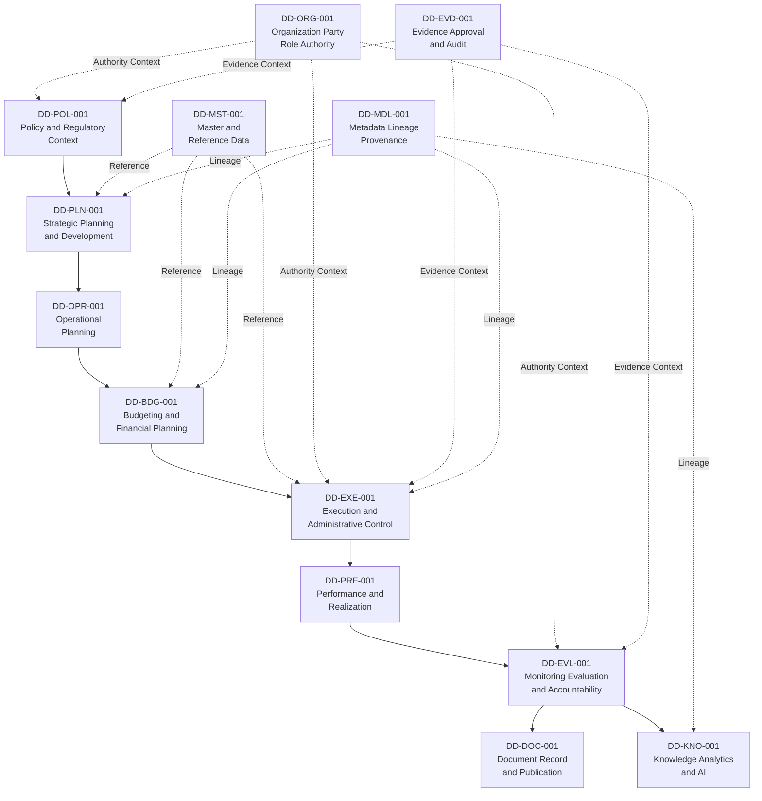

# 19 — Enterprise Data Domain Model

## 1. Tujuan dan Kedudukan

Dokumen ini adalah **Official Enterprise Data Domain Model** (BP-DATA-001), Approved Architecture Blueprint yang menerjemahkan Candidate Data Subject Areas dari ARCH-DATA-001 menjadi enterprise data domains dengan boundary, business meaning, relationship, dan lifecycle concern yang terstruktur pada tingkat konseptual/logis enterprise.

BP-DATA-001 Version 1.0.0 telah menyelesaikan final substantive re-review oleh Chief Enterprise Architect dengan review outcome **PASSED**, dan berlaku efektif sejak **5 Agustus 2026**. Approval ini menetapkan model tiga belas domain dan boundary konseptualnya sebagai baseline arsitektur resmi untuk enterprise data domain landscape e-PeLARA Next Generation.

Label **Candidate Target Direction** dan **Evidence Pending** yang masih digunakan dalam isi dokumen ini merupakan klasifikasi evidence atau arah implementasi lanjutan bagi setiap domain, relationship, atau concern tertentu — bukan tanda bahwa approval BP-DATA-001 secara keseluruhan masih pending. Approval BP-DATA-001 **tidak berarti** implementasi telah dilakukan; label tersebut tetap relevan untuk membedakan area yang memerlukan follow-up artifact, governance formal, atau evidence tambahan.

Dokumen **bukan**:
- Logical/physical data model, Entity-Relationship Diagram (ERD), database schema, tabel, kolom, index, constraint, atau foreign key.
- Data dictionary, API schema, event schema, technology selection, atau implementation specification.
- Master data blueprint, reference data management strategy, data quality standard, lineage pipeline, atau governance operating model detail.
- Legal determination, compliance verification, risk acceptance, exception approval, atau G2 disposition.

Approval dokumen ini tidak menetapkan implementasi, data owner, authority institusional, compliance, verification, atau disposition G2. G1 dan G2 tetap tanpa disposition.

## 2. Ruang Lingkup

Dokumen menetapkan proposed enterprise data domain landscape mencakup sekurang-kurangnya tiga belas candidate domains dengan scope inclusion/exclusion, business purpose, lifecycle concern, relationship konseptual, dan interface ke artefak Seq 20–28. Dokumen tidak membuat implementasi detail, keputusan temporal, metadata/lineage/quality rule, ownership assignment, atau teknologi.

## 3. Dependency dan Sumber

**Sumber yang benar-benar dibaca langsung untuk dokumen ini:**

| Sumber | Peran |
| --- | --- |
| [ARCH-DATA-001](18-Enterprise-Data-Architecture.md) | Normative parent; Candidate Data Subject Areas, arah Data and Knowledge, dan boundary enterprise. Dibaca langsung. |
| [ARCH-BUS-001](../02-business-architecture/10-Business-Architecture-Overview.md) | Business context dan capability domain Level 0 tingkat enterprise. Dibaca langsung (sebagian). |
| [BP-BUS-002](../02-business-architecture/12-Planning-to-Accountability-Value-Streams.md) | Value stream Planning-to-Accountability (VS-PTA-001) dan stage participation. Dibaca langsung (sebagian). |
| [REF-BUS-001](business-glossary/15-Business-Glossary.md) | Vocabulary kanonis bisnis. Dibaca langsung (sebagian). |
| [Baseline 2](../01-current-state/2-modul-sistem.md) | Current evidence modul, entitas, dan rantai dokumen. Dibaca langsung (sebagian). |

**Sumber yang direferensi hanya melalui ARCH-DATA-001, tidak dibaca ulang untuk dokumen ini:**

| Sumber | Kedudukan |
| --- | --- |
| BP-BUS-001 — Business Capability Map | Referenced indirectly through ARCH-DATA-001; not reread for this document. |
| BP-BUS-003 — Government Document Lifecycle Blueprint | Referenced indirectly through ARCH-DATA-001; not reread for this document. |
| BP-BUS-004 — Roles, Authority and Approval Blueprint | Referenced indirectly through ARCH-DATA-001; not reread for this document. |
| Baseline 3 — Alur Logika Sistem | Referenced indirectly through ARCH-DATA-001 §6; not reread for this document. |
| Baseline 5 — Referensi Teknis Database/API/Frontend | Referenced indirectly through ARCH-DATA-001 §6; not reread for this document. |
| GOV-REP-001 — Repository Structure | Referenced indirectly through ARCH-DATA-001 conformance metadata; not reread for this document. |
| GOV-EA-005 — Architecture Review and Gate Standard | Referenced indirectly through ARCH-DATA-001 conformance metadata; not reread for this document. |
| GOV-EA-006 — Traceability Standard | Referenced indirectly through ARCH-DATA-001 conformance metadata; not reread for this document. |
| AIR-001 — Architecture Issue Register | Referenced indirectly through ARCH-DATA-001 §19, §35; not reread for this document. |
| Baseline 4 — Penilaian Kesesuaian Standar | Not read directly. Assessment content (misalnya dashboard data dummy) hanya dirujuk melalui ARCH-DATA-001 §6 sebagai parent Approved yang telah mencatat assessment tersebut. |

Governance, register, roadmap, dan sumber yang direferensi tidak langsung digunakan sebagai link dan context, bukan dependency tambahan dan bukan klaim pembacaan langsung.

## 4. Evidence Method

Dokumen menggunakan kerangka kerja evidence berikut:

| Status evidence | Penggunaan dalam BP-DATA-001 |
| --- | --- |
| Documented Current Fact | Fakta data/modul/entitas yang terdokumentasi Baseline atau artefak Approved tertentu. |
| Documented Assessment | Temuan, gap, atau penilaian yang dicatat dalam sumber resmi. |
| Candidate Target Direction | Proposed domain, boundary, relationship, atau interface yang diturunkan dari ARCH-DATA-001 dan supporting context, belum diimplementasikan atau diverifikasi. |
| Evidence Pending | Informasi yang memerlukan bukti lebih lanjut, verifier sah, atau otoritas institusional. |

Dokumen tidak mengaudit ulang Baseline dan selalu merujuk sumbernya secara eksplisit. Pemisahan evidence status harus jelas pada setiap klaim.

Approval BP-DATA-001 menetapkan domain model dan boundary konseptual sebagai baseline arsitektur resmi. Status Candidate Target Direction dan Evidence Pending tetap digunakan untuk membedakan arah implementasi serta evidence yang belum diselesaikan; status tersebut tidak membatalkan status Approved dokumen ini.

## 5. Istilah dan Vocabulary

| Istilah | Definisi pada konteks ini |
| --- | --- |
| **Enterprise data domain** | Pengelompokan konseptual data yang bersama-sama melayani area concern atau lifecycle tertentu dalam enterprise pemerintahan, yang dapat ditelusuri ke business capability, value stream, dan source authority. |
| **Data subject area** | Kategori tingkat tinggi dari data concerns yang tercakup dalam domain. Candidate subject areas dinyatakan di ARCH-DATA-001 §13. |
| **Domain boundary** | Batas semantik dan scope yang memisahkan domain satu dari lainnya pada tingkat konseptual/logis, tanpa detail implementasi. |
| **Domain relationship** | Hubungan semantik konseptual antara domain (misalnya `PROVIDES_CONTEXT_TO`, `DERIVES_FROM`), bukan relasi database atau foreign key. |
| **Lifecycle concern** | Aspek lifecycle data yang relevan bagi domain (creation, use, update, versioning, sharing, publication, retention, disposal). |
| **Design-time identifier** | Identifier stabil untuk candidate domain pada fase desain; bukan ID instance database, kode regulasi, atau identifier resmi accepted. |
| **Proposed domain** | Istilah evidence untuk domain yang boundary dan semantic-nya telah ditetapkan melalui approval BP-DATA-001; implementasi detail dan follow-up governance tetap belum dilakukan. |
| **Authoritative source** | Pembentukan/penetapan oleh authority sah, bukan lokasi teknis data saja. |

## 6. Prinsip Pemodelan Domain

1. **One Data, Many Publications**: Data otoritatif tunggal dapat dipublikasikan dalam berbagai format tanpa duplikasi substansi atau perubahan lineage.
2. **Traceability by Link**: Domain dan relationship ditelusuri ke source yang relevan, bukan melalui duplikasi.
3. **Source-to-Consumer Separation**: Source authoritative, copy, cache, export, derivative, dan publication adalah concerns berbeda.
4. **Authority Boundary Clarity**: Boundary bisnis, temporal, compliance, dan technical ownership dipisahkan secara konseptual.
5. **Evidence-Based Modeling**: Setiap domain dan relationship didukung oleh evidence dari Charter, Business Architecture, Baseline, atau register yang relevan.
6. **Evidence Status Transparency**: Setiap klaim harus jelas berstatus Documented/Candidate/Pending tanpa ambiguitas.

## 7. Design-Time Identifier Convention

Candidate domains dalam dokumen ini menggunakan identifier pola:

```
DD-<DOMAIN-CODE>-<SEQUENCE-3-DIGIT>
```

- **DD**: Prefix untuk "Data Domain" pada fase design-time.
- **DOMAIN-CODE**: Singkatan atau kode domain (misal: `POL`, `PLN`, `OPR`, `BDG`, `EXE`, `PRF`, `EVL`, `ORG`, `MST`, `DOC`, `EVD`, `MDL`, `KNO`).
- **SEQUENCE-3-DIGIT**: Nomor urut tiga digit dalam group (contoh: `001`).

Contoh: `DD-POL-001`, `DD-PLN-001`, `DD-ORG-001`. Seluruh identifier domain yang digunakan dalam dokumen ini terbatas pada tiga belas Domain ID yang terdaftar pada Candidate Domain Catalog (§9).

**Catatan penting:** Identifier ini adalah design-time identifier stabil untuk fase konsultasi dan governance. Identifier **bukan**:
- ID database instance.
- Kode regulasi resmi.
- Identifier yang telah diterima/disetujui institusi.
- Identifier production atau official.

**Production dan official identifier tetap Evidence Pending**. Penetapan identifier production/official adalah keputusan post-acceptance dan governance formal; tidak dimulai pada fase BP-DATA-001 dan belum ditetapkan di BP-DATA-002 Seq 20.

## 8. Enterprise Data Domain Landscape

Enterprise data domain landscape untuk e-PeLARA Next Generation mencakup tiga belas candidate domains yang diturunkan dari Candidate Data Subject Areas ARCH-DATA-001 §13. Landscape menghubungkan tiga pilar utama:

1. **Planning-to-Accountability Core**: Domain yang mendukung rantai dokumen pemerintahan dari kebijakan hingga publikasi dan akuntabilitas.
2. **Structural and Contextual Enablers**: Domain yang mendukung pemahaman konteks organisasi, peran, dan data master.
3. **Cross-Cutting Concerns**: Domain yang memotong lintas-pilar untuk metadata, lineage, governance, pengetahuan, dan publikasi.

**Catatan Data Quality**: Data quality **bukan** candidate data domain tersendiri. Data quality diperlakukan sebagai cross-cutting concern yang relevan bagi seluruh tiga belas domain di bawah, dengan detail dimension, rule, threshold, dan acceptance criteria diarahkan ke STD-DATA-001 Seq 23.



**Catatan diagram:**
- Garis solid menunjukkan flow konseptual utama Planning-to-Accountability.
- Garis putus menunjukkan relationship cross-cutting enabler dan concern.
- Diagram adalah konseptual enterprise-level, bukan ERD atau data flow technical.

## 9. Candidate Domain Catalog

| Domain ID | Domain Name | Business Purpose | Key Data Subject | Lifecycle Relevance | Upstream Context | Downstream Consumer | Evidence Status | Owner/Authority Status | Follow-up Artifact |
| --- | --- | --- | --- | --- | --- | --- | --- | --- | --- |
| DD-POL-001 | Policy and Regulatory Context | Mengelola dan melacak konteks kebijakan, regulasi, requirement, dan batas kewenangan yang membentuk basis arah bisnis dan proses pemerintahan. | Policy, regulation, compliance requirement, authority scope, decision boundary | Creation/capture, update, version, publication, retention | Charter, Legislative framework | DD-PLN-001, DD-BDG-001, DD-EVL-001 | Candidate Target Direction | To be designated or verified by competent institutional authority — Evidence Pending | BP-DATA-005, STD-DATA-002, GOV-DATA-001 |
| DD-PLN-001 | Strategic Planning and Development | Mengelola konteks perencanaan strategis (RPJMD, Renstra OPD) yang menghubungkan arah, tujuan, sasaran, program, dan strategi pemerintahan. | Strategic plan, objective, goal, strategy, program hierarchy, planning period | Formulation, alignment, version, supersession, publication | DD-POL-001, DD-ORG-001 | DD-OPR-001, DD-EVL-001, DD-KNO-001 | Documented Current (baseline modul RPJMD, Renstra) + Candidate Target Direction (alignment traceability) | To be assigned by Project Owner — Evidence Pending | BP-DATA-001 (data domain), BP-DATA-003 (lineage), STD-DATA-001 (quality) |
| DD-OPR-001 | Operational Planning | Mengelola konteks perencanaan operasional tahunan (RKPD, Renja) yang menghubungkan strategi ke aksional kegiatan per tahun. | Operational plan, annual work plan, activity hierarchy, period-specific target, tactical priority | Formulation, cascading, update, publication | DD-PLN-001, DD-ORG-001 | DD-BDG-001, DD-EXE-001, DD-EVL-001 | Documented Current (baseline modul RKPD, Renja) + Candidate Target Direction | To be assigned by Project Owner — Evidence Pending | BP-DATA-001, BP-DATA-003 |
| DD-BDG-001 | Budgeting and Financial Planning | Mengelola konteks anggaran dan perencanaan keuangan (RKA, DPA, budget allocation) yang menghubungkan rencana dengan alokasi keuangan dan authorisasi. | Budget, financial allocation, budget authorization, cash flow, fiscal period, budget execution | Formulation, authorization, execution, reconciliation, closure, retention | DD-OPR-001, DD-POL-001, DD-ORG-001 | DD-EXE-001, DD-PRF-001, DD-EVL-001 | Documented Current (baseline modul RKA, DPA) + Candidate Target Direction | To be assigned by Project Owner — Evidence Pending | BP-DATA-002, BP-DATA-003, STD-DATA-001 |
| DD-EXE-001 | Execution and Administrative Control | Mengelola konteks pelaksanaan kegiatan, pengendalian administratif, penatausahaan keuangan, dan pencatatan realitas. | Activity execution, financial transaction, administrative record, variance, control event | Execution, recording, update, control, adjustment, closure | DD-BDG-001, DD-OPR-001, DD-MST-001 | DD-PRF-001, DD-EVL-001, DD-DOC-001 | Documented Current (baseline modul pelaksanaan/penatausahaan) + Evidence Pending (workflow approval end-to-end) | To be assigned by Project Owner — Evidence Pending | BP-DATA-002, BP-DATA-003, STD-DATA-001, GOV-DATA-001 |
| DD-PRF-001 | Performance and Realization | Mengelola konteks kinerja, realisasi indikator, dan monitoring atas target vs. achievement. | Performance indicator, realization, achievement, variance, monitoring context, scorecard | Capture, monitoring, update, aggregation, publication | DD-EXE-001, DD-BDG-001, DD-OPR-001 | DD-EVL-001, DD-KNO-001, DD-DOC-001 | Documented Current (dashboard/visualisasi didokumentasikan sebagai capability) + Documented Assessment (Dashboard RPJMD dengan data dummy adalah Documented Assessment) + Candidate Target Direction (traceability, quality) | To be assigned by Project Owner — Evidence Pending | STD-DATA-001, BP-DATA-004, BP-DATA-005 |
| DD-EVL-001 | Monitoring, Evaluation, and Accountability | Mengelola konteks evaluasi, pembelajaran, laporan akuntabilitas, dan umpan balik hasil untuk arah berikutnya. | Evaluation, accountability report, lesson learned, feedback, recommendation, decision-support insight | Analysis, reporting, learning capture, feedback formulation, publication | DD-PRF-001, DD-EXE-001, DD-DOC-001, DD-EVD-001 | DD-KNO-001, DD-DOC-001, Policy revision loop | Documented Current (baseline modul evaluasi/laporan) + Target Direction (traceability, source-to-output consistency) | To be assigned by Project Owner — Evidence Pending | BP-DATA-002, BP-DATA-004, STD-DATA-001, GOV-DATA-001 |
| DD-ORG-001 | Organization, Party, Role, and Authority Context | Mengelola konteks organisasi, pejabat, peran, kewenangan, dan batas responsibility yang memberikan konteks authority bagi seluruh proses dan data. | Organization unit, person, role, authority, responsibility, approval boundary, delegation | Registration, update, version, supersession, authorization | Regulatory framework, Charter | DD-POL-001, DD-EXE-001, DD-EVL-001, DD-DOC-001 | Documented Current (baseline pengguna/akses) + Evidence Pending (authority mapping, delegation formal) | To be designated or verified by competent institutional authority — Evidence Pending | GOV-DATA-001, BP-DATA-005 |
| DD-MST-001 | Master and Reference Data | Mengelola data master dan referensi terkendali (kodesifikasi, nomenklatur, klasifikasi, struktur hirarki) yang menjadi basis accuracy dan consistency bagi domain lainnya. | Master code, reference value, classification scheme, hierarchical structure, operational taxonomy | Establishment, versioning, publication, consumption, archival | Regulatory framework, domain requirements | DD-PLN-001, DD-BDG-001, DD-EXE-001, DD-PRF-001, DD-ORG-001 | Documented Assessment (baseline mencatat kebutuhan kode/nomenklatur) + Candidate Target Direction | To be designated or verified by competent institutional authority — Evidence Pending | BP-DATA-002, STD-DATA-001, BP-DATA-005 |
| DD-DOC-001 | Document, Record, and Publication | Mengelola konteks dokumen resmi, record, arsip, dan publikasi yang merupakan output dari proses bisnis dan sumber untuk publikasi terkontrol. | Government document, official record, archive, publication, document version, document lineage | Creation, review, approval, publication, versioning, retention, disposal | DD-EVL-001, DD-POL-001, DD-EXE-001 | DD-KNO-001, Publication consumers, Regulatory archive | Documented Current (baseline dokumen pemerintahan dalam lifecycle) + Target Direction (One Data Many Publications) | To be designated or verified by competent institutional authority — Evidence Pending | BP-DATA-005, STD-DATA-002, GOV-DATA-001 |
| DD-EVD-001 | Evidence, Approval, and Audit | Mengelola konteks evidence, approval trail, audit log, dan verification record yang memberikan accountabilitas dan control bagi seluruh transaksi dan keputusan. | Evidence, approval signature, audit trail, control event, verification status, compliance record | Capture, retention, audit, verification, archival | DD-POL-001, DD-EXE-001, DD-ORG-001 | DD-EVL-001, DD-KNO-001, Regulatory/compliance consumers | Evidence Pending (signature mechanism, audit completeness, verification model; referensi bagian presisi belum tersedia) | To be designated or verified by competent institutional authority — Evidence Pending | STD-DATA-002, GOV-DATA-001 |
| DD-MDL-001 | Metadata, Lineage, and Provenance | Mengelola metadata, lineage data, dan provenance yang memungkinkan data ditelusuri ke source, transformation, version, dan decision context. | Metadata, data lineage, transformation rule, version history, provenance, data origin | Capture, maintenance, traceability, publication | All domains (cross-cutting) | All domains (cross-cutting) | Candidate Target Direction | To be assigned by Project Owner — Evidence Pending | BP-DATA-003, GOV-DATA-001 |
| DD-KNO-001 | Knowledge, Analytics, and AI Derivatives | Mengelola konteks knowledge asset, analytical derivative, insight, rekomendasi AI, dan decision-support output yang diturunkan dari data otoritatif dengan provenance dan human oversight yang jelas. | Knowledge asset, analytical model, insight, AI recommendation, decision-support output, trained model provenance | Creation, versioning, validation, publication, consumption, oversight | DD-EVL-001, DD-PRF-001, DD-DOC-001 | Decision makers, publication consumers | Candidate Target Direction (controlled AI governance) + Documented Current (baseline AI recommendation, analytics) | To be designated or verified by competent institutional authority — Evidence Pending | BP-DATA-004, GOV-AI-001 |

## 9A. Domain Boundary: Inclusion, Exclusion, and Overlap Concern

Tabel berikut ringkas boundary untuk setiap dari 13 candidate domain; boundary adalah candidate dan subject to refinement pada follow-up design:

| Domain ID | Inclusion (Primary Scope) | Exclusion (Out of Scope) | Overlap/Escalation Concern |
| --- | --- | --- | --- |
| **DD-POL-001** | Policy, regulation, legal requirement, authority boundary, compliance scope, policy document | Implementation detail, operational procedure | Overlap dengan DD-ORG-001 authority scope; escalation jika policy-authority conflict |
| **DD-PLN-001** | Strategic plan context (5 atau 6 tahun), objective, goal, program, strategy hierarchy, planning period alignment | Operational plan detail (yearly), execution task, transaction | Overlap dengan DD-OPR-001 cascading; escalation untuk period conflict (AIR-001) |
| **DD-OPR-001** | Operational plan (yearly), work plan, activity hierarchy, tactical priority, resource allocation concern | Strategic formulation, execution transaction, actual performance | Overlap dengan DD-PLN-001 hierarchy; escalation untuk resource-to-activity mapping |
| **DD-BDG-001** | Budget formulation, financial plan, allocation, authorization, fiscal period, budget execution scope | Detailed expenditure transaction (belongs to DD-EXE-001), payment processing | Overlap dengan DD-EXE-001 transaction detail; escalation untuk variance/exception |
| **DD-EXE-001** | Execution transaction, activity implementation, administrative record, control event, financial transaction | Strategic formulation, evaluation result, performance indicator | Overlap dengan DD-BDG-001 budget detail; escalation untuk control exception |
| **DD-PRF-001** | Performance indicator, realization, achievement, monitoring context, scorecard | Evaluation judgment, lesson learned, recommendation | Overlap dengan DD-EVL-001 analysis; escalation untuk variance interpretation |
| **DD-EVL-001** | Evaluation, learning, accountability report, feedback, recommendation, decision-support insight | Performance capture (belongs to DD-PRF-001), execution control | Overlap dengan DD-PRF-001 indicator; escalation untuk policy revision decision |
| **DD-ORG-001** | Organization structure, person, role, authority boundary, delegation, responsibility scope | Individual performance appraisal, compensation, HR transaction | Cross-cutting enabler; escalation untuk authority dispute |
| **DD-MST-001** | Master code, reference value, classification scheme, hierarchy, operational taxonomy | Instance data (belongs to domain-specific), transaction detail | Cross-cutting enabler; escalation untuk code-to-domain mapping |
| **DD-DOC-001** | Government document, official record, archive, document metadata, document lifecycle | Content analysis (belongs to DD-KNO-001), individual file system | Overlap dengan DD-MDL-001 document lineage; escalation untuk publication authority |
| **DD-EVD-001** | Evidence, approval trail, audit log, verification record, control event record | Audit judgment, audit finding interpretation | Cross-cutting enabler; escalation untuk compliance determination |
| **DD-MDL-001** | Metadata, data lineage, transformation rule, version history, provenance | Data value itself (belongs to domain-specific), technical database schema | Cross-cutting enabler; escalation untuk lineage-rule conflict |
| **DD-KNO-001** | Knowledge asset, analytical derivative, AI recommendation, decision-support output, trained model provenance | Implementation detail, algorithm tuning, technical performance optimization | Overlap dengan DD-DOC-001 publication; escalation untuk knowledge-authority role |

**Catatan boundary:**
- Inclusion/Exclusion adalah candidate scope; refinement berada di follow-up design (BP-DATA-002, BP-DATA-003).
- Overlap/Escalation adalah concern identifier untuk governance resolution; tidak diselesaikan dalam BP-DATA-001.
- Boundary tidak menetapkan ownership atau authority; authority designation tetap Evidence Pending.

## 10. Domain Boundary Rules

| Principle | Application | Example | Boundary Guard |
| --- | --- | --- | --- |
| **Non-overlapping Primary Scope** | Setiap domain memiliki primary scope concern yang unik; secondary overlap diperkenankan jika relationship jelas. | DD-OPR-001 adalah primary untuk operational planning; reference ke DD-PLN-001 adalah secondary relationship. | Klaim "primary for X" harus jelas; ambiguitas dirujuk ke follow-up artifact atau governance review. |
| **Lifecycle Phase Separation** | Domain dipisahkan berdasarkan phase lifecycle jika phase tersebut memiliki concern, lifecycle, atau authority boundary yang berbeda. | DD-PLN-001 (formulation), DD-EXE-001 (execution), DD-EVL-001 (evaluation) adalah phase yang berbeda dengan lifecycle, evidence, dan authority berbeda. | Phase boundary harus traceable ke business lifecycle concern, bukan hanya data pipeline. |
| **Source Authority Boundary** | Domain yang berbeda authority source atau approval boundary adalah domain berbeda. | DD-POL-001 (regulatory authority) vs. DD-EXE-001 (operational execution) memiliki authority boundary berbeda. | Authority boundary harus didokumentasikan; "evidence pending" adalah catatan jika belum jelas. |
| **Cross-Cutting Enablers** | Domain yang memberikan concern cross-cutting (metadata, lineage) adalah enabler domains, bukan consumer domains. Data quality adalah cross-cutting concern yang melekat pada seluruh domain, bukan enabler domain tersendiri; detail berada di STD-DATA-001 Seq 23. | DD-MDL-001 dan DD-ORG-001 adalah enabler untuk domain lainnya. | Enabler domain tidak menggantikan primary domain responsibility. |
| **Temporal Concern Separation** | Planning period, fiscal year, reporting period, version, dan transaction time yang berbeda adalah concern yang dipisahkan, bukan boundary domain. | DD-PLN-001, DD-OPR-001, DD-BDG-001 berbagi temporal concerns; separation terjadi pada data model/lineage detail, bukan domain boundary. | Temporal decision (5 vs 6 tahun Renstra) diputuskan pada ADR-0001 (Accepted, 2026-08-05, Opsi C — Hybrid); AIR-001 Resolved. Detail schema/metadata tetap Evidence Pending, bukan diselesaikan dalam BP-DATA-001. |

## 11. Candidate Domain Relationship Vocabulary

Relationship type yang digunakan dalam domain model, dengan semantics masing-masing (bukan formal GOV-EA-006 relationship_type; lihat §26A):

| Relationship Type | Semantics |
| --- | --- |
| **PROVIDES_CONTEXT_TO** | Domain A menyediakan konteks atau requirement untuk Domain B; B bergantung pada konteks A untuk formulation. |
| **DERIVES_FROM** | Domain A adalah derivation atau output dari Domain B; A menggunakan atau bergantung pada source data dari B. |
| **REFERENCES** | Domain A menggunakan reference data atau nilai master dari Domain B tanpa perubahan atau transformasi. |
| **PRODUCES** | Domain A memproduksi output/publikasi yang dikonsumsi Domain B atau publication consumer. |
| **CONSUMES** | Domain A mengkonsumsi output atau insight dari Domain B. |
| **EVIDENCES** | Domain A menyediakan evidence, approval trail, atau audit context untuk Domain B. |
| **GOVERNED_BY_CONTEXT_OF** | Domain A diatur/bounded oleh governance context atau authority boundary dari Domain B. |
| **PARTICIPATES_IN** | Domain berkontribusi pada value stream atau capability yang melingkupi domain. |

**Catatan umum:**
- Semua relationship adalah **Candidate Relationship** dan **Evidence Pending** sampai direview dan diterima.
- Tidak ada cardinality database (1:1, 1:N, M:N), multiplicity teknis, atau constraint fisik yang ditetapkan.
- Relationship adalah semantik enterprise, bukan relasi data model atau implementasi integrasi.
- Confirmasi relationship detail dan transitivity berada pada follow-up artifact (BP-DATA-003 Lineage, GOV-DATA-001).

## 12. Candidate Domain Relationship Instances

Setiap baris berikut adalah satu triple Source–Relationship–Target yang terpisah dan tidak digabung dengan relationship lain. Header "Source Object" dan "Target Object" digunakan karena PARTICIPATES_IN dapat menargetkan value stream (VS-PTA-001), bukan hanya domain:

| Source Object | Relationship | Target Object | Rationale | Status |
| --- | --- | --- | --- | --- |
| DD-POL-001 | PROVIDES_CONTEXT_TO | DD-PLN-001 | Policy dan regulatory context menjadi basis formulasi strategic planning. | Candidate Relationship |
| DD-ORG-001 | PROVIDES_CONTEXT_TO | DD-EXE-001 | Authority dan role context menyediakan governance boundary untuk execution. | Candidate Relationship |
| DD-OPR-001 | DERIVES_FROM | DD-PLN-001 | Source object (DD-OPR-001) adalah domain turunan; target object (DD-PLN-001) adalah domain asal. Operational planning adalah turunan cascading dari strategic planning. | Candidate Relationship |
| DD-BDG-001 | DERIVES_FROM | DD-OPR-001 | Source object (DD-BDG-001) adalah domain turunan; target object (DD-OPR-001) adalah domain asal. Budget formulation adalah turunan dari operational planning. | Candidate Relationship |
| DD-EXE-001 | DERIVES_FROM | DD-BDG-001 | Source object (DD-EXE-001) adalah domain turunan; target object (DD-BDG-001) adalah domain asal. Execution adalah turunan dari budget authorization. | Candidate Relationship |
| DD-PRF-001 | DERIVES_FROM | DD-EXE-001 | Source object (DD-PRF-001) adalah domain turunan; target object (DD-EXE-001) adalah domain asal. Performance realization adalah turunan dari execution record. | Candidate Relationship |
| DD-EVL-001 | DERIVES_FROM | DD-PRF-001 | Source object (DD-EVL-001) adalah domain turunan; target object (DD-PRF-001) adalah domain asal. Evaluation adalah turunan dari performance data. | Candidate Relationship |
| DD-EVL-001 | PRODUCES | DD-DOC-001 | Evaluation menghasilkan accountability report/publication. | Candidate Relationship |
| DD-KNO-001 | CONSUMES | DD-PRF-001 | Knowledge/analytics mengkonsumsi performance data sebagai input. | Candidate Relationship |
| DD-KNO-001 | CONSUMES | DD-DOC-001 | Knowledge/analytics mengkonsumsi document/publication sebagai input. | Candidate Relationship |
| DD-EVD-001 | EVIDENCES | DD-EXE-001 | Evidence/audit trail menyediakan accountability context untuk execution. | Candidate Relationship |
| DD-EVD-001 | EVIDENCES | DD-EVL-001 | Evidence/audit trail menyediakan accountability context untuk evaluation. | Candidate Relationship |
| DD-PLN-001 | REFERENCES | DD-MST-001 | Strategic planning menggunakan master/reference value tanpa transformasi. | Candidate Relationship |
| DD-EXE-001 | REFERENCES | DD-MST-001 | Execution menggunakan master/reference value tanpa transformasi. | Candidate Relationship |
| DD-PLN-001 | GOVERNED_BY_CONTEXT_OF | DD-POL-001 | Strategic planning bounded oleh policy dan regulatory authority boundary. | Candidate Relationship |
| DD-EXE-001 | GOVERNED_BY_CONTEXT_OF | DD-ORG-001 | Execution bounded oleh organizational authority boundary. | Candidate Relationship |
| DD-PLN-001 | PARTICIPATES_IN | VS-PTA-001 | Strategic planning berkontribusi pada value stream Planning-to-Accountability (local mapping ke BP-BUS-002); target object adalah value stream, bukan domain. | Candidate Relationship (local mapping only) |
| DD-EXE-001 | PARTICIPATES_IN | VS-PTA-001 | Execution berkontribusi pada value stream Planning-to-Accountability (local mapping ke BP-BUS-002); target object adalah value stream, bukan domain. | Candidate Relationship (local mapping only) |

**Catatan:**
- Setiap baris adalah satu Source–Relationship–Target triple; tidak ada penggabungan dua relationship dalam satu baris atau arah.
- Untuk relationship DERIVES_FROM: source object adalah domain turunan; target object adalah domain asal.
- Cross-cutting enabler (DD-MST-001, DD-ORG-001, DD-EVD-001, DD-MDL-001) berelasi ke domain lain melalui triple eksplisit, bukan diagram flow gabungan.
- Data quality tetap cross-cutting concern (bukan domain tersendiri); detail di STD-DATA-001 Seq 23.
- Relationship instance ini adalah **konseptual dan enterprise-level**, bukan ERD atau data flow technical.
- Policy revision loop (potential feedback dari DD-KNO-001 ke DD-POL-001) tidak diformalkan sebagai relationship dalam domain model ini; tetap Evidence Pending.

## 13. Document and Publication Context

Domain **DD-DOC-001** dan **DD-KNO-001** mendukung konteks publikasi terkontrol sesuai prinsip "One Data, Many Publications" dari ARCH-DATA-001 §29:

| Publication Context | Requirement | Responsible Domain | Related Support | Evidence Status |
| --- | --- | --- | --- | --- |
| **Authoritative Source** | Satu sumber data otoritatif yang dapat ditelusuri ke origin dan approval. | DD-EXE-001, DD-EVL-001, DD-DOC-001 | DD-EVD-001 (approval trail), DD-MDL-001 (lineage) | Documented Current + Target Direction |
| **Publication Format** | Berbagai format publikasi (PDF, Excel/CSV, Word, Web, API) dari satu source tanpa input ulang. | DD-DOC-001, DD-KNO-001 | DD-MDL-001 (format versioning); quality per format sebagai cross-cutting concern (STD-DATA-001) | Target Direction |
| **Publication Authority** | Authority untuk publikasi tertentu berbeda dari data authority; publication authority tetap terpisah. | DD-ORG-001 (role/authority), DD-DOC-001 (publication catalog) | DD-POL-001 (publication policy), DD-EVD-001 (approval trail) | Evidence Pending |
| **Classification and Retention** | Publication classification scheme dan retention policy terkendali; classification level tidak ditetapkan pada tahap ini. | DD-DOC-001 (metadata) | DD-POL-001 (classification policy), DD-EVD-001 (audit trail) | Classification scheme, classification level, criteria, authority, and assignment remain Candidate Target Direction and Evidence Pending. Detail is reserved for STD-DATA-002 Seq 25. |
| **Publication Lineage** | Setiap publikasi dapat ditelusuri ke source, transformation, version, dan approval context. | DD-MDL-001 (lineage), DD-DOC-001 (publication metadata) | DD-EVD-001 (approval), DD-KNO-001 (derivative context) | Target Direction |

## 14. Organization, Role, and Authority Boundary

Domain **DD-ORG-001** menyediakan konteks organisasi, peran, dan kewenangan yang fundamental bagi semua proses dan data decision:

| Aspect | Data Concern | Related Domain | Evidence Status | Authority Responsibility |
| --- | --- | --- | --- | --- |
| **Organizational Structure** | Organisasi unit, hierarki, fungsi, lokasi, periode validitas | DD-POL-001 (policy context) | Documented Current (baseline pengguna) + Evidence Pending (formal definition) | To be assigned by Project Owner — Evidence Pending |
| **Role and Responsibility** | Role, responsibility, decision boundary, approval authority, delegation | DD-POL-001, DD-EVL-001 | Evidence Pending (detail mapping) | To be designated or verified by competent institutional authority — Evidence Pending |
| **Person and User Identity** | Person identity, user account, access role, authentication, audit trail | DD-EVD-001 (audit trail) | Documented Current (baseline user management) | To be assigned by Project Owner — Evidence Pending |
| **Approval and Signature** | Approval sequence, approval authority, digital signature, rejection reason, appeal boundary | DD-EVD-001 (evidence trail) | Evidence Pending (signature mechanism dan workflow end-to-end; referensi bagian presisi belum tersedia) | To be assigned by Project Owner — Evidence Pending |
| **Delegation and Substitution** | Delegation of authority, substitution rule, validity period, audit trail | DD-ORG-001 (primary), DD-EVD-001 (audit) | Evidence Pending | To be designated or verified by competent institutional authority — Evidence Pending |

**Catatan:** Penetapan manusia, jabatan, OPD, atau unit actual bukan tugas BP-DATA-001. Assignment berada pada GOV-DATA-001 (Data Governance Operating Model) Seq 24.

## 15. Identifier and Identity Context

Identifier data dalam enterprise mencakup beberapa kategori yang harus dipisahkan:

| Identifier Category | Domain Relevance | Scope | Uniqueness Rule | Stability | Key Concern |
| --- | --- | --- | --- | --- | --- |
| **Business Identifier** | Identifier yang bermakna bisnis (program code, activity code, budget line). | Domain-specific | Unique dalam scope defined | Harus stabil jika possible; change harus tracked. | DD-PLN-001, DD-BDG-001, DD-EXE-001; tracking di DD-MDL-001. |
| **Regulatory/Reference Code** | Identifier yang ditetapkan regulasi (OPD code, classification code, kodesifikasi). | Regulated scope | Unique per regulation | Stable per regulation | DD-MST-001, DD-POL-001; authority definition. |
| **Document Identifier** | Identifier unik dokumen (RPJMD-2025-OPD-001). | Document-specific | Unique per document | Stable; version dipisahkan. | DD-DOC-001, DD-EVD-001. |
| **Version Identifier** | Identifier untuk version/revision (version 1.0, revision 3). | Document/data versioning | Unique per version cycle | Stabil per version. | DD-MDL-001 (versioning concern). |
| **Person/User Identity** | Identifier untuk person atau user (person ID, NIP). | Person-specific | Unique per person | Stabil selamanya atau superseded with history. | DD-ORG-001, DD-EVD-001. |
| **Period Identifier** | Identifier untuk periode (periode_id, fiscal year). | Period-specific | Unique per period cycle | Stabil per cycle. | DD-PLN-001, DD-BDG-001, DD-OPR-001; conflict context AIR-001. |
| **Organizational Identity** | Identifier organisasi (OPD code, unit code). | Organizational scope | Unique dalam hierarchy | Stable dalam organizational structure; change tracked. | DD-ORG-001, DD-MST-001. |

Penetapan pola ID production/official, namespace, scope rule, dan collision handling tetap **Evidence Pending**; BP-DATA-002 (Draft, belum Approved) belum menetapkan hal ini.

## 16. Temporal, Period, Version, and Effective-Dating Context

Dokumen ini **tidak memilih temporal design atau keputusan siklus**. Sebaliknya, dokumen membedakan temporal concerns sebagai design dimension yang harus dipisahkan:

| Temporal Concern | Definition | Domain Relevance | Current Evidence | Candidate Direction | Status |
| --- | --- | --- | --- | --- | --- |
| **Planning Period** | Periode perencanaan resmi (5 atau 6 tahun). | DD-PLN-001, DD-OPR-001, DD-BDG-001 | RPJMD dicatat 5 tahun; hierarki awal Baseline 2 menyebut Renstra 5 tahun; detail Modul Renstra menyebut 6 tahun dengan target/pagu tahun 1–6. Conflict documented AIR-001 (Resolved); diputuskan pada ADR-0001 (Accepted, 2026-08-05) — Opsi C Hybrid: siklus normatif 5 tahun + transition year kondisional tahun ke-6. | Explicit period context per domain sesuai ADR-0001; aturan pemicu transition year dan metadata `period_type` tetap Evidence Pending, dirutekan ke BP-DATA-003/GOV-DATA-001. | Approved Architecture Direction (ADR-0001); detail schema Evidence Pending |
| **Fiscal Year** | Tahun fiskal untuk budgeting dan execution. | DD-BDG-001, DD-EXE-001 | Baseline mencatat tahun fiskal per RKA/DPA. | Fiscal year sebagai explicit context, bukan asumsi implicit. | Candidate Target Direction |
| **Reporting Period** | Periode untuk reporting (bulanan, kuartalan, tahunan). | DD-PRF-001, DD-EVL-001 | Baseline mencatat monev bulanan dan laporan tahunan. | Reporting period eksplisit per report type. | Documented Current + Target Direction |
| **Version** | Versi data/dokumen untuk tracking changes dan history. | DD-DOC-001, DD-MDL-001 | Baseline mencatat versioning dokumen pemerintahan. | Version sebagai explicit data concern; history tidak ditimpa. | Documented Current + Target Direction |
| **Revision** | Revisi dalam cycle version. | DD-MDL-001, DD-DOC-001 | Baseline mencatat revisi dokumen. | Revision history traceable dan immutable. | Target Direction |
| **Approval Date** | Tanggal persetujuan untuk suatu dokumen/data. | DD-EVD-001, DD-DOC-001 | Baseline mencatat approval timestamp. | Approval date sebagai separate concern dari effective date. | Documented Current + Target Direction |
| **Effective Date** | Tanggal berlaku suatu rule, policy, atau data value. | DD-POL-001, DD-MST-001, DD-OPR-001 | Baseline tidak menentukan explicit effective date per data. | Effective date sebagai explicit context; different dari approval date. | Candidate Target Direction |
| **Transaction Time** | Waktu pencatatan transaksi dalam sistem. | All domains (cross-cutting) | Baseline mencatat timestamp transaksi. | Transaction time sebagai audit context immutable. | Documented Current |
| **Valid Time** | Waktu periode data diasumsikan valid/berlaku. | All domains (cross-cutting) | Baseline tidak memisahkan transaction time dan valid time. | Valid time explicitly separated dari transaction time untuk temporal query. | Candidate Target Direction |

**Catatan penting:**
- **Conflict Renstra Planning Period 5 vs 6 Tahun (Documented Conflict)**:
  * RPJMD (Strategic Development Plan) = 5 tahun (Documented Current Fact dari Baseline 2).
  * Hierarki awal Baseline 2 menyebut Renstra (Strategic Plan) = 5 tahun.
  * Detail Modul Renstra Baseline 2 menyebut Renstra 6 tahun dengan target/pagu tahun 1–6.
  * **Konflik ini didokumentasikan pada AIR-001** (Architecture Issue Register — Resolved) **dan diputuskan pada ADR-0001** (Accepted, 2026-08-05, Opsi C — Hybrid: siklus normatif 5 tahun + transition year kondisional tahun ke-6).
  * BP-DATA-001 **tidak memilih atau menyelesaikan** periode; keputusan tetap berada pada ADR-0001, bukan BP-DATA-001. Dokumen ini hanya mereferensikan keputusan tersebut sebagai context, tanpa mengklaim implementasi teknis.
- **No Temporal Schema Design**: BP-DATA-001 tidak membuat temporal schema (bitemporal, slowly changing dimension, temporal table), transaction time tracking rule, atau valid-time query requirement. Detail implementasi dan temporal decision berada pada ADR-0001 Seq 21 dan follow-up artifact.

## 17. Master and Reference Data Interface

Domain **DD-MST-001** mengelola master dan reference data yang menjadi fondasi consistency dan accuracy:

| Master/Reference Category | Purpose | Data Concerns | Related Domains | Authority | Evidence Status |
| --- | --- | --- | --- | --- | --- |
| **Organisational Master** | Definisi unit organisasi, hierarki, fungsi, lokasi. | Organization code, organization hierarchy, valid period | DD-ORG-001, DD-POL-001 | To be assigned by Project Owner — Evidence Pending | Documented Current + Evidence Pending (formal definition) |
| **Classification Scheme** | Master kodesifikasi regulasi (OPD code, program code, kegiatan code). | Code, code meaning, hierarchy, versioning, valid period, usage scope | DD-POL-001, DD-PLN-001, DD-BDG-001 | To be designated or verified by competent institutional authority — Evidence Pending | Documented Current (baseline kodesifikasi) + Evidence Pending (governance) |
| **Reference Value Set** | Value set untuk domain tertentu (kelompok bidang, tipe kegiatan, status dokumen). | Value, description, hierarchy, valid period | Domain-specific (all domains may reference) | To be designated or verified by competent institutional authority — Evidence Pending | Evidence Pending (detail di BP-DATA-002) |
| **Operational Taxonomy** | Taksonomi operasional (jenis pengeluaran, jenis indikator). | Taxonomy term, definition, hierarchy, semantic relationship | DD-EVL-001, DD-PRF-001, DD-KNO-001 | To be assigned by Project Owner — Evidence Pending | Candidate Target Direction (detail di BP-DATA-005) |
| **Period Master** | Master periode (planning period, fiscal year, reporting period). | Period identifier, period name, period start/end date, period type | DD-PLN-001, DD-OPR-001, DD-BDG-001, DD-PRF-001 | To be assigned by Project Owner — Evidence Pending | Documented Current (implicit dalam modules) + Candidate Target Direction (explicit master) |

**Implementasi Detail Evidence Pending**: Keputusan siapa menjadi authoritative source setiap master category, ownership, synchronization rule, dan quality standard berada di BP-DATA-002 Seq 20 dan STD-DATA-001 Seq 23.

## 18. Metadata, Lineage, and Provenance Interface

Domain **DD-MDL-001** mengelola metadata, lineage, dan provenance yang memungkinkan traceability end-to-end:

| Metadata Concern | Semantic | Related Domains | Data Requirement | Implementation | Status |
| --- | --- | --- | --- | --- | --- |
| **Data Origin** | Source, data owner, creation date, creator | All domains | Capture at creation; update on change | Metadata schema di BP-DATA-003 | Candidate Target Direction |
| **Business Meaning** | Business definition, usage scope, steward responsibility | All domains | Document di glossary/ontology | REF-BUS-001, BP-DATA-005 | Documented Current (glossary) + Target (domain ontology) |
| **Data Lineage** | Lineage dari source ke transformation ke consumer | All domains | Track source, rule, output | Data Lineage Blueprint BP-DATA-003 | Candidate Target Direction |
| **Version and History** | Current version, prior version, supersession, change reason | DD-DOC-001, DD-MDL-001 | Immutable history, version link | Versioning model Seq 21 | Candidate Target Direction |
| **Data Classification** | Classification level, handling rule, retention period | All domains | Mark per classification | STD-DATA-002 Seq 25 | Evidence Pending |
| **Quality Metadata** | Quality dimension, quality rule, test result, exception | All domains | Quality definition per domain | STD-DATA-001 Seq 23 | Candidate Target Direction |
| **Usage and Consumption** | Consuming process, consuming application, frequency, purpose | All domains | Track usage for optimization | Analytics dan BI Seq 26–27 | Evidence Pending |
| **Approval and Authority** | Approval chain, approval date, approval authority | DD-EVD-001, DD-DOC-001 | Capture approval context | GOV-DATA-001 Seq 24 | Evidence Pending (signature mechanism dan workflow mapping; referensi bagian presisi belum tersedia) |

## 19. Data Quality Interface (Cross-Cutting Concern)

Data quality **bukan candidate data domain tersendiri**. Data quality diperlakukan sebagai concern cross-cutting yang relevan bagi seluruh tiga belas candidate domain pada §9. Tabel berikut mengidentifikasi dimensi quality sebagai concern konseptual, bukan rule, threshold, test, atau acceptance criteria:

| Quality Dimension | Definition | Related Domains | Evidence Status |
| --- | --- | --- | --- |
| **Completeness** | Semua required attribute/record tersedia, tanpa missing value | All domains | Candidate Target Direction |
| **Validity** | Data value sesuai allowed value set dan format rule | All domains (esp. DD-MST-001) | Candidate Target Direction |
| **Consistency** | Data nilai sama lintas sistem/source untuk entity yang sama | All domains (esp. cross-domain) | Evidence Pending (integration scope pending) |
| **Uniqueness** | Identifier unik sesuai scope (no duplicate) | Key domains (DD-PLN-001, DD-BDG-001, DD-EXE-001, DD-ORG-001) | Candidate Target Direction |
| **Accuracy** | Data value mencerminkan realitas bisnis/faktual | All domains (verification model pending) | Evidence Pending |
| **Timeliness** | Data tersedia dalam waktu yang diperlukan untuk usage | All domains | Evidence Pending |
| **Integrity** | Data relationship dan constraint logic terpenuhi | All domains (esp. keyed domains) | Candidate Target Direction |
| **Traceability** | Data dapat ditelusuri ke source, transformation, approval | All domains (via DD-MDL-001) | Candidate Target Direction |
| **Authorized Accessibility** | Data dapat diakses oleh authorized consumer sesuai authority boundary | All domains | Evidence Pending |

**Catatan:** Dokumen ini menetapkan **quality concerns dimension** sebagai cross-cutting interface, bukan quality rule, threshold, test, acceptance criteria, remediation responsibility, atau steward assignment. Detail implementasi, termasuk penetapan responsibility, berada di STD-DATA-001 Seq 23.

## 20. Classification, Privacy, Retention, and Security Interface

Dokumen ini menetapkan **interface design concern** untuk classification, privacy, retention, dan security tanpa menetapkan implementasi detail, level klasifikasi, atau pihak yang melakukan klasifikasi. Classification scheme, classification level, criteria, authority, and assignment remain Candidate Target Direction and Evidence Pending. Detail is reserved for STD-DATA-002 Seq 25.

| Concern | Semantic | Policy Domain | Implementation Responsibility | Status |
| --- | --- | --- | --- | --- |
| **Data Classification** | Classification scheme, classification level, criteria, authority, and assignment remain Candidate Target Direction and Evidence Pending. Detail is reserved for STD-DATA-002 Seq 25. | DD-POL-001 (policy context) | STD-DATA-002 Seq 25 | Evidence Pending; REG-08 Under Regulatory Status Verification |
| **Personal Data** | Data yang mengidentifikasi atau dapat mengidentifikasi person natural, subject to privacy interface. Determinasi applicability tetap external authority. | DD-ORG-001 (person data), DD-EVD-001 (audit data) | STD-DATA-002 Seq 25 | Evidence Pending; COMP-007 Under Applicability Assessment |
| **Lawful Basis** | Basis hukum untuk processing personal data. Penetapan basis hukum tetap Evidence Pending. | DD-POL-001 (policy context) | To be designated or verified by competent institutional authority — Evidence Pending | Evidence Pending |
| **Data Retention Period** | Periode retention data. Tidak ada retention period yang ditetapkan dalam BP-DATA-001. | DD-POL-001 (retention policy), DD-DOC-001 (document retention) | STD-DATA-002 Seq 25 | Evidence Pending; no retention period set in BP-DATA-001 |
| **Data Disposal** | Procedure dan authority untuk disposal/destruction data sesuai retention end. | DD-DOC-001 (document lifecycle), DD-EVD-001 (audit trail) | STD-DATA-002 Seq 25 | Evidence Pending |
| **Access Control** | Access control adalah governance concern; model dan mechanism tidak ditetapkan BP-DATA-001. | DD-ORG-001 (role context), DD-EVD-001 (audit trail) | GOV-DATA-001 Seq 24 | Evidence Pending (governance model) |
| **Security Protection** | Data protection adalah governance dan technology concern; standard dan scope tidak ditetapkan BP-DATA-001. | All domains (cross-cutting) | Technology Architecture (outside scope BP-DATA-001) | Not determined in BP-DATA-001 |
| **Audit Trail** | Capture dan immutability audit trail untuk compliance dan accountability. | DD-EVD-001 (evidence/audit primary), all domains (cross-cutting) | STD-DATA-002 Seq 25 | Evidence Pending (comprehensive audit mechanism) |

**Catatan penting:**
- **REG-08 Status**: tetap **Under Regulatory Status Verification**; BP-DATA-001 tidak menetapkan applicability atau legal status baru.
- **COMP-007 Status**: tetap **Under Applicability Assessment**; BP-DATA-001 tidak membuat privacy determination atau legal opinion baru.
- **Mapping Status**: Mapping baru antara domain dan classification/privacy/retention adalah **Candidate relationship** dan **Evidence Pending** sampai verified oleh authority sah.
- **Classification level**: Classification scheme, classification level, criteria, authority, and assignment remain Candidate Target Direction and Evidence Pending. Detail is reserved for STD-DATA-002 Seq 25. BP-DATA-001 tidak menetapkan siapa yang melakukan klasifikasi.

## 21. Knowledge, Analytics, AI, and Publishing Interface

Domain **DD-KNO-001** mengelola knowledge asset, analytical derivative, AI output, dan publishing interface dengan governance yang jelas:

| Concern | Semantic | Source | Authority | Human Oversight | Evidence Status |
| --- | --- | --- | --- | --- | --- |
| **Knowledge Asset** | Asset pengetahuan (dokumen, best practice, lesson learned, research) dengan source, provenance, version, dan authority jelas. | Multiple domains (EVL, DOC, KNO) | To be assigned by Project Owner — Evidence Pending | Knowledge review dan acceptance governance (Evidence Pending) | Candidate Target Direction (detail di BP-DATA-004 Seq 26) |
| **Analytical Derivative** | Output analytical (dashboard, report, statistical analysis) diturunkan dari source data dengan transformation jelas. | Analytical system consuming multiple domains | To be assigned by Project Owner — Evidence Pending | Analyst governance dan business review (governance detail Evidence Pending) | Documented Current (dashboard baseline) + Target Direction (analytics governance) |
| **AI Recommendation** | Output AI recommendation dengan lineage input data dan audit trail traceable; recommendation bukan decision. | Multiple domains (PRF, EVL, KNO input) | To be designated or verified by competent institutional authority — Evidence Pending | **Human decision maker tetap authority final**; AI tidak menggantikan decision authority atau verification | Candidate Target Direction (detail di GOV-AI-001 Seq 28) |
| **Decision-Support Output** | Output untuk mendukung human decision, bukan mengganti decision. | Analytical dan AI systems | To be assigned by Project Owner — Evidence Pending | **Decision maker tetap authority resmi**; decision-support output hanya informasi context | Candidate Target Direction |
| **Trained Model Provenance** | Lineage model terlatih: source, input lineage, dan audit trail; operasional detail adalah implementasi concern. | AI systems | To be designated or verified by competent institutional authority — Evidence Pending | Model oversight governance (Evidence Pending) | Candidate Target Direction (detail di GOV-AI-001 Seq 28) |
| **Publication Context** | Knowledge/insight ready-to-publish dengan classification, approval, version, dan publication format. | Multiple domains (through DD-DOC-001) | To be designated or verified by competent institutional authority — Evidence Pending | Publication approval governance, terpisah dari data approval (Evidence Pending) | Target Direction (One Data Many Publications) |

**Prinsip Utama (dari ARCH-DATA-001 §28):**
- Analytics derivative tidak menimpa source data.
- AI bukan decision authority; output AI bukan authoritative fact tanpa source, provenance, validation, dan acceptance oleh authority yang sah.
- Knowledge asset memerlukan source, version, lifecycle, dan authority context.
- Arah ini tidak memilih model/provider, prompt, data access, atau implementasi AI; detail berada di GOV-AI-001 Seq 28.

## 22. Current-State Mapping

Mapping antara Candidate Data Domain BP-DATA-001 dan Documented Current-State Baseline:

| Domain | Baseline Module/Evidence | Current-State Data Entities | Assessment | Mapping Status |
| --- | --- | --- | --- | --- |
| DD-POL-001 | Baseline 2 (charter/policy reference, dibaca sebagian); assessment regulatory context dirujuk melalui ARCH-DATA-001 §6 | — (implicit dalam architecture context) | Documented Current (policy context exists) + Evidence Pending (formal policy data scope) | Candidate mapping; detail di review |
| DD-PLN-001 | Baseline 2 (RPJMD, Renstra, Renja modul, dibaca sebagian); Baseline 3 (periode_id) dirujuk melalui ARCH-DATA-001 §6 | RPJMD, Visi, Misi, Tujuan, Sasaran, Strategi, ArahKebijakan, Program, Kegiatan, SubKegiatan; Indikator*; RenstraOPD, RenstraTujuan, etc. | Documented Current (baseline modul); Candidate (traceability linkage dan detail validation) | Documented mapping; detail validation dan scope confirmation di follow-up |
| DD-OPR-001 | Baseline 2 (RKPD, Renja modul, dibaca sebagian) | Rkpd, Renja, Prioritas*; cascading relation | Documented Current (modul tersedia) | Documented mapping; scope validation pending |
| DD-BDG-001 | Baseline 2 (RKA, DPA modul, dibaca sebagian) | Rka, Dpa entities | Documented Current (modul tersedia) | Documented mapping; detail rule pending |
| DD-EXE-001 | Baseline 2 (modul pelaksanaan, dibaca sebagian); workflow assessment dirujuk melalui ARCH-DATA-001 §6 sebagai parent Approved | Entitas execution/transaksi (detail direferensi melalui ARCH-DATA-001) | Documented Current (baseline modul pelaksanaan) + Documented Assessment (workflow approval incomplete, dicatat ARCH-DATA-001 §6) | Documented mapping; workflow completion Evidence Pending |
| DD-PRF-001 | Baseline 2 (dashboard/visualisasi modul, dibaca sebagian); dashboard data dummy assessment dirujuk melalui ARCH-DATA-001 §6 sebagai parent Approved | Realisasi, RealisasiIndikator, Dashboard entities | Documented Current (dashboard/visualisasi didokumentasikan sebagai capability) + Documented Assessment (Dashboard RPJMD dengan data dummy, dicatat ARCH-DATA-001 §6) | Documented mapping; data quality Evidence Pending |
| DD-EVL-001 | Baseline 2 (evaluasi, monev, laporan modul, dibaca sebagian) | Modul evaluasi, laporan LAKIP/LPK-Dispang/LK-Dispang | Documented Current (modul tersedia) | Documented mapping; workflow end-to-end Evidence Pending |
| DD-ORG-001 | Baseline 2 (user management, dibaca sebagian); user/role/permission reference direferensi melalui ARCH-DATA-001 | User, Role, Permission entities | Documented Current (baseline) + Evidence Pending (formal organization model, delegation) | Documented mapping; authority boundary Evidence Pending |
| DD-MST-001 | Baseline 2 (implicit dalam modul, dibaca sebagian); code reference direferensi melalui ARCH-DATA-001 | Organisasi code, Bidang code, JenisKegiatan code, etc. (referenced indirectly through ARCH-DATA-001) | Documented Current + Assessment (kodesifikasi exists) + Evidence Pending (governance scope) | Documented mapping; master-reference separation Evidence Pending |
| DD-DOC-001 | Baseline 2 (dokumen pemerintahan dalam lifecycle, dibaca sebagian); file storage reference direferensi melalui ARCH-DATA-001 | Dokumen entities (RPJMD, Renstra, Laporan, etc.) | Documented Current (dokumen lifecycle mapped); Candidate (publication management) | Documented mapping; publication governance Evidence Pending |
| DD-EVD-001 | Baseline 2 (dibaca sebagian; bagian spesifik tanda tangan digital tidak tersedia referensi presisi) | Approval signature, Digital signature entities | Evidence Pending (signature mechanism existence dan detail; audit trail comprehensiveness) | Documented mapping; comprehensive evidence context Evidence Pending |
| DD-MDL-001 | Baseline (implicit versioning, referenced indirectly through ARCH-DATA-001; not reread for this document) | Version, Updated date, Created date, etc. (implicit di entities) | Documented Current (implicit) + Candidate (explicit metadata architecture) | Candidate mapping; metadata schema design Evidence Pending |
| DD-KNO-001 | Baseline 2 (rekomendasi AI, dashboard modul, dibaca sebagian); assessment scope dirujuk melalui ARCH-DATA-001 §6 sebagai parent Approved | AI recommendation, Dashboard visualization, Analytics entities | Documented Current (dashboard/visualisasi dan rekomendasi AI didokumentasikan sebagai capability) + Documented Assessment (assessment scope dicatat ARCH-DATA-001 §6) + Candidate Target Direction (governance model) | Documented mapping; AI governance Evidence Pending (GOV-AI-001) |

**Catatan Mapping:**
- Tidak semua baseline modul dipetakan ke domain resmi; beberapa modul dapat span multiple domain atau belong ke follow-up architecture.
- Keputusan akhir mapping adalah responsibility review governance dan follow-up artifact.
- Mapping ini adalah kandidat dan dapat berubah setelah review CEA dan stakeholder.
- Baseline 4 tidak dibaca langsung untuk dokumen ini; assessment content yang bersumber dari Baseline 4 (misalnya dashboard data dummy, workflow approval gap) direferensi hanya melalui ARCH-DATA-001 §6 sebagai parent Approved yang telah mencatat assessment tersebut.

## 23. Business Capability Mapping

BP-BUS-001 — Business Capability Map — **tidak dibaca langsung** untuk dokumen ini; BP-BUS-001 hanya referenced indirectly through ARCH-DATA-001. Oleh karena itu, dokumen ini **tidak membuat mapping rinci ke capability ID spesifik** (mis. CAP-GOV-01, CAP-PLN-01) karena sumber capability ID tersebut tidak diverifikasi langsung untuk dokumen ini.

Sebagai gantinya, dokumen mencatat hubungan konseptual tingkat tinggi antara candidate domain dan capability domain Level 0 sebagaimana disebutkan pada ARCH-BUS-001 §11 (dibaca langsung, sebagian):

| Data Domain | Related Capability Domain (Level 0, konseptual) | Relationship Type | Evidence |
| --- | --- | --- | --- |
| DD-POL-001 | Governance dan strategic direction | PROVIDES_CONTEXT_TO (Candidate) | ARCH-BUS-001 §11 |
| DD-PLN-001 | Planning | PROVIDES_CONTEXT_TO (Candidate) | ARCH-BUS-001 §11 |
| DD-OPR-001 | Planning | PROVIDES_CONTEXT_TO (Candidate) | ARCH-BUS-001 §11 |
| DD-BDG-001 | Budgeting | PROVIDES_CONTEXT_TO (Candidate) | ARCH-BUS-001 §11 |
| DD-EXE-001 | Execution management | PROVIDES_CONTEXT_TO (Candidate) | ARCH-BUS-001 §11 |
| DD-PRF-001 | Performance monitoring | PROVIDES_CONTEXT_TO (Candidate) | ARCH-BUS-001 §11 |
| DD-EVL-001 | Evaluation dan reporting | PROVIDES_CONTEXT_TO (Candidate) | ARCH-BUS-001 §11 |
| DD-ORG-001 | Governance dan strategic direction | PROVIDES_CONTEXT_TO (Candidate) | ARCH-BUS-001 §11 |
| DD-MST-001 | Data dan knowledge management | PROVIDES_CONTEXT_TO (Candidate) | ARCH-BUS-001 §11 |
| DD-DOC-001 | Digital publication | PROVIDES_CONTEXT_TO (Candidate) | ARCH-BUS-001 §11 |
| DD-EVD-001 | Compliance dan control | PROVIDES_CONTEXT_TO (Candidate) | ARCH-BUS-001 §11 |
| DD-MDL-001 | Data dan knowledge management | PROVIDES_CONTEXT_TO (Candidate) | ARCH-BUS-001 §11 |
| DD-KNO-001 | Analytics dan decision support | PROVIDES_CONTEXT_TO (Candidate) | ARCH-BUS-001 §11 |

**Catatan:**
- Mapping domain-to-capability-domain ini adalah **Candidate relationship** dan **Evidence Pending**; bukan mapping resmi ke capability ID BP-BUS-001.
- Detail mapping ke capability ID formal (Level 1) memerlukan pembacaan langsung BP-BUS-001 dan berada di luar scope dokumen ini.

## 24. Value-Stream and Lifecycle Mapping

Hubungan antara Candidate Data Domain dan Value Stream Planning-to-Accountability VS-PTA-001 (dari BP-BUS-002):

| Data Domain | VST Stage Participation | Data Contribution | Constraint/Boundary |
| --- | --- | --- | --- |
| DD-POL-001 | VST-PTA-01 (Strategic and Regulatory Context) | Menyediakan policy context, requirement, decision boundary | Bukan legal determination atau authority final |
| DD-PLN-001 | VST-PTA-02 (Formulate and Align Plans) | Menyediakan plan context, alignment lineage | Bukan workflow approval atau SOP |
| DD-OPR-001 | VST-PTA-03 (Budget Context formulation) + VST-PTA-02 (cascading) | Menyediakan operational plan linkage | Bukan penetapan periode atau planning sequence rule |
| DD-BDG-001 | VST-PTA-03 (Formulate and Authorize Budget) | Menyediakan budget context, authorization evidence | Bukan financial transaction detail |
| DD-EXE-001 | VST-PTA-04 (Execute and Administer) | Menyediakan execution context, transaction record | Bukan approval workflow end-to-end atau control acceptance |
| DD-PRF-001 | VST-PTA-05 (Monitor Performance) | Menyediakan monitoring metric, realization data, insight | Bukan verification atau performance acceptance |
| DD-EVL-001 | VST-PTA-06 (Evaluate and Accountability) + VST-PTA-08 (Feedback) | Menyediakan evaluation result, accountability evidence, feedback context | Bukan evaluation method atau acceptance decision |
| DD-ORG-001 | All VST stages (cross-cutting authority context) | Menyediakan role/authority context untuk setiap stage | Bukan authority final atau delegation execution |
| DD-MST-001 | All VST stages (cross-cutting reference) | Menyediakan master/reference value consistency | Bukan master synchronization atau system of record decision |
| DD-DOC-001 | VST-PTA-06 (output), VST-PTA-07 (Publication) | Menyediakan document/publication context | Bukan publication approval authority atau format decision final |
| DD-EVD-001 | All VST stages (cross-cutting evidence/audit) | Menyediakan approval trail, audit evidence | Bukan control effectiveness assessment atau compliance verdict |
| DD-MDL-001 | All VST stages (cross-cutting metadata/lineage) | Menyediakan lineage, version, provenance context | Bukan lineage execution rule atau technical transformation |
| DD-KNO-001 | VST-PTA-07 (Publication/Decision Support), VST-PTA-08 (Feedback) | Menyediakan insight, recommendation context | Bukan decision authority atau AI governance implementasi detail |

**Catatan Lifecycle:**
- Setiap domain memiliki lifecycle concern (creation, use, update, version, publication, retention) yang akan didetailkan pada follow-up artifact.
- Temporal decision (planning period) diputuskan pada ADR-0001 (Accepted); fiscal year dan effective dating tetap AIR-001/follow-up artifact dan Evidence Pending.

## 25. Regulatory and Compliance Boundary

Hubungan antara Candidate Data Domain dan Regulatory/Compliance Context. Dokumen ini **tidak mengutip regulasi spesifik secara langsung**; regulatory requirement detail berada pada BP-BUS-005 — Regulatory Requirement Traceability dan Compliance Register, yang keduanya tidak dibaca ulang untuk dokumen ini (referenced indirectly through ARCH-DATA-001; not reread for this document).

| Domain | Regulatory/Compliance Interface | Status | Authority Responsibility |
| --- | --- | --- | --- |
| DD-POL-001 | Regulatory dan policy context interface; detail requirement di [BP-BUS-005](../02-business-architecture/16-Regulatory-Requirement-Traceability.md) dan [Compliance Register](../00-governance/05-Compliance-Register.md) | Candidate relationship; Evidence Pending | To be designated or verified by competent institutional authority — Evidence Pending |
| DD-PLN-001 | Planning structure compliance interface; detail requirement di BP-BUS-005 dan Compliance Register | Candidate relationship; Evidence Pending | To be designated or verified by competent institutional authority — Evidence Pending |
| DD-OPR-001 | Operational planning structure compliance interface; detail requirement di BP-BUS-005 dan Compliance Register | Candidate relationship; Evidence Pending | To be designated or verified by competent institutional authority — Evidence Pending |
| DD-BDG-001 | Budget structure, authorization compliance interface; detail requirement di BP-BUS-005 dan Compliance Register | Candidate relationship; Evidence Pending | To be designated or verified by competent institutional authority — Evidence Pending |
| DD-EXE-001 | Execution control, transaction recording compliance interface; detail requirement di BP-BUS-005 dan Compliance Register | Candidate relationship; Evidence Pending | To be assigned by Project Owner — Evidence Pending |
| DD-PRF-001 | Performance monitoring compliance interface; detail requirement di BP-BUS-005 dan Compliance Register | Candidate relationship; Evidence Pending | To be assigned by Project Owner — Evidence Pending |
| DD-EVL-001 | Evaluation, accountability reporting compliance interface; detail requirement di BP-BUS-005 dan Compliance Register | Candidate relationship; Evidence Pending | To be assigned by Project Owner — Evidence Pending |
| DD-ORG-001 | Organization, role, delegation compliance interface; detail requirement di BP-BUS-005 dan Compliance Register | Candidate relationship; Evidence Pending | To be designated or verified by competent institutional authority — Evidence Pending |
| DD-MST-001 | Master/reference data governance compliance interface; detail requirement di BP-BUS-005 dan Compliance Register | Candidate relationship; Evidence Pending | To be designated or verified by competent institutional authority — Evidence Pending |
| DD-DOC-001 | Document management, retention, disposal compliance interface; detail requirement di BP-BUS-005 dan Compliance Register | Candidate relationship; Evidence Pending | To be designated or verified by competent institutional authority — Evidence Pending |
| DD-EVD-001 | Audit trail, evidence preservation compliance interface; detail requirement di BP-BUS-005 dan Compliance Register | Candidate relationship; Evidence Pending | To be designated or verified by competent institutional authority — Evidence Pending |
| DD-MDL-001 | Metadata, lineage requirement compliance interface; detail requirement di BP-BUS-005 dan Compliance Register | Candidate relationship; Evidence Pending | To be designated or verified by competent institutional authority — Evidence Pending |
| DD-KNO-001 | AI/analytics governance compliance interface; detail requirement di BP-BUS-005 dan Compliance Register | Candidate relationship; Evidence Pending | To be designated or verified by competent institutional authority — Evidence Pending |

**Catatan:**
- **REG-08 Status**: tetap **Under Regulatory Status Verification**; BP-DATA-001 tidak menetapkan mapping compliance baru, applicability, atau legal conclusion.
- **COMP-007 Status**: tetap **Under Applicability Assessment**; BP-DATA-001 tidak membuat privacy determination.
- Seluruh mapping domain–regulatory requirement pada tabel ini adalah **Candidate relationship** dan **Evidence Pending**; tidak ada klaim compliant, applicable, verified, atau legal conclusion.
- Mapping detail antara domain dan regulatory requirement spesifik adalah responsibility STD-DATA-002 Seq 25 dan GOV-DATA-001 Seq 24, dengan rujukan langsung ke BP-BUS-005 dan Compliance Register pada tahap tersebut.

## 26. Architecture Approval and Evidence Boundary

BP-DATA-001 Version 1.0.0 telah **Approved** oleh Chief Enterprise Architect dengan review outcome **PASSED**, efektif 5 Agustus 2026. Boundary berikut menegaskan cakupan dan batas approval tersebut:

- Approval Version 1.0.0 menetapkan model 13 domain, semantic boundary, dan relationship konseptual sebagai **baseline arsitektur resmi** untuk enterprise data domain landscape.
- Approval **tidak berarti** implementasi selesai; implementasi detail tetap berada pada follow-up artifact Seq 20–28.
- Approval **tidak menetapkan** owner/steward/authority institusional; assignment tetap Evidence Pending sesuai placeholder yang berlaku di seluruh dokumen.
- Approval **tidak menyelesaikan** Evidence Pending; setiap item Evidence Pending yang tercatat di dokumen ini (§17, §20, §21, §28, dll.) tetap terbuka.
- Approval BP-DATA-001 **tidak dipengaruhi oleh dan tidak mempengaruhi** status AIR-001/ADR-0001; AIR-001 Resolved dan ADR-0001 Accepted dicatat sebagai administrative patch terpisah pada 2026-08-05, bukan bagian dari approval BP-DATA-001 itu sendiri.
- Approval **tidak menetapkan** applicability REG-08 atau COMP-007; keduanya tetap berstatus Under Regulatory Status Verification dan Under Applicability Assessment.
- Approval BP-DATA-001 **bukan** disposition G2.
- G1 dan G2 **tetap tanpa disposition**.

Tabel berikut dipertahankan sebagai boundary untuk validasi implementasi dan follow-up evidence pada tahap berikutnya:

| Aspect | Boundary Description | Review/Acceptance Responsibility |
| --- | --- | --- |
| **Domain Semantic** | Apakah proposed domain boundary dan semantic (business purpose, key concept, lifecycle) resonan dengan business context dan justified oleh evidence? | Telah direview Chief Enterprise Architect; hasil PASSED |
| **Relationship Correctness** | Apakah relationship antar-domain semantically correct dan justified? | Telah divalidasi selama architecture review |
| **Completeness** | Apakah tiga belas candidate domain mencakup keseluruhan Candidate Data Subject Areas dari ARCH-DATA-001? | Completeness check telah dilakukan selama review |
| **Current-State Mapping** | Apakah mapping antara candidate domain dan baseline modul accurate dan useful untuk follow-up? | Mapping validation and reconciliation; detail lanjutan di follow-up artifact |
| **Evidence Sufficiency** | Apakah setiap domain dan relationship memiliki sufficient evidence untuk proceed ke follow-up artifact? | Evidence review selesai untuk approval; Evidence Pending resolution path tetap berlaku untuk item spesifik |
| **Scope Clarity** | Apakah scope inclusion/exclusion setiap domain clear dan tidak ambiguous? | Scope validation telah dilakukan; refinement lanjutan di follow-up design phase |

## 26A. Domain Semantic Relationship Vocabulary vs. Document-Level Traceability Summary (GOV-EA-006)

**Penting:** Dokumen ini menggunakan domain relationship vocabulary (PROVIDES_CONTEXT_TO, DERIVES_FROM, REFERENCES, PRODUCES, CONSUMES, EVIDENCES, GOVERNED_BY_CONTEXT_OF, PARTICIPATES_IN) hanya sebagai **semantic descriptors** dari hubungan konseptual antara candidate data domain pada tingkat business modeling. Vocabulary ini **bukan** formal relationship_type yang ditetapkan GOV-EA-006 Traceability Standard, dan tidak diklaim sebagai demikian.

| Aspek | Domain Semantic Vocabulary (BP-DATA-001, §11–§12) | Document-Level Traceability Summary (§34, GOV-EA-006 vocabulary) |
| --- | --- | --- |
| **Purpose** | Describe business semantic relationships antara candidate data domain; enterprise-level modeling untuk domain landscape. | Summary ringkas relasi BP-DATA-001 terhadap artefak lain menggunakan vocabulary GOV-EA-006; bukan canonical record. |
| **Scope** | Domain-to-domain relationship (PROVIDES_CONTEXT_TO, DERIVES_FROM, dll.) di dalam BP-DATA-001. | Artefak-to-artefak relationship (BP-DATA-001 ke ARCH-DATA-001, governance standard, dll.). |
| **Status** | Candidate Target Direction; subject to review dan revision. | Document-level summary di §34; bukan formal minimum traceability record dan bukan Canonical Traceability Matrix. |
| **Relationship types used** | PROVIDES_CONTEXT_TO, DERIVES_FROM, REFERENCES, PRODUCES, CONSUMES, EVIDENCES, GOVERNED_BY_CONTEXT_OF, PARTICIPATES_IN — vocabulary domain semantic, bukan formal GOV-EA-006 relationship_type. | DEPENDS_ON dan GOVERNED_BY (bila semantiknya tepat) sebagai vocabulary kanonis GOV-EA-006, dicatat sebagai document-level summary. |

**Konformitas terhadap GOV-EA-006:**
- Domain semantic vocabulary pada §11–§12 (PROVIDES_CONTEXT_TO, DERIVES_FROM, REFERENCES, PRODUCES, CONSUMES, EVIDENCES, GOVERNED_BY_CONTEXT_OF, PARTICIPATES_IN) **tidak digunakan** sebagai formal relationship_type GOV-EA-006; vocabulary ini adalah descriptive language untuk business domain modeling.
- §34 menyediakan **Document-Level Traceability Summary using GOV-EA-006 vocabulary** — bukan canonical traceability record, bukan formal minimum traceability record, dan bukan Canonical Traceability Matrix.
- BP-DATA-001 DEPENDS_ON ARCH-DATA-001 dipertahankan sebagai relationship dalam summary tersebut.
- Sumber yang hanya dibaca atau direferensi (ARCH-BUS-001, BP-BUS-002, REF-BUS-001, Baseline 2, AIR-001, ADR-0001) dicatat sebagai **Source Reference Table**, bukan formal traceability record.
- Interface konseptual ke Seq 20–28 dicatat sebagai **Conceptual Interface** tanpa kolom formal relationship_type (lihat §27 dan §34).
- Owner traceability record, evidence reference lengkap, dan verification formal terhadap Document-Level Traceability Summary ini tetap **Evidence Pending** sampai canonical traceability record tersedia melalui governance resmi.
- Dokumen ini tidak mengklaim record Verified, tidak mengklaim adanya Traceability Authority, canonical registry, atau verification proses yang belum tersedia atau belum ditetapkan, dan tidak membuat Canonical Traceability Matrix.

## 27. Conceptual Interface to Seq 20–28

BP-DATA-001 menyediakan context konseptual bagi follow-up artifacts Seq 20–28 tanpa membuat isi artefak tersebut dan tanpa mengklaim formal relationship_type GOV-EA-006:

| Sequence | Artifact ID | Artifact Title | Role terhadap BP-DATA-001 | Boundary |
| --- | --- | --- | --- | --- |
| 20 | BP-DATA-002 | Master and Reference Data Blueprint | Implementasi detail master/reference governance setiap domain | Candidate domains dan MST domain mapping; tidak make-or-break decision BP-DATA-001 |
| 21 | ADR-0001 | Temporal Model Decision Record | Keputusan temporal (5 vs 6 tahun) — Accepted, Opsi C Hybrid, 2026-08-05 | Temporal concern separation di BP-DATA-001; ADR-0001 telah decide; AIR-001 Resolved; tidak mengubah substansi BP-DATA-001 |
| 22 | BP-DATA-003 | Data Lineage and Traceability Blueprint | Implementasi lineage model, metadata schema, version control setiap domain | DD-MDL-001 context; lineage relationship; implementasi detail di 22 |
| 23 | STD-DATA-001 | Data Quality Standard | Quality rule, metric, threshold, test, acceptance setiap domain | Data quality cross-cutting concern dimension didefinisikan di BP-DATA-001 §19; rule dan implementasi detail di Seq 23 |
| 24 | GOV-DATA-001 | Data Governance Operating Model | Data ownership, stewardship, authority boundary, decision right, SLA setiap domain | DD-ORG-001 authority context; assignment/activation di GOV-DATA-001; bukan set BP-DATA-001 |
| 25 | STD-DATA-002 | Data Classification, Retention, Privacy, and Security Standard | Security/privacy/classification/retention rule setiap domain | Classification/privacy/retention interface di BP-DATA-001; detail standard di 25; REG-08/COMP-007 context |
| 26 | BP-DATA-004 | Enterprise Knowledge Model | Ontology, semantic modeling, knowledge asset lifecycle | Knowledge domain DD-KNO-001 context; semantic detail di 26 |
| 27 | BP-DATA-005 | Government Ontology and Taxonomy | Government concept taxonomy, domain ontology, semantic mapping | Vocabulary dan semantic relationship; taxonomy structure di 27 |
| 28 | GOV-AI-001 | Knowledge Lifecycle and Provenance Standard / AI Governance | AI decision authority, provenance tracking, human oversight, AI recommendation governance | DD-KNO-001 AI governance concern; AI implementation rule di 28 |

**Catatan:** Tabel di atas adalah Conceptual Interface, bukan formal traceability record. Tidak ada kolom formal relationship_type dicantumkan; role terhadap BP-DATA-001 hanya descriptive context.

**Catatan penting:**
- **BP-DATA-002 (Seq 20) sudah tersedia**: Master and Reference Data Blueprint Version 0.1.0, Draft for Review, dengan administrative boundary cleanup completed dan substantive review deferred. BP-DATA-002 tetap Draft dan tidak Approved; tidak memiliki normatif institutional authority claim atau committed implementation.
- Artefak Seq 21–28 (selain BP-DATA-002) **tidak dibuat** oleh BP-DATA-001; tetap tidak dimulai, not READY, dan tidak Approved.
- Hubungan BP-DATA-001 terhadap Seq 20–28 adalah interface konseptual (`PROVIDES_CONTEXT_TO`, Candidate relationship); dokumen ini tidak menetapkan kapan atau dengan syarat apa artefak follow-up dapat dimulai, proceed, atau memperoleh status tertentu.

## 28. Assumptions, Constraints, and Evidence Pending

### Working Assumptions untuk Candidate Direction

1. Candidate Data Subject Areas ARCH-DATA-001 §13 menyediakan basis untuk proposed domains BP-DATA-001 (tidak klaim completeness atau representativeness; sufficiency untuk implementation tetap Evidence Pending).
2. Baseline modul, entitas, dan rantai dokumen yang dibaca sebagian mencatat current state evidence (tidak klaim accuracy atau completeness; detail validation di follow-up).
3. Business Architecture context BP-BUS-001 dan Value Stream BP-BUS-002 (referenced indirectly through ARCH-DATA-001) dapat menjadi reference untuk domain modeling (tidak klaim validity sebelum formal review).
4. Conflict Renstra 5/6 tahun adalah documented conflict terlihat dalam Baseline; conflict telah diputuskan pada ADR-0001 (Accepted, Opsi C Hybrid) dan AIR-001 berstatus Resolved (bukan diselesaikan dalam BP-DATA-001 itu sendiri).
5. One Data, Many Publications principle dari ARCH-DATA-001 adalah Approved direction; implementasinya tetap Evidence Pending dan candidate target di follow-up artifact.

### Constraints

1. BP-DATA-001 tidak menetapkan temporal design atau siklus (5 atau 6 tahun); keputusan telah ditetapkan pada ADR-0001 Seq 21 (Accepted); AIR-001 Resolved. Detail schema/metadata tetap Evidence Pending pada follow-up artifact.
2. BP-DATA-001 tidak menetapkan owner/steward/authority actual; assignment adalah responsibility project owner dan governance formal.
3. Identifier design-time tidak mengikat identifier production; production/official identifier tetap Evidence Pending dan merupakan keputusan post-acceptance melalui governance formal, bukan ditetapkan BP-DATA-002.
4. Domain relationship adalah semantic enterprise, bukan technical data integration; implementasi detail di Seq 22–23.
5. Quality, classification, retention, privacy rule tidak ditetapkan BP-DATA-001; definisi di STD-DATA-001/STD-DATA-002.

### Evidence Pending

Informasi berikut adalah Candidate Target Direction dan Evidence Pending; resolusinya adalah interface konseptual ke follow-up artifact, bukan syarat implementasi atau due point bagi BP-DATA-001:

| Pending Item | Owner/Verifier (Candidate) | Follow-up Interface (Konseptual) |
| --- | --- | --- |
| Authority mapping untuk DD-POL-001, DD-ORG-001, DD-MST-001 | To be designated or verified by competent institutional authority — Evidence Pending | GOV-DATA-001 Seq 24 |
| Regulatory applicability status REG-08 dan COMP-007 | To be designated or verified by competent institutional authority — Evidence Pending | STD-DATA-002 Seq 25 |
| Temporal decision (5 vs 6 tahun Renstra) | Diputuskan pada ADR-0001 (Accepted, 2026-08-05, Opsi C Hybrid); aturan pemicu transition year tetap `To be designated or verified by competent institutional authority — Evidence Pending` | GOV-DATA-001 Seq 24 / BP-DATA-003 Seq 22 |
| End-to-end workflow approval completeness DD-EXE-001 | To be assigned by Project Owner — Evidence Pending | GOV-DATA-001 Seq 24 |
| Dashboard data quality DD-PRF-001 | To be assigned by Project Owner — Evidence Pending | STD-DATA-001 Seq 23 |
| Master/reference data governance scope DD-MST-001 | To be designated or verified by competent institutional authority — Evidence Pending | BP-DATA-002 Seq 20 |
| Metadata schema finalization DD-MDL-001 | To be assigned by Project Owner — Evidence Pending | BP-DATA-003 Seq 22 |
| AI governance model and human oversight DD-KNO-001 | To be designated or verified by competent institutional authority — Evidence Pending | GOV-AI-001 Seq 28 |

## 29. Issue, Risk, Compliance, ADR, and Change Interfaces

Dokumen ini mereferensi dan tidak mengubah issues, risks, compliance, ADR, atau Enterprise Change Log:

| Register/Decision | Reference | Status | BP-DATA-001 Role |
| --- | --- | --- | --- |
| **AIR-001** | Architecture Issue Register §AIR-001 — Conflict Renstra period 5 vs 6 tahun | Resolved | **Referenced as context**; decision path selesai melalui ADR-0001 Seq 21; BP-DATA-001 tidak mengklaim resolve conflict itu sendiri |
| **ADR-0001** | Architecture Decision Record — Temporal model 5 vs 6 tahun | Accepted (2026-08-05, Opsi C — Hybrid) | **Referenced as follow-up decision, telah Accepted**; BP-DATA-001 tidak membuat temporal schema; detail schema tetap Evidence Pending pada follow-up artifact |
| **REG-08** | Regulatory Requirement Mapping — Data Privacy and Protection | Under Regulatory Status Verification | **Referenced as context**; BP-DATA-001 tidak menetapkan mapping compliance baru; detail di STD-DATA-002 Seq 25 |
| **COMP-007** | Personal Data Classification and Privacy Determination | Under Applicability Assessment | **Referenced as context**; BP-DATA-001 tidak membuat privacy determination; legal assessment tetap authority external |
| **ARISK-001, ARISK-007** | Architecture Risk Register | Maintained | **Referenced as context**; no risk acceptance atau mitigation decision di BP-DATA-001 |
| **Enterprise Change Log** | 06-Change-Log.md | Version 1.0.13 (as of cutoff) | **Not updated by BP-DATA-001**; change entry akan dicatat hanya setelah BP-DATA-001 Approved dan published |

**Catatan:**
- BP-DATA-001 tidak menutup AIR-001 (Resolved bukan Closed), tidak memutuskan ADR-0001 (keputusan ADR-0001 dibuat pada dokumennya sendiri oleh Project Owner), tidak menerima risk, tidak memverifikasi compliance, dan tidak menyetujui exception.
- Dokumen ini hanya mereferensi status terkini AIR-001/ADR-0001 melalui administrative patch tertanggal 2026-08-05 dan tidak mengubah substansi keputusan itu sendiri.

## 30. G2 Evidence Contribution

BP-DATA-001 berkontribusi ke G2 — Data and Knowledge Foundation dengan menyediakan:

| Evidence Dimension | Contribution | Completeness |
| --- | --- | --- |
| **Data Domain Clarity** | Proposed domain landscape dan semantic boundary yang memisahkan policy, planning, budgeting, execution, performance, evaluation context serta cross-cutting enablers. | Partial (candidate domains ini adalah Level 0 landscape; Level 1–2 detail di follow-up) |
| **Source-to-Outcome Traceability** | Relationship model yang menunjukkan pergerakan data dari policy context hingga publication dan feedback, dengan explicit relationship semantics. | Partial (relationship semantic defined; lineage implementation di Seq 22) |
| **Identifier and Temporal Separation** | Pemisahan concern: business identifier vs. technical key, planning period vs. fiscal year vs. reporting period vs. version, approval date vs. effective date. | Partial (concern separated di BP-DATA-001; schema design di Seq 20–21) |
| **Cross-Cutting Governance** | Identification domain governance concern: authority (DD-ORG-001), evidence (DD-EVD-001), metadata (DD-MDL-001), data quality (cross-cutting concern, STD-DATA-001), publication (DD-DOC-001). | Partial (concern mapped; governance implementation di Seq 23–25) |
| **Current-to-Target Gap** | Mapping baseline current state ke proposed domain; identification evidence pending untuk workflow completion, quality, authority assignment. | Partial (mapping documented; gap resolution dalam follow-up and governance) |
| **Regulatory Boundary** | Identification domain yang subject ke regulatory requirement interface (privacy, audit, retention, classification); reference ke BP-BUS-005 dan Compliance Register. | Partial (boundary identified; compliance assessment di STD-DATA-002, GOV-DATA-001) |

**G2 Disposition:**
- Kontribusi ini adalah evidence parsial yang mendukung konteks G2, bukan klaim readiness atau disposition.
- G2 tetap tanpa disposition. BP-DATA-001 tidak menetapkan readiness, approval, acceptance, atau disposition G2.
- Acceptance domain BP-DATA-001 bukan equivalent dengan G2 disposition.

## 31. Batas Kewenangan AI

Claude Work (AI) bertindak sebagai Draft File Operator dengan kewenangan terbatas:

| Authority Scope | Permitted | Prohibited |
| --- | --- | --- |
| **Draft Composition** | Menerjemahkan Candidate Data Subject Areas ARCH-DATA-001 ke proposed domains berdasarkan business architecture, baseline evidence, dan mandate instruksi. | Membuat independent redefinition dari data domain atau subject area tanpa grounding pada source yang diizinkan. |
| **Relationship Modeling** | Mengidentifikasi candidate relationship antara domain berdasarkan business process dan value stream flow; menetapkan relationship semantic (PROVIDES_CONTEXT_TO, etc.). | Menetapkan relationship ownership, cardinality teknis, atau implementasi detail; membuat canonical traceability matrix. |
| **Evidence Tracing** | Mereferensi dan melacak evidence dari source yang diizinkan (ARCH-DATA-001, Business Architecture, Baseline, Register, Charter). | Membuat independent evidence claim atau mengaudit ulang source yang telah ditetapkan status resminya. |
| **Boundary Marking** | Menandai setiap klaim/relationship/concern berstatus Documented/Candidate/Pending dan mereferensi ke sumber atau follow-up responsibility. | Mengklaim status Verified, Approved, atau Accepted tanpa authority formal. |
| **Change Management** | Mencatat apa yang dibuat sebagai Version 0.1.0 Draft dalam Change Log dokumen lokal. | Mengupdate Enterprise Change Log atau register resmi tanpa mandate khusus. |
| **Governance Interface** | Menyusun dokumen untuk review Chief Enterprise Architect berdasarkan governance standard GOV-EA-005. | Membuat review decision, finding, atau disposition Gate; melakukan follow-up approval/revision tanpa mandat CEA. |

**Keputusan yang tetap External Authority:**
- Data domain final definition dan Approved status → **Telah dijalankan** oleh Chief Enterprise Architect (ChatGPT) untuk BP-DATA-001 Version 1.0.0 berdasarkan standing delegation dari Project Owner dan penerimaan Project Owner (Fahmi Alhabsi) pada 5 Agustus 2026. Approval tersebut **tidak menetapkan** owner/steward, authority institusional, regulatory applicability, temporal decision, atau implementation acceptance — seluruh item tersebut tetap Evidence Pending sesuai placeholder di bawah.
- Owner/steward assignment → To be assigned by Project Owner — Evidence Pending.
- Authority boundary dan delegation → To be designated or verified by competent institutional authority — Evidence Pending.
- Temporal decision (5 vs 6 tahun) → Diputuskan pada ADR-0001 Seq 21 (Accepted, 2026-08-05); aturan pemicu transition year dan metadata schema tetap To be assigned by Project Owner — Evidence Pending.
- Regulatory applicability dan legal opinion → To be designated or verified by competent institutional authority — Evidence Pending.
- AI governance dan decision authority → To be assigned by Project Owner — Evidence Pending; governance formal.

## 32. Persetujuan

| Peran | Nama | Catatan | Status | Tanggal |
| --- | --- | --- | --- | --- |
| Penyusun Dokumen/File Operator | Claude Work | Menyusun dan melakukan finalisasi administratif berdasarkan instruksi CEA. Tidak menetapkan review outcome atau approval secara mandiri. | Selesai | 2026-08-05 |
| Chief Enterprise Architect | ChatGPT | Final substantive re-review BP-DATA-001 Version 0.3.1 dinyatakan PASSED. BP-DATA-001 disahkan sebagai Official Enterprise Data Domain Model Version 1.0.0 berdasarkan standing delegation Project Owner. | Approved | 2026-08-05 |
| Project Owner / Delegation Authority | Fahmi Alhabsi | Menyatakan setuju dan menerima hasil final substantive re-review serta memberikan mandat finalisasi administratif pada 5 Agustus 2026. | Mandat dan penerimaan tercatat | 2026-08-05 |

## 33. Change Log Dokumen

| Version | Date | Change | Actor | Status |
| --- | --- | --- | --- | --- |
| 0.1.0 | 2026-08-04 | Penyusunan awal Enterprise Data Domain Model sebagai BP-DATA-001 Seq 19 berdasarkan ARCH-DATA-001 Approved, Business Architecture (dibaca sebagian), dan Baseline current-state (dibaca sebagian) dengan mandate sementara untuk draft-only output. Tiga belas candidate domains diturunkan dari Candidate Data Subject Areas ARCH-DATA-001 §13. Temporal concern separation dan governance boundary diidentifikasi tanpa resolusi. Evidence Pending status ditandai eksplisit untuk setiap area memerlukan verifier sah atau external authority. Dokumen tidak membuat owner assignment, compliance determination, temporal decision, atau G2 disposition. | Claude Work | Draft for Review |
| 0.1.0 | 2026-08-04 | Koreksi boundary administratif untuk memastikan tepat 13 candidate domain, data quality sebagai cross-cutting concern, identifier konsisten, relationship follow-up menggunakan PROVIDES_CONTEXT_TO, sumber aktual transparan, referensi regulasi tidak didukung dihapus, dan G2 tetap tanpa disposition. Version, status, effective_date, dan review_outcome tidak berubah. | Claude Work | Draft for Review |
| 0.2.0 | 2026-08-05 | Corrective revision substantif berdasarkan CEA review (AR-EA019-001 sampai AR-EA019-011): (1) Temporal conflict — stated lengkap RPJMD 5 tahun, Renstra 5/6 tahun hierarchy conflict, conflict tetap open di AIR-001/ADR-0001. (2) Relationship — perbaiki arah DERIVES_FROM (source ke derivation), hapus FEEDBACK, pisahkan relationship semantics dari formal GOV-EA-006. (3) Domain boundary — tambah per-domain inclusion/exclusion/overlap concern (§9A). (4) Evidence method — koreksi assumptions ke "working assumptions", hapus "complete/representative/valid/sufficient" claims. (5) Authority — standardize "To be assigned by Project Owner" dan "To be designated or verified by competent institutional authority — Evidence Pending" tanpa specific role names. (6) Quality/Classification/AI — simplify ke concern-only language tanpa formula/threshold/metric/retraining detail. (7) AI section — remove "model owner + data scientist" dan technical detail. (8) Add traceability section (26A) — pisahkan domain semantic vocabulary dari formal GOV-EA-006. (9) Program state — note BP-DATA-002 v0.1.0 Draft tersedia; production identifier tetap Evidence Pending. (10) Assumptions — state semua source sebagai provisional, tidak claim completeness/representativeness. (11) Change Log — note corrective revision dengan 11 poin. Metadata: version bumped 0.2.0; status Draft for Review; effective_date null; review_outcome Pending; gate tanpa disposition. | Claude Work | Draft for Review (Pending CEA Substantive Re-review) |
| — | 2026-08-05 | **CEA Substantive Review terhadap Version 0.1.0**: Outcome **REVISIONS REQUIRED**. Finding AR-EA019-001 sampai AR-EA019-011 diterbitkan oleh Chief Enterprise Architect. | Chief Enterprise Architect (ChatGPT) | Review Outcome: REVISIONS REQUIRED |
| — | 2026-08-05 | **CEA Substantive Re-review terhadap Version 0.2.0**: Outcome **REVISIONS REQUIRED**. 10-point corrective instruction diterbitkan untuk revisi lanjutan. | Chief Enterprise Architect (ChatGPT) | Review Outcome: REVISIONS REQUIRED |
| 0.3.0 | 2026-08-05 | Corrective revision substantif kedua berdasarkan CEA re-review outcome terhadap v0.2.0 (10-point instruction): (1) §16 Temporal Table — Current Evidence dilengkapi literal "RPJMD dicatat 5 tahun; hierarki awal Baseline 2 menyebut Renstra 5 tahun; detail Modul Renstra menyebut 6 tahun dengan target/pagu tahun 1–6"; AIR-001 Open dan ADR-0001 undecided dipertahankan. (2) §11–§12 — relationship flow teks ambigu diganti tabel Source–Relationship–Target–Rationale–Status dengan triple terpisah (11 instance eksplisit); tidak ada penggabungan relationship. (3) §26A dan §34 — hapus klaim CONFORMS_TO/REFERENCES/PROVIDES_CONTEXT_TO sebagai formal GOV-EA-006 relationship_type; formal traceability hanya DEPENDS_ON dan GOVERNED_BY; source yang dibaca dicatat sebagai Source Reference Table; interface Seq 20–28 dicatat sebagai Conceptual Interface tanpa kolom relationship_type; hapus klaim Traceability Authority/canonical registry. (4) Evidence claims — hapus "monitoring real-time", "feature exists", "scope limited"; gunakan "dashboard/visualisasi dan rekomendasi AI didokumentasikan sebagai capability; Dashboard RPJMD dengan data dummy adalah Documented Assessment"; klaim tanda tangan digital diturunkan menjadi Evidence Pending karena referensi bagian presisi tidak tersedia. (5) Authority placeholders — standardisasi penuh ke "To be assigned by Project Owner — Evidence Pending" dan "To be designated or verified by competent institutional authority — Evidence Pending"; hapus "Knowledge owner + steward", "Publication authority (separate...)", "Legal authority (external)", dan role belum ditetapkan lainnya. (6) Scope discipline — §15 hapus Technical Primary Key; §19 hapus % complete/valid, latency metric, formula; §20 hapus role-based/attribute-based access dan encryption in transit/at rest/backup; §21 hapus retraining schedule, performance metric, platform. (7) Identifier — pola diubah ke `DD-<DOMAIN-CODE>-<SEQUENCE-3-DIGIT>`; rentang 01–99 dihapus; klaim production identifier diputuskan BP-DATA-002 dihapus; production/official identifier tetap Evidence Pending. (8) §35–§36 — ditulis ulang total mencerminkan state v0.3.0, riwayat review CEA, BP-DATA-002 v0.1.0 Draft tersedia, Seq 21–28 belum dimulai; tidak mengulang laporan historis v0.1.0 sebagai state final. (9) Change Log — entri terpisah untuk review outcome v0.1.0 REVISIONS REQUIRED, corrective revision v0.2.0, re-review v0.2.0 REVISIONS REQUIRED, dan corrective revision v0.3.0 ini. (10) Tepat 13 Domain ID dipertahankan; tidak ada keputusan temporal, owner/authority aktual, compliance determination, approval, data-domain acceptance, atau G2 disposition yang ditetapkan. Metadata: version 0.3.0; status Draft for Review; effective_date null; review_outcome Pending; gate G2 tanpa disposition. | Claude Work | Draft for Review (Pending CEA Substantive Re-review) |
| — | 2026-08-05 | **CEA Substantive Re-review terhadap Version 0.3.0**: Outcome **REVISIONS REQUIRED**. 7-point final limited corrective instruction diterbitkan, fokus pada standardisasi authority placeholder residual, koreksi klaim signature Evidence Pending, penyesuaian label traceability, dan penyesuaian header relationship object. | Chief Enterprise Architect (ChatGPT) | Review Outcome: REVISIONS REQUIRED |
| 0.3.1 | 2026-08-05 | Final limited corrective revision berdasarkan CEA re-review outcome terhadap v0.3.0 (7-point instruction): (1) Standardisasi seluruh authority placeholder residual pada isi aktif §9 (Domain Catalog), §14 (Organization/Authority Boundary), §17 (Master/Reference Interface), §21 (AI Interface), §28 (Evidence Pending register), §31 (Batas Kewenangan AI/Keputusan External Authority) menjadi "To be assigned by Project Owner — Evidence Pending" (program-level) atau "To be designated or verified by competent institutional authority — Evidence Pending" (institutional/statutory); metadata owner/approver/delegation_authority resmi tidak diubah. (2) §18 Metadata/Lineage/Provenance Interface — "Documented Current (digital signature)" pada Approval and Authority diganti "Evidence Pending (signature mechanism dan workflow mapping; referensi bagian presisi belum tersedia)". (3) §26A dan §34 — label "Formal Traceability" diganti "Document-Level Traceability Summary using GOV-EA-006 vocabulary"; ditegaskan bukan canonical/formal minimum traceability record; ditambahkan kolom Target Version dan Target Relative Path untuk ARCH-DATA-001 (1.0.0, `03-data-architecture/18-Enterprise-Data-Architecture.md`), GOV-REP-001 (1.0.0, `00-governance/01-Repository-Structure.md`), GOV-EA-005 (1.0.0, `00-governance/08-Architecture-Review-and-Gate-Standard.md`), GOV-EA-006 (1.0.0, `00-governance/09-Traceability-Standard.md`); hanya DEPENDS_ON dan GOVERNED_BY dipertahankan; owner, evidence reference, dan verification formal dinyatakan Evidence Pending sampai canonical traceability record tersedia; tidak ada klaim record Verified atau Canonical Traceability Matrix. (4) §12 — header "Source Domain"/"Target Domain" diganti "Source Object"/"Target Object" karena PARTICIPATES_IN dapat menargetkan value stream; rumusan DERIVES_FROM ditambahkan eksplisit "source object adalah domain turunan; target object adalah domain asal" pada setiap instance DERIVES_FROM. (5) §35–§36 — diperbarui ke Version 0.3.1; konsistensi authority placeholder diverifikasi; BP-DATA-002 v0.1.0 Draft for Review dipertahankan; Seq 21–28 tetap belum dimulai; G1/G2 tetap tanpa disposition. (6) Change Log — entri terpisah ditambahkan untuk re-review CEA v0.3.0 REVISIONS REQUIRED dan corrective revision v0.3.1 ini; Enterprise Change Log tidak diperbarui. (7) Pencarian ulang dilakukan terhadap seluruh placeholder authority dan klaim traceability; occurrence tanpa "— Evidence Pending" pada isi aktif telah dikoreksi (lihat laporan pencarian ulang terpisah). Metadata: version 0.3.1; status Draft for Review; effective_date null; review_outcome Pending; gate G2 tanpa disposition. | Claude Work | Draft for Review (Pending CEA Final Substantive Re-review) |
| — | 2026-08-05 | **CEA Final Substantive Re-review terhadap Version 0.3.1**: Outcome **PASSED**. Seluruh finding v0.3.0 (7-point final limited corrective instruction) telah diselesaikan dan diverifikasi; regression check terhadap 13 Domain ID, relationship instances, arah DERIVES_FROM, temporal conflict disclosure, authority placeholder suffix, signature mechanism Evidence Pending, dan Document-Level Traceability Summary dinyatakan lulus. | Chief Enterprise Architect (ChatGPT) | Review Outcome: PASSED |
| 1.0.0 | 2026-08-05 | Finalisasi administratif BP-DATA-001 menjadi Official Enterprise Data Domain Model berdasarkan keputusan CEA (final substantive re-review PASSED) dan penerimaan Project Owner (Fahmi Alhabsi, 5 Agustus 2026). Perubahan mencakup: metadata (version 1.0.0, status Approved, effective_date 2026-08-05, review_outcome PASSED); current-state wording pada §1 (Tujuan dan Kedudukan) dan §4 (Evidence Method) untuk mencerminkan status Approved tanpa mengklaim implementation completion; §26 diganti judul menjadi "Architecture Approval and Evidence Boundary" dengan penegasan bahwa approval tidak menyelesaikan owner/authority assignment, Evidence Pending, AIR-001, ADR-0001, REG-08/COMP-007 applicability, atau G2 disposition; §31 diperbarui untuk mencatat bahwa kewenangan CEA telah dijalankan berdasarkan standing delegation dan penerimaan Project Owner; tabel Persetujuan §32 diperbarui mencatat Approved status CEA dan penerimaan Project Owner; §35–§36 ditulis ulang mencerminkan state Version 1.0.0 Approved. Tidak ada perubahan substantif terhadap domain model, boundary, relationship, arah DERIVES_FROM, temporal conflict, authority placeholder assignment, atau evidence status. G1/G2 tetap tanpa disposition. Enterprise Change Log, BP-DATA-002, register, ADR, dan Seq 21–28 tidak disentuh. Pada verifikasi administratif pra-pencatatan Enterprise Change Log, stale wording "draft ini"/"this draft" pada §3, §7, §22, §23, §25, dan §36 dinormalisasi menjadi wording dokumen resmi tanpa mengubah substansi, metadata, atau governance state. | Claude Work berdasarkan keputusan CEA | Approved |
| 1.0.0 | 2026-08-05 | **Administrative patch pasca-keputusan ADR-0001.** ADR-0001 (Temporal Model Decision Record) telah Accepted oleh Project Owner pada 2026-08-05 dengan Opsi C — Hybrid (siklus normatif Renstra 5 tahun + transition year kondisional tahun ke-6); AIR-001 diperbarui menjadi Resolved pada Architecture Issue Register. Referensi status AIR-001/ADR-0001 pada §9A/§16 (temporal table dan narrative), §21 (Evidence Pending register), §26A/§34 (Source Reference Table dan Conceptual Interface), §31 (Batas Kewenangan AI), §32 (Konfirmasi Boundary), §35, dan §36 diperbarui dari "AIR-001 Open"/"ADR-0001 undecided" menjadi "AIR-001 Resolved"/"ADR-0001 Accepted (Opsi C — Hybrid)". Tidak ada perubahan terhadap domain model, boundary, relationship, arah DERIVES_FROM, Domain ID, authority placeholder assignment selain notasi status AIR-001/ADR-0001 di atas, evidence status lain, atau G2 disposition. G1/G2 tetap tanpa disposition. Version metadata tidak dibump (tetap 1.0.0) karena perubahan bersifat administrative-patch atas approved document merujuk keputusan artefak lain, konsisten dengan pola ECHG-027/028. | Claude Work, di bawah HANDOFF-e-PeLARA-EA-2026-08-05-v10 | Approved — Administrative Patch |

## 34. Document-Level Traceability Summary using GOV-EA-006 vocabulary

**Penting:** Tabel di bawah ini adalah **Document-Level Traceability Summary**, bukan canonical traceability record, bukan formal minimum traceability record, dan bukan Canonical Traceability Matrix. Owner traceability record, evidence reference lengkap, dan verification formal tetap **Evidence Pending** sampai canonical traceability record tersedia melalui governance resmi.

| Source | Relationship | Target | Target Version | Target Relative Path | Kedudukan |
| --- | --- | --- | --- | --- | --- |
| BP-DATA-001 | DEPENDS_ON | ARCH-DATA-001 | 1.0.0 (Approved) | `03-data-architecture/18-Enterprise-Data-Architecture.md` | Normative parent; Candidate Data Subject Areas, principles, dan Data and Knowledge direction. |
| BP-DATA-001 | GOVERNED_BY | GOV-REP-001 | 1.0.0 | `00-governance/01-Repository-Structure.md` | Repository structure dan traceability by link standard. |
| BP-DATA-001 | GOVERNED_BY | GOV-EA-005 | 1.0.0 | `00-governance/08-Architecture-Review-and-Gate-Standard.md` | Architecture Review and Gate Standard. |
| BP-DATA-001 | GOVERNED_BY | GOV-EA-006 | 1.0.0 | `00-governance/09-Traceability-Standard.md` | Traceability Standard. |

Hanya DEPENDS_ON dan GOVERNED_BY yang digunakan sebagai vocabulary kanonis GOV-EA-006 dalam summary ini.

**Source Reference Table (sumber yang dibaca/direferensi, bukan formal traceability record):**

| Source Dibaca/Direferensi | Kedudukan | Status Pembacaan |
| --- | --- | --- |
| ARCH-BUS-001 | Business context. | Dibaca sebagian |
| BP-BUS-002 | Value stream VS-PTA-001 context. | Dibaca sebagian |
| REF-BUS-001 | Business Glossary vocabulary. | Dibaca sebagian |
| Baseline 2 | Current evidence modul. | Dibaca sebagian |
| AIR-001 | Conflict Renstra 5/6 tahun context; Resolved (2026-08-05). | Referenced indirectly through ARCH-DATA-001 |
| ADR-0001 | Temporal model decision context; Seq 21; Accepted (2026-08-05, Opsi C — Hybrid). | Referenced indirectly through ARCH-DATA-001 |

**Conceptual Interface ke Seq 20–28 (bukan formal relationship_type; tidak ada kolom relationship):**

| Artifact ID | Sequence | Kedudukan |
| --- | --- | --- |
| BP-DATA-002 | 20 | Master and Reference Data Blueprint — sudah tersedia sebagai Draft for Review Version 0.1.0. |
| ADR-0001 | 21 | Temporal Model Decision Record — Accepted, 2026-08-05, Opsi C — Hybrid. |
| BP-DATA-003 | 22 | Data Lineage and Traceability Blueprint — belum dimulai. |
| STD-DATA-001 | 23 | Data Quality Standard — belum dimulai. |
| GOV-DATA-001 | 24 | Data Governance Operating Model — belum dimulai. |
| STD-DATA-002 | 25 | Data Classification, Retention, Privacy, Security Standard — belum dimulai. |
| BP-DATA-004 | 26 | Enterprise Knowledge Model — belum dimulai. |
| BP-DATA-005 | 27 | Government Ontology and Taxonomy — belum dimulai. |
| GOV-AI-001 | 28 | Knowledge Lifecycle and AI Governance — belum dimulai. |

**Catatan penutup §34:**
- Tabel di atas (Document-Level Traceability Summary, Source Reference Table, Conceptual Interface) secara kolektif **bukan** Canonical Traceability Matrix dan **bukan** formal/minimum traceability record sebagaimana dimaksud GOV-EA-006.
- Tidak ada klaim record Verified.
- Tidak ada Traceability Authority, canonical registry, atau verification proses yang diklaim tersedia.
- Owner, evidence reference lengkap, dan verification formal terhadap traceability ini tetap **Evidence Pending** sampai ditetapkan melalui governance resmi.

## 35. Validasi Boundary dan Klaim Akhir — Version 1.0.0 Approved

Dokumen ini menegaskan state aktual setelah finalisasi administratif Version 1.0.0:

1. ✓ Hanya **satu file** diubah: `03-data-architecture/19-Enterprise-Data-Domain-Model.md`.
2. ✓ Metadata: Version **1.0.0**, Status **Approved**, `effective_date: 2026-08-05`, `review_outcome: PASSED`, `prepared_by: Claude Work`, `gate: G2 — Data and Knowledge Foundation; tanpa disposition`.
3. ✓ BP-DATA-001 Version 1.0.0 adalah **Official Enterprise Data Domain Model**, Approved Architecture Blueprint berlaku efektif 5 Agustus 2026.
4. ✓ **Tepat 13 Domain ID unik** dipertahankan: DD-POL-001, DD-PLN-001, DD-OPR-001, DD-BDG-001, DD-EXE-001, DD-PRF-001, DD-EVL-001, DD-ORG-001, DD-MST-001, DD-DOC-001, DD-EVD-001, DD-MDL-001, DD-KNO-001.
5. ✓ **Tidak ada owner/steward/authority institusional baru** yang ditetapkan oleh approval ini; seluruh authority placeholder pada isi aktif tetap menggunakan "To be assigned by Project Owner — Evidence Pending" (program-level) atau "To be designated or verified by competent institutional authority — Evidence Pending" (institutional/statutory). Metadata owner/approver/delegation_authority resmi tidak diubah.
6. ✓ **Evidence Pending tetap terbuka** untuk seluruh item yang tercatat (§17, §20, §21, §28, dan lokasi relevan lain); approval tidak menyelesaikan Evidence Pending manapun.
7. ✓ **AIR-001 berstatus Resolved** (diperbarui 2026-08-05 melalui administrative patch terpisah); conflict RPJMD 5 tahun, Baseline hierarchy Renstra 5 tahun, Modul Renstra 6 tahun (target/pagu tahun 1–6) tetap dinyatakan lengkap di §16 sebagai historical evidence.
8. ✓ **ADR-0001 berstatus Accepted** (2026-08-05, Opsi C — Hybrid); keputusan temporal ditetapkan pada dokumen ADR-0001 itu sendiri, bukan oleh approval BP-DATA-001.
9. ✓ **REG-08 dan COMP-007 tidak berubah**; tetap Under Regulatory Status Verification dan Under Applicability Assessment.
10. ✓ **G1 dan G2 tetap tanpa disposition**; approval BP-DATA-001 bukan disposition G2.
11. ✓ **BP-DATA-002 tetap Draft for Review Version 0.1.0**; tidak diubah oleh finalisasi ini.
12. ✓ **Seq 21–28 tetap belum dimulai**; hanya Conceptual Interface yang dicatat (§27, §34), tanpa formal relationship_type.
13. ✓ **Enterprise Change Log belum diperbarui**; entry pada ECL akan dicatat melalui proses governance terpisah.
14. ✓ Relationship model tetap menggunakan triple Source Object–Relationship–Target Object (§12); arah DERIVES_FROM tetap eksplisit "source object adalah domain turunan; target object adalah domain asal" — tidak diubah oleh finalisasi ini.
15. ✓ §26A dan §34 tetap menggunakan label **"Document-Level Traceability Summary using GOV-EA-006 vocabulary"**; tetap bukan canonical/formal minimum traceability record — tidak diubah oleh finalisasi ini.
16. ✓ Signature mechanism (§18) tetap **Evidence Pending**; tidak diubah menjadi verified atau current oleh finalisasi ini.
17. ✓ Klaim yang dihapus: dokumen tidak lagi menyatakan masih Draft, Pending review, belum Approved, atau menunggu final substantive re-review — kecuali sebagai catatan historis di Change Log (§33) dan Riwayat Review (§36).

## 36. State Aktual Dokumen — Version 1.0.0 Approved

```text
Document ID: BP-DATA-001
Version: 1.0.0
Status: Approved
Effective Date: 2026-08-05
Review Outcome: PASSED
Prepared by: Claude Work
Approved by: Chief Enterprise Architect (ChatGPT) under standing delegation from Project Owner
Project Owner: Fahmi Alhabsi
Gate: G2 — Data and Knowledge Foundation; tanpa disposition
```

**Riwayat Review dan Revisi (Historical Record):**
- v0.1.0 (2026-08-04): Draft awal + boundary cleanup administratif.
- CEA Substantive Review terhadap v0.1.0: **REVISIONS REQUIRED**.
- v0.2.0 (2026-08-05): Corrective revision substantif pertama (AR-EA019-001 s.d. AR-EA019-011).
- CEA Substantive Re-review terhadap v0.2.0: **REVISIONS REQUIRED**.
- v0.3.0 (2026-08-05): Corrective revision substantif kedua (10-point instruction).
- CEA Substantive Re-review terhadap v0.3.0: **REVISIONS REQUIRED**.
- v0.3.1 (2026-08-05): Final limited corrective revision (7-point instruction).
- CEA Final Substantive Re-review terhadap v0.3.1: **PASSED**.
- v1.0.0 (2026-08-05): Finalisasi administratif — BP-DATA-001 ditetapkan sebagai Official Enterprise Data Domain Model (lihat §33 Change Log Dokumen untuk detail lengkap).

**State Final:**

> BP-DATA-001 Version 1.0.0 telah ditetapkan sebagai Official Enterprise Data Domain Model. Approval ini mengesahkan baseline arsitektur konseptual, bukan implementation completion, institutional authority assignment, compliance determination, temporal decision, atau disposition G2.

**Program State Terkini:**
- BP-DATA-002 (Seq 20) **tetap tersedia**: Master and Reference Data Blueprint Version 0.1.0, Draft for Review; tidak diubah oleh finalisasi BP-DATA-001 ini; tetap Draft, bukan Approved, bukan normative dependency yang diterima.
- Seq 21–28 (selain BP-DATA-002) **tetap belum dimulai**.
- G1 dan G2 **tetap tanpa disposition**.
- AIR-001 **berstatus Resolved**; ADR-0001 **berstatus Accepted** (Opsi C — Hybrid, 2026-08-05) — keduanya diperbarui melalui administrative patch tertanggal 2026-08-05, terpisah dari finalisasi BP-DATA-001 Version 1.0.0.
- REG-08 dan COMP-007 **tidak berubah**.
- Enterprise Change Log **belum diperbarui** oleh finalisasi ini.

**Sumber yang benar-benar dibaca langsung:**
1. ARCH-DATA-001 (18-Enterprise-Data-Architecture.md) — dibaca penuh
2. ARCH-BUS-001 (10-Business-Architecture-Overview.md) — dibaca sebagian
3. BP-BUS-002 (12-Planning-to-Accountability-Value-Streams.md) — dibaca sebagian
4. REF-BUS-001 (15-Business-Glossary.md) — dibaca sebagian
5. Baseline 2 (2-modul-sistem.md) — dibaca sebagian

**Sumber yang direferensi hanya melalui ARCH-DATA-001, tidak dibaca ulang untuk dokumen ini:**
BP-BUS-001, BP-BUS-003, BP-BUS-004, BP-BUS-005, Baseline 3, Baseline 4, Baseline 5, GOV-REP-001, GOV-EA-005, GOV-EA-006, AIR-001.

**Konfirmasi Boundary:**
- ✓ Hanya file BP-DATA-001 yang diubah dalam finalisasi ini; tidak ada file lain yang dibuat, diubah, dipindahkan, atau dihapus.
- ✓ BP-DATA-002, Enterprise Change Log, register, ADR, artefak Approved tidak disentuh.
- ✓ Seq 21–28 tidak dibuat.
- ✓ REG-08, COMP-007, G1, G2 status tidak berubah. AIR-001 (Resolved) dan ADR-0001 (Accepted) statusnya berubah pada artefaknya sendiri melalui keputusan Project Owner 2026-08-05; BP-DATA-001 hanya memperbarui referensi status tersebut sebagai administrative patch, tidak mengambil keputusan.

---
