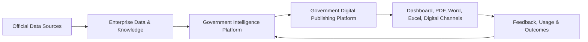
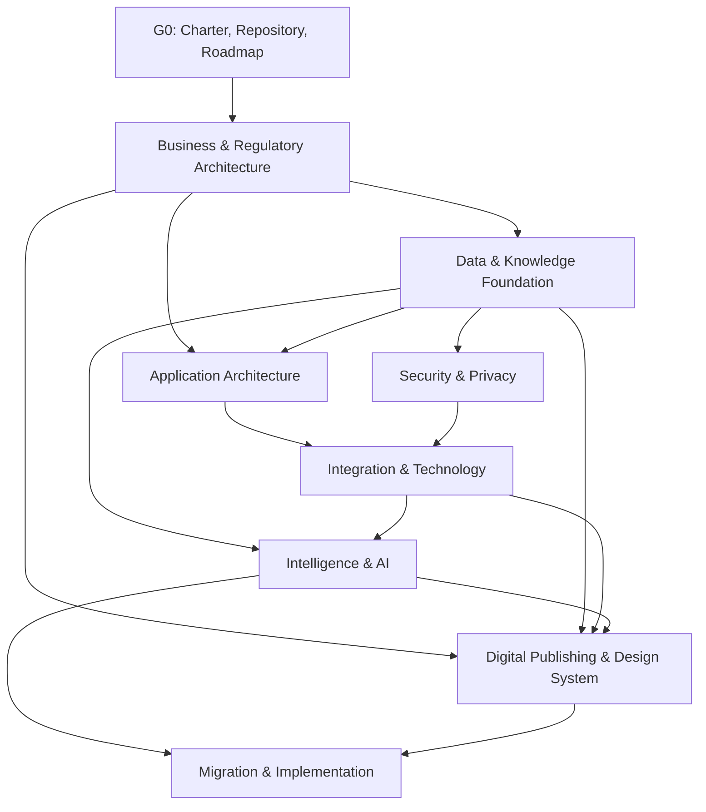
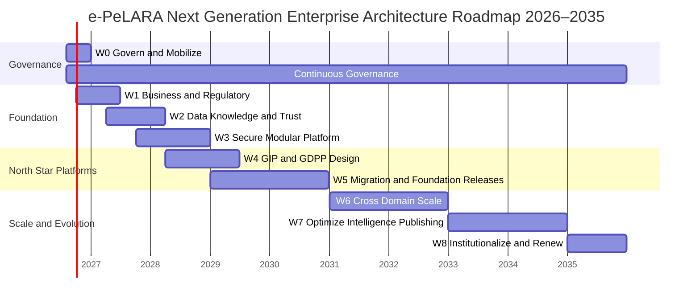
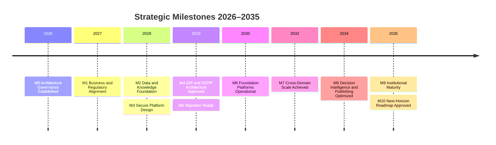

# 02 — Enterprise Architecture Roadmap

## Master Roadmap Enterprise Architecture e-PeLARA Next Generation 2026–2035

**Status:** Approved  
**Versi:** 1.0.0  
**Tanggal:** 4 Agustus 2026  
**Klasifikasi:** Master Enterprise Architecture Roadmap  
**Horizon:** 2026–2035  
**Otoritas induk:** `00-Architecture-Charter.md` Version 1.0.0 — Approved  
**Standar repository:** `01-Repository-Structure.md` Version 1.0.0 — Approved

---

## 1. Tujuan dan Kedudukan

Dokumen ini adalah **master roadmap** untuk penyusunan, pengesahan, implementasi, dan evolusi seluruh dokumentasi Enterprise Architecture e-PeLARA Next Generation.

Roadmap menetapkan:

1. arah arsitektur selama 5–10 tahun;
2. urutan penyusunan dokumen dan dependency;
3. prioritas lintas domain;
4. Architecture Gates;
5. implementation waves;
6. milestone dan deliverable;
7. Definition of Completion setiap fase; dan
8. jalur transformasi menuju **Government Intelligence Platform (GIP)** dan **Government Digital Publishing Platform (GDPP)**.

Roadmap ini bukan jadwal proyek source code yang kaku. Ia adalah kerangka pengendali yang memandu keputusan, investasi, work package, migrasi, dan acceptance gate. Detail waktu dapat disesuaikan melalui Change Log atau ADR tanpa mengubah tujuan strategis, sepanjang tetap konsisten dengan Architecture Charter.

---

## 2. Visi Roadmap 2026–2035

> **Dalam horizon 2026–2035, e-PeLARA Next Generation bertransformasi dari aplikasi perencanaan dan penganggaran menjadi platform pemerintahan berbasis data, pengetahuan, analitik, AI, dan publikasi digital yang terintegrasi, terpercaya, aman, dapat diaudit, serta berkelanjutan.**

### 2.1 Horizon Lima Tahun — 2026–2030

Fokus 2026–2030 adalah membangun fondasi dan mencapai platform operasional:

- governance dan arsitektur enterprise disahkan;
- business capability dan regulatory traceability dibentuk;
- data, knowledge, security, dan integration foundation dibangun;
- domain aplikasi dimodernisasi secara bertahap;
- Government Intelligence Platform mulai beroperasi;
- Government Digital Publishing Platform menghasilkan publikasi lintas format;
- migration waves berjalan tanpa mengganggu layanan inti; dan
- production readiness, observability, resilience, serta audit menjadi praktik standar.

### 2.2 Horizon Sepuluh Tahun — 2031–2035

Fokus 2031–2035 adalah scale, optimization, dan institutionalization:

- GIP berkembang menjadi decision intelligence lintas OPD;
- knowledge graph, ontology, dan government knowledge menjadi aset institusional;
- integrasi dengan sistem pemerintahan eksternal semakin matang;
- otomatisasi publikasi multi-channel mencapai skala enterprise;
- AI governance, evaluation, dan cost control menjadi kapabilitas permanen;
- platform dapat digunakan kembali untuk ekosistem aplikasi pemerintah daerah; dan
- arsitektur beradaptasi terhadap perubahan regulasi, teknologi, organisasi, serta periode perencanaan baru.

---

## 3. North Star Platforms

### 3.1 Government Intelligence Platform

GIP adalah lapisan terpadu yang mengubah data perencanaan, penganggaran, realisasi, kinerja, risiko, evaluasi, regulasi, dan pengetahuan menjadi insight yang dapat ditelusuri untuk mendukung keputusan pemerintah.

Kapabilitas target:

- trusted enterprise data;
- master/reference data dan temporal model;
- end-to-end data lineage;
- business glossary, ontology, taxonomy, dan knowledge graph;
- analytics, KPI, early warning, scenario, dan policy insight;
- AI gateway dan provider abstraction;
- prompt library dan AI evaluation;
- explainability, provenance, human approval, dan audit; serta
- secure access sesuai peran, OPD, dokumen, dan klasifikasi data.

### 3.2 Government Digital Publishing Platform

GDPP adalah lapisan publikasi enterprise yang menerapkan filosofi **One Data, Many Publications** untuk menghasilkan dashboard, PDF, Word, Excel, presentasi, infografis, dan kanal digital dari data serta narasi resmi yang sama.

Kapabilitas target:

- canonical document model;
- regulatory template registry;
- narrative dan publication pipeline;
- design tokens, layout, typography, component, chart, dan infographic system;
- Annual Report Style berkualitas kelas dunia;
- multiformat rendering dan consistency validation;
- accessibility, print readiness, versioning, approval, dan digital signature;
- asset and rights governance; serta
- publication lineage dari data hingga output final.

### 3.3 Hubungan GIP dan GDPP

GIP menyediakan data, makna, pengetahuan, analitik, dan insight yang dapat dipercaya. GDPP mengubahnya menjadi publikasi resmi yang konsisten, mudah dipahami, dan berkualitas tinggi.

---

## 4. Domain Enterprise Architecture

| Domain       | Tujuan Strategis                                                                         | Outcome 2030                                 | Outcome 2035                               |
| ------------ | ---------------------------------------------------------------------------------------- | -------------------------------------------- | ------------------------------------------ |
| Business     | Menyatukan capability, value stream, kewenangan, lifecycle dokumen, dan regulasi         | Proses end-to-end dan ownership disahkan     | Optimasi lintas OPD berbasis outcome       |
| Data         | Membangun single source of truth, lineage, quality, temporal model, dan governance       | Enterprise data foundation operasional       | Data ecosystem lintas OPD dan periode      |
| Application  | Menetapkan domain boundary, portfolio, modularity, workflow, dan lifecycle aplikasi      | Platform modular dengan legacy coexistence   | Reusable government application platform   |
| Integration  | Menetapkan API, event, interoperability, serta integrasi SIPD/e-SIGAP                    | Integration layer terkendali                 | Government interoperability ecosystem      |
| Technology   | Menetapkan platform, deployment, observability, performance, dan resilience              | Lingkungan operasional standar dan terpantau | Platform adaptif, efisien, dan scalable    |
| Security     | Menjaga identity, access, privacy, audit, threat control, dan continuity                 | Zero-trust-aligned control baseline          | Continuous assurance dan adaptive security |
| Intelligence | Mengelola analytics, knowledge, AI gateway, model, prompt, dan evaluation                | GIP Minimum Viable Platform beroperasi       | Decision intelligence lintas OPD           |
| Publishing   | Mengelola document model, design system, rendering, template, dan publication governance | GDPP multi-format beroperasi                 | Automated government publishing ecosystem  |

### 4.1 Cross-Cutting Layers

Tiga lapisan berlaku pada seluruh domain:

1. **Governance Layer** — Charter, ADR, issue, risk, compliance, standards, gates, dan Change Log.
2. **Knowledge Layer** — Government Knowledge, ontology, taxonomy, prompt, evaluation, pattern, benchmark, dan research notes.
3. **Presentation Layer** — Design System, typography, layout, components, chart, infographic, publication system, dan Annual Report Style.

---

## 5. Skala Prioritas

| Prioritas  | Definisi                                                                    | Kriteria                                                                                |
| ---------- | --------------------------------------------------------------------------- | --------------------------------------------------------------------------------------- |
| `Critical` | Harus tersedia agar pekerjaan lain sah, aman, atau dapat dimulai            | Blocking dependency, kewenangan, regulasi, data/security foundation, atau risiko tinggi |
| `High`     | Sangat penting untuk mencapai target platform dan architecture gate         | Dampak lintas domain, nilai operasional tinggi, atau dependency utama                   |
| `Medium`   | Diperlukan untuk kelengkapan, optimasi, atau scale setelah fondasi tersedia | Tidak memblokir fase awal tetapi penting untuk maturitas                                |
| `Low`      | Dapat dilakukan setelah kapabilitas utama stabil                            | Enhancement, eksperimen, atau manfaat jangka panjang                                    |

Prioritas tidak otomatis menentukan tanggal. Sequencing mempertimbangkan dependency, kapasitas, risiko, regulasi, readiness, dan keputusan Project Owner.

---

## 6. Master Document Sequence

### 6.1 Foundation and Governance Documents

| Seq | Document ID  | Dokumen                                      | Klasifikasi         | Prioritas | Dependency                               | Gate  |
| --- | ------------ | -------------------------------------------- | ------------------- | --------- | ---------------------------------------- | ----- |
| 00  | GOV-EA-001   | `00-Architecture-Charter.md`                 | Governance          | Critical  | Official Baseline                        | G0    |
| 01  | GOV-REP-001  | `01-Repository-Structure.md`                 | Governance Standard | Critical  | Charter                                  | G0    |
| 02  | RM-EA-001    | `02-Enterprise-Architecture-Roadmap.md`      | Roadmap             | Critical  | Charter, Repository Standard             | G0    |
| 03  | AIR-EA-001   | `Architecture-Issue-Register.md`             | Issue Register      | Critical  | Charter, Baseline                        | G0–G6 |
| 04  | GOV-EA-002   | `Architecture-Risk-Register.md`              | Governance          | High      | Charter, Roadmap                         | G0–G6 |
| 05  | GOV-COMP-001 | `Compliance-Register.md`                     | Governance          | Critical  | Baseline, regulatory references          | G1–G6 |
| 06  | GOV-EA-003   | `Change-Log.md`                              | Governance          | Critical  | Repository Standard                      | G0–G6 |
| 07  | GOV-EA-004   | `Architecture-Governance-Operating-Model.md` | Governance          | High      | Charter, Roadmap                         | G1    |
| 08  | GOV-EA-005   | `Architecture-Review-and-Gate-Standard.md`   | Standard            | High      | Governance Operating Model               | G1    |
| 09  | GOV-EA-006   | `Traceability-Standard.md`                   | Standard            | High      | Repository Standard, Compliance Register | G1    |

### 6.2 Business Architecture Documents

| Seq | Document ID  | Dokumen                                       | Prioritas | Dependency                         | Gate  |
| --- | ------------ | --------------------------------------------- | --------- | ---------------------------------- | ----- |
| 10  | ARCH-BUS-001 | `Business-Architecture-Overview.md`           | Critical  | Roadmap, Baseline                  | G1    |
| 11  | BP-BUS-001   | `Business-Capability-Map.md`                  | Critical  | Business Overview                  | G1    |
| 12  | BP-BUS-002   | `Planning-to-Accountability-Value-Streams.md` | Critical  | Capability Map                     | G1    |
| 13  | BP-BUS-003   | `Government-Document-Lifecycle-Blueprint.md`  | Critical  | Value Streams, regulations         | G1    |
| 14  | BP-BUS-004   | `Roles-Authority-and-Approval-Blueprint.md`   | High      | Document Lifecycle                 | G1    |
| 15  | REF-BUS-001  | `Business-Glossary.md`                        | Critical  | Capability Map, Baseline           | G1–G2 |
| 16  | BP-BUS-005   | `Regulatory-Requirement-Traceability.md`      | Critical  | Compliance Register, Value Streams | G1    |
| 17  | STD-BUS-001  | `Business-Process-Modeling-Standard.md`       | Medium    | Business Overview                  | G1    |

### 6.3 Data and Knowledge Architecture Documents

| Seq | Document ID   | Dokumen                                                 | Prioritas | Dependency                                                                                     | Gate |
| --- | ------------- | ------------------------------------------------------- | --------- | ---------------------------------------------------------------------------------------------- | ---- |
| 18  | ARCH-DATA-001 | `Enterprise-Data-Architecture.md`                       | Critical  | G1 deliverables, Baseline                                                                      | G2   |
| 19  | BP-DATA-001   | `Enterprise-Data-Domain-Model.md`                       | Critical  | Enterprise Data Architecture                                                                   | G2   |
| 20  | BP-DATA-002   | `Master-and-Reference-Data-Blueprint.md`                | Critical  | Data Domain Model                                                                              | G2   |
| 21  | ADR-0001      | Temporal Model Decision                                 | Critical  | AIR-001 — Siklus Renstra dinyatakan 5 tahun dan 6 tahun pada bagian berbeda; Data Domain Model | G2   |
| 22  | BP-DATA-003   | `Data-Lineage-and-Traceability-Blueprint.md`            | Critical  | Data Domain Model, value streams                                                               | G2   |
| 23  | STD-DATA-001  | `Data-Quality-Standard.md`                              | High      | Data Domain Model                                                                              | G2   |
| 24  | GOV-DATA-001  | `Data-Governance-Operating-Model.md`                    | Critical  | Data Architecture                                                                              | G2   |
| 25  | STD-DATA-002  | `Data-Classification-Retention-and-Privacy-Standard.md` | Critical  | Security inputs, regulations                                                                   | G2   |
| 26  | BP-DATA-004   | `Enterprise-Knowledge-Model.md`                         | High      | Business Glossary, Data Domain Model                                                           | G2   |
| 27  | BP-DATA-005   | `Government-Ontology-and-Taxonomy.md`                   | High      | Knowledge Model                                                                                | G2   |
| 28  | GOV-AI-001    | `Knowledge-Lifecycle-and-Provenance-Standard.md`        | High      | Knowledge Model, Repository Standard                                                           | G2   |

### 6.4 Application and Integration Architecture Documents

| Seq | Document ID  | Dokumen                                    | Prioritas | Dependency                                                                                                                             | Gate  |
| --- | ------------ | ------------------------------------------ | --------- | -------------------------------------------------------------------------------------------------------------------------------------- | ----- |
| 29  | ARCH-APP-001 | `Application-Architecture.md`              | Critical  | G1–G2 deliverables                                                                                                                     | G3    |
| 30  | REF-APP-001  | `Application-Portfolio-Catalog.md`         | High      | Baseline, Application Architecture                                                                                                     | G3    |
| 31  | BP-APP-001   | `Domain-and-Bounded-Context-Blueprint.md`  | Critical  | Capability Map, Data Domains                                                                                                           | G3    |
| 32  | BP-APP-002   | `Enterprise-Workflow-State-Model.md`       | Critical  | Document Lifecycle; AIR-004 — Workflow approval disebut belum tersedia, sementara perkembangan proyek menunjukkan implementasi parsial | G3    |
| 33  | BP-APP-003   | `Application-Modularization-Blueprint.md`  | High      | Domain Blueprint, Portfolio                                                                                                            | G3    |
| 34  | ARCH-INT-001 | `Integration-Architecture.md`              | Critical  | Application and Data Architecture                                                                                                      | G3    |
| 35  | STD-INT-001  | `API-Design-and-Versioning-Standard.md`    | Critical  | Integration Architecture                                                                                                               | G3    |
| 36  | STD-INT-002  | `Event-and-Notification-Standard.md`       | High      | Integration Architecture, workflow model                                                                                               | G3    |
| 37  | REF-INT-001  | `API-and-Event-Catalog.md`                 | High      | API/Event Standards                                                                                                                    | G3–G6 |
| 38  | BP-INT-001   | `SIPD-Integration-Blueprint.md`            | High      | Integration Architecture; AIR-007 — Status integrasi SIPD masih berupa gap                                                             | G3    |
| 39  | BP-INT-002   | `e-SIGAP-Integration-and-SSO-Blueprint.md` | High      | Identity Blueprint, Integration Architecture                                                                                           | G3    |

### 6.5 Technology and Security Architecture Documents

| Seq | Document ID   | Dokumen                                                 | Prioritas | Dependency                                                       | Gate  |
| --- | ------------- | ------------------------------------------------------- | --------- | ---------------------------------------------------------------- | ----- |
| 40  | ARCH-TECH-001 | `Technology-Architecture.md`                            | Critical  | Application/Integration Architecture                             | G3    |
| 41  | STD-TECH-001  | `Technology-Standards-Catalog.md`                       | High      | Technology Architecture                                          | G3    |
| 42  | BP-TECH-001   | `Environment-and-Deployment-Blueprint.md`               | Critical  | Technology Architecture                                          | G3–G5 |
| 43  | BP-TECH-002   | `Observability-and-Operations-Blueprint.md`             | High      | Deployment Blueprint                                             | G3–G5 |
| 44  | BP-TECH-003   | `Resilience-Backup-and-Disaster-Recovery-Blueprint.md`  | Critical  | Technology; AIR-009 — Backup dan restore otomatis belum tersedia | G3–G5 |
| 45  | ARCH-SEC-001  | `Security-Architecture.md`                              | Critical  | Business, Data, Application inputs                               | G3    |
| 46  | BP-SEC-001    | `Identity-Access-and-Separation-of-Duties-Blueprint.md` | Critical  | Roles/Authority Blueprint                                        | G3    |
| 47  | BP-SEC-002    | `Security-Privacy-and-Audit-Control-Blueprint.md`       | Critical  | Data Classification, Security Architecture                       | G3    |
| 48  | BP-SEC-003    | `Threat-Model-and-Security-Zones.md`                    | High      | App/Integration/Technology Architecture                          | G3    |
| 49  | STD-SEC-001   | `Secure-Engineering-and-Secrets-Standard.md`            | Critical  | Security Architecture                                            | G3–G5 |

### 6.6 Intelligence and AI Architecture Documents

| Seq | Document ID | Dokumen                                            | Prioritas | Dependency                              | Gate  |
| --- | ----------- | -------------------------------------------------- | --------- | --------------------------------------- | ----- |
| 50  | ARCH-AI-001 | `Government-Intelligence-Platform-Architecture.md` | Critical  | G1–G3 foundations                       | G3    |
| 51  | BP-AI-001   | `Analytics-and-Decision-Intelligence-Blueprint.md` | High      | Data/Knowledge Architecture             | G3    |
| 52  | BP-AI-002   | `AI-Gateway-and-Provider-Abstraction-Blueprint.md` | High      | Integration, Security, Technology       | G3    |
| 53  | GOV-AI-002  | `Responsible-AI-Governance-Standard.md`            | Critical  | Charter, Security, Knowledge Governance | G3    |
| 54  | STD-AI-001  | `Prompt-Library-Standard.md`                       | High      | Knowledge Lifecycle, AI Governance      | G3    |
| 55  | STD-AI-002  | `AI-Evaluation-and-Acceptance-Standard.md`         | Critical  | AI Governance, Prompt Standard          | G3–G6 |
| 56  | REF-AI-001  | `AI-Model-Prompt-and-Evaluation-Register.md`       | High      | AI standards                            | G3–G6 |
| 57  | BP-AI-003   | `Knowledge-Graph-and-Retrieval-Blueprint.md`       | Medium    | Ontology, Data Architecture, Security   | G3    |

### 6.7 Publishing and Design System Documents

| Seq | Document ID  | Dokumen                                                  | Prioritas | Dependency                              | Gate  |
| --- | ------------ | -------------------------------------------------------- | --------- | --------------------------------------- | ----- |
| 58  | ARCH-PUB-001 | `Government-Digital-Publishing-Platform-Architecture.md` | Critical  | Business/Data/Application foundations   | G3    |
| 59  | BP-PUB-001   | `Canonical-Document-Model-Blueprint.md`                  | Critical  | Document Lifecycle, Data Lineage        | G3    |
| 60  | BP-PUB-002   | `Multiformat-Publishing-Pipeline-Blueprint.md`           | Critical  | Canonical Document Model, Technology    | G3    |
| 61  | GOV-PUB-001  | `Publication-Governance-and-Approval-Standard.md`        | Critical  | Roles/Approval, regulatory traceability | G3    |
| 62  | STD-PUB-001  | `Government-Design-System-Standard.md`                   | Critical  | Publishing Architecture, Accessibility  | G3    |
| 63  | STD-PUB-002  | `Typography-Layout-and-Annual-Report-Style.md`           | High      | Design System Standard                  | G3    |
| 64  | STD-PUB-003  | `Chart-and-Infographic-Standard.md`                      | High      | Data Quality, Design System             | G3    |
| 65  | STD-PUB-004  | `Publication-Accessibility-and-Quality-Standard.md`      | High      | Design System, regulations              | G3–G6 |
| 66  | REF-PUB-001  | `Template-and-Publication-Asset-Register.md`             | High      | Publication standards                   | G3–G6 |

### 6.8 Transition and Implementation Documents

| Seq | Document ID | Dokumen                                          | Prioritas | Dependency                               | Gate  |
| --- | ----------- | ------------------------------------------------ | --------- | ---------------------------------------- | ----- |
| 67  | RM-MIG-001  | `Migration-and-Modernization-Roadmap.md`         | Critical  | Approved domain blueprints               | G4    |
| 68  | BP-MIG-001  | `Transition-Architecture-01-Foundation.md`       | Critical  | Migration Roadmap                        | G4    |
| 69  | BP-MIG-002  | `Transition-Architecture-02-Platform.md`         | High      | Transition 01                            | G4    |
| 70  | BP-MIG-003  | `Transition-Architecture-03-Scale.md`            | Medium    | Transition 02                            | G4    |
| 71  | GOV-MIG-001 | `Implementation-Readiness-Checklist.md`          | Critical  | G4 deliverables                          | G5    |
| 72  | GOV-MIG-002 | `Production-Readiness-Checklist.md`              | Critical  | Security, resilience, testing inputs     | G6    |
| 73  | RM-MIG-002  | `Legacy-Coexistence-and-Decommissioning-Plan.md` | High      | Application Portfolio, Migration Roadmap | G4–G6 |
| 74  | REF-EA-001  | `Enterprise-Architecture-Traceability-Matrix.md` | Critical  | All approved artifacts                   | G1–G6 |

### 6.9 Sequencing Rule

Nomor sequence menunjukkan urutan logis, bukan kewajiban menyelesaikan seluruh dokumen secara serial. Dokumen yang tidak memiliki dependency langsung dapat disusun paralel setelah input minimumnya tersedia. Tidak ada dokumen yang boleh disahkan apabila dependency normatifnya belum Approved/Active, kecuali diberi conditional approval dengan issue, risiko, dan tanggal penyelesaian yang eksplisit.

---

## 7. Dependency Map Antar Dokumen

### 7.1 Critical Dependency Chains

| Chain                   | Dependency                                                                                                        |
| ----------------------- | ----------------------------------------------------------------------------------------------------------------- |
| Regulatory Traceability | Charter → Capability/Value Stream → Compliance Register → Regulatory Requirements → Controls/Tests                |
| Planning-to-Performance | Business Lifecycle → Data Domain → Lineage → Application Domain → Workflow → Analytics                            |
| Secure Platform         | Data Classification → Identity/Access → Security Zones → Secure Engineering → Production Gate                     |
| GIP                     | Data Foundation → Knowledge Model → Integration → Security → Analytics → AI Governance → AI Evaluation            |
| GDPP                    | Document Lifecycle → Canonical Document Model → Data Lineage → Design System → Publishing Pipeline → Quality Gate |
| Migration               | Approved Blueprints → Gap/Impact → Transition Architecture → Work Packages → G5 → Implementation → G6             |

---

## 8. Architecture Gates

| Gate | Nama                              | Keputusan Utama                                  | Evidence Minimum                                                                                                    | Otoritas                                        |
| ---- | --------------------------------- | ------------------------------------------------ | ------------------------------------------------------------------------------------------------------------------- | ----------------------------------------------- |
| G0   | Charter Approved                  | Program arsitektur boleh dimulai                 | Charter, Official Baseline, Repository Standard, Master Roadmap, initial issue register                             | Project Owner                                   |
| G1   | Business and Regulatory Alignment | Target proses dan kewenangan sah                 | Capability map, value streams, document lifecycle, roles/approval, regulatory traceability                          | Project Owner berdasarkan rekomendasi CEA       |
| G2   | Data and Knowledge Foundation     | Model data/knowledge dapat menjadi fondasi       | Data domains, ownership, master/reference, temporal model ADR, lineage, quality, glossary, ontology, retention      | Project Owner/owner data                        |
| G3   | Integrated Target Architecture    | Target platform lengkap dan konsisten            | App domains, workflow, APIs/events, technology, security, GIP, GDPP, Design System, AI governance                   | Project Owner berdasarkan Architecture Review   |
| G4   | Migration Ready                   | Transisi boleh direncanakan sebagai work package | Gap analysis, transition architectures, dependency, cost/risk, coexistence, rollback, acceptance                    | Project Owner                                   |
| G5   | Implementation Ready              | Work package boleh diimplementasikan             | Traceability, design package, test plan, migration plan, environment, security, operations, rollback                | Penanggung jawab implementasi dan Project Owner |
| G6   | Production Ready                  | Rilis boleh go-live                              | Functional/integration/regression/performance/security/UAT evidence, backup/restore, operations, rollback, approval | Project Owner                                   |

### 8.1 Gate Rules

- gate adalah keputusan resmi, bukan sekadar rapat status;
- keputusan gate harus `Passed`, `Conditionally Passed`, atau `Not Passed`;
- conditional pass wajib memiliki issue, owner, due date, risiko, dan batas penggunaan;
- evidence harus ditautkan dalam Traceability Matrix;
- keputusan berdampak arsitektur dicatat melalui ADR; dan
- G5 dan G6 diterapkan per work package/release, bukan hanya sekali untuk seluruh program.

---

## 9. Implementation Waves 2026–2035

### Wave 0 — Govern and Mobilize (Q3–Q4 2026)

**Tujuan:** membentuk kendali arsitektur dan repository resmi.

**Prioritas:** Critical.

**Deliverables:**

- Architecture Charter;
- Repository Governance Standard;
- Master EA Roadmap;
- Issue, Risk, Compliance, dan Change registers;
- ADR template dan Architecture Review Standard;
- root repository, README, metadata, dan document index; serta
- Official Baseline terdaftar.

**Definition of Completion:**

- G0 Passed;
- seluruh artefak governance memiliki owner, status, versi, dan link;
- issue awal memiliki ID dan treatment path;
- struktur repository dapat digunakan konsisten; dan
- perubahan dokumen resmi terkendali.

### Wave 1 — Align Government Business (Q4 2026–Q2 2027)

**Tujuan:** menyepakati capability, proses, kewenangan, lifecycle dokumen, dan regulasi.

**Prioritas:** Critical.

**Deliverables:**

- Business Architecture Overview;
- Capability Map;
- Planning-to-Accountability Value Streams;
- Government Document Lifecycle;
- Roles, Authority, and Approval Blueprint;
- Business Glossary;
- Regulatory Requirement Traceability; dan
- Architecture Governance Operating Model.

**Definition of Completion:**

- G1 Passed;
- seluruh domain bisnis inti memiliki owner;
- lifecycle RPJMD hingga LAKIP/LKjIP terhubung;
- titik approval dan separation of duties didefinisikan;
- requirement regulatif terhubung dengan capability/proses; dan
- unresolved contradiction masuk Issue Register tanpa mengaburkan target state.

### Wave 2 — Build Data, Knowledge and Trust Foundation (Q2 2027–Q1 2028)

**Tujuan:** membangun single source of truth dan Knowledge Layer.

**Prioritas:** Critical.

**Deliverables:**

- Enterprise Data Architecture;
- Data Domain Model;
- Master/Reference Data Blueprint;
- Temporal Model ADR;
- Data Lineage Blueprint;
- Data Quality Standard;
- Data Governance Operating Model;
- Data Classification, Retention, and Privacy Standard;
- Knowledge Model, ontology, taxonomy, provenance; dan
- initial `13-knowledge/` catalogs.

**Definition of Completion:**

- G2 Passed;
- data owner dan steward ditetapkan untuk domain inti;
- sumber otoritatif, identifier, periode, versi, dan lineage didefinisikan;
- konflik 5/6 tahun diselesaikan melalui ADR temporal model;
- business glossary, ontology, dan taxonomy memiliki governance;
- quality rules dan data classification dapat diuji; dan
- knowledge asset memiliki provenance serta lifecycle.

### Wave 3 — Design Secure Modular Platform (Q4 2027–Q4 2028)

**Tujuan:** menetapkan target application, integration, technology, dan security architecture.

**Prioritas:** Critical–High.

**Deliverables:**

- Application Architecture dan portfolio;
- Domain/Bounded Context Blueprint;
- Enterprise Workflow State Model;
- Integration Architecture;
- API/Event Standards dan catalogs;
- SIPD dan e-SIGAP blueprints;
- Technology, Deployment, Observability, dan Resilience blueprints;
- Security Architecture;
- Identity/Access, privacy/audit, threat model, dan secure engineering standards; serta
- approved domain ADRs.

**Definition of Completion:**

- target domain boundary dan ownership tidak ambigu;
- kontrak integrasi, versioning, error, dan security rules ditetapkan;
- deployment environments dan operational controls didefinisikan;
- RPO/RTO, backup/restore, observability, dan incident expectations tersedia;
- security controls terhubung ke threat dan data classification; dan
- input inti G3 untuk platform tersedia.

### Wave 4 — Establish GIP and GDPP Designs (Q2 2028–Q2 2029)

**Tujuan:** menyelesaikan target architecture dua North Star Platforms.

**Prioritas:** Critical–High.

**Deliverables GIP:**

- Government Intelligence Platform Architecture;
- Analytics and Decision Intelligence Blueprint;
- AI Gateway Blueprint;
- Responsible AI Governance;
- Prompt Library Standard;
- AI Evaluation and Acceptance Standard;
- model/prompt/evaluation register; dan
- Knowledge Graph/Retrieval Blueprint.

**Deliverables GDPP:**

- Government Digital Publishing Platform Architecture;
- Canonical Document Model;
- Multiformat Publishing Pipeline;
- Publication Governance and Approval;
- Government Design System;
- Typography, Layout, Annual Report, Chart, Infographic, Accessibility, dan Quality Standards;
- template/asset register; dan
- initial `14-design-system/` release.

**Definition of Completion:**

- G3 Passed;
- GIP dan GDPP menggunakan data/knowledge foundation yang sama;
- AI memiliki human oversight, evaluation, fallback, cost, privacy, dan audit controls;
- canonical document model menjaga konsistensi lintas PDF/Word/Excel/dashboard;
- Design System berlaku lintas aplikasi dan publikasi;
- Annual Report Style tidak mengurangi regulatory fidelity; dan
- publication lineage dari data ke output dapat dijelaskan.

### Wave 5 — Plan Migration and Deliver Foundation Releases (Q1 2029–Q4 2030)

**Tujuan:** menerjemahkan blueprint menjadi transition architecture dan rilis terukur.

**Prioritas:** Critical–High.

**Deliverables:**

- Migration and Modernization Roadmap;
- gap, impact, cost, risk, dan dependency assessments;
- Transition Architecture 01–02;
- legacy coexistence dan decommissioning plan;
- implementation/production readiness checklists;
- prioritized work packages;
- foundational GIP services;
- foundational GDPP services;
- migrated pilot domains; dan
- operational evidence per release.

**Definition of Completion:**

- G4 Passed untuk master migration plan;
- setiap work package melewati G5 sebelum implementasi;
- setiap release produksi melewati G6;
- rollback dan data reconciliation terbukti;
- sistem berjalan tetap terlindungi selama coexistence;
- pilot menunjukkan nilai, keamanan, reliability, dan usability; dan
- keputusan scale dibuat berdasarkan evidence.

### Wave 6 — Scale Across Planning and Performance Domains (2031–2032)

**Tujuan:** memperluas GIP dan GDPP ke seluruh rantai perencanaan–akuntabilitas dan lintas OPD prioritas.

**Prioritas:** High–Medium.

**Deliverables:**

- expanded data domains dan integrations;
- cross-document intelligence;
- portfolio-wide workflow dan approval;
- multi-OPD analytics;
- expanded publication templates dan channels;
- knowledge graph enrichment;
- automation observability dan cost management; serta
- Transition Architecture 03.

**Definition of Completion:**

- domain yang diprioritaskan memiliki lineage end-to-end;
- insight dan publication outputs berasal dari authoritative sources;
- adoption dan data quality mencapai target yang disetujui;
- security, privacy, dan AI evaluation beroperasi kontinu; dan
- legacy component hanya dipertahankan dengan alasan serta retirement plan.

### Wave 7 — Optimize Decision Intelligence and Publishing (2033–2034)

**Tujuan:** meningkatkan prediksi, scenario, personalization, kualitas publikasi, serta efisiensi operasional.

**Prioritas:** Medium.

**Deliverables:**

- advanced decision intelligence;
- scenario dan policy simulation dengan guard;
- proactive risk/early warning;
- semantic search dan government knowledge services;
- intelligent narrative and publication assistance;
- publication analytics dan feedback loop;
- performance/cost optimization; dan
- updated standards berdasarkan evidence.

**Definition of Completion:**

- advanced intelligence memiliki validasi, explainability, dan human accountability;
- tidak ada keputusan resmi otomatis tanpa pejabat berwenang;
- kualitas publikasi terukur dan konsisten;
- penggunaan AI dan platform cost-effective; dan
- optimization tidak mengurangi keamanan, kepatuhan, atau traceability.

### Wave 8 — Institutionalize and Renew (2035)

**Tujuan:** menjadikan arsitektur sebagai kapabilitas institusional berkelanjutan dan menyiapkan horizon berikutnya.

**Prioritas:** High untuk governance; Medium–Low untuk enhancement.

**Deliverables:**

- enterprise architecture maturity assessment;
- regulatory and technology horizon scan;
- platform renewal strategy;
- next-period data and planning transition;
- reusable government platform catalog;
- lessons learned dan pattern library institutionalization; dan
- Roadmap 2036–2045.

**Definition of Completion:**

- governance, funding, ownership, kompetensi, dan operating model berkelanjutan;
- critical architecture debt memiliki treatment plan;
- knowledge dan Design System menjadi aset institusional;
- roadmap baru disahkan sebelum horizon lama berakhir; dan
- keputusan renewal didukung evidence outcome 2026–2035.

---

## 10. Diagram Roadmap Keseluruhan

### 10.1 Milestone Timeline

---

## 11. Milestone Register

| ID  | Target  | Milestone                             | Gate/Decision     | Evidence Utama                                                         |
| --- | ------- | ------------------------------------- | ----------------- | ---------------------------------------------------------------------- |
| M0  | Q4 2026 | Architecture Governance Established   | G0                | Charter, repository, roadmap, registers, operating process             |
| M1  | Q2 2027 | Business and Regulatory Alignment     | G1                | Capabilities, value streams, lifecycle, roles, compliance traceability |
| M2  | Q1 2028 | Data and Knowledge Foundation         | G2                | Data domains, temporal ADR, lineage, governance, glossary, ontology    |
| M3  | Q4 2028 | Secure Modular Platform Design        | G3 input          | App, integration, technology, security blueprints                      |
| M4  | Q2 2029 | GIP and GDPP Architecture Approved    | G3                | Intelligence, AI, publishing, Design System artifacts                  |
| M5  | Q3 2029 | Migration Ready                       | G4                | Roadmap, transition architecture, coexistence, risk/cost, rollback     |
| M6  | Q4 2030 | Foundation Platforms Operational      | G5/G6 per release | Pilot GIP/GDPP services and production evidence                        |
| M7  | Q4 2032 | Cross-Domain Scale Achieved           | Portfolio review  | End-to-end lineage, multi-OPD adoption, expanded publications          |
| M8  | Q4 2034 | Intelligence and Publishing Optimized | Maturity review   | Advanced analytics, semantic knowledge, publication feedback           |
| M9  | Q2 2035 | Institutional Maturity Confirmed      | EA maturity gate  | Governance, capability, ownership, funding, controls                   |
| M10 | Q4 2035 | Roadmap 2036–2045 Approved            | New G0            | New Charter alignment and master roadmap                               |

---

## 12. Phase Deliverable Matrix

| Fase | Business                               | Data/Knowledge                           | App/Integration              | Tech/Security                  | Intelligence           | Publishing                 | Transition                      |
| ---- | -------------------------------------- | ---------------------------------------- | ---------------------------- | ------------------------------ | ---------------------- | -------------------------- | ------------------------------- |
| W0   | Scope                                  | Baseline register                        | Portfolio baseline           | Initial risks                  | AI guard               | Publishing mandate         | Master roadmap                  |
| W1   | Capabilities, value streams, lifecycle | Glossary seed                            | Process/application linkage  | Role/authority inputs          | Use-case inventory     | Publication requirements   | Priority map                    |
| W2   | Data ownership                         | Domains, MDM, lineage, quality, ontology | Data contracts input         | Classification/privacy         | Knowledge foundation   | Canonical data input       | Data transition constraints     |
| W3   | Workflow requirements                  | Logical/physical mappings                | Domain, API, event, workflow | Platform, security, resilience | Platform dependencies  | Rendering dependencies     | Technical gap inputs            |
| W4   | Decision/publication use cases         | Knowledge graph inputs                   | GIP/GDPP service boundaries  | AI/publishing controls         | GIP blueprints         | GDPP + Design System       | Transition candidates           |
| W5   | Pilot processes                        | Migrated/reconciled data                 | Foundation services          | Operational evidence           | GIP MVP                | GDPP MVP                   | Coexistence, rollback, releases |
| W6   | Cross-OPD adoption                     | Expanded domains                         | Portfolio scale              | Scale controls                 | Multi-OPD intelligence | Multi-channel publishing   | Legacy retirement               |
| W7   | Outcome optimization                   | Semantic enrichment                      | Service optimization         | Cost/performance assurance     | Advanced intelligence  | Intelligent publishing     | Architecture debt reduction     |
| W8   | Institutional operating model          | Long-term knowledge stewardship          | Reusable platform portfolio  | Renewal strategy               | AI maturity            | Design/publishing maturity | Next roadmap                    |

---

## 13. Definition of Completion Umum

Setiap fase hanya dapat dinyatakan selesai apabila:

1. seluruh deliverable wajib tersedia pada repository resmi;
2. status, version, owner, approver, dan effective date tercatat;
3. dependency normatif terpenuhi;
4. decision penting memiliki ADR;
5. issue, risk, dan compliance status diperbarui;
6. traceability ke Charter, requirement, regulasi, blueprint, dan test tersedia sesuai fase;
7. diagram memiliki source yang dapat diedit;
8. tidak ada credential atau data sensitif yang tersimpan tanpa kewenangan;
9. repository quality gate lulus;
10. acceptance criteria fase terbukti, bukan hanya dinyatakan;
11. Architecture Gate terkait memperoleh keputusan resmi; dan
12. Change Log diperbarui.

Completion tidak berarti semua issue harus ditutup. Issue dapat dibawa ke fase berikutnya apabila non-blocking, memiliki owner, risiko, target penyelesaian, dan persetujuan yang jelas.

---

## 14. Roadmap Governance

### 14.1 Review Cadence

| Review                    | Frekuensi                    | Fokus                                                |
| ------------------------- | ---------------------------- | ---------------------------------------------------- |
| Roadmap health review     | Bulanan pada fase aktif      | dependency, blocker, deliverable, issue, risk        |
| Architecture Gate review  | Pada akhir fase/work package | evidence dan keputusan gate                          |
| Quarterly roadmap review  | Triwulanan                   | prioritas, kapasitas, milestone, perubahan eksternal |
| Annual strategic review   | Tahunan                      | outcome, regulasi, teknologi, funding, horizon       |
| Five-year midpoint review | 2030                         | realisasi GIP/GDPP dan penyesuaian 2031–2035         |

### 14.2 Change Rules

- perubahan tanggal atau sequencing minor dicatat di Change Log;
- perubahan dependency, target platform, gate, atau scope strategis memerlukan ADR;
- perubahan yang bertentangan dengan Charter tidak dapat disahkan melalui roadmap;
- perubahan prioritas harus mencatat alasan, dampak, dan risiko;
- approved milestone tidak dihapus; statusnya diubah dan historinya dipertahankan; dan
- roadmap diperbarui sebagai dokumen yang sama sesuai versioning standard.

### 14.3 Progress Status

Setiap deliverable menggunakan status:

- `Not Started`;
- `Proposed`;
- `Drafting`;
- `In Review`;
- `Draft for Approval`;
- `Approved`;
- `Active/Implementing`;
- `Completed`;
- `Blocked`; atau
- `Superseded`.

Persentase kemajuan tidak boleh digunakan tanpa definisi output yang objektif. Status gate dan bukti completion lebih utama daripada angka persentase subjektif.

---

## 15. Assumptions and Constraints

### 15.1 Assumptions

- lima Current State documents tetap menjadi Official Baseline;
- transformasi dilakukan secara incremental;
- Project Owner mempertahankan kewenangan persetujuan strategis;
- domain pemerintahan dan teknis dapat berkembang melalui blueprint/ADR;
- integrasi eksternal bergantung pada akses dan kebijakan pemilik sistem; dan
- resource plan rinci ditetapkan pada Migration Roadmap dan work package.

### 15.2 Constraints

- tidak melakukan audit ulang repository/database kecuali diminta khusus;
- tidak mengubah source code pada fase penyusunan blueprint;
- sistem berjalan harus dilindungi selama coexistence;
- kepatuhan regulasi Indonesia tidak dapat ditukar dengan kualitas visual atau kecepatan;
- AI tidak menggantikan kewenangan pejabat;
- secret dan data sensitif tidak disimpan di dokumentasi;
- perubahan Charter dan Repository Standard mengikuti ADR/Change Log; dan
- jadwal bergantung pada kapasitas, pendanaan, regulasi, akses integrasi, dan readiness organisasi.

---

## 16. Success Measures

| Dimensi      | Ukuran Arah                                                                  | Target Penetapan |
| ------------ | ---------------------------------------------------------------------------- | ---------------- |
| Governance   | Gate compliance, ADR traceability, issue aging                               | Ditetapkan W0–W1 |
| Business     | Capability ownership dan process coverage                                    | W1               |
| Data         | Quality, lineage, duplicate reduction, authoritative-source coverage         | W2               |
| Application  | Modularity, dependency reduction, workflow coverage                          | W3               |
| Integration  | Contract coverage, reliability, version compliance                           | W3–W5            |
| Technology   | Availability, performance, observability, RPO/RTO                            | W3–W5            |
| Security     | Control coverage, findings, incident response, access review                 | W3–W5            |
| Intelligence | Insight accuracy, explainability, adoption, AI evaluation pass rate          | W4–W6            |
| Publishing   | Cross-format consistency, accessibility, regulatory fidelity, visual quality | W4–W6            |
| Migration    | Reconciliation, rollback success, release quality, legacy retirement         | W5–W8            |

Target kuantitatif ditetapkan setelah baseline pengukuran tersedia dan disahkan dalam blueprint atau roadmap implementasi terkait.

---

## 17. Immediate Next Documents

Setelah roadmap disahkan, urutan terdekat adalah:

1. `Architecture-Issue-Register.md`;
2. `Architecture-Risk-Register.md`;
3. `Compliance-Register.md`;
4. `Change-Log.md`;
5. `Architecture-Governance-Operating-Model.md`;
6. `Architecture-Review-and-Gate-Standard.md`;
7. `Traceability-Standard.md`;
8. `Business-Architecture-Overview.md`;
9. `Business-Capability-Map.md`; dan
10. `Planning-to-Accountability-Value-Streams.md`.

Penyusunan dapat dilakukan bertahap dan paralel hanya jika dependency minimum telah tersedia. Dokumen tidak dibuat sekadar untuk memenuhi daftar; setiap dokumen harus memiliki keputusan, ownership, dan manfaat governance yang jelas.

---

## 18. Persetujuan

| Peran                      | Nama          | Status                                                    |
| -------------------------- | ------------- | --------------------------------------------------------- |
| Project Owner              | Fahmi Alhabsi | Disahkan — 4 Agustus 2026                                  |
| Chief Enterprise Architect | ChatGPT       | Direview dan direkomendasikan untuk disahkan              |
| Penyusun Dokumen           | ChatGPT Work  | Menyusun dokumen berdasarkan mandat dan arahan arsitektur |

---

## 19. Change Log Dokumen

| Versi | Tanggal        | Perubahan                                                        | Status             |
| ----- | -------------- | ---------------------------------------------------------------- | ------------------ |
| 1.0.0 | 4 Agustus 2026 | Penyusunan, review, dan pengesahan Official Enterprise Architecture Master Roadmap 2026–2035 | Approved |

---

## 20. Related Documents

- `00-Architecture-Charter.md` — Official Architecture Constitution.
- `01-Repository-Structure.md` — Official Repository Governance Standard.
- `Architecture-Issue-Register.md` — issue dan contradiction tracking.
- `Architecture-Risk-Register.md` — enterprise architecture risk tracking.
- `Compliance-Register.md` — regulatory requirement and control mapping.
- `Change-Log.md` — centralized architecture change history.

---

**End of Document — 02-Enterprise-Architecture-Roadmap.md**
